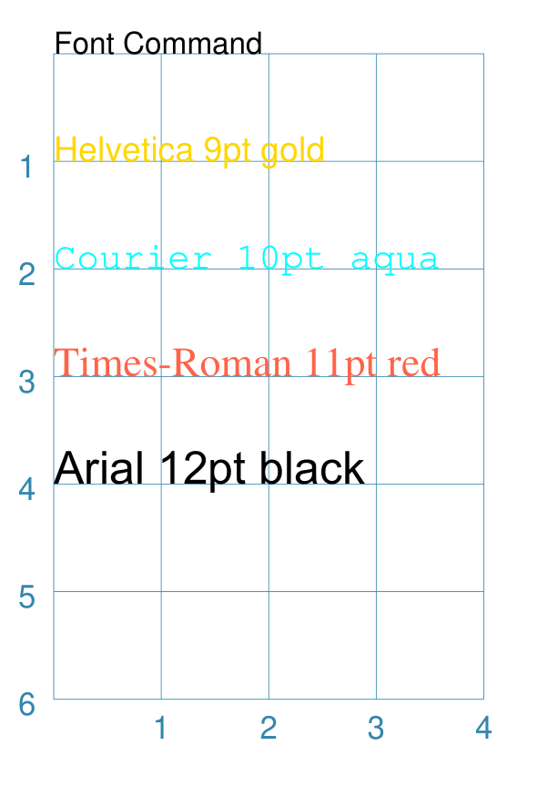
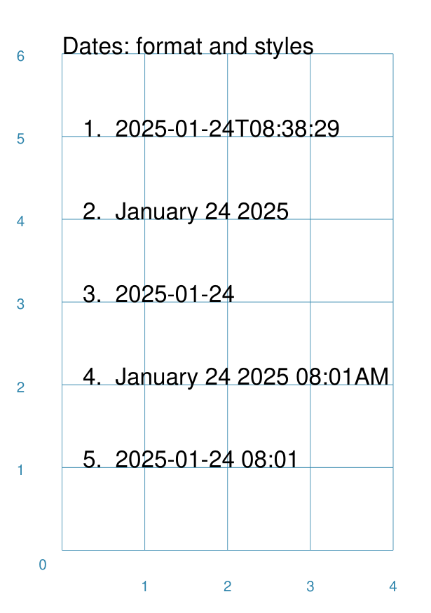

===================
Additional Commands
===================

.. |dash| unicode:: U+2014 .. EM DASH SIGN

This section deals with some of the additional commands available in
:doc:`protograf <index>` that are not covered in detail elsewhere.

You should already be familiar with all of the
:doc:`Basic Concepts <basic_concepts>`,  and have created some
basic scripts of your own using the :doc:`Core Shapes <core_shapes>`.

.. _table-of-contents-addcmd:

-  `Common Command`_
-  `Font Command`_
-  `Extract Command`_
-  `Random Command`_
-  `Today Command`_
-  `BGG Command`_


.. _the-common-command:

Common Command
==============
`↑ <table-of-contents-addcmd_>`_

The ``Common()`` command allows different shapes to share the same properties.

These properties are listed in much the same way as they would for an actual
shape, but the ``Common()`` command does not actually draw anything itself.

For example:

.. code:: python

  colors = Common(stroke="tomato", fill="gold")
  Circle(common=colors, cx=1, cy=2)
  Square(common=colors, cx=2, cy=2)

Here the circle and the square will both use the Common properties assigned to
the ``colors`` name.

.. NOTE::

  The common properties **cannot** be overwritten by a shape; if set, they
  will be used and cannot be changed on a case-by-case basis!


.. _the-font-command:

Font Command
============
`↑ <table-of-contents-addcmd_>`_

.. NOTE::

  There is a section with much more in-depth discussion on the
  :doc:`use of fonts <using_fonts>` which could be helpful,
  especially if you have problems...

The ``Font()`` command will change the default font in use from that point
forward in the script.

Usually, the font's properties will be set at the time that a ``Text()``
command is issued, and multiple ``Text()`` commands can obviously use the
`Common Command`_ to avoid duplication, but it can sometimes be useful
to set the font properties more widely, especially where locating or
setting up the font

The following properties are available for the command:

- *name* - the name of the font face
- *size* - the font "height" in points
- *stroke* - the font color; either a built-in color or a hexadecimal value

If you need to use a specific style name that differs from the default style,
for example *italic* or *bold*, you will need to refer to that font by its
name, for example ``Arial-Bold``.

Because the *name* is compulsory, its often omitted from the command.

Example 1. Common Fonts
-----------------------



===== ======
|fc1| This example shows the use of the command with different properties:

      .. code:: python

        Font("Helvetica", size=9, stroke="gold")
        Text(text="Helvetica 9pt gold",
             x=0, y=1, align="left")

        Font("Courier", size=10, stroke="cyan")
        Text(text="Courier 10pt aqua",
             x=0, y=2, align="left")

        Font("Times-Roman", size=11, stroke="tomato")
        Text(text="Times-Roman 11pt red",
             x=0, y=3, align="left")

        Font("Arial", size=12, stroke="black")
        Text(text="Arial 12pt black",
             x=0, y=4, align="left")

      The first three are examples of the :ref:`standard fonts <builtin-fonts>`
      available to a PDF.

      Standard fonts can be safely used anywhere that
      :doc:`protograf <index>` can be run.

      The fourth font is a *custom* one that would need to first be installed
      onto the machine where the script is to be run.

      .. IMPORTANT::

        The first time that *any* custom font is used, in any of your scripts,
        will trigger a "discovery" process whereby *all* fonts are catalogued.
        This will cause a long delay |dash| however, after that the catalogue
        details are stored in a single file. This can be used directly and
        quickly, so after that your scripts will not have the delay.

      In each example, the name of the font appears first, followed by any
      further details as to its properties.

===== ======

.. _the-extract-command:

Extract Command
===============
`↑ <table-of-contents-addcmd_>`_

The ``Extract()`` command allows portions of pages to be extracted as PNG
images.

Specifying which page, or pages, are affected, along with the portions
required, will automatically create these images after the final PDF is
produced by **protograf**.

There are a number of properties that can be assigned to an ``Extract``.

The first must always be the page, or pages, where the extraction must happen.
These can be specified in as text e.g.: ``"43"``, ``"2-4"``, or ``"3-5,7,9"``,
or in a list e.g.: ``[43]``, ``[2, 3, 4]``, or ``[3, 4, 5, 7, 9]``.

Either one of two properties can be used to specify what part of the page must
be extracted:

- *cols_rows*: two numbers - either space-separated in text **or** in a list
  e.g. ``"3 4"`` or ``[5, 6]``.  The first number is how many columns the page
  should be divided into and the second number is how many rows the page
  should be divided into.  So a `"2 2"`` value divides the page into quarters.
- *areas* - this is a list of sets of numbers, with four number in each.
  The set numbers represent the top-left *x* and *y* and the bottom-right
  *x* and *y* locations on the page of a rectangle that must b extracted
  e.g. ``[(1, 1, 5, 5), (2, 2, 6, 7)]`` will extract two rectangular
  images |dash| the first being 4cm in height and width and starting 1cm away
  from the top and left of the page, and the second being 4cm width by 5cm in
  height and starting 2cm away from the top and left of the page

A *cols_rows* example:

.. code:: python

    Extract("1-3" , cols_rows='2 2')

A *areas* example:

.. code:: python

    Extract("2,4,6", areas=[(1, 1, 5, 5), (2, 2, 6, 7)])


By default, the images are named after the PDF file being created, along with
a ``_N`` suffix, where N is the page number, and then a ``_M`` where M is the
sequence number of the image. For example, the fourth image on the third page
extracted from a file called ``demo.pdf`` would be called ``demo_3_4.png``.

There is an optional *name* property that can be used to specify names for the
images.  This is just a list of text values.  If the list is not long enough
for all the images, the naming will revert back to the default approach.

For example:

.. code:: python

    Extract(
        "1-3" ,
        cols_rows='2 2',
        names=[
            'top-left-quarter',
            'top-right-quarter',
            'bottom-left-quarter',
            'bottom-right-quarter',
        ]
    )

This extract will create images named ``top-left-quarter.png``,
``top-right-quarter.png``, ``bottom-left-quarter.png``, and
``bottom-right-quarter.png``.

.. _random-command:

Random Command
==============
`↑ <table-of-contents-addcmd_>`_

The ``Random()`` command allows the generation of numbers within a range.

.. code:: python

  Random()

will randomly generate a decimal number in the range to 0 to 1,
rounded to 2 decimal places.

.. code:: python

  Random(10)

will randomly generate a decimal number in the range to 1 to 10,
rounded to 2 decimal places.

.. code:: python

  Random(10, 20, 3)

will randomly generate a number in the range to 20 to 30,
rounded to 3 decimal places. The second number is added to the
range of random numbers generated in the range to 1 to 10


.. _the-today-command:

Today Command
=============
`↑ <table-of-contents-addcmd_>`_

The ``Today()`` command will insert text with the current date and/or time.

Varying date formats can be used. Two properties are available:

- *details* - this can be one of: ``date``, ``datetime``, ``time``, ``year``,
  ``month`` or ``day```.
- *style* - this can be ``usa`` or ``eur``; if not provided then ``ISO`` date
  style is used |dash| see the ``"1."`` example below.


Example 1. Common Usage
-----------------------
`^ <the-today-command_>`_



===== ======
|df1| This example shows the use of the command with different *details*
      and *style* - the first example just uses defaults.

      .. code:: python

        dtext = Common(x=0.25, align="left", font_size=8)
        Text(
            common=dtext, y=1,
            text="1.  "+Today())
        Text(
            common=dtext, y=2,
            text="2.  "+Today(details="date", style="usa"))
        Text(
            common=dtext, y=3,
            text="3.  "+Today(details="date", style="eur"))
        Text(
            common=dtext, y=4,
            text="4.  "+Today(details="datetime", style="usa"))
        Text(
            common=dtext, y=5,
            stroke=red,
            text="5.  "+Today(details="datetime", style="eur"))

      Because the output of the ``Today()`` command is provided as text,
      it can be used for the *text* property of the ``Text()`` command
      and located and styled as part of that command.

===== ======


.. _the-bgg-command:

BGG Command
===========
`↑ <table-of-contents-addcmd_>`_

The `BGG()` command is designed to retrieve board game data from the
`BoardGameGeek (BGG) <https://boardgamegeek.com/>`_ database, via its API,
and provide that data in a form suitable for use in
:doc:`Card Decks <card_decks>`.

Examples of using BGG API data for card creation can be found at
:ref:`BGG Examples <BGG-Examples>`.


.. IMPORTANT::

   1. Note that access to the BGG API can only be used in terms of its
      license: https://boardgamegeek.com/wiki/page/XML_API_Terms_of_Use
   2. Furthermore, there is an upper limit to how many games can be retrieved
      at a time - best available knowledge suggests this is about 15,000.
   3. Copies are kept of data downloaded from BGG - and this data will *not*
      be re-retrieved from BGG unless you delete those copies; see `Caching`_
      below.

Usage
-----

The ``BGG`` command allows game data to be retrieved either by providing:

- a comma-delimited list |dash| in square brackets from ``[`` to ``]`` |dash| of
  game IDs
- the ID of a BoardGameGeek user; by default all games in that user's collection
  will be retrieved, unless filters are used

The ID of a game appears in its URL; so, for example, the game "Monopoly"
can be found at https://boardgamegeek.com/boardgame/1406


Example 1. Games by ID
~~~~~~~~~~~~~~~~~~~~~~

To retrieve games which have the ID's 1, 2 and 3:

.. code:: python

    BGG(ids=[1, 2, 3])

When the command runs, you will get the following feedback::

    FEEDBACK:: All board game data accessed via this tool is owned by
    BoardGameGeek and provided through their XML API

If you add the *progress* property, you will get feedback on the process
as it runs, showing that each game is being processed i.e.

.. code:: python

    BGG(ids=[1, 2, 3], progress=True)

shows::

    FEEDBACK:: Retrieving game '1' from BoardGameGeek...
    FEEDBACK:: Retrieving game '2' from BoardGameGeek...
    FEEDBACK:: Retrieving game '3' from BoardGameGeek...


Example 2. Games for a BGG User
~~~~~~~~~~~~~~~~~~~~~~~~~~~~~~~

To retrieve games for an (imaginary) user with the username ``BenKenobi1976``:

.. code:: python

    BGG(user='BenKenobi1976')

A collection can be very large; you may want to filter it to create a
`Subset of Games`_.

.. _protograf_caching:

Caching
-------

*Caching* is the process of storing a copy of something |dash| usually a file,
an image or some other kind of data |dash| so that it does not have to be
retrieved again.  This is useful when accessing resources from the internet,
as it saves time and bandwidth.

In the case of BoardGameGeek data, copies of the game data and images are
stored under your user directory on your local machine (or where ever you are
running :doc:`protograf <index>`).

The caching directory is called ``.protograf`` and this will have a ``bgg``
subdirectory where game data |dash| such as ``.pck`` files |dash| and
``images`` and ``thumbs`` are stored.  If you delete these folders and files,
they will be recreated the next time your script runs i.e. all of their data
will need to be downloaded again.


Output Fields
-------------

The results of a successful command, that returns one or more games,
includes data for the following fields:

- **AVERAGEWEIGHT** ~
- **BAYESAVERAGE** ~
- **BGG** ~
- **CATEGORIES** ~
- **DESCRIPTION** ~
- **DESCRIPTION_SHORT** ~
- **DESIGNERS** ~
- **DISPLAY** ~
- **EXPANDS** ~
- **EXPANSION** ~
- **EXPANSIONS** ~
- **FAMILIES** ~
- **ID** ~
- **IMAGE** ~
- **IMPLEMENTATIONS** ~
- **MAXPLAYERS** ~
- **MECHANICS** ~
- **MEDIAN** ~
- **MINAGE** ~
- **MINPLAYERS** ~
- **NAME** ~
- **NUMCOMMENTS** ~
- **NUMWEIGHTS** ~
- **OWNED** ~
- **PLAYERS** ~
- **PLAYINGTIME** ~
- **PROPERTIES** ~
- **PUBLISHERS** ~
- **RANKS** ~
- **SHORT** ~
- **STDDEV** ~
- **THUMBNAIL** ~
- **TRADING** ~
- **USERSRATED** ~
- **WANTING** ~
- **WISHING** ~
- **YEARPUBLISHED** ~

.. HINT::

   This program's developer was not able to find an authoritative set
   of descriptions for these fields; but they do seem mostly self-obvious,
   assuming you have made use of BoardGameGeek's database to manage
   your game collection.

If you retrieve data for a user's collection, there will also be an
additional set of fields, with data specific to that user:

- **USER_GAME** ~
- **USER_OWN** ~
- **USER_PREORDERED** ~
- **USER_PREVOWNED** ~
- **USER_RATING** ~
- **USER_WANT** ~
- **USER_WANTTOBUY** ~
- **USER_WANTTOPLAY** ~
- **USER_WISHLIST** ~
- **USER_WISHLISTPRIORITY** ~


Subset of Games
---------------

You can retrieve a subset of games for a user by providing one or more items
to filter their collection on.

These are added as extra properties to the ``BGG()`` command. For example:

.. code:: python

    bgames = BGG(
        user='BenKenobi1976',
        want_to_play=True,
        own=True,
    )

In this example, games must be marked both as "want to play" items **and**
items that are "own"ed in the collection of the (imaginary) user
``BenKenobi1976``.

.. HINT::

    A user's entire collection is retrieved at once |dash| so there
    is *no* "progress" option available!

The full list of property filters that can be used, when accessing a
user's collection, are:

- *own* -  include (if ``True``) or exclude (if ``False``) owned items
- *rated* -  include (if ``True``) or exclude (if ``False``) rated items
- *played* -  include (if ``True``) or exclude (if ``False``) played items
- *commented* -  include (if ``True``) or exclude (if ``False``) items commented on
- *trade* -  include (if ``True``) or exclude (if ``False``) items for trade
- *want* -  include (if ``True``) or exclude (if ``False``) items wanted in trade
- *wishlist* -  include (if ``True``) or exclude (if ``False``) items in the
  wishlist
- *preordered* -  include (if ``True``) or exclude (if ``False``) preordered
  items
- *want_to_play* -  include (if ``True``) or exclude (if ``False``) items
  wanting to play
- *want_to_buy* -  include (if ``True``) or exclude (if ``False``) items
  wanting to buy
- *prev_owned* -  include (if ``True``) or exclude (if ``False``) previously
  owned items
- *has_parts* -  include (if ``True``) or exclude (if ``False``) items for
  which there is a comment in the "Has parts" field
- *want_parts* -  include (if ``True``) or exclude (if ``False``) items for
  which there is a comment in the "Want parts" field
