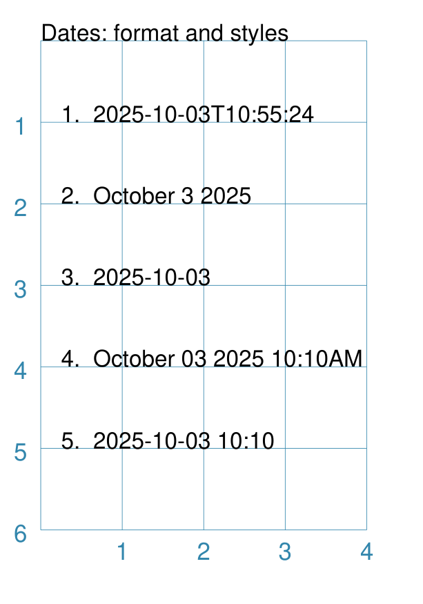

===================
Additional Commands
===================

.. |dash| unicode:: U+2014 .. EM DASH SIGN

This section deals with some of the additional commands available in
:doc:`protograf <index>` that are not covered elsewhere. You should
already be familiar with all of the :doc:`Basic Concepts <basic_concepts>`,
and have looked through the section on :doc:`Core Shapes <core_shapes>`.

.. _table-of-contents:

Table of Contents
=================

-  `BGG Command`_
-  `Font Command`_
-  `Today Command`_

.. _the-bgg-command:

BGG Command
===========
`↑ <table-of-contents_>`_

The `BGG()` command is designed to retrieve board game data from the
`BoardGameGeek (BGG) <https://boardgamegeek.com/>`_ database, via its API,
and provide that data in a form suitable for use in
:doc:`Card Decks <card_decks>`.

Examples of using BGG API data for card creation can be found at
:ref:`BGG Examples <BGG-Examples>`.

.. IMPORTANT::

   1. Note that access to the BGG API can only be used in terms of its
      license: https://boardgamegeek.com/wiki/page/XML_API_Terms_of_Use
   2. Furthermore, there is an upper limit to how many games can be retrieved
      at a time - best available knowledge suggests this is about 15,000.
   3. Copies are kept of data downloaded from BGG - and this data will *not*
      be re-retrieved from BGG unless you delete those copies; see `Caching`_
      below.

Usage
-----

The ``BGG`` command allows game data to be retrieved either by providing:

- a comma-delimited list |dash| in square brackets from ``[`` to ``]`` |dash| of
  game IDs
- the ID of a BoardGameGeek user; by default all games in that user's collection
  will be retrieved, unless filters are used

The ID of a game appears in its URL; so, for example, the game "Monopoly"
can be found at https://boardgamegeek.com/boardgame/1406

Example 1.
~~~~~~~~~~

To retrieve games with ID's 1, 2 and 3:

.. code:: python

    BGG(ids=[1, 2, 3])

When the command runs, you will get the following feedback::

    FEEDBACK:: All board game data accessed via this tool is owned by
    BoardGameGeek and provided through their XML API

If you add the *progress* property, you will get feedback on the process
as it runs, showing that each game is being processed i.e.

.. code:: python

    BGG(ids=[1, 2, 3], progress=True)

shows::

    FEEDBACK:: Retrieving game '1' from BoardGameGeek...
    FEEDBACK:: Retrieving game '2' from BoardGameGeek...
    FEEDBACK:: Retrieving game '3' from BoardGameGeek...

Example 2.
~~~~~~~~~~

To retrieve games for an (imaginary) user with the username ``BenKenobi1976``:

.. code:: python

    BGG(user='BenKenobi1976')

A collection can be very large; you may want to filter it to create a
`Subset of Games`_.

.. _protograf_caching:

Caching
-------

Caching is the process of storing a copy of something - usually a file or
data, so that it does not have to be retrieved again.

In the case of BoardGameGeek data, copies of the game data and images are
stored under your user directory on your local machine (or whereever you are
running :doc:`protograf <index>`).

The directory is called ``.protograf`` and will have a ``bgg`` subdirectory
where game data |dash| as ``.pck`` files |dash| and ``images`` and ``thumbs``
are stored.  If you delete these folders and files, they will be recreated
the next time your script runs.

Output Fields
-------------

The results of a successful command, that returns one or more games,
includes data for the following fields:

- **AVERAGEWEIGHT** -
- **BAYESAVERAGE** -
- **BGG** -
- **CATEGORIES** -
- **DESCRIPTION** -
- **DESCRIPTION_SHORT** -
- **DESIGNERS** -
- **DISPLAY** -
- **EXPANDS** -
- **EXPANSION** -
- **EXPANSIONS** -
- **FAMILIES** -
- **ID** -
- **IMAGE** -
- **IMPLEMENTATIONS** -
- **MAXPLAYERS** -
- **MECHANICS** -
- **MEDIAN** -
- **MINAGE** -
- **MINPLAYERS** -
- **NAME** -
- **NUMCOMMENTS** -
- **NUMWEIGHTS** -
- **OWNED** -
- **PLAYERS** -
- **PLAYINGTIME** -
- **PROPERTIES** -
- **PUBLISHERS** -
- **RANKS** -
- **SHORT** -
- **STDDEV** -
- **THUMBNAIL** -
- **TRADING** -
- **USERSRATED** -
- **WANTING** -
- **WISHING** -
- **YEARPUBLISHED** -

.. HINT::

   This program's developer was not able to find an authoritative set
   of descriptions for these fields; but they do seem mostly self-obvious,
   assuming you have made use of BoardGameGeek's database to manage
   your game collection.

If you retrieve data for a user's collection, there will also be an
additional set of fields, with data specific to that user:

- **USER_GAME** -
- **USER_OWN** -
- **USER_PREORDERED** -
- **USER_PREVOWNED** -
- **USER_RATING** -
- **USER_WANT** -
- **USER_WANTTOBUY** -
- **USER_WANTTOPLAY** -
- **USER_WISHLIST** -
- **USER_WISHLISTPRIORITY** -

Subset of Games
---------------

You can retrieve a subset of games for a user by providing one or more items
to filter their collection on.

These are added as extra properties to the ``BGG()`` command. For example:

.. code:: python

    bgames = BGG(
        user='BenKenobi1976',
        want_to_play=True,
        own=True,
    )

In this example, games must be marked both as "want to play" items **and**
items that are "own"ed in the collection of the (imaginary) user
``BenKenobi1976``.

.. HINT::

    A user's entire collection is retrieved at once - so there is no
    "progress" option available!

The full list of property filters that can be used, when accessing a
user's collection, are:

- *own* -  include (if ``True``) or exclude (if ``False``) owned items
- *rated* -  include (if ``True``) or exclude (if ``False``) rated items
- *played* -  include (if ``True``) or exclude (if ``False``) played items
- *commented* -  include (if ``True``) or exclude (if ``False``) items commented on
- *trade* -  include (if ``True``) or exclude (if ``False``) items for trade
- *want* -  include (if ``True``) or exclude (if ``False``) items wanted in trade
- *wishlist* -  include (if ``True``) or exclude (if ``False``) items in the
  wishlist
- *preordered* -  include (if ``True``) or exclude (if ``False``) preordered
  items
- *want_to_play* -  include (if ``True``) or exclude (if ``False``) items
  wanting to play
- *want_to_buy* -  include (if ``True``) or exclude (if ``False``) items
  wanting to buy
- *prev_owned* -  include (if ``True``) or exclude (if ``False``) previously
  owned items
- *has_parts* -  include (if ``True``) or exclude (if ``False``) items for
  which there is a comment in the "Has parts" field
- *want_parts* -  include (if ``True``) or exclude (if ``False``) items for
  which there is a comment in the "Want parts" field

.. _the-font-command:

Font Command
============
`↑ <table-of-contents_>`_

.. NOTE::

  There is a section with much more in-depth discussion on the
  :doc:`use of fonts <using_fonts>` which could be helpful,
  especially if you have problems...

The ``Font()`` command will change the default font in use from that point
forward in the script.

Usually, the font's properties will be set at the time that a ``Text()``
command is issued, and multiple ``Text()`` commands can obviously use the
``Common()`` command to avoid duplication, but it can sometimes be useful
to set the font properties more widely, especially where locating or
setting up the font

The following properties are available for the command:

- *name* - the name of the font face
- *size* - the font "height" in points
- *stroke* - the font color; either a built-in color or a hexadecimal value
- *style* - a specific style name that differs from the default style,
  which is often termed "regular"
- *directory* - a location where the font file(s) can be found

Because the *name* is compulsory, its often omitted from the command.

.. |fc1| image:: images/custom/commands/fonts.png
   :width: 330

===== ======
|fc1| This example shows the use of the command with different properties:

      .. code:: python

        Font("Helvetica")
        Text(text="Helvetica 12pt black",
             x=0, y=5, align="left")

        Font("Times-Roman", size=11, stroke=tomato)
        Text(text="Times-Roman 11pt red",
             x=0, y=4, align="left")

        Font("Courier", size=10, stroke=aqua)
        Text(text="Courier 9pt aqua",
             x=0, y=3, align="left")

        Font("Verdana", size=9, stroke=gold)
        Text(text="Verdana 9pt gold",
             x=0, y=2, align="left")

      The first three are examples of the standard fonts available to a PDF,
      and can be safely used anywhere that :doc:`protograf <index>` can
      be run, while the fourth is one that would have to be installed onto
      the host machine.

      In each example, the name of the font appears first, followed by any
      further details as to its properties.

===== ======

.. _the-today-command:

Today Command
============
`↑ <table-of-contents_>`_

The ``Today()`` command will insert text with the current date and/or time.

Varying date formats can be used. Two properties are available:

- *details* - this can be either ``date`` or ``datetime``
- *style* - this can be ``usa`` or ``eur``; if not provided then ``ISO`` date
  style is used |dash| see the "1." example below.

Example 1.
----------
`^ <the-today-command_>`_

===== ======
|df1| This example shows the use of the command with different *details*
      and *style* - the first example just uses defaults.

      .. code:: python

        dtext = Common(x=0.25, align="left", font_size=8)
        Text(
            common=dtext, y=5,
            text="1.  "+Today())
        Text(
            common=dtext, y=4,
            text="2.  "+Today(details="date", style="usa"))
        Text(
            common=dtext, y=3,
            text="3.  "+Today(details="date", style="eur"))
        Text(
            common=dtext, y=2,
            text="4.  "+Today(details="datetime", style="usa"))
        Text(
            common=dtext, y=1,
            stroke=red,
            text="5.  "+Today(details="datetime", style="eur"))

      Because the output of the ``Today()`` command is provided as text,
      it can be used for the *text* property of the ``Text()`` command
      and located and styled as part of that command.

===== ======
