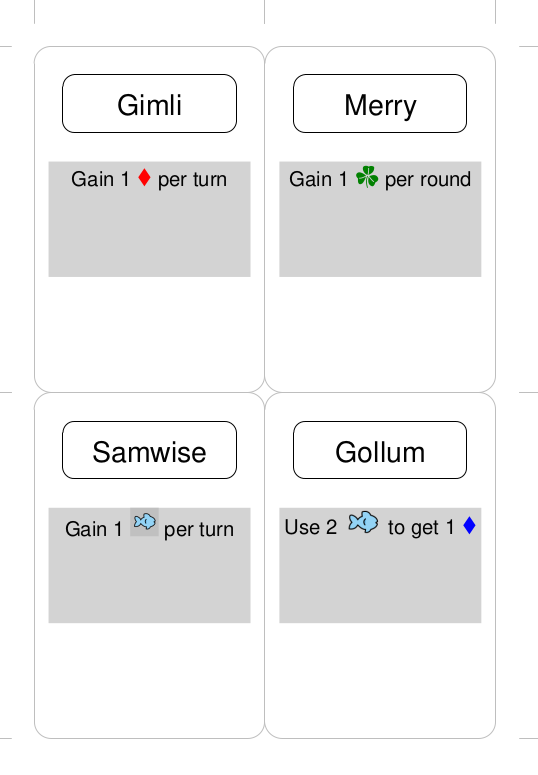

================================
Cards: Images, Symbols and Fonts
================================

.. |dash| unicode:: U+2014 .. EM DASH SIGN

This section assumes you are very familiar with the concepts, terms and
ideas for :doc:`protograf <index>` as presented in the
:doc:`Basic Concepts <basic_concepts>` , that you understand all of the
:doc:`Additional Concepts <additional_concepts>`
and that you've created some basic scripts of your own using the
:doc:`Core Shapes <core_shapes>`.

.. NOTE::

    This section provides further information about how images, together with
    fonts, can be used to add graphics to cards. It will be helpful if you have
    already read the other sections referred to in the card's overview section:
    :doc:`Working with Cards <card_deck_introduction>`.

.. _table-of-contents-ciif:

- `Overview`_
- `Terminology`_
- `Stand-alone Images`_
- `Inline / Embedded Images and Symbols`_
- `IconFont Command`_
- `Text with Embedded Images and Symbols`_
- `Cards with Text Embedded Images and Symbols`_

Overview
========
`↑ <table-of-contents-ciif_>`_

The use of graphics |dash| both images and symbols |dash| to readily convey
information has become prevalant in board and card games.  Once you understand
the meaning or association of that image or symbol in the context of the game,
its usually much faster to recognise and act on it than it is to read a full
sentence or a phrase.

**protograf** supports a number of ways to incorporate such graphics into
a card, whether standlone or as part of text.

Terminology
===========

Images
------

*Image* is the term used for any kind of illustration - artwork, line drawings,
photographs, AI-generated images and so on.

Symbols, Glyphs and Icons
-------------------------

Symbols, glyphs and icons are usually small, simple images, often composed of
a few lines of drawing, and containing only a few colors.

- A *symbol* is a broad term for anything representing an idea or concept
  e.g. a heart for love; a company logo
- An *icon* is a type of symbol that directly represents a common object through
  a recognizable image e.g. a trash can represents deleting a computer file
- A *glyph* is an instance of a typographic character or a recognizable image
  e.g. the @ sign

These graphics can be found as "stand alone" images |dash| typically as
small ``.png`` or ``.svg`` format files |dash| or embedded in a font.
If part of a font, they are often accessed via their Unicode "address" |dash|
usually a 4 character string prefixed with a ``\u``.

In **protograf** the term *symbol* will be used to encompass all of the above.

Stand-alone Images
==================
`↑ <table-of-contents-ciif_>`_

A "stand-alone" image is **not** part of a text string and can be displayed
directly on any part of a card; this is fully described in the
:ref:`Image Command <image-command>`.

.. HINT::

   Remember that when defining an image to appear on a card, you should
   usually use the command with a **lowercase initial** i.e. ``image()``
   rather than ``Image()``, as this will defer it being drawn to when the
   card itself is drawn.

Inline / Embedded Images and Symbols
====================================
`↑ <table-of-contents-ciif_>`_

It is not uncommon to "embed" or "inline" a symbol or image in the text
itself; so, for example, instead of the phrase *take 2 gold*, the text will
display *+2* |gld| |dash| in this case the picture of the gold could either
be an image or a symbol from a font.

Image References
----------------

The way to reference an image file within :ref:`HTML Text <textHTML>` is to
surround it with a pair of marker symbols:  ``|: ... :|``.  At the start,
the ``|:`` is used and at the end the ``:|`` is used.  These symbols should
enclose the name of the image file.

The name can also be followed by a space and a number |dash| where the number
represents the required *height* of the image; larger images will be shrunk
to this size. If the extension is missing from the filename, the ``.png``
extension will be added.  For example:

.. code::

    |:openmoji--fish 14:|

will be replaced in the text by:

.. code::

    

.. HINT::

    An alternative pair of marker symbols that can be used for SVG files is:
    ``|; ... ;|``. In this case, if the extension is missing from the filename,
    the ``.svg`` extension will be added.

    **NOTE** The current underlying software does *not* support transparency
    for SVG images |dash| ensure the images you use have a background color
    that matches the area where they are being used!

Symbol References
-----------------

The way to reference a font symbol within :ref:`HTML Text <textHTML>` is to
surround it with a pair of marker symbols:  ``|! ... !|``.  At the start,
the ``|!`` is used and at the end the ``!|`` is used.  These symbols should
enclose the character symbol being referenced.

The name can also be followed by a space and a number |dash| where the number
represents the required *point size* of the symbol.  It can be further followed
by a color reference  |dash| either a name or hexadecimal code |dash| that will
be used to change the symbol's color.

For example:

.. code::

    |!\u2666 14 red!|

will be replaced in the text by a red diamond shape |dash| assuming that the
default symbol font is not changed (see below for the `IconFont Command`_).

.. code::

    

.. _the-iconfont-command:

IconFont Command
================
`↑ <table-of-contents-ciif_>`_

The ``IconFont()`` command is very similar to the
:ref:`Font command <the-font-command>` but with one significant difference.

The **only** purpose of this command is to set a different font that is used,
from the point onwards from where it is set in the script, for the symbols
that are being referenced in :ref:`HTML Text <textHTML>`.

If not set, **protograf** will default to using **Helvetica** font as the
source for any symbol references.

Text with Embedded Images and Symbols
=====================================
`↑ <table-of-contents-ciif_>`_

Both of the following examples below show how images or font symbols can be
embedded in :ref:`HTML Text <textHTML>`.

.. |ti1| image:: images/customised/text_images.png
   :width: 330

===== ======
|ti1| This example shows Text constructed using commands with the
      following properties:

      .. code:: python

        IconFont("Arial")
        Text(x=0.5, y=1,
             width=3, height=2,
             html=True,
             box_fill="silver",
             text="""
             

             Return 2 |:openmoji--fish 14:|
             and get 3 |!\u2666!|
             
"""
         )
        IconFont("game-icons-net-20200315a")
        Text(x=0.5, y=3.5,
             width=3, height=2,
             html=True,
             box_fill="silver",
             text="""
             

             Recyle 2 |;openmoji--fish 16;|
             and get 4 |!\uEB73 16 green!|
             
"""
         )

      In the :ref:`HTML Text <textHTML>`, markup is used to format
      the main text; in this case to set the *style* within a ``
``
      to use a certain font family, color and size.

      The top example shows how the image marker symbols ``|: ... :|`` are
      used to reference an image called ``openmoji--fish.png`` which is set
      to size *14*.  In addition, because the ``IconFont()`` has been set
      to *Arial*, the character symbol of a diamond is shown when using the
      symbol markers ``|! ... !|`` and referencing Unicode *2666*.

      The lower example shows how the image marker symbols ``|; ... ;|`` are
      used to reference an image called ``openmoji--fish.svg``. In addition,
      because the ``IconFont()`` has now been set to *game-icons-net-20200315a*,
      the character symbol of a shamrock |shm| is shown when using the symbol
      markers ``|! ... !|`` and referencing  Unicode *EB73* |dash| this is
      set to size *16* with a *green* color.

      .. HINT::

        The fonts used in this example can be sourced from:

        - https://fonts.google.com/specimen/Quintessential
        - https://github.com/toddfast/game-icons-net-font/tree/master/distro

        The small fish image marker is part of a set available from
        https://icon-sets.iconify.design/openmoji/

===== ======

Cards with Text Embedded Images and Symbols
===========================================
`↑ <table-of-contents-ciif_>`_

Both of the following examples below show how images or font symbols can be
embedded in :ref:`HTML Text <textHTML>` used in cards.

===== ======
|ti2| This example shows character Cards constructed using commands with the
      following properties:

      .. code:: python

        Create(
           filename='cards_symbols.pdf',
           margin=1.25,
           paper="A6")

        # deck data
        lotr = [
            ['ID', 'Name', 'Age', 'Race', 'Ability', 'Copies'],
            [1, "Gimli", 140, "Dwarf",
             "Gain 1 |!\u2666 12 red!| per turn", 1],
            [6, "Merry", 37, "Hobbit",
             "Gain 1 |!\uEB73 12 green!| per round", 1],
            [7, "Samwise", 39, "Hobbit",
             "Gain 1 |;openmoji--fish 14;| per turn", 1],
            [9, "Gollum", None, "Hobbit",
             "Use 2 |:openmoji--fish 12:| to get 1 |!\u2666 12 blue!|", 1],
        ]
        Data(data_list=lotr)

        # design the deck
        Deck(
            cards=1,
            height=6, width=4,
            grid_marks=True,
            rounding=0.3,
            fill=None,
            stroke="gray",
            copy='Copies')

        # character Name
        name_box = rectangle(
            x=0.5, y=0.5,
            width=3, height=1,
            rounding=0.2)
        Card("*", name_box)
        Card("all",
             text(
                 text=T("{{ Name }}"),
                 x=2, y=1.2,
                 font_size=14))

        # character Ability
        IconFont("game-icons-net-20200315a")
        able = text(
            x=0.25, y=2,
            width=3.5, height=2,
            font_size=10,
            box_fill="lightgrey",
            html=True,
            text=T("{{ Ability }}")
        )
        Card("all", able)

      For the :ref:`HTML Text <textHTML>` *text*, the ``T()`` function
      is used to access and display the character's *Ability* data.

      This example shows how the image marker symbols ``|: ... :|`` are
      used to reference an image called ``openmoji--fish.png`` which is set
      to size *12*. It also shows how the image marker symbols ``|; ... ;|``
      are used to reference an image called ``openmoji--fish.svg`` which is
      set to size *14*.

      Because the ``IconFont()`` has been set to *game-icons-net-20200315a*:

      - a shamrock |shm| is shown when using the symbol
        markers ``|! ... !|`` and referencing Unicode *EB73*; and
      - a diamond is shown when using the symbol markers ``|! ... !|``
        and referencing Unicode *2666* |dash| the color is set differently for
        two different card characters.

===== ======
