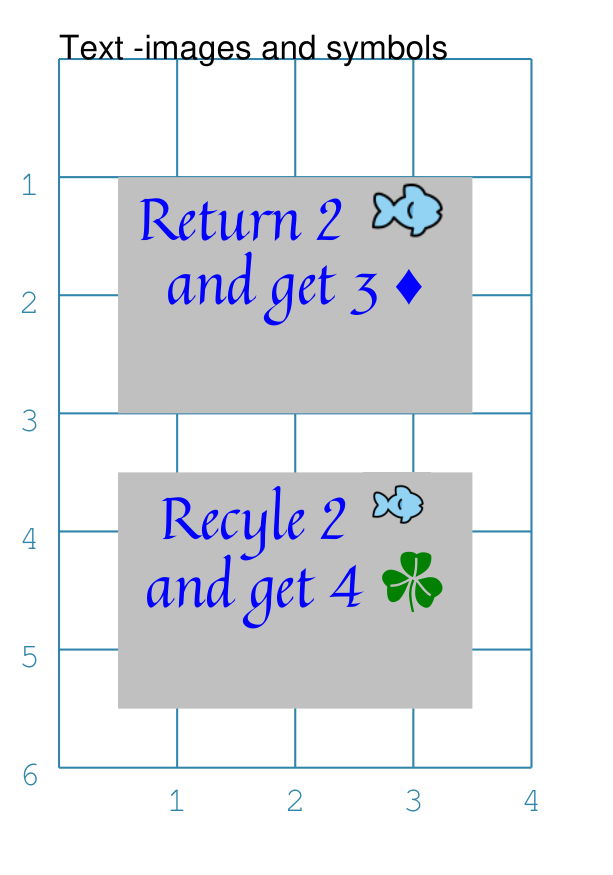

================================
Cards: Images, Symbols and Fonts
================================

.. |dash| unicode:: U+2014 .. EM DASH SIGN

This section assumes you are very familiar with the concepts, terms and
ideas for :doc:`protograf <index>` as presented in the
:doc:`Basic Concepts <basic_concepts>` , that you understand all of the
:doc:`Additional Concepts <additional_concepts>`
and that you've created some basic scripts of your own using the
:doc:`Core Shapes <core_shapes>`.

.. NOTE::

    This section provides further information about how images, together with
    fonts, can be used to add graphics to cards. It will be helpful if you have
    already read the other sections referred to in the card's overview section:
    :doc:`Working with Cards <card_deck_introduction>`.

.. _table-of-contents-ciif:

- `Overview`_
- `Terminology`_
- `Stand-alone Images`_
- `Inline / Embedded Images and Symbols`_
- `The IconFont Command`_

Overview
========
`↑ <table-of-contents-ciif_>`_

The use of graphics |dash| both images and symbols |dash| to readily convey
information has become prevalant in board and card games.  Once you understand
the meaning or association of that image or symbol in the context of the game,
its usually much faster to recognise and act on it than it is to read a full
sentence or a phrase.

**protograf** supports a number of ways to incorporate such graphics into
a card, whether standlone or as part of text.

Terminology
===========

Images
------

Image is the term used for any kind of illustration - artwork, line drawings,
photographs, AI-generated images and so on.

Symbols, Glyphs and Icons
-------------------------

Symbols, glyphs and icons are usually small, simple images, often composed of
a few lines of drawing, and containing only a few colors.

- A *symbol* is a broad term for anything representing an idea or concept
  e.g. a heart for love; a company logo
- An *icon* is a type of symbol that directly represents a common object through
  a recognizable image e.g. a trash can represents deleting a computer file
- A *glyph* is an instance of a typographic character or a recognizable image
  e.g. the @ sign

They can be found as "stand alone" image files or embedded in a font.
If part of a font, they are often accessed via their Unicode "address" |dash|
typically a 4 character string prefixed with a ``\u``.

In **protograf** the term *symbol* will be used to encompass all of the above.

Stand-alone Images
==================
`↑ <table-of-contents-ciif_>`_

TBD

Inline / Embedded Images and Symbols
====================================
`↑ <table-of-contents-ciif_>`_

.. |gld| image:: gold.png
   :width: 12

It is not uncommon to "embed" or "inline" a symbol or image in the text
itself; so, for example, instead of the phrase *take 2 gold*, the text will
display *+2* |gld| |dash| in this case the picture of the gold could either
be an image or a symbol from a font.

The following example illustrates how either of these can be done.

===== ======
|ti1| This example shows Text constructed using commands with the
      following properties:

      .. code:: python

        IconFont("Arial")
        Text(x=0.5, y=1,
             width=3, height=2,
             html=True,
             box_fill="silver",
             text="""
             

             Return 2 |:openmoji--fish 14:|
             and get 3 |!\u2666!|
             
"""
         )
        IconFont("game-icons-net-20200315a")
        Text(x=0.5, y=3.5,
             width=3, height=2,
             html=True,
             box_fill="silver",
             text="""
             

             Recyle 2 |;openmoji--fish 16;|
             and get 4 |!\uEB73 16 green!|
             
"""
         )

===== ======

.. _the-iconfont-command:

The IconFont Command
====================
`↑ <table-of-contents-ciif_>`_

TBD
