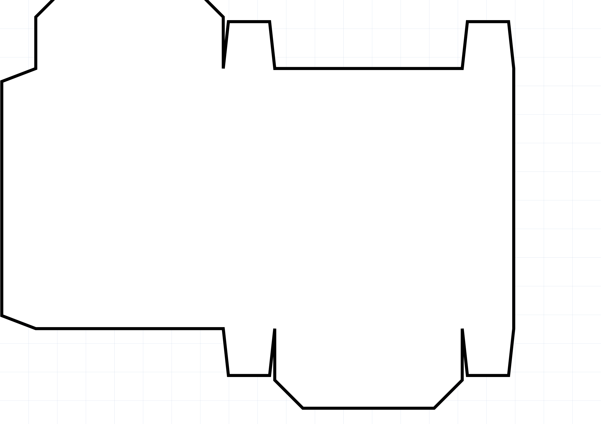
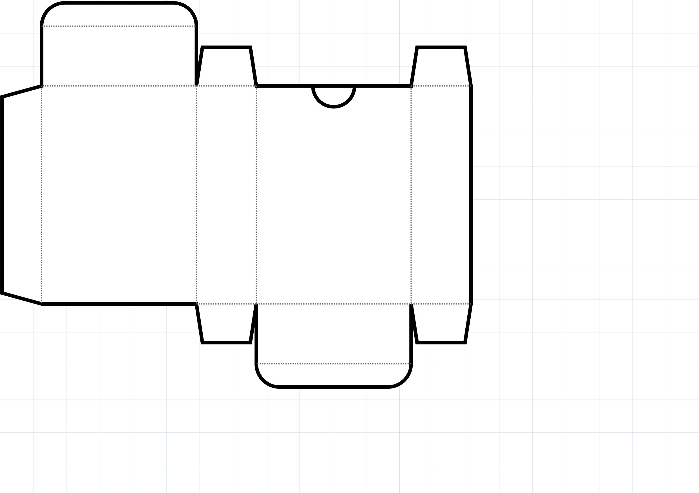
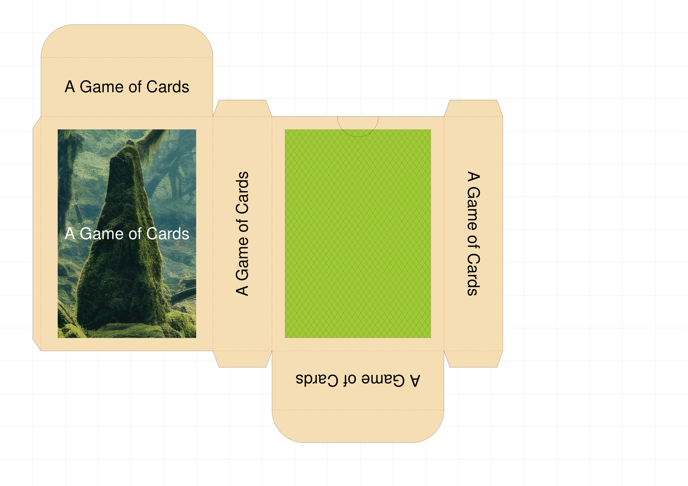

=======
CardBox
=======

.. |dash| unicode:: U+2014 .. EM DASH SIGN

This section assumes you are very familiar with the concepts, terms and ideas
for :doc:`protograf <index>`  as presented in the
:doc:`Basic Concepts <basic_concepts>` , that you understand all of the
:doc:`Additional Concepts <additional_concepts>` and that you've created some
basic scripts of your own using the :doc:`Core Shapes <core_shapes>`. You also
be familiar with the various types of shape's properties described in the
:doc:`Customised Shapes <customised_shapes>`

.. _table-of-contents-cardbox:

- `Overview`_
- `CardBox Properties`_
- `CardBox Examples`_
- `Useful Resources`_

.. _cardbox-object:

Overview
========
`↑ <table-of-contents-cardbox_>`_

The ``CardBox()`` command allows you to create template that, when printed,
can be cut out and folded to create a box. This is useful to store a deck of
cards; or can just be used as a storage box.

These kinds of boxes are often known as tuck boxes.

.. HINT::

    The documentation shows images of such templates as PNG files.
    However, if you want to actually **print** and assemble the box
    templates, you should use the PDF version that is always generated!

.. _cardboxProperties:

CardBox Properties
==================
`↑ <table-of-contents-cardbox_>`_

The basic ``CardBox()`` properties are the same as many other shapes and
objects:

* *x* and *y* values can be set to offset the top-left "corner" of the
  box template from the page margins.
* *stroke* and *stroke_width* set the style of the outline of the box template
* *fill* sets the color of the interior of the box template.

In addition to the above, the ``CardBox()`` command has a number of properties
that can be set to customize how the box template will appear.

* The key **size** of the box can be set using:

  * *card_size* - using the name of a standard/common card type will set
    both the height and width e.g. ``poker``, ``bridge``, ``mini`` etc.
    The default card size is ``poker``.
  * *height* - a value, in the chosen or default units, of the box height
    (use this if you are not setting a *card_size*)
  * *width* - a value, in the chosen or default units, of the box width
    (use this if you are not setting a *card_size*)
  * *depth* - a value, in the chosen or default units, of the box depth; if
    not set, it defaults to approximately ``2`` cm |dash| the height of deck
    of 54 standard playing cards

* The **padding** refers to the amount of extra space allocated to the
  height and width in order to allow for a better "fit" inside the box:

  * *padding* - the value, in the chosen or default units, of the total extra
    amount added to each of the *height* and *width* values
  * *padding_height* - the value, in the chosen or default units, of the extra
    amount added to the *height* value
  * *padding_width* - the value, in the chosen or default units, of the extra
    amount added to the *width* value

* The **folds** indicate the lines at which the template must be folded in
  order to create the box shape. These properties can be set:

  * *fold* - when set to ``True`` will cause the fold lines to be shown
  * *fold_stroke* - sets the color of the fold lines
  * *fold_stroke_width* - sets the thickness of the fold lines

* The **flaps** are the "non-visible" parts of the box that get tucked or glued
  inside of it when folded.  Their default sizes are calculated in proportion
  to the key sizes. Their heights can be set directly:

  * *flap* - the height, in the chosen or default units, of the main flaps
    (the ones attached to the top/front and bottom/back)
  * *flap_inner* - the height, in the chosen or default units, of the smaller
    flaps (the ones attached to the right and left sides)
  * *flap_glue* - the width, in the chosen or default units, of the long thin
    flap attached to the side of the front area; this flap is designed to be
    glued to the back of the left side

* Various **other** properties can be set:

  * *rounded* - when set to ``True`` will changes the style of the main flaps
  * *thumb* - the value, in the chosen or default units, of the diameter
    of a half-circle drawn at the top of the back of the box

Finally, the other useful properties that can be set are for what needs to be
displayed on the various visible locations of the folded box. These locations
include the front, the back, the left side, the right side, the top and the
bottom (or underneath).

For each of these different areas, one or more shapes can be allocated to
appear in that area.

The shapes are automatically placed in the center of the area to which they are
allocated.  If there are multiple shapes, they should be in a list (inside
``[`` ... ``]`` brackets), and they will be drawn in order from left to right.
In other words, the leftmost shape is drawn first and the following shapes
are drawn over each other in sequence.

The locations for the shapes are all identified by the prefix ``shape_``,
followed by the area name: ``shape_front``, ``shape_back``, ``shape_left``,
``shape_right``, ``shape_top`` and ``shape_bottom``.

.. HINT::

    Bear in mind that, depending on how you want the box to appear once it
    has been folded and glued, some of the shapes may need to be rotated;
    in particular, ``shape_left``, ``shape_right``, and ``shape_bottom``.

.. _cardboxExamples:

CardBox Examples
================
`↑ <table-of-contents-cardbox_>`_

The examples below shows how a ``CardBox`` can be created and styled.

The examples are shown on a A5-size page, landscape orientation, with
a background grid (``1`` cm squares) and ``0.25`` cm (~1/10") margin.
The code for this is:

.. code:: python

    Create(
        filename="cardbox.pdf",
        paper="A5-l",
        margin=0.25,
        page_grid=1,
    )

Note also that for purposes of easy viewing, the line thicknesses of the
first two examples have been increased; if the images are still unclear,
then click on them to see a larger view.

Example 1: The default CardBox
------------------------------
`^ <cardboxExamples_>`_

===== ======
|cb1| This example shows a CardBox object constructed using these commands:

      .. code:: python

        CardBox()

      All of the CardBox shapes are constructed with same basic layout:
      the front, right, back and left areas in sequence across the midddle
      with the top atached to the front and the bottom attached to the back.

      The default template is designed to house a standard playing card deck
      of *Poker*-sized cards.  The default *padding* for these cards is 2mm.

      Part of the top flap has been cut off |dash| normally, the *y* value
      would be set higher to "move" the template downwards.

===== ======

Example 2: CardBox Properties
-----------------------------
`^ <cardboxExamples_>`_

===== ======
|cb2| This example shows a CardBox object constructed using these commands:

      .. code:: python

        CardBox(
          card_size="Mini",
          stroke_width=3,
          fold=True,
          fold_stroke_width=1,
          rounded=True,
          thumb=1.25,
        )

      All of the CardBox shapes are constructed with same basic layout:
      the front, right, back and left areas in sequence across the midddle
      with the top atached to the front and the bottom attached to the back.

      The customisation here involves:

      * *card_size* - changed fom "Poker" to "Mini"
      * *fold* - set to ``True``; the dotted lines can be seen where
        folds are required
      * *rounded* - set to ``True``; the edges of the top and bottom flaps
        can be seen to be rounded, not diagonal
      * *thumb* - set to ``1.25`` cm; produces the semi-circle shown on the
        centre of the upper-edge of the back area

===== ======

Example 3: CardBox Shapes
-------------------------
`^ <cardboxExamples_>`_

===== ======
|cb3| This example shows a CardBox object constructed using these commands:

      .. code:: python

        front = image(
          "images/mff-crop.jpg",
          height=6.35, width=4.45)
        back = rectangle(
          stroke="maroon", fill="yellowgreen",
          height=6.35, width=4.45,
          hatches='d', hatches_count=50,
          hatches_stroke="maroon")

        name = Common(
            text="A Game of Cards", font_size=14)
        name_up = text(common=name)
        name_front = text(common=name, stroke="white")
        name_top = text(common=name)
        name_btm = text(common=name, rotation=180)
        name_lft = text(common=name, rotation=-90)
        name_rgh = text(common=name, rotation=90)

        CardBox(
            card_size="Mini",
            fold=True,
            rounded=True,
            thumb=1.25,

            fold_stroke="red",
            fill="wheat",
            padding_width=0.8,
            padding_height=0.8,

            flap=1,
            flap_glue=0.25,
            flap_inner=0.5,

            shapes_front=[front, name_front],
            shapes_back=back,
            shapes_top=name_top,
            shapes_bottom=name_btm,
            shapes_left=name_lft,
            shapes_right=name_rgh,
        )

      All of the CardBox shapes are constructed with same basic layout:
      the front, right, back and left areas in sequence across the midddle
      with the top atached to the front and the bottom attached to the back.

      In addition to the same kind of customisation shown above in
      `Example 2: CardBox Properties`_ the following are also set:

      * the colors of the template area *fill* and the fold lines *stroke*
      * the *padding* i.e. the value by which the height and width of the
        front and back areas of template are increased i.e. values added to
        the height and width of the chosen card size
      * the various *flap* heights are set to absolute values, rather than
        being calculated based on other box template values

      In addition, various shapes are assigned to the different areas of the
      box template.

      Shapes are pre-defined in the preceding script and assigned
      a name so they can be referenced by the ``CardBox`` properties.

      Note that shapes assigned to three of the area properties |dash|
      *shape_right*, *shape_top* and *shape_bottom* |dash| have all
      been rotated.

===== ======

Useful Resources
================
`↑ <table-of-contents-cardbox_>`_

Obviously :doc:`protograf <index>` is not the only tool capable of creating
box templates.  There many other tools; some of which are listed below.

Inclusion of these resources does **not** constitute a recommendation! As
always, check how they are allowed to be used and any terms and conditions.

* https://www.cefbox.com/dielines/foldingBox/reverseTuckEnd
* https://www.templatemaker.nl/en/cardbox/
* https://www.cpforbes.net/tuckbox/
* https://deckinabox.sgenoud.com/deck
* https://andylei.github.io/paperbox/
* https://dprather12.github.io/tuckbox-gen/

In addition, BoardGameGeek hosts a page listing similar resources at
https://boardgamegeek.com/wiki/page/Tuck_boxes

Finally, https://www.magicianmasterclass.com/post/playing-card-box-template
has helpful illustrated instructions for cutting out and assembling a box.
