Core Shapes
===========

.. |dash| unicode:: U+2014 .. EM DASH SIGN
.. |copy| unicode:: U+00A9 .. COPYRIGHT SIGN
   :trim:
.. |deg|  unicode:: U+00B0 .. DEGREE SIGN
   :ltrim:
.. |br| raw:: html

    

These descriptions of the available shapes assume you are familiar with
the concepts, terms and ideas for :doc:`protograf <index>` as presented
in the :doc:`Basic Concepts <basic_concepts>` - especially *units*,
*properties* and *defaults*. It will also help to at least browse through
the section on :doc:`Additional Concepts <additional_concepts>`.

.. _table-of-contents-core:

Table of Contents
-----------------

-  `Shape Index`_
-  `Overview`_
-  `Commonalities`_
-  `Linear Shapes`_
-  `Enclosed Shapes`_
-  `Compound Shapes`_
-  `Shapes Common Properties`_

.. _shape-index:

Shape Index
-----------

-  `Arc`_
-  `Arrow`_
-  `Blueprint`_
-  `Bezier`_
-  `Circle`_
-  `Compass`_
-  `Chord`_
-  `Dot`_
-  `DotGrid`_
-  `Ellipse`_
-  `EquilateralTriangle`_
-  `Grid`_
-  `Hexagon`_
-  `Hexagons`_
-  `Image`_
-  `Line`_
-  `Lines`_
-  `Polygon`_
-  `Polyline`_
-  `Polyshape`_
-  `QRCode`_
-  `Rectangle`_
-  `Rectangles`_
-  `Rhombus`_
-  `Sector`_
-  `Square`_
-  `Stadium`_
-  `Star`_
-  `Starfield`_
-  `Text`_
-  `Trapezoid`_

Overview
---------
`↑ <table-of-contents-core_>`_

Where possible, the basic examples first show how a shape would appear
on a page when **only** the default properties are used. This means that,
for most cases, that *lines* are drawn in **black** and shapes that have an
enclosed area are *filled* with a **white** color. The default length, width
or height in most cases is **1cm**. The only change from default, for these
examples, has been to make the default line width (*stroke_width*) thicker
for easier viewing of the small PNG images.

Most shapes can be styled by setting one or more of the
`Shapes Common Properties`_. Other shapes have additional properties
available that allow even further styling.

To make it easier to see where and how a shape has been drawn, most of these
examples have been created with a background grid, which **protograf**
refers to as a `Blueprint`_ shape, added to the page  - a small A8
"business card" size - for cross-reference. In addition, the default line width
(aka *stroke_width*) has been made thicker for easier viewing of the small
PNG images that were generated from the original PDF output.

.. NOTE::

   The graphics for these examples were generated from either of the following
   scripts;
   `default_shapes <https://github.com/gamesbook/protograf/blob/master/examples/simple/default_shapes.py>`_ or
   `customised_shapes <https://github.com/gamesbook/protograf/blob/master/examples/simple/customised_shapes.py>`_.
   The program first creates a PDF, then generates a PNG file for each page
   in the PDF.

Commonalities
--------------
`↑ <table-of-contents-core_>`_

There are some properties that can be set for almost all of the shapes;
examples of these are presented in the section on `Shapes Common Properties`_
at the end, rather than being described in detail for every single shape.

.. HINT::

   Bear in mind that if a property that it does not support is
   provided for a shape, then that property and its value will simply be
   ignored.

.. _linearIndex:

Linear Shapes
--------------
`↑ <shape-index_>`_

.. _arc-command:

Arc
~~~
`↑ <shape-index_>`_

An arc is a curved line.

Example 1. Default Arc
++++++++++++++++++++++

.. |arc| image:: images/defaults/arc.png
   :width: 330

===== ======
|arc| This example shows the shape constructed using the command with only
      defaults:

      .. code:: python

          Arc()

      It has the following properties based on the defaults:

      - origin is at x-position ``1`` cm and at y-position ``1`` cm
===== ======

Example 2. Customised Arc
+++++++++++++++++++++++++

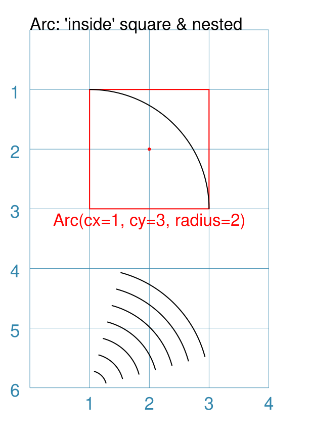

===== ======
|ac2| This example shows the shape constructed using the command with these
      properties:

      .. code:: python

          Arc(cx=1, cy=3, radius=2)

      To help with visualisation, the Arc is surrounded by a red Rectangle:

      .. code:: python

            Rectangle(
                x=1, y=1, height=1, width=2, dot=0.02,
                stroke="red", fill=None,
                title="Arc(cx=1, cy=3, radius=2)")
            )

      The Arc has the following properties:

      - origin is at x-position ``1`` cm and at y-position ``3`` cm
      - the arc radius is ``2`` cm
===== ======

.. _bezier-command:

Bezier
~~~~~~
`↑ <shape-index_>`_

A Bezier is a curve that has inflection points, allowing it to "bend".

Example 1. Default Bezier
+++++++++++++++++++++++++

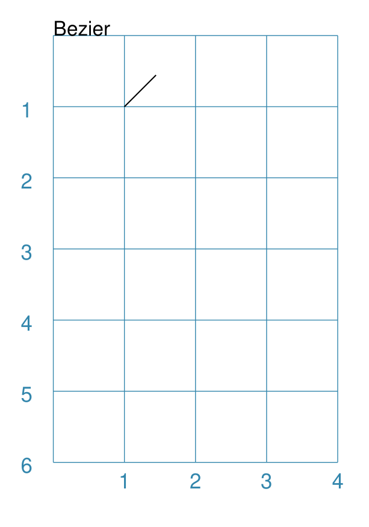

===== ======
|bez| This example shows the shape constructed using the command with only
      defaults:

      .. code:: python

          Bezier()

      It has the following properties based on the defaults:

      - starts at x-position ``1`` cm and at y-position ``1`` cm
===== ======

Example 2. Customised Bezier
++++++++++++++++++++++++++++

===== ======
|bz1| This example shows the shape constructed using the command with the
      following properties:

      .. code:: python

          Bezier(
            x=0, y=1,
            x1=4, y1=3,
            x2=3, y2=4,
            x3=4, y3=6,
            stroke_width=1)

      It has the following properties based on changes to the defaults:

      - starts at x-position ``0`` cm and at y-position ``1`` cm
      - has the inflection points set by:

        - *x1* and *y1*, and
        - *x2* and *y2*
      - ends at position *x3* of ``4`` cm and at *y3* of ``6`` cm
      - has a thicker *stroke_width*
===== ======

.. _chord-command:

Chord
~~~~~
`↑ <shape-index_>`_

A chord is a straight line joining two points on a circle's diameter.

Example 1. Customised Chord
+++++++++++++++++++++++++++

.. |chd| image:: images/defaults/chord.png
   :width: 330

===== ======
|chd| If the shape constructed using only default properties, there will be
      nothing to see:

      .. code:: python

          Chord()

      This example then shows the shape constructed using the command with these
      properties:

      .. code:: python

          Chord(
              shape=Circle(radius=1, fill=None),
              angle=135,
              angle1=45)

      It has the following properties based on these values:

      - a small circle that defines boundaries for the chord line
      - the start of chord is at the intersection of the radius of the circle
        at 135 |deg| with the circle's circumference
      - the end of chord is at the intersection of the radius of the circle
        at 45 |deg| with the circle's circumference

===== ======

.. _dot-command:

Dot
~~~
`↑ <shape-index_>`_

A dot is a small, filled `Circle`_.

Example 1. Default Dot
++++++++++++++++++++++

.. |dot| image:: images/defaults/dot.png
   :width: 330

===== ======
|dot| This example shows the shape constructed using the command with only
      defaults:

      .. code:: python

          Dot()

      It has the following properties based on the defaults:

      - centre at x-position ``1`` cm and at y-position ``1`` cm
      - diameter of ``3`` points; there are 72 points in an inch, so this is 1/24th
        of an inch, or approximately 1mm (``0.1`` cm), in size
      - fill color for a Dot is the same as the stroke |dash| default is black
===== ======

.. _line-command:

Line
~~~~
`↑ <shape-index_>`_

Example 1. Default Line
+++++++++++++++++++++++

.. |ln1| image:: images/defaults/line.png
   :width: 330

===== ======
|ln1| This example shows the shape constructed using the command with only
      defaults:

      .. code:: python

          Line()

      It has the following properties based on the defaults:

      - starts at x-position ``1`` cm and at y-position ``1`` cm
      - length of ``1`` cm
      - heading/default direction is 0 |deg| |dash| i.e. "eastwards"

      *Note* that direction means "anti-clockwise from 0 |deg|", where
      the zero lines runs in the "east" direction from the left.
===== ======

Example 2. Customised Line
++++++++++++++++++++++++++

.. |ln2| image:: images/customised/line_custom.png
   :width: 330

===== ======
|ln2| This example shows Lines constructed using commands with the
      following properties:

      .. code:: python

        # black lines
        Line(
            x=0, y=0.5,
            stroke_width=0.2,
            dotted=True,
            label="0.2", font_size=6)
        Line(
            x=1, y=0.5,
            stroke_width=0.4, dotted=True,
            label="0.4", font_size=6)
        Line(
            x=2, y=0.5,
            stroke_width=0.8, dotted=True,
            label="0.8", font_size=6)
        Line(
            x=3, y=0.5,
            stroke_width=1.6, dotted=True,
            label="1.6", font_size=6)

        # colored lines
        Line(
            x=0, y=4, x1=4, y1=5,
            stroke="blue", stroke_width=1,
            dashed=[0.2, 0.1],
            label="dashed:[0.2,0.1]", font_size=6)
        Line(
            x=0, y=3, length=4.1, angle=15,
            stroke="red",
            label="15", font_size=6)
        Line(
            x=0, y=2, length=4,
            stroke="chartreuse", stroke_width=2)

      The various black lines have these properties:

      - *x* and *y* set as their starting point
      - a default length of ``1`` cm
      - *stroke_width* - set as value in points and labelled accordingly
      - *dotted* - has a value of ``True``

      The dotted line is just a series of small lines i.e. the "dots",
      followed by gaps, of sizes equal to the line's *stroke_width*.

      The thin red line has:

      - *angle* - of 15 |deg| from the baseline, clockwise

      The angle guides the direction in which the line is drawn; if not
      given |dash| as in the case of the thick green line |dash| this
      will be 0 |deg|. The line length is then calculated based on these
      points.

      The thick green line and the thin red line both have:

      - *x* and *y* set as their starting point
      - *length* - sets the specific size of the line

      The medium blue line has:

      - *dashed* - length of ``2`` mm and spacing of ``1`` mm
      - *x1* and *y1* set as the ending point

      Dashes are a list of two numbers. The first is the length of the dash;
      the second is the length of the space between each dash.
===== ======

.. _polyline-command:

Polyline
~~~~~~~~
`↑ <shape-index_>`_

A polyline is a series of lines joining points.

Example 1. Customised Polyline
++++++++++++++++++++++++++++++

.. |ply| image:: images/defaults/polyline.png
   :width: 330

===== ======
|ply| The shape cannot be constructed using only default properties:

      .. code:: python

          Polyline()

      Nothing will be visible; instead you will see a warning::

        WARNING:: There are no points to draw the Polyline

      This example then shows the shape constructed using the command with these
      properties:

      .. code:: python

          Polyline(points=[(0, 0), (1, 1), (2, 0)])

      It has the following properties based on these values:

      - starts at x-position ``0`` cm and at y-position ``0`` cm
      - second point is at x-position ``1`` cm and at y-position ``1`` cm
      - third point is at x-position ``2`` cm and at y-position ``0`` cm

      The *points* for a Polyline:

      - are in a list, as shown by the square brackets from ``[`` to ``]``,
      - each *x* and *y* are provided as a pair of values in round brackets
      - each *x* and *y* are separated by a comma
      - each pair of values in the list is separated by a comma

===== ======

.. _text-command:

Text
~~~~
`↑ <shape-index_>`_

It may seem strange to view text as a "shape" but, from a drawing point of
view, it's really just a series of complex lines drawn in a particular pattern!
Thus text has a position in common with many other shapes, as well as its own
special properties.

The basic properties that can be set are:

- *text* - the text string
- *font_size* - default is ``12`` points
- *font_name* - the default is ``Helvetica``
- *stroke* - the default text color is ``black``
- *align* - the default alignment is ``centre``; it can be changed to be
  ``left`` or ``right``

See Examples 2 and 3 below for additional properties.

Example 1. Default Text
+++++++++++++++++++++++

===== ======
|t01| This example shows the shape constructed using the command with mostly.
      defaults.

      Only the **text** property is changed from a blank
      string |dash| otherwise there would nothing to see!:

      .. code:: python

          Text(text="Hello World")

      It otherwise has the following properties based on the defaults:

      - located is at x-position ``1`` cm and at y-position ``1`` cm
      - text is at the ``center`` of the position
      - default *font_size* is ``12`` points
      - default *font_name* is ``Helvetica``

===== ======

Example 2. Customised Text
++++++++++++++++++++++++++

.. |t02| image:: images/customised/text_custom.png
   :width: 330

===== ======
|t02| This example shows the shape constructed using various properties:

      .. code:: python

        Text(wrap=True,
             x=0, y=1, width=4, height=1,
             font_size=7, fill="black", stroke="black",
             font_name="Courier", align="right",
             transform='t',
             text="I am Courier in title case to the right")
        Text(wrap=True,
             x=0, y=2.5, width=4, height=1,
             font_size=8, fill="black", stroke="black",
             font_name="Helvetica", align="left",
             transform='upper',
             text="I am Helvetica in upper case to the left")
        Text(wrap=True,
             x=0, y=4, width=4, height=1,
             font_size=9, fill="black", stroke="black",
             font_name="Times-Roman", align="centre",
             transform='lowercase',
             text="I'm lower case Times-Roman in the centre")

      In this example, the use of ``wrap=True`` signifies the  use of "complex"
      multi-line text, to which various styling properties can be applied.

      Complex text can have the following properties:

      - *width* - width of the box in which the text appears
      - *height* - height of the box in which the text appears
      - *align* - can be ``left``, ``centre`` or ``right``
      - *transform* - uppercase (u), lowercase (l) or capitalise (c)
      - various font properties

      The box **must** be big enough to show the text, otherwise none will be
      displayed!

      This example also shows how the text's font can be set using the ``font_name``
      property.

      .. NOTE::

        If you're not using a built-in font, you **must** install it with
        a ``Font`` command.

        For more details see :ref:`the Font command <the-font-command>`.

===== ======

Example 3. Styled Text
++++++++++++++++++++++

.. |t03| image:: images/customised/text_style.png
   :width: 330

===== ======
|t03| This example shows the shape constructed using various properties:

      .. code:: python

        Font("Times-Roman", size=11, stroke="tomato")
        Text(x=0, y=0.5, align="left",
             text="Times-Roman 12pt red")

        Text(html=True,
             x=0, y=1, width=4, height=2,
             text=''
                  'HTML Helvetica 10pt '
                  '<b>bold</b> <i>ital</i> <b><i>bold ital</i></b>'
        )
        Text(html=True,
             x=0, y=2, width=4, height=2,
             text=''
                  'HTML Times-Roman 9pt '
                  '<b>bold</b> <i>ital</i> <b><i>bold ital</i></b>'
        )
        Text(html=True,
             x=0, y=3, width=4, height=2,
             css="font-family: Courier; font-size: 8pt; color: blue;",
             text='HTML/CSS Courier 8pt '
                  '<b>bold</b> <i>ital</i> <b><i>bold ital</i></b>'
        )

      In this example, the use of ``html=True`` signifies the use of "styled"
      multi-line, HTML-formatted, text.

      "Styled" means that various CSS styling properties can be applied to it.

      This example shows how the text's font can be set either:

      - via the ``Font`` command
      - via *css* property
      - via the ``font-family: ...">`` embedded in the *text*

===== ======

Example 4. Rotated Text
+++++++++++++++++++++++

.. |t04| image:: images/customised/text_rotate.png
   :width: 330

===== ======
|t04| This example shows the shape constructed using various properties:

      .. code:: python

        props = Common(
            font_size=7,  fill="black", stroke="black",
            font_name="Helvetica")

        Text(
            common=props, x=1, y=1,
            text="Line text 1,1 - rotate 30",
            rotation=30)
        Text(
            common=props, x=3, y=1,
            text="Line text 3,1 - rotate 30\nline break",
            rotation=30)

        Text(
            common=props, x=0, y=3,
            width=1, height=3, wrap=True,
            text="Wrap text - 1-by-3 - rotate 90",
            rotation=90)
        Text(
            common=props, x=1, y=3,
            width=3, height=1, wrap=True,
            text="Wrap text - 3-by-1 - rotate 90",
            rotation=90)

        Text(
            common=props, x=3, y=3,
            width=1, height=3, html=True,
            css="font-family: Helvetica; font-size: 7pt;",
            text="<i>HTML text</i> - 1-by-3 - rotate 90",
            rotation=90)

      This example shows how the text can be rotated using the *rotation*
      property.

      The top two examples show normal (aka "line") text rotated around
      the mind-point of the text at the ``x`` and ``y`` location.

      Be aware that even though the ``\n`` forces a line-break, the total
      length of the line is still calculated using all the characters.

      The lower two examples on the left show "text in a box" using the
      ``wrap=True`` property.

      It should be noted that the width of the
      box is effectively also rotated, so that the width now becomes the
      "height" (and vice-versa of course).

      The lower example on the right shows "text in a box" using the
      ``html=True`` property.

      For this example, styling is via the *css*
      property and not via the :ref:`Common command <the-common-command>`

      .. NOTE::

        Both *wrap* and *html* text can only be rotated in increments of
        90 (ninety) degrees!!

===== ======

Enclosed Shapes
---------------
`↑ <table-of-contents-core_>`_

These shapes are created by enclosing an area, the most basic being a simple rectangle.
They effectively have two dimensions: *height* and *width*.

The difference between enclosed and linear shapes is that the area enclosed by
the shape can be filled with a color. The default fill color is *white*.
There is an overview on how color is used in the
:doc:`Basic Concepts section <basic_concepts>`

.. HINT:::

   **protograf** comes with a predefined set of named colors, shown in the
   `colors <https://github.com/gamesbook/protograf/blob/master/examples/colorset.pdf>`_
   PDF file.

.. _arrow-command:

Arrow
~~~~~~
`↑ <shape-index_>`_

An Arrow consists of two main parts: the tail (or body) and the head.  In terms
of **protograf** conventions, the tail is the part that takes on the common
properties of *height* and *width*; while the dimensions for the head, if not
provided, are calculated from those.

Example 1. Default Arrow
++++++++++++++++++++++++

===== ======
|ar0| This example shows the shape constructed using the command with only
      defaults:

      .. code:: python

          Arrow()

      It has the following properties based on the defaults:

      - centre-bottom point at x-position ``1`` cm and at y-position ``1`` cm
      - *height* of the tail portion of ``1`` cm
      - *head_height* of the head portion of ``1`` cm (based on the *height*)
      - *head_width* of the head portion of ``2`` cm; the maximum distance
        between the two arrowhead "wingtips" - for which the default value is
        calculated as equal to twice the *width*
===== ======

Example 2. Rotated Arrow
++++++++++++++++++++++++

.. |ar1| image:: images/customised/arrow_rotate.png
   :width: 330

===== ======
|ar1| This example shows the shape constructed using the commands as follows:

      .. code:: python

        Arrow(
            x=1, y=5.5,
            title="The Arrow", heading="An arrow",
            dot=0.1, cross=0.5)

        Arrow(
            x=2.5, y=3, title="0\u00B0",
            dot=0.15, dotted=True)

        Arrow(
            x=2.5, y=3, title="45\u00B0",
            dot=0.1, dot_stroke="red",
            fill=None, stroke="red", rotation=45)

        Arrow(
            x=3, y=5.5,
            label="arrow")

      The shapes all set the following properties:

      - centre-bottom point at *x* and *y*
      - *title* - appears below the shape
      - *dot* - small, filled circle |dash| **centre** of the
        Arrow

      The lower-left Arrow also sets the following properties:

      - *heading* - appears above the shape
      - *cross* - small pair of lines at the Arrow's centre

      The lower-right Arrow also sets the following properties:

      - *label* - appears in the middle of the shape

      The two arrows in the top-right are superimposed.

      The red outline Arrow shares the same centre as the black dotted
      Arrow before/below it.

      The red arrow is rotated 45 |deg| to the left about the centre.

      .. NOTE::

         The degrees sign is a Unicode character i.e. a "\\u" followed by four
         numbers and/or letters.

         For access to full Unicode lists as well as
         the option to search for characters by name, see:
         https://www.compart.com/en/unicode/plane/U+0000

===== ======

Example 3. Styled Arrow
+++++++++++++++++++++++

===== ======
|ar2| This example shows the shape constructed using the commands as follows:

      .. code:: python

        Arrow(
            x=1, y=5, height=1, width=0.5,
            head_height=0.5, head_width=0.75)
        Arrow(
            x=2, y=5, height=1, width=0.5,
            head_height=0.5, head_width=0.75,
            tail_width=0.75,
            stroke="tomato", fill="lightsteelblue",
            stroke_width=2, transparency=50)
        Arrow(
            x=3, y=5, height=1, width=0.5,
            head_height=0.5, head_width=0.75,
            tail_width=0.01,
            fill_stroke="gold")
        Arrow(
            x=1, y=3, height=1, width=0.25,
            head_height=0.5, head_width=1,
            points_offset=-0.25,
            fill="chartreuse")
        Arrow(
            x=2, y=3, height=1, width=0.25,
            head_height=1, head_width=0.75,
            points_offset=0.25,
            fill="tomato")
        Arrow(
            x=3, y=3, height=1, width=0.5,
            head_height=0.5, head_width=0.5,
            tail_notch=0.25,
            stroke="black", fill="cyan", stroke_width=1)

      The shapes all set the following properties:

      - centre-bottom point at *x* and *y*
      - *height* of the tail portion (``1`` cm for all)
      - *width* of the tail portion
      - *head_height* sets height of the head (triangular) portion
      - *head_width* sets width of the head (triangular) portion

      The *head_width* represents the maximum distance between the outer
      arrowhead "wingtips".

      The **silver** arrow has these properties:

      - *tail_width* of ``0.75`` cm
      - *transparency* - set to ``50`` %; the grid is partly visible through it

      The smaller *tail_width* means the base of the arrow is wider
      than the body i.e. the width at the top of the tail section.

      The **gold** arrow has these properties:

      - *tail_width* of ``0.01`` cm

      The near-zero *tail_width*  means the base of the arrow is nearly
      shown as a point.

      The **green** (``chartreuse`` fill) arrow has these properties:

      - *points_offset* of ``-0.25`` cm

      The *points_offset* here means that the two "wingtips" of the arrowhead
      are moved back towards the tail.

      The **red** (``tomato`` fill)  arrow has these properties:

      - *points_offset* of ``0.25`` cm;

      The *points_offset* here means that the two "wingtips" of the arrowhead
      are moved forwards away from the tail.

      In this case, the head has been been made narrower and longer.

      The **blue** (``cyan`` fill) arrow has these properties:

      - *tail_notch* of ``0.25`` cm; the base has a small inwards-facing
        triangle "cut out"

      The blue arrow also has matching *width* and *head_width* (of ``0.5`` cm)
      which means that there are no visible arrowhead "wingtips".

===== ======

.. _circle-command:

Circle
~~~~~~
`↑ <shape-index_>`_

.. NOTE::

   There is more detail about the many properties that can be defined for a
   Circle in the :ref:`customised Circles <circleIndex>` section.

Example 1. Default Circle
+++++++++++++++++++++++++

.. |ccl| image:: images/defaults/circle.png
   :width: 330

===== ======
|ccl| This example shows the shape constructed using the command with only
      defaults:

      .. code:: python

          Circle()

      It has the following properties based on the defaults:

      - upper-left "corner" at x-position ``1`` cm and at y-position ``1`` cm
      - diameter of ``1`` cm
===== ======

.. _compass-command:

Compass
~~~~~~~
`↑ <shape-index_>`_

A Compass is often thought of a specific device used for navigation. Here,
its abstracted somewhat to indicate directional lines - specified by traditional
compass directions - drawn within an enclosing shape; by default, circle.

Example 1. Default Compass
++++++++++++++++++++++++++

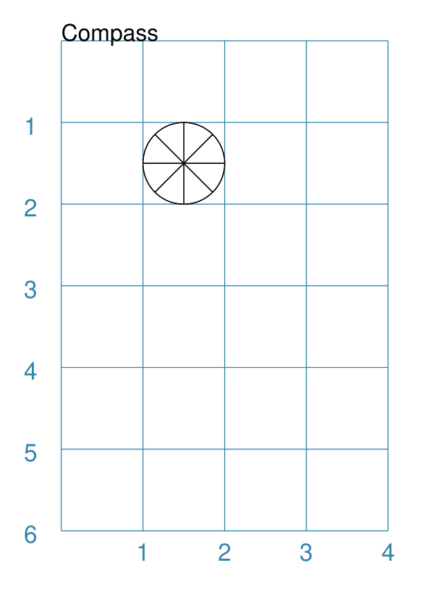

===== ======
|cmp| This example shows the shape constructed using the command with only
      defaults:

      .. code:: python

          Compass()

      It has the following properties based on the defaults:

      - upper-left at x-position ``1`` cm and at y-position ``1`` cm
      - diameter of ``1`` cm
      - lines in all 8 directions, extending from the centre outwards

      The lines  represent the primary |dash| North, South, East and West |dash| and
      secondary |dash| North-East, South-East, North-West and South-West |dash|
      directions.

===== ======

Example 2. Customised Compass
+++++++++++++++++++++++++++++

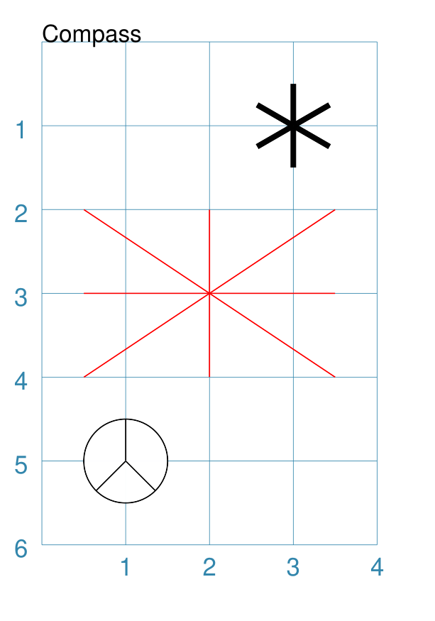

===== ======
|cm2| This example shows the shape constructed using the command with different
      properties.

      The **top-right  Compass** shape:

      .. code:: python

          Compass(
              cx=3, cy=1,
              radius=0.5,
              perimeter='hexagon',
              radii_stroke_width=2)

      This Compass shape has the following properties:

      - centred at x-position ``3`` cm and at y-position ``1`` cm
      - *perimeter* - set as ``hexagon`` to define
        where the six radial lines of the compass extend
      - *radii_stroke_width* - set to ``2`` points; a much thicker line

      For this Compass, the perimeter is a hexagon with a radius of ``0.5`` cm.

      A hexagon has 6 possible radii, corresponding to its vertices.

      .. NOTE::

        Where *directions*, which define where the radial lines extend,
        are not given, the default is ``*``, which means "all" radial lines.

      The **centre Compass** shape:

      .. code:: python

          Compass(
              cx=2, cy=3,
              height=2, width=3,
              perimeter='rectangle',
              directions="*",
              radii_stroke="red")

      This Compass shape has the following properties:

      - centred at x-position ``2`` cm and at y-position ``3`` cm
      - *perimeter* - set as ``rectangle`` to define
        where the radial lines of the compass extend
      - *directions* - where the radial lines extend; in this case
        the ``*`` means "all" eight compass points
      - *radii_stroke* - the line colors used

      For this Compass, the perimeter is a rectangle with a height of ``2`` cm
      and a width of ``3`` cm.

      A rectangle has 8 possible radii, corresponding to its corners and the
      centre of its sides.

      The **lower-left Compass** shape:

      .. code:: python

          Compass(
              cx=1, cy=5, radius=0.5,
              perimeter='circle',
              directions="ne nw s"
          )

      This Compass shape has the following properties:

      - centred at x-position ``1`` cm and at y-position ``5`` cm
      - radius - ``0.5`` cm
      - *directions* - define where the radial lines extend; in this case to the
        North-East, North-West and South

===== ======

.. _ellipse-command:

Ellipse
~~~~~~~
`↑ <shape-index_>`_

Example 1. Default Ellipse
++++++++++++++++++++++++++

.. |ell| image:: images/defaults/ellipse.png
   :width: 330

===== ======
|ell| This example shows the shape constructed using the command with only
      defaults:

      .. code:: python

          Ellipse()

      It has the following properties based on the defaults:

      - upper-left "corner" at x-position ``1`` cm and at y-position ``1`` cm
      - height of ``1`` cm
      - width of ``1`` cm

      Because the *height* and *width* default to the same value, it appears
      as a `Circle`_.

===== ======

Example 2. Customised Ellipse
+++++++++++++++++++++++++++++

===== ======
|el1| This example shows the shape constructed using the command with these
      properties:

      .. code:: python

          Ellipse(cx=2, cy=3, width=3, height=4, dot=0.1)

      It has the following properties set for it:

      - centre at x-position ``2`` cm and at y-position ``3`` cm
      - *height* of ``4`` cm
      - *width* of ``3`` cm

      Because the *height* is greater than the *width* it has more of an egg-shape.
===== ======

.. _equilateraltriangle-command:

EquilateralTriangle
~~~~~~~~~~~~~~~~~~~
`↑ <shape-index_>`_

Example 1. Default EquilateralTriangle
++++++++++++++++++++++++++++++++++++++

.. |eqi| image:: images/defaults/equiangle.png
   :width: 330

===== ======
|eqi| This example shows the shape constructed using the command with only
      defaults:

      .. code:: python

          EquilateralTriangle()

      It has the following properties based on the defaults:

      - lower-left "corner" at x-position ``1`` cm and y-position ``1`` cm
      - side - ``1`` cm i.e. all sides are equal
===== ======

Example 2. Customised EquilateralTriangle
+++++++++++++++++++++++++++++++++++++++++

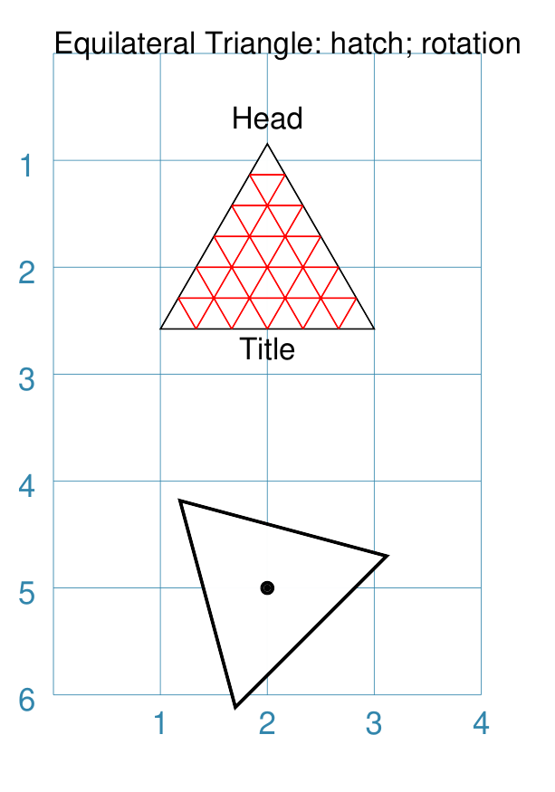

===== ======
|eq2| This example shows the shape constructed using the command with the
      various properties.

      In the top section:

      .. code:: python

        EquilateralTriangle(
            x=2, y=1,
            flip="north", hand="west",
            label="NW",
            fill="red")
        EquilateralTriangle(
            x=2, y=1,
            flip="north", hand="east",
            label="NE",
            fill="gold")
        EquilateralTriangle(
            x=2, y=1,
            flip="south", hand="west",
            label="SW",
            fill="blue")
        EquilateralTriangle(
            x=2, y=1,
            flip="south", hand="east",
            label="SE",
            fill="chartreuse")

      These shapes have the following properties:

      - starting position - *x* is``2`` cm and *y* is ``1`` cm
      - default side of ``1`` cm; all sides are equal
      - *flip* - can be ``north`` or ``south`` |dash| the triangle
        to either point up or down relative to the starting position
      - *hand*  - can be ``west`` or ``east`` |dash| the triangle
        to be drawn to the left or the right relative to the starting position

      The middle section shows:

      .. code:: python

        EquilateralTriangle(
            x=1, y=4, side=1.5,
            hatch_count=5, hatch_stroke="red",
            title="Title", heading="Head")

      - starting position - *x* is ``1`` cm and *y* is ``4`` cm
      - *side* of ``1.5`` cm; all sides are equal
      - *hatch_count* of ``5`` - this means there will be 5 equally spaced lines drawn
        between opposing sides and running parallel to the third side
      - *hatch_stroke* - customise the hatches to show them as ``red``

      The top section shows:

      .. code:: python

        EquilateralTriangle(
            x=1, y=5.5, side=1.5,
            stroke_width=1,
            rotation=45,
            dot=.05)

      - starting position -  *x* is ``1`` cm and *y* is ``5.5`` cm
      - *dot* - in the centre
      - *rotation* - of 45 |deg| anti-clockwise about
        the centre

===== ======

.. _hexagon-command:

Hexagon
~~~~~~~
`↑ <shape-index_>`_

.. NOTE::

   There is more detail about the many properties that can be defined for a
   Hexagon in the :ref:`customised shapes' Hexagon <hexIndex>` section.

Example 1. Default Hexagon
++++++++++++++++++++++++++

.. |hx1| image:: images/defaults/hexagon-flat.png
   :width: 330

===== ======
|hx1| This example shows the shape constructed using the command with only
      defaults:

      .. code:: python

          Hexagon()

      It has the following properties based on the defaults:

      - upper-left "corner" at x-position ``1`` cm and at y-position ``1`` cm
      - flat-to-flat |dash| opposite edges |dash| distance of ``1`` cm
      - "flat" top - top edge is parallel to top of paper
===== ======

Example 2. Pointy Hexagon
+++++++++++++++++++++++++

.. |hx2| image:: images/defaults/hexagon-pointy.png
   :width: 330

===== ======
|hx2| This example shows the shape constructed using the command with only
      one change to the defaults:

      .. code:: python

          Hexagon(orientation="pointy")

      It has the following properties based on the defaults:

      - upper-left "corner" at x-position ``1`` cm and at y-position ``1`` cm
      - flat-to-flat height of ``1`` cm
      - *orientation* -``pointy`` i.e. side edge is parallel to side of paper
===== ======

.. _polygon-command:

Polygon
~~~~~~~
`↑ <shape-index_>`_

A polygon is a shape constructed of any number of sides of equal length.

For example, a hexagon is simply a polygon with 6 sides and an octagon
is a polygon with 8 sides.

    **HINT** Unlike the `Hexagon`_ shape, a Polygon can be rotated!

Example 1. Default Polygon
++++++++++++++++++++++++++

.. |pol| image:: images/defaults/polygon.png
   :width: 330

===== ======
|pol| This example shows the shape constructed using the command with only
      defaults:

      .. code:: python

          Polygon()

      It has the following properties based on the defaults:

      - centre at x-position ``1`` cm and at y-position ``1`` cm
      - ``6`` sides
      - a *side* length of  ``1`` cm
===== ======

Example 2. Polygon with Sides
+++++++++++++++++++++++++++++

.. |pl1| image:: images/customised/polygon_sizes.png
   :width: 330

===== ======
|pl1| This example shows three shapes constructed using the command with the
      following properties:

      .. code:: python

        Polygon(cx=1, cy=5, sides=7, radius=1, label="Seven")
        Polygon(cx=2, cy=3, sides=6, radius=1, label="Six")
        Polygon(cx=3, cy=1, sides=5, radius=1, label="Five")

      It can be seen that each shape is constructed as follows:

      - *centre* - using *cx* and *cy* values
      - *radius* - ``1`` cm in each case
      - *sides* - varying from ``7`` down to ``5``

      Even-sided polygons have a "flat" top, whereas odd-sided ones are
      asymmetrical; this can be adjusted through `rotation`_.
===== ======

Example 3. Polygon Radii
++++++++++++++++++++++++

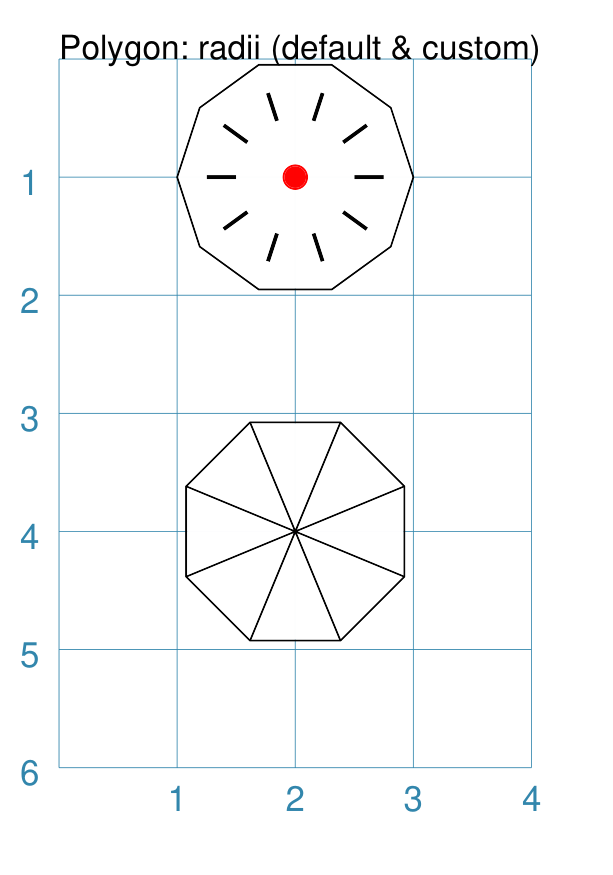

===== ======
|pl2| This example shows the shape constructed using the command with the
      additional properties.

      The **lower** example:

      .. code:: python

          Polygon(cx=2, cy=4, sides=8, radius=1, radii=True)

      It has the following properties:

      - *centre* at x-position ``2`` cm and at y-position ``4`` cm, with a *radius*
        size of ``1`` cm
      - *sides* - ``8`` sides
      - *radii* - set to ``True`` to force lines to be drawn from the centre
        of the polygon to each of its vertices

      The **top** example:

      .. code:: python

          Polygon(
              cx=2, cy=1, sides=10, radius=1,
              radii=True,
              radii_offset=0.75, radii_length=0.25, radii_stroke_width=1,
              dot=0.1, dot_stroke="red"
          )

      It has the following properties:

      - *centre* at x-position ``2`` cm and at y-position ``1`` cm, with a *radius*
        size of ``1`` cm
      - *sides* - ``10``
      - *radii* - set to ``True`` to force lines to be drawn from the centre of
        the polygon to each of its vertices; the radii properties are then set:

        - *radii_offset* - set to ``0.75`` cm; distance away from the centre
          that the radii will start
        - *radii_length*  - set to ``0.25`` cm
        - *radii_stroke_width* - set to ``1`` point; a slightly thicker line

      .. NOTE::

        When the radii length is shorter than the distance from
        vertex to centre, the line will still go in the same direction
        but never touch the vertex.

===== ======

Example 4. Polygon with Perbis
++++++++++++++++++++++++++++++

The *perbis* |dash| short for "perpendicular bisector" |dash| defines
lines that should be drawn from the centres of the sides of the polygon
to the polygon's centre.

.. |pl3| image:: images/customised/polygon_perbis.png
   :width: 330

===== ======
|pl3| This example shows the shape constructed using the command with the
      additional properties.

      The **lower** example:

      .. code:: python

          Polygon(cx=2, cy=4, sides=8, radius=1, perbis='*')

      It has the following properties:

      - *centre* at x-position ``2`` cm and at y-position ``4`` cm, with a *radius*
        size of ``1`` cm
      - *sides* - ``8`` sides (an octagon)
      - *perbis* - set to ``*``; this means lines are drawn from each of the
        centres of the sides of the polygon to its centre

      The **top** example:

      .. code:: python

          Polygon(
            cx=2, cy=1, sides=8, radius=1,
            perbis="2,4,7",
            perbis_offset=0.25, perbis_length=0.5, perbis_stroke_width=1,
            dot=0.1, dot_stroke="red")

      It has the following properties:

      - *centre* at x-position ``2`` cm and at y-position ``1`` cm
      - *radius* size of ``1`` cm
      - *sides* - ``8`` (an octagon)
      - *perbis* - lines drawn to sides 2, 4 and 7

      The edges of the polygon are numbered; the east-most facing edge is 1,
      and then numbers increase in an clockwise direction.

      Its properties can be set as follows:

      - *perbis* - a list of edges to use
      - *perbis_offset* - set to ``0.25`` cm; the distance away from the centre
        that the lines will start to be drawn
      - *perbis_length*  - set to ``0.5`` cm
      - *perbis_stroke_width* - set to ``1`` point; a slightly thicker line

      Note that when the perbis length is shorter than that the distance from
      centre point to edge, the line will still go in the same direction but never
      touch the vertex or the edge.

===== ======

Example 5. Polygon Rotation
+++++++++++++++++++++++++++

.. |pl4| image:: images/customised/polygon_rotation_flat.png
   :width: 330

===== ======
|pl4| This example shows five shapes constructed using the command with
      additional properties:

      .. code:: python

        Polygon(common=poly6, y=1, x=1.0, label="0")
        Polygon(common=poly6, y=2, x=1.5, rotation=15, label="15")
        Polygon(common=poly6, y=3, x=2.0, rotation=30, label="30")
        Polygon(common=poly6, y=4, x=2.5, rotation=45, label="45")
        Polygon(common=poly6, y=5, x=3.0, rotation=60, label="60")

      The examples have the following properties:

      - *x* and *y* - set the upper-left location
      - *radius* - ``1`` cm in each case
      - *sides* - the default of ``6`` in each case (a `hexagon`_ shape)
      - *rotation* - varies from 0 |deg| to 60 |deg|

      The rotation defined here is anti-clockwise from the horizontal.

===== ======

.. _polyshape-command:

Polyshape
~~~~~~~~~
`↑ <shape-index_>`_

A Polyshape is an irregular `polygon`_, constructed using a series of points.

Example 1. Default Polyshape
++++++++++++++++++++++++++++

.. |shp| image:: images/customised/polyshape_default.png
   :width: 330

===== ======
|shp| If the shape is constructed using the command with only defaults:

      .. code:: python

        Polyshape()

      Then nothing will be visible; instead you will see a warning::

        WARNING:: There are no points to draw the Polyshape

      Like `polyline`_, the Polyshape requires a list of points to be constructed.

      This example shows how to do this using the command with these properties:

      .. code:: python

        Polyshape(points=[(1, 2), (1, 1), (2, 0), (3, 1), (3, 2)])

      It has the following properties:

      - starts at x-position ``1`` cm and at y-position ``2`` cm
      - second point is at x-position ``1`` cm and at y-position ``1`` cm
      - third point is at x-position ``2`` cm and at y-position ``0`` cm
      - etc.

      The *points* for a Polyshape which represent its vertices are given in a
      list:

      - all points are listed inside the square brackets from ``[`` to ``]``
      - each *x* and *y* are provided as a pair of values in round brackets
      - each *x* and *y* are separated by a comma
      - each pair of values in the list is separated by a comma

      Lines are drawn between each successive point in the list; **including a
      line from the last to the first**.

      The default *stroke* and *fill* apply to this example of a Polyshape.
===== ======

Example 2. Polyshape with Centre
++++++++++++++++++++++++++++++++

While the Polyshape does not have the ability to be constructed using a
*cx* and *cy* pair to set its centre location |dash| like the symmetric
shapes |dash| it is possible to provide these values to the shape command,
and they can then be used for a label, plus the `dot and cross`_, similar
to those other shapes.

**NOTE** - the program has no way of knowing or "checking" that the values
for the *cx* and *cy* pair that you supply to it are correct!

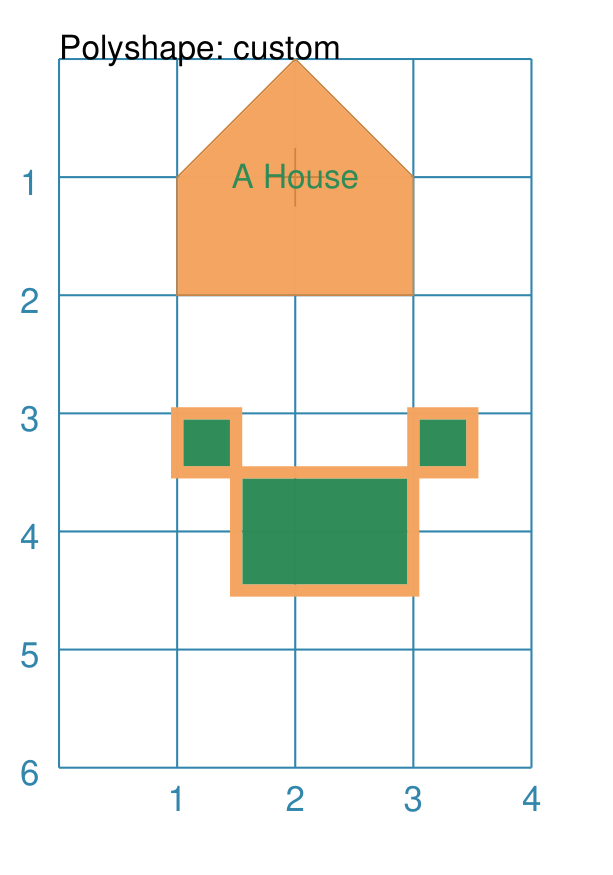

===== ======
|sh2| The shape is constructed using the command with these properties:

      .. code:: python

        Polyshape(
              points=[(1, 2), (1, 1), (2, 0), (3, 1), (3, 2)],
              cx=2, cy=1,
              label='A House',
              label_stroke="seagreen",
              cross=0.5,
              fill="sandybrown",
              stroke="peru",
        )

      As in Example 1, the *points* are used to construct the outline of the
      shape. Other properties:

      - the centre is *defined* to be at x-position ``2`` cm and y-position
        ``1`` cm
      - *cross* - sets the length of each of the two lines that cross at the
        centre to be ``0.5`` cm
      - *label* - sets the text appearing at the defined centre position
      - *fill* - color of ``sandybrown`` (hexadecimal value ``#F4A460``)
        for the shape's' interior
      - *stroke* - color of ``peru`` (hexadecimal value ``#CD853F``)

      *Reminder:* ``cx`` and ``cy`` affect the drawing of the cross and label
      but do **not** affect the drawing of the shape itself.
===== ======

Example 3. Polyshape Offset
+++++++++++++++++++++++++++

There are two other options available.

In addition to the *cx* and *cy* pair, an *x* and *y* pair can also be provided;
these values will be used to offset ("move") the Polyshape from the position it
would normally occupy.

It is also possible to provide the *points* as a string of space-separated
pairs of values; so instead of ``[(0,0), (1,1)]`` just use ``"0,0 1,1"``.

.. |sh3| image:: images/customised/polyshape_offset.png
   :width: 330

===== ======
|sh3| The shapes are constructed using the command with these properties:

        .. code:: python

            Polyshape(
                points="0,0 0,1 2,0 2,1 0,0",
                cx=1, cy=0.5,
                fill="chartreuse",
                label="Left ....... Right")
            Polyshape(
                points="0,0 0,1 2,0 2,1 0,0",
                cx=1, cy=0.5,
                fill="gold",
                label="Left ....... Right",
                x=1, y=2)

      As in Example 2, the *points* are used to construct the outline of the
      shape. In this case, they are a string of space-separated pairs of values.

      Other properties:

      - the centre is defined to be at x-position ``1`` cm and y-position
        ``0.5`` cm; this **only** affects drawing of the label
        but does **not** affect drawing the shape itself
      - *label* - sets the text appearing at the defined centre position
      - *fill* color defines the color of the interior of the shape

      In the ``gold``-filled Polyshape, the *x* and *y* values have been set.
      So, even though the points used to define the ``gold`` Polyshape are
      the same as those used for ``green`` one, these values cause the whole
      shape to be moved down and to the right.
===== ======

.. _qrcode-command:

QRCode
~~~~~~
`↑ <shape-index_>`_

A QR Code is a square image containing a pattern of black squares and dots.
It represents encoded information that a device with a QR scanner, for example
a cell phone, can decode.

The properties that can be provided to a ``QRCode`` command, apart from the
usual *x* and *y*, to set the upper-left corner, and *height* and *width* to
set the size, are:

- *image* - this should be the first property and is the name of the file
  that will be created by the command
- *text* - this contains the information that is to be encoded (and decoded)
- *scaling* - the size of the indivdual QR Code squares, in pixels
- *stroke* - the color of the pattern containing the black squares and dots
- *fill* - the color that will appear as the background

.. NOTE::

    The QR Code images generated will be stored in the cache directory
    ``.protograf/images/qrcodes`` (or ``.protograf\images\qrcodes``);
    see :ref:`caching <protograf_caching>`.

Example 1. Default QRCode
+++++++++++++++++++++++++

===== ======
|qrc| The shape cannot be constructed using only default properties:

      .. code:: python

          QRCode()

      Nothing will be visible; instead you will see a warning::

        WARNING:: No text supplied for the QRCode shape!

      This example shows the shape constructed using the commands with these
      properties:

      .. code:: python

        QRCode("qrcode1.png", text="Help")

      The first command uses the defaults which means it has the following
      properties automtically set for it:

      - upper-left corner at x-position ``1`` cm and at y-position ``1`` cm
      - *width* and *height* - default to ``1`` cm
      - *scaling* - default is ``1``, so 1 pixel per square
      - *stroke* - is ``black`` for the squares color
      - *fill* - is ``white`` for the background color

      The second command overides various of these defaults:

      .. code:: python

        QRCode(
            'qrcode2.png',
            text="Help me ObiWan",
            x=1, y=3,
            height=2, width=2,
            fill="gray",
            stroke="red",
            scaling=5
        )

      In this example, the QR Code is now larger with different colors.

===== ======

.. _rectangle-command:

Rectangle
~~~~~~~~~
`↑ <shape-index_>`_

.. NOTE::

   There is more detail about the many properties that can be defined for a
   Rectangle in the :ref:`customised Rectangle <rectangleIndex>` section.

Example 1. Default Rectangle
++++++++++++++++++++++++++++

.. |rct| image:: images/defaults/rectangle.png
   :width: 330

===== ======
|rct| This example shows the shape constructed using the command with only
      defaults:

      .. code:: python

          Rectangle()

      It has the following properties set for it:

      - upper-left corner at x-position ``1`` cm and y-position ``1`` cm
      - *width* and *height* - default to ``1`` cm

      Because all sides of the Rectangle are equal, it appears as though it
      is a `Square`_.
===== ======

Example 2. Customised Rectangle
+++++++++++++++++++++++++++++++

.. |rc1| image:: images/customised/rectangle_custom.png
   :width: 330

===== ======
|rc1| This example shows the shape constructed using the command with these
      properties:

      .. code:: python

          Rectangle(cx=2, cy=3, width=3, height=4, dot=0.1)

      It has the following properties set for it:

      - *cx* and *cy* - set the centre at x-position ``2`` cm and
        y-position ``3`` cm
      - *height* - ``4`` cm
      - *width* - ``3`` cm
      - *dot* - small, filled circle placed at the centre of size ``0.1``

      Because the *height* is greater than the *width* the Rectangle has an
      appearance like a playing card.
===== ======

.. _rhombus-command:

Rhombus
~~~~~~~
`↑ <shape-index_>`_

Example 1. Default Rhombus
++++++++++++++++++++++++++

.. |rh0| image:: images/defaults/rhombus.png
   :width: 330

===== ======
|rh0| This example shows the shape constructed using the command with only
      defaults:

      .. code:: python

          Rhombus()

      It has the following properties based on the defaults:

      - upper-left at x-position ``1`` cm and at y-position ``1`` cm
      - *width* - ``1`` cm
      - *height* - ``1`` cm

      Because the sides are of equal length, the Rhombus appears to be a
      rotated Square.
===== ======

Example 2. Rhombus Centre & Dot
+++++++++++++++++++++++++++++++

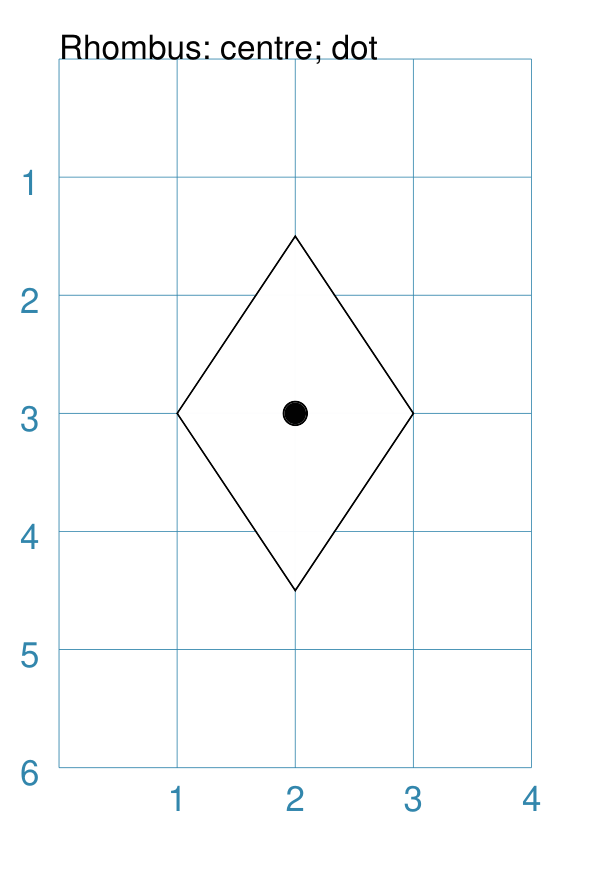

===== ======
|rh1| This example shows the shape constructed using the command with these
      properties:

      .. code:: python

          Rhombus(cx=2, cy=3, width=2, height=3, dot=0.1)

      It has the following properties set for it:

      - centre at x-position ``2`` cm and at y-position ``3`` cm
      - *width* - ``2`` cm
      - *height* - ``3`` cm
      - *dot* - small, filled circle placed at the centre of size ``0.1``
===== ======

Example 3. Rhombus Border Styles
++++++++++++++++++++++++++++++++

===== ======
|rh2| This example shows the shape constructed using the command with these
      properties:

      .. code:: python

          Rhombus(
            cx=2, cy=3, width=2, height=3,
            borders=[
                ("nw", 2, gold),
                ("ne", 2, lime, True),
                ("se", 2, tomato, [0.1, 0.2]),
                ("sw", 2)
            ]
          )

      It has the following properties set for it:

      - centre at x-position ``2`` cm and at y-position ``3`` cm
      - *width* of ``2`` cm
      - *height* of ``3`` cm
      - *borders* - a list of sets of custom settings for each side; each set
        can contain:

        - `direction` - ne (northeast), se (southeast), nw (northwest),
          or sw (southwest)
        - `width` - the line thickness
        - `color` - either a named color or a hexadecimal value
        - `style` - ``True`` makes it dotted; a pair of values creates dashes

        Direction and width are required, but color and style are optional.

        Mutiple, spaced values can be used to draw lines e.g. ``ne se``.
===== ======

.. _sector-command:

Sector
~~~~~~
`↑ <shape-index_>`_

A Sector is like the triangular-shaped wedge that is often cut from a pizza
or cake. It extends from the centre of a "virtual" circle outwards to its
enclosing diameter.  The two "arms" of the sector will cover a certain number
of degrees of the circle (from 1 to 360).

Example 1. Default Sector
+++++++++++++++++++++++++

===== ======
|sct| This example shows the shape constructed using the command with only
      defaults:

      .. code:: python

          Sector()

      It has the following properties based on the defaults:

      - upper-left "corner"at x-position ``1`` cm and at y-position ``1`` cm

      The sector is then drawn inside a circle of radius ``1`` cm, whose
      centre is at  x-position ``0.5`` cm and at y-position ``0.5`` cm.
      The default *angle_width* is 90 |deg|.
===== ======

Example 2. Customised Sector
++++++++++++++++++++++++++++

.. |sc1| image:: images/customised/sectors.png
   :width: 330

===== ======
|sc1| This example shows examples of the Sector constructed using commands
      with the following properties:

      .. code:: python

        sctm = Common(
            cx=2, cy=3, radius=2,
            fill="black", angle_width=43)

        Sector(common=sctm, angle=40)
        Sector(common=sctm, angle=160)
        Sector(common=sctm, angle=280)

      These all have the following Common properties:

      - centred at x-position ``2`` cm and at y-position ``3`` cm
      - *radius* of ``2`` cm for the enclosing "virtual" circle
      - *fill* color of black
      - *angle_width* - determines the coverage i.e. the "width" of the
        Sector; in all these cases it is 43 |deg|

      Each sector in this example is drawn at a different *angle*.
      This represents a "virtual" centre-line extending through the sector,
      outwards from the centre of the enclosing "virtual" circle.
===== ======

.. _square-command:

Square
~~~~~~
`↑ <shape-index_>`_

Example 1. Default Square
+++++++++++++++++++++++++

.. |sqr| image:: images/defaults/square.png
   :width: 330

===== ======
|sqr| This example shows the shape constructed using the command with only
      defaults:

      .. code:: python

          Square()

      It has the following properties based on the defaults:

      - upper-left corner at:

        - x-position ``1`` cm, and
        - y-position ``1`` cm
      - side of ``1`` cm

===== ======

Example 2. Customised Square
++++++++++++++++++++++++++++

.. |sq1| image:: images/customised/square_custom.png
   :width: 330

===== ======
|sq1| This example shows the shape constructed using the command with these
      properties:

      .. code:: python

          Square(cx=2, cy=3, side=3, dot=0.1)

      It has the following properties set for it:

      - centre at x-position ``2`` cm and at y-position ``3`` cm
      - *side* of ``3`` cm; both *width* and *height* match this
      - *dot* - small, filled circle placed at the centre of size ``0.1``

===== ======

.. _stadium-command:

Stadium
~~~~~~~
`↑ <shape-index_>`_

A Stadium is a shape constructed with a rectangle as a base, and then curved
projections added that extend from one or more of the sides.

In its default form, it may look like a pill.

Example 1. Default Stadium
++++++++++++++++++++++++++

===== ======
|std| This example shows the shape constructed using the command with only
      defaults:

      .. code:: python

          Stadium()

      It has the following properties based on the defaults:

      - straight edge start at:

        - x-position ``1`` cm and
        - y-position ``1`` cm
      - height and width of ``1`` cm each

      The default curved ends extend from the east/right and west/left sides.

===== ======

Example 2. Customised Stadium
+++++++++++++++++++++++++++++

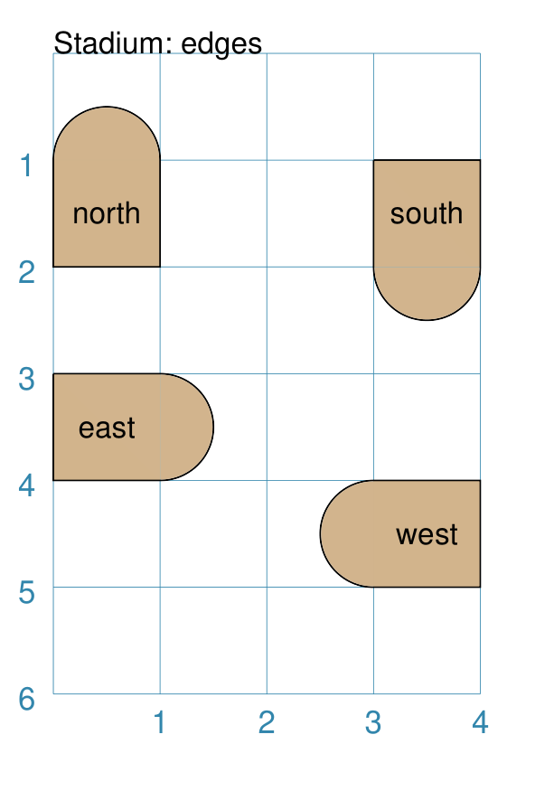

===== ======
|st1| This example shows example of the shape constructed using the command
      with the following properties:

      .. code:: python

        Stadium(
          x=0, y=1, height=1, width=1, edges='n',
          fill="tan", label="north")
        Stadium(
          x=3, y=1, height=1, width=1, edges='s',
          fill="tan", label="south")
        Stadium(
          x=0, y=3, height=1, width=1, edges='e',
          fill="tan", label="east")
        Stadium(
          x=3, y=4, height=1, width=1, edges='w',
          fill="tan", label="west")

      These have the following properties set:

      - *height* and *width* - of ``1`` cm and ``1`` cm respectively
      - *edges* - set the projection direction(s)

      The edges of the rounded projection(s) can be set using
      a letter to represent direction, where:

      - ``n`` is ``north`` ("up"),
      - ``s`` is ``south`` ("down"),
      - ``e`` is ``east`` ("right"), and
      - ``w`` is ``west`` ("left").

      One or more edge values can be used together with spaces between them
      e.g. ``n e`` to draw both north **and** east.

===== ======

.. _star-command:

Star
~~~~
`↑ <shape-index_>`_

A Star is a fivepointed shape; essentially made by joining points spaced
equally around the circumference of a circle.

To create more varied kinds of stars, see the triangle petal shapes that can
be created using a :ref:`customised Circle <circleIndex>`.

Example 1. Default Star
+++++++++++++++++++++++

===== ======
|str| This example shows the shape constructed using the command with only
      defaults:

      .. code:: python

          Star()

      It has the following properties based on the defaults:

      - centre at x-position ``1`` cm and at y-position ``1`` cm
      - "height" of ``1`` cm
      - default of 5 points
===== ======

Example 2. Customised Star
++++++++++++++++++++++++++

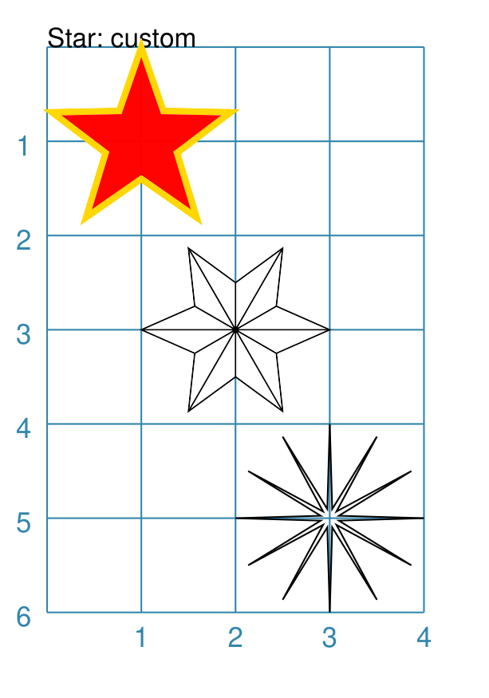

===== ======
|st2| This example shows the shape constructed using the command with these
      properties:

      .. code:: python

          Star(
            cx=2, cy=3, radius=2,
            fill="yellow",
            stroke="yellow",
            rotation=36)

      It has the following properties that differ from the defaults:

      - centre at x-position ``2`` cm and at y-position ``3`` cm
      - *radius* - ``2`` cm; length of the "arms"
      - *fill* color - ``yellow`` for the interior of the Star
      - *stroke* color - ``yellow`` for the outline of the Star
      - *rotation* - 36 |deg| anti-clockwise about the centre
===== ======

.. _starfield-command:

Starfield
~~~~~~~~~
`↑ <shape-index_>`_

A Starfield is a shape in which a number of small dots are scattered at random
to simulate what might be seen when looking at a portion of the night sky.

The dots are drawn inside the boundaries of an "enclosure"; this can be a
rectangle, a circle, or a polygon |dash| but this shape is not, itself, drawn.

The number of dots drawn depends on the "density", which is the product of the
actual area of the shape multiplied by the density value.

.. HINT::

    If you want repeatable randomness - that is to say, the same sequence of
    random numbers being generated every time the program is run - then assign
    a value to the *seeding* property; for example:

    .. code:: python

      Starfield(seeding=42)

    The images used for this document are created with such a setting; but only
    to avoid the code repository detecting a "change" each time the script runs.

Example 1. Default Starfield
++++++++++++++++++++++++++++

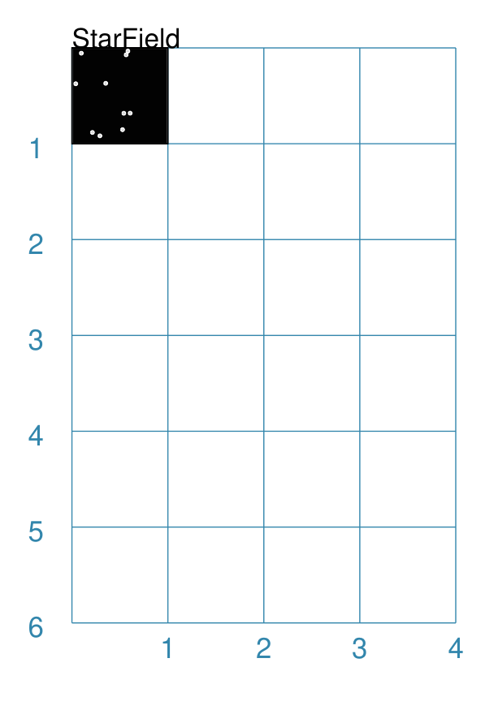

===== ======
|sf0| This example shows the shape constructed using the command with only
      defaults:

      .. code:: python

          Starfield()

      It has the following properties based on the defaults:

      - upper-left corner at x-position ``0`` cm and y-position ``0`` cm
      - an enclosing rectangle with *height* and *width* of ``1`` cm
      - 10 randomly placed ``white`` *color* 'dots' (the starfield *density*)

      Because the default fill color is ``white``, this example adds an extra
      `Rectangle()` shape, with a fill of ``black``, which is drawn first and
      is hence "behind" the field of dots.
===== ======

Example 2. Multiple Color Starfield
+++++++++++++++++++++++++++++++++++

.. |sf1| image:: images/customised/starfield_rectangle.png
   :width: 330

===== ======
|sf1| This example shows the shape constructed using the command with the
      following properties:

      .. code:: python

        StarField(
            enclosure=rectangle(x=0, y=0, height=3, width=3),
            density=80,
            colors=[white, white, red, green, blue],
            sizes=[0.4]
        )

      It has the following properties set:

      - upper-left corner at x-position ``0`` cm and y-position ``0`` cm
      - *enclosure* - the rectangle size determines the boundaries of the area
        (*height* and *width* each of ``3`` cm) inside of which the stars (dots) are
        randomly drawn
      - *density* - there will be a total of "80 multiplied by the enclosure
        area" dots drawn
      - *colors* - is a list of colors, one of which will be randomly chosen
        each time before drawing a dot
      - *sizes* - is a list of randomly chosen dot sizes; in this case there is
        just one value and so all dots will be same size

      Because the default fill color is white, this example adds an extra
      `Rectangle()` shape, with a fill color of black, which is drawn first and
      is hence "behind" the field of dots.
===== ======

Example 3. Multiple Size Starfield
++++++++++++++++++++++++++++++++++

.. |sf2| image:: images/customised/starfield_circle.png
   :width: 330

===== ======
|sf2| This example shows the shape constructed using the command with the
      following properties:

      .. code:: python

        StarField(
            enclosure=circle(x=0, y=0, radius=1.5),
            density=30,
            sizes=[0.15, 0.15, 0.15, 0.15, 0.3, 0.3, 0.5]
        )

      It has the following properties set:

      - upper-left "corner" at x-position ``0`` cm and at y-position ``0`` cm
      - *enclosure* - the `circle` radius (``1.5`` cm) determines the boundaries
        of the area inside of which the stars (dots) are randomly drawn
      - *density* - there will be a total of "30 multiplied by the enclosure
        area" dots drawn
      - *sizes* - is a list of available dot sizes, one of which is randomly
        chosen from the list each time before drawing a dot

      Because the default fill color is white, this example adds an extra
      `Circle()` shape, with a fill color of black, which is drawn first and is
      hence "behind" the field of dots.
===== ======

Example 4. Multiple Color & Size Starfield
++++++++++++++++++++++++++++++++++++++++++

.. |sf3| image:: images/customised/starfield_poly.png
   :width: 330

===== ======
|sf3| This example shows the shape constructed using the command with the
      following properties:

      .. code:: python

        StarField(
            enclosure=polygon(x=1.5, y=1.4, sides=10, radius=1.5),
            density=50,
            colors=["white", "white", "white", "red", "green", "blue"],
            sizes=[0.15, 0.15, 0.15, 0.15, 0.3, 0.3, 0.45]
        )

      It has the following properties set:

      - upper-left "corner" at x-position ``1.5`` cm and y-position ``1.4`` cm
      - *enclosure* - the polygon radius (``1.5`` cm) determines the boundaries
        of the area inside of which the stars (dots) are randomly drawn
      - *density* - there will be a total of "50 multiplied by the enclosure
        area" dots drawn
      - *colors* - a list of available dot colors, one of which is randomly
        chosen from the list each time before drawing a dot
      - *sizes* - a list of available dot sizes, one of which is randomly
        chosen from the list each time before drawing a dot

      Because the default fill color is white, this example adds an extra
      `Polygon()` shape, with a fill color of black, which is drawn first and
      is hence "behind" the field of dots.
===== ======

.. _trapezoid-command:

Trapezoid
~~~~~~~~~
`↑ <shape-index_>`_

Example 1. Default Trapezoid
++++++++++++++++++++++++++++

.. |trp| image:: images/defaults/trapezoid.png
   :width: 330

===== ======
|trp| This example shows the shape constructed using the command with only
      defaults:

      .. code:: python

          Trapezoid()

      It has the following properties based on the defaults:

      - starts at x-position ``1`` cm and at y-position ``1`` cm
      - *width* of ``1`` cm
      - *height* of ``1`` cm
      - the lower edge of the shape defaults to half the *width*
===== ======

Example 2. Size & Flip Trapezoid
++++++++++++++++++++++++++++++++

.. |tr1| image:: images/customised/trapezoid_custom.png
   :width: 330

===== ======
|tr1| This example shows the shape constructed using the command with these
      properties:

      .. code:: python

          Trapezoid(
            cx=2, cy=3, width=3, top=2, height=4, flip='s', dot=0.1)

      It has the following properties set for it:

      - centre at x-position ``2`` cm and at y-position ``3`` cm
      - *width* of ``3`` cm
      - *height* of ``4`` cm
      - *top* of ``2`` cm
      - *flip* of ``s`` (for ``south``) means the "top" is drawn below the base

===== ======

Example 3. Trapezoid Borders
++++++++++++++++++++++++++++

.. |tr3| image:: images/customised/trapezoid_borders.png
   :width: 330

===== ======
|tr3| This example shows the shape constructed using the command with these
      properties:

      .. code:: python

        Trapezoid(
            cx=2, cy=3, width=2,
            height=2, top=1.5,
            stroke_width=2,
            borders=[
                ("w", 2, "gold"),
                ("e", 2, "chartreuse", True),
                ("n", 2, "tomato", [0.1, 0.2]),
                ("s", 2)
            ]
        )

      It has the following properties set for it:

      - centre at x-position ``2`` cm and at y-position ``3`` cm
      - *width* of ``2`` cm
      - *height* of ``3`` cm
      - *top* of ``1.5`` cm
      - *stroke_width* of 2 points
      - *borders* - a list of sets of custom settings for each side; each set
        can contain:

        - *direction* - one of n(orth), s(outh), e(ast) or w(est)
        - *width* - the line thickness
        - *color* - either a named color or a hexadecimal value
        - *style* - ``True`` makes it dotted; a list of values creates dashes

      Borders' direction and width are required, but color and style are
      optional.

      Multiple border directions can be used, with spaces between them,
      e.g. ``n s`` to draw lines on both north **and** south sides.

===== ======

.. _compoundIndex:

Compound Shapes
---------------
`↑ <table-of-contents-core_>`_

Compound shapes are ones composed of multiple elements; but the program takes
care of drawing all of them based on the properties supplied.

The following are all such shapes:

- `Blueprint`_
- `DotGrid`_
- `Grid`_
- `Hexagons`_
- `Image`_
- `Lines`_
- `Rectangles`_

.. _blueprint-command:

Blueprint
~~~~~~~~~
`↑ <shape-index_>`_

This shape is primarily intended to support drawing while it is "in progress".
It provides a quick and convenient underlying grid that can help to orientate
and place other shapes that *are* required for the final product.  Typically,
one would just comment out this command when its purpose has been served.

On the grid, the values of **x** appear across the lower edge (increasing
from left to right); those for **y** along the left side (increasing from
top to bottom). The grid respects the margins that have been set but you will
observe that the Blueprint numbering itself is located inside the margin area!

Different styling options are provided that can make the Blueprint more
useful in different contexts.

.. NOTE::

   There is more detail about the various properties that can be defined for a
   Blueprint in the :ref:`customised Blueprint <blueprintIndex>` section.

Example 1. Defaults
+++++++++++++++++++

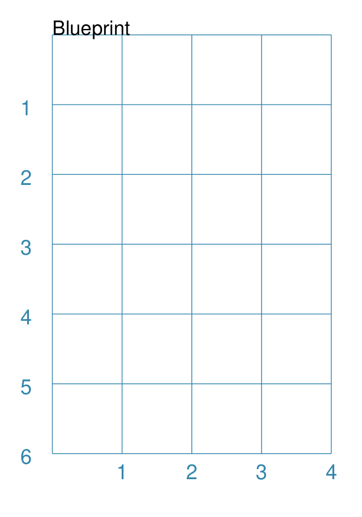

===== ======
|blp| This example shows the shape constructed using the command with only
      defaults:

      .. code:: python

          Blueprint()

      It has the following properties based on the defaults:

      - starts at the upper-left corner, as defined by the page margins
      - has vertical and horizontal lines filling the page from the lower left
        corner up to the right-most and top-most margins
      - has interval between the lines of ``1`` cm
      - default line color is a shade of ``blue`` (hexadecimal ``#2F85AC``)
      - the x- and y-axis are numbered from the left and top respectively

===== ======

Example 2. Subdivisions & Style
+++++++++++++++++++++++++++++++

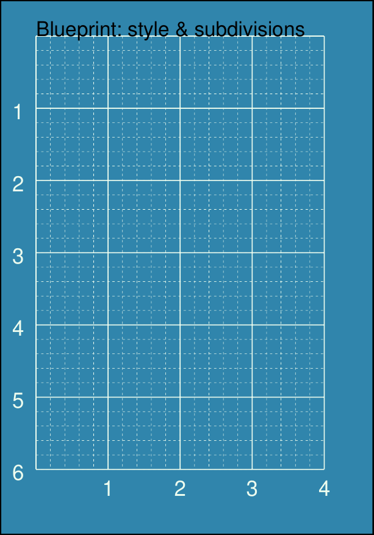

===== ======
|bl2| This example shows the shape constructed using the command with these
      properties:

      .. code:: python

          Blueprint(
            subdivisions=5,
            stroke_width=0.5,
            style='invert')

      It has the following properties set:

      - *subdivisions* - set to ``5``
      - *stroke_width* - set to ``0.5``; slightly thicker line makes
        the main grid more visible
      - *style* - set to ``invert`` so that the lines and number colors are white
        and the fill color is now a shade of ``blue`` (``#2F85AC``)

      The *subdivisions* are the thinner lines that are drawn between each pair
      of primary lines |dash| they do not have any numbering and are *dotted*.
===== ======

.. _dotgrid-command:

DotGrid
~~~~~~~
`↑ <shape-index_>`_

A DotGrid is a series of dots |dash| both in the vertical and horizontal
directions. This will, by default, fill the page, as far as possible,
between its margins.

Example 1. Defaults
+++++++++++++++++++

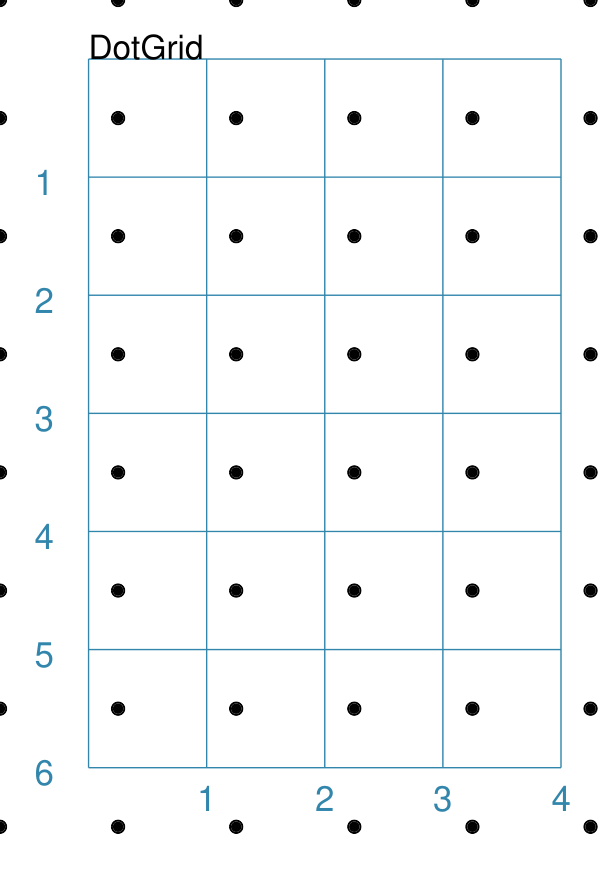

===== ======
|dtg| This example shows the shape constructed using the command with only
      defaults::

          DotGrid()

      It has the following properties based on the defaults:

      - the upper-left of the grid is drawn at the absolute page x-position
        of ``0`` cm and y-position ``0`` cm i.e. the margins are ignored
      - a set of dots, spaced ``1`` cm apart, are created extending to the
        right- and top- edges
      - default dot size of ``3`` points
      - default color of ``black``

===== ======

Example 2. Moleskine Grid
+++++++++++++++++++++++++

===== ======
|dg1| This example shows the shape constructed using the command with the
      following properties:

      .. code:: python

        DotGrid(
            stroke="darkgray",
            width=0.5, height=0.5,
            dot_point=1, offset_y=-0.25)

      To simulate the dot grid found in Moleskine notebooks, it
      has the following properties set:

      - *width* and *height* - intervals between the centre of the dots
        in the x- and y-directions respectively
      - *dot_point* - set to be smaller than the default of ``3``
      - *stroke*  - set to ``darkgrey`` i.e. lighter than the default black
      - *offset_y* - moves the start of the grid slightly downwards by 1/4 cm

      .. HINT::

         For a notebook page for *actual* use, you could consider setting
         the page color.

         To change the page color, set the *fill* property of the ``Create()``
         command.

         A color like ``"cornsilk"`` might provide a suitable backdrop
         for the light grey of the grid.
===== ======

.. _grid-command:

Grid
~~~~
`↑ <shape-index_>`_

A Grid is a series of crossed lines |dash| both in the vertical and
horizontal directions. The Grid will, by default, fill the page as far
as possible between its margins.

Example 1. Defaults
+++++++++++++++++++

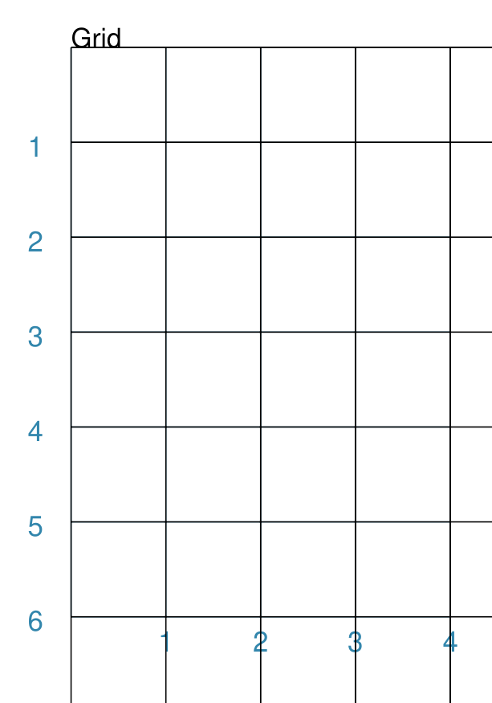

===== ======
|grd| This example shows the shape constructed using the command with only
      defaults:

      .. code:: python

          Grid()

      It has the following properties based on the defaults:

      - starts at upper-left corner of page defined by the margin
      - has a default grid interval of ``1`` cm in both the x- and y-direction
===== ======

Example 2. Side & Stroke
++++++++++++++++++++++++

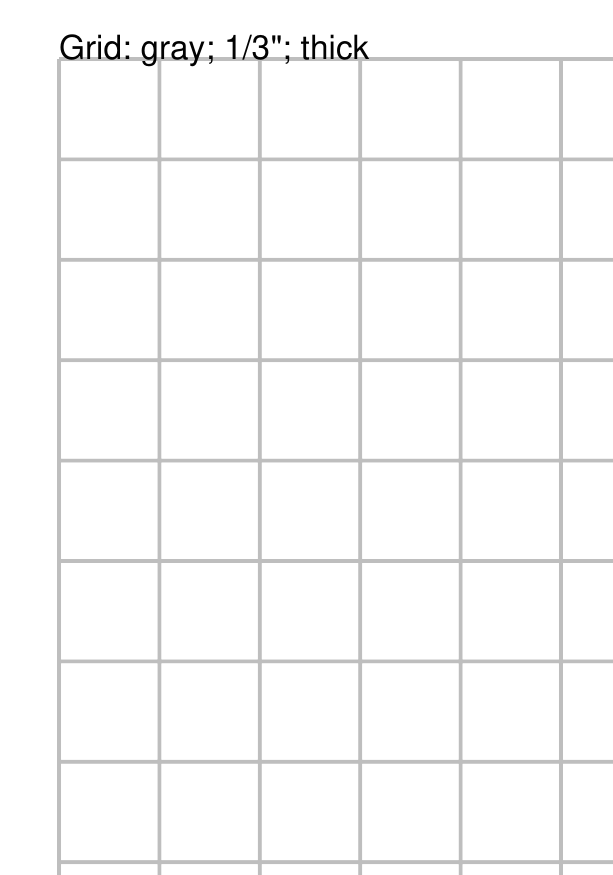

===== ======
|gr2| This example shows the shape constructed using the command with the
      following properties (and without a `Blueprint`_ background):

      .. code:: python

          Grid(side=0.85, stroke="gray", stroke_width=1)

      It has the following properties based on the defaults:

      - *side* - set to ``0.85`` cm (about 1/3 of an inch)
        which sets the size of both the x- and y-direction
      - *stroke_width* - set to ``1`` point; the thicker line makes the grid
        more visible
      - *stroke* - set to ``gray`` i.e. a lighter color than the default black

===== ======

Example 3. Fixed Size
+++++++++++++++++++++

.. |gr3| image:: images/customised/grid_3x4.png
   :width: 330

===== ======
|gr3| This example shows the shape constructed using the command with the
      following properties:

      .. code:: python

          Grid(
              x=0.5, y=0.5,
              height=1.25, width=1,
              cols=3, rows=4,
              stroke="gray", stroke_width=1
          )

      It has the following properties set for it:

      - *x* and *y* - each set to ``0.5`` cm; offsets the grid's upper-left
        corner from the page margin
      - *height* - value of ``1.25`` cm set for the row height
      - *width* - value of ``1`` cm set for the column width
      - *cols* and *rows* - ``3`` columns wide by ``4`` rows high
      - *stroke_width* - set to ``1`` point; the thicker line makes
        the grid clearly visible
      - *stroke* -set to ``gray`` i.e. a lighter color than the default black

      The grid now has a fixed "rows by columns" size, rather than being
      automatically calculated to fill up the page.

===== ======

.. _image-command:

Image
~~~~~
`↑ <shape-index_>`_

Pedantically speaking, an image is not like the other shapes in the sense that
it does not consist of lines and areas drawn by **protograf**  itself.

An "image" refers to an external file which is simply inserted into the drawing.

The Image shape shares a number of common aspects with other shapes - such as
an x & y position, a width and height, and the ability to be rotated.

An image can also be "drawn over" by other shapes appearing later on in the
script.

If an image has a transparent area, this will be respected and shapes
appearing earlier on in the script may then be visible "below" it.

Example 1. Default Image
++++++++++++++++++++++++

===== ======
|im1| If the shape was constructed using only default properties, there will be
      nothing to see and an error will be displayed:

      .. code:: python

          Image()

      Will show this message::

          FEEDBACK:: Unable to load image - no name provided

      This example then shows the shape constructed with just a single property:

      .. code:: python

        Image("sholes_typewriter.png")

      This first, unnamed property is the filename of the image.

      If no directory is supplied for the image, it is assumed to be
      in the same as that of the script.

      The image has the following other properties based on the defaults:

      - upper-left corner - x-position ``1`` cm and y-position ``1`` cm
      - *width* and *height* - default to ``1`` cm each

      The size set for the image may distort it if the ratios do not match
      those of the image itself.

===== ======

Example 2. Rotation & Scaling
+++++++++++++++++++++++++++++

.. |im2| image:: images/customised/images_normal_rotation.png
   :width: 330

===== ======
|im2| This example shows the shape constructed using the command with the
      following properties:

      .. code:: python

        Image(
          "sholes_typewriter.png",
          x=0, y=1, width=1.5, height=1.5,
          title="PNG")
        Image(
          "sholes_typewriter.png",
          x=2, y=1, width=1.5, height=1.5,
          title="60\u00B0",
          rotation=60)
        Image(
          "noun-typewriter-3933515.svg",
          x=0, y=4, width=1.5, height=1.5,
          title="SVG")
        Image(
          "noun-typewriter-3933515.svg",
          x=2, y=4, width=1.5, height=1.5,
          title="45\u00B0",
          rotation=45)

      Each image has the following properties set for it:

      - name of the image file; this must be the first property set
      - *x* and *y* - these values set the upper-left corner
      - *height* - set to ``1.5`` cm; this value may cause some distortion
      - *width* - set to ``1.5`` cm; this value may cause some distortion

      Two of the images |dash| the ones on the right |dash| are rotated about
      a centre point:

      - *rotation* - degrees, anti-clockwise, about the centre

      The image centre is calculated based on it's height and width.

===== ======

Example 3. Sliced
+++++++++++++++++

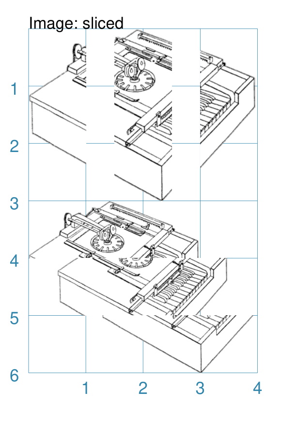

===== ======
|im3| This example shows the shape constructed using the command with the
      following properties:

      .. code:: python

        Image("sholes_typewriter.png", sliced='l',
              width=1, height=3, x=0, y=0)
        Image("sholes_typewriter.png", sliced='c',
              width=1, height=3, x=1.5, y=0)
        Image("sholes_typewriter.png", sliced='r',
              width=1, height=3, x=3, y=0)

        Image("sholes_typewriter.png", sliced='t',
              width=3, height=1, x=0.5, y=3)
        Image("sholes_typewriter.png", sliced='m',
              width=3, height=1, x=0.5, y=4)
        Image("sholes_typewriter.png", sliced='b',
              width=3, height=1, x=0.5, y=5)

      Here the *sliced* property is used to "slice" off portions of the
      image. In the upper example:

      - *l* - the left fraction, matching the image's width:height ratio
      - *c* - the centre fraction, matching the image's width:height ratio
      - *r* - the right fraction, matching the image's width:height ratio

      In the lower example:

      - *t* - the top fraction, matching the image's height:width ratio
      - *m* - the middle fraction, matching the image's height:width ratio
      - *b* - the botttom fraction, matching the image's height:width ratio

===== ======

.. _hexagons-command:

Hexagons
~~~~~~~~
`↑ <shape-index_>`_

Hexagons are often drawn in a "honeycomb" arrangement to form a grid. For games
this is often used to delineate the spaces in which playing pieces can be placed
and their movement regulated.

.. NOTE::

   Very detailed information about using hexagons in grids can be found in the
   section on :doc:`Hexagonal Grids <hexagonal_grids>`.

Example 1. Hexagons Defaults
++++++++++++++++++++++++++++

===== ======
|hex| This example shows the shape constructed using the command with two
      basic properties; the number of rows and columns in the grid:

      .. code:: python

          Hexagons(rows=3, cols=3)

      It has the following properties based on the defaults:

      - upper-left "corner" at x-position ``1`` cm and at y-position ``1`` cm
      - flat-to-flat hexagon *height* of ``1`` cm
      - "flat" top hexagons
      - size of ``3`` *rows* by ``3`` *cols* ("columns")
      - the "even" columns are offset by one-half hexagon height "downwards"
===== ======

.. _lines-command:

Lines
~~~~~~
`↑ <shape-index_>`_

Lines are simply a series of parallel lines drawn over repeating rows - for
horizontal lines - or columns - for vertical lines.

Example 1. Lines Defaults
+++++++++++++++++++++++++

===== ======
|ls0| This example shows the shape constructed using the command with only
      defaults:

      .. code:: python

          Lines()

      It has the following properties based on the defaults:

      - starts at x-position ``1`` cm and at y-position ``1`` cm
      - heading/default direction is 0 |deg| (anti-clockwise from 0 |deg| "east")
      - has a default number of lines of ``1``
      - line length of ``1`` cm
===== ======

Example 2. Customised Lines
+++++++++++++++++++++++++++

.. |ls1| image:: images/customised/lines.png
   :width: 330

===== ======
|ls1| This example shows the shapes constructed using the command with the
      following properties:

      .. code:: python

        Lines(
            x=1, y=1, x1=4, y1=1,
            rows=2, height=1,
            label_size=8, label="rows; ht=1.0")
        Lines(
            x=1, y=3, x1=1, y1=6,
            cols=2, width=1.5,
            label_size=8, label="col; wd=1.5")

      The first command has the following properties:

      - *x* and *y* - both set at ``1`` cm for the left starting point
      - *x1* and *y1* - set ``4`` cm and ``1`` cm for the right end point
      - *rows* - set to ``2`` to create two parallel horizontal lines
      - *height* - value of ``1`` cm set for the row height; this is the
        separation between each line

      The second command has the following properties:

      - *x* and *y* - set to ``1`` cm and ``3`` cm  for the left starting point
      - *x1* and *y1* - set ``1`` cm and ``6`` cm for the right end point
      - *cols* - set to ``2`` to create two parallel vertical lines
      - *width* - value of ``1.5`` cm set for the column width; this sets the
        separation between each line

      Note that the *label* that has been set applies to **every** line that is
      drawn.

===== ======

.. _rectangles-command:

Rectangles
~~~~~~~~~~
`↑ <shape-index_>`_

Rectangles can be drawn in a row-by-column layout to form a grid. For games
this is often used to delineate a track or other spaces in which playing pieces
can be placed.

Example 1. Rectangles: Columns and Rows
+++++++++++++++++++++++++++++++++++++++

.. |rc0| image:: images/customised/rectangles_rowcol.png
   :width: 330

===== ======
|rc0| This example shows the shape constructed using the command with these
      properties:

      .. code:: python

          Rectangles(
              rows=3, cols=2,
              stroke_width=1)

      It has the following properties:

      - top-left corner at defaults of x-position ``0`` cm and
        y-position ``0`` cm
      - *height* and *width* of default ``1`` cm each
      - *stroke_width* of ``1``

      There are 3 rows |dash| the y-direction |dash| and 2 columns
      |dash| the x-direction.

===== ======

Example 2. Customised Rectangles
++++++++++++++++++++++++++++++++

===== ======
|rn1| This example shows the Rectangles constructed using the command with
      these properties:

      .. code:: python

          Rectangles(
             cols=2, rows=4,
             width=1.5, height=1.25,
             fill="chartreuse",
             dotted=True)

      It has the following properties based on the defaults:

      - starts at x-position ``0`` cm and y-position ``0`` cm
      - *width* - ``1.5`` cm set for each Rectangle's width
      - *height* - ``1.25`` cm set for each Rectangle's height
      - *fill* color of ``chartreuse``
      - *dotted* border lines for each Rectangle

===== ======

.. _shapes-common-properties:

Shapes Common Properties
------------------------
`↑ <table-of-contents-core_>`_

The following are properties common to many shapes that can be set to create
the desired output:

- `x and y`_
- `cx and cy`_
- `Fill and Stroke`_
- `Dot and Cross`_
- `Rotation`_
- `Text Descriptions`_
- `Transparency`_
- `Centre Shape`_

x and y
~~~~~~~
`^ <shapes-common-properties_>`_

Almost every shape will need to have its :ref:`position <position-concept>` set.
"Position" here usually refers to a point corresponding to the top-left of that
shape.

The common way to do this is by setting a value for **x** |dash| the distance
from the left margin of the page (or card) to the left edge of the shape;
and/or **y** |dash| the distance from the top margin of the page (or card)
to the top edge of the shape.

.. NOTE::

    Its more appropriate to think of this position as that of the "bounding
    box" of the shape i.e. imagine a rectangle drawn such that the shape
    just fits inside it; the "position" is the point corresponding to the
    top-left of that imaginary Rectangle.

cx and cy
~~~~~~~~~
`^ <shapes-common-properties_>`_

Almost every shape will need to have its :ref:`position <position-concept>` set.
"Position" here refers to a point corresponding to the centre of that shape.

For shapes that support it, the way to do this is by setting a value for **cx**
|dash| the distance from the left margin of the page (or card) to the centre
position of the shape and/or **cy** |dash| the distance from the bottom margin
of the page (or card) to the centre position of the shape.

Fill and Stroke
~~~~~~~~~~~~~~~
`^ <shapes-common-properties_>`_

Almost every single shape will have a *stroke*, corresponding to the color of
the line used to draw it, and a *stroke_width* which is the thickness in
points (72 points per inch); the default line color is *black*.

All `Enclosed Shapes`_ will have a *fill* corresponding to the color used for
the area inside it; the default fill color is *white*.

A "shortcut" to setting both fill and stroke to be the same for a shape,
is to use the property *fill_stroke* (see Example 2 below).

If the fill is set to the :ref:`keyword <reserved-names-concept>` ``None``
(note the uppercase "N"), the area will have no fill color, and effectively
becomes transparent.

If the stroke is set to the :ref:`keyword <reserved-names-concept>` ``None``
(note the uppercase "N"), the line will have no color, and effectively
becomes transparent.

Example 1. Fill & Stroke
++++++++++++++++++++++++

===== ======
|fsb| This example shows a shape constructed using the command:

      .. code:: python

          Rectangle(
              fill="yellow", stroke="red",
              stroke_width=6)

      The shape has the following properties that differ from the defaults:

      - *fill* color of ``yellow`` for the interior of the shape
      - *stroke* color of ``red`` for the border of the shape
      - *stroke_width* - set to ``6`` points (about 2mm or 0.2cm)

      It can be seen that very thick lines "straddle" a centre line running
      through the defined location.

      In this case the Rectangle is both larger in outer dimensions than the
      expected 1x1 cm and smaller in inner dimensions than the expected 1x1 cm
      due to the thickness of the lines used to construct it.

===== ======

Example 2. Fill_Stroke
++++++++++++++++++++++

The *fill_stroke* property is a "shortcut" which sets **both** the
*fill* and *stroke* color at same time.

===== ======
|fst| This example shows a shape constructed using the command:

      .. code:: python

          Circle(fill_stroke="cyan")

      The shape has the following property that differ from the defaults:

      - *fill_stroke* color of ``cyan``

      Here, the line color used to draw the circumference is the same as
      the fill color of the interior.

===== ======

Dot and Cross
~~~~~~~~~~~~~
`^ <shapes-common-properties_>`_

For shapes that have a definable centre e.g. a `Circle`_, a `Square`_
or a `Hexagon`_, it is possible to place a dot, a cross, or both at this
location.

The color for the dot and cross will, if not provided, take on the stroke
color of the shape of which they are part |dash| see the `Stadium` example
below.

.. |dnc| image:: images/customised/dots_crosses.png
   :width: 330

===== ======
|dnc| This example shows various shapes constructed using the following
      commands:

      .. code:: python

        Stadium(
            cx=1, cy=1, side=1,
            stroke="blue",
            dot=0.1)
        Stadium(
            cx=3, cy=1, side=1,
            stroke="blue",
            cross=0.25,
            cross_stroke_width=1)

        Polygon(
            cx=1, cy=3, sides=8,
            radius=1,
            dot=0.1,
            dot_stroke="orange")
        Polygon(
            cx=3, cy=3, sides=8, diameter=2,
            cross=0.25,
            cross_stroke="orange",
            cross_stroke_width=1)

        Rhombus(
            cx=1, cy=5, side=2,
            dot=0.1,
            dot_stroke="red")
        Rhombus(
            cx=3, cy=5, side=2,
            cross=0.25,
            cross_stroke="red",
            cross_stroke_width=1)

      The shapes have their properties set as follows:

      - *cx* and *cy* set the centre point of the shape
      - *dot* - sets the size of dot at the centre
      - *dot_stroke*  - sets the color (and fill) of the dot; defaults to match the
        *stroke* of the shape that it is part of
      - *cross* - sets the length of each of the two lines that cross at the
        centre
      - *cross_stroke*  - sets the color of the cross lines; defaults to the
        stroke of the shape that it is part of
      - *cross_stroke_width* - sets the thickness of the cross lines
===== ======

Rotation
~~~~~~~~
`^ <shapes-common-properties_>`_

Every shape, whose *centre* can be calculated, will support a *rotation*
property. Rotation takes place in anti-clockwise direction, from the horizontal,
around the centre of the shape, in *degrees*.

Example 1. Rhombus Rotation
+++++++++++++++++++++++++++

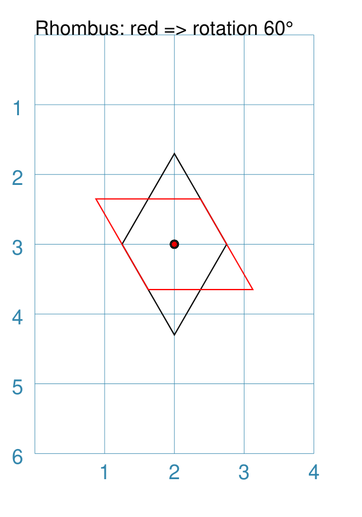

===== ======
|rt1| This example shows the shape constructed using these commands:

      .. code:: python

        Rhombus(
            cx=2, cy=3,
            width=1.5,
            height=2*equilateral_height(1.5),
            fill=None, stroke="black",
            dot=0.06)
        Rhombus(
            cx=2, cy=3,
            width=1.5,
            height=2*equilateral_height(1.5),
            fill=None, stroke="red",
            dot=0.03,
            rotation=60)

      The shape with the *black* outline and large dot in the centre is the
      "normal" Rhombus.

      The shape with the *red* outline and smaller, red dot in the centre is
      the rotated Rhombus. It has these properties:

      - *fill* color - `None` so no fill is used; this makes it completely
        transparent.
      - *rotation* - ``60`` is the number of degrees, anti-clockwise, that
        it has been rotated

      The shapes are completely transparent, so its possible to see
      how the second is drawn relative to the first.
===== ======

Example 2. Polygon Rotation
+++++++++++++++++++++++++++

.. |rt2| image:: images/customised/polygon_rotation_pointy.png
   :width: 330

===== ======
|rt2| This example shows five Polygons constructed using the command with
      additional properties:

      .. code:: python

        poly6 = Common(
          fill=None, sides=6, diameter=1,
          stroke_width=1, orientation='flat')

        Polygon(common=poly6,
                y=1, x=1.0, label="0")
        Polygon(common=poly6,
                y=2, x=1.5, rotation=15,
                label="15")
        Polygon(common=poly6,
                y=3, x=2.0, rotation=30,
                label="30")
        Polygon(common=poly6,
                y=4, x=2.5, rotation=45,
                label="45")
        Polygon(common=poly6,
                y=5, x=3.0, rotation=60,
                label="60")

      The examples have the following properties:

      - *centre* - using `cx` and `cy` values
      - *radius* - ``1`` cm in each case
      - *sides* - the default of 6 in each case ("hexagon" shape)
      - *rotation* - varies from 0 |deg| to 60 |deg| (anti-clockwise from the
        horizontal)

===== ======

Example 3. Shapes Rotation
++++++++++++++++++++++++++

===== ======
|rt3| This example shows different shapes constructed using commands with
      some ``Common`` properties:

      .. code:: python

        props = Common(
            stroke="black",
            cross=0.5, cross_stroke="red",
            cross_stroke_width=1,
            rotation=45, label_size=6)

        Star(
            x=1, y=1, vertices=5, radius=0.75,
            common=props, label="star")
        Ellipse(
            cx=3, cy=1, height=1, width=1.5,
            common=props, label="ellipse")
        Polygon(
            cx=1, cy=3, sides=6, side=0.75,
            common=props, label="polygon")
        Stadium(
            cx=3, cy=3, side=1,
            common=props, label="stadium")
        Rectangle(
            cx=1, cy=5, height=1, width=1.5,
            common=props, label="rectangle")
        Rhombus(
            cx=3, cy=5, side=2,
            common=props, label="rhombus")

      The shapes share common properties for the cross at the centre,
      with a rotation of 45 |deg| each.

===== ======

Example 4. Rotation with Hatches
++++++++++++++++++++++++++++++++

.. |rt4| image:: images/customised/shape_hatch_and_rotation.png
   :width: 330

===== ======
|rt4| This example shows different shapes constructed using commands with
      some ``Common`` properties:

      .. code:: python

        htch = Common(
            fill='lightgray', stroke=None,
            hatch_count=5, hatch_width=0.75,
            hatch='w', hatch_stroke="red",
            rotation=30)

        Hexagon(
            common=htch,
            cx=2, cy=1, height=1.5,
        )
        EquilateralTriangle(
            common=htch,
            cx=1, cy=3, side=1.5,
        )
        Circle(
           common=htch,
           cx=3, cy=3, radius=0.75,
        )
        Rectangle(
            common=htch,
            x=0.5, y=4, height=1.5, width=1,
        )
        Rhombus(
           common=htch,
           cx=3, cy=5, height=2, width=1.5,
        )

      The shapes share common properties for the number and style of hatches,
      with a rotation of 30 |deg| each.

===== ======

Text Descriptions
~~~~~~~~~~~~~~~~~
`^ <shapes-common-properties_>`_

Being able to associate a description, or identifier, with a shape can be
useful.

There are three kinds of text that can be added to a shape, without having to
specify their location or other details.

.. NOTE::

   Obviously, a `Text`_ shape can also be placed anywhere, including being
   superimposed on another shape, in order to handle more complex text needs.

The three "simple" text types that can be added to a shape are:

- *heading* - this appears above the shape  (slightly offset)
- *label* - this appears in the middle of the shape
- *title* - this appears below the shape (slightly offset)

All types are, by default, centred horizontally. Each type can be customised
in terms of its color, size and face by appending *_stroke*, *_size* and
*_face* respectively to the type's name.

The *label* text can, in addition, be **moved** relative to the shape's centre
by using *mx* and *my* properties; positive values will move the text to
the right and down; and negative values will move the text to the left and up.

Example 1. Heading, Label and Title
+++++++++++++++++++++++++++++++++++

.. |tx1| image:: images/customised/descriptions.png
   :width: 330

===== ======
|tx1| This example shows two shapes constructed using these commands to change
      default properties:

      .. code:: python

        Hexagon(
            cx=2, cy=1.5, height=1.5,
            title="Title",
            label="Label",
            heading="Heading")

        Rectangle(
            x=0.5, y=3, width=3, height=2,
            label="red; size=14",
            label_stroke="red", label_size=14)

      The Hexagon shows where the *heading*, *label* and *title* appear
      relative to the shape's boundaries, with default font size of 12 points.

      The Rectangle shows how the *label* can be customised in terms of its
      *stroke* (``red``) and font *size* (``14`` points).
===== ======

Example 2. Label Offsets
++++++++++++++++++++++++

.. |tx2| image:: images/customised/label_offset.png
   :width: 330

===== ======
|tx2| This example shows six Rectangles constructed using the command with
      additional properties:

      .. code:: python

        rct = Common(
          height=1.0, width=1.75,
          stroke_width=0.5, label_size=7)

        Rectangle(
          common=rct, x=0, y=0.0, label="offset -x, -y",
          label_mx=-0.2, label_my=-0.2)
        Rectangle(
          common=rct, x=0, y=1.5, label="offset -x",
          label_mx=-0.3)
        Rectangle(
          common=rct, x=0, y=3.0, label="offset -x, +y",
          label_mx=-0.2, label_my=0.2)
        Rectangle(
          common=rct, x=2, y=0.0, label="offset +x, -y",
          label_mx=0.2, label_my=-0.2)
        Rectangle(
          common=rct, x=2, y=1.5, label="offset +x",
          label_mx=0.3)
        Rectangle(
          common=rct, x=2, y=3.0, label="offset +x, +y",
          label_mx=0.2, label_my=0.2)
        Rectangle(
          common=rct, x=0, y=4.5, label="offset -y",
          label_my=-0.2)
        Rectangle(
          common=rct, x=2, y=4.5, label="offset +y",
          label_my=0.2)

      Setting values for *label_my* and *label_mx* cause the label to
      shift away from centre.

      Positive values move the label down and to the right while
      negative values move it up and to the left.

===== ======

Transparency
~~~~~~~~~~~~
`^ <shapes-common-properties_>`_

All `Enclosed Shapes`_, that have a *fill*, can have a transparency value set
that will affect the fill color used for the area inside them.

If a shape needs to be completely transparent - i.e. no color at all being
visible - then set the *fill* value to ``None``.

.. |trn| image:: images/defaults/transparency.png
   :width: 330

===== ======
|trn| This example shows a number of Rectangles constructed as follows:

      .. code:: python

        Rectangle(
            x=1, y=3, height=1, width=2,
            fill="#008000", stroke="#C0C0C0",
            transparency=25, label="25%")
        Rectangle(
            x=1, y=4, height=1, width=2,
            fill="#008000", stroke="#C0C0C0",
            transparency=50, label="50%")
        Rectangle(
            x=1, y=5, height=1, width=2,
            fill="#008000", stroke="#C0C0C0",
            transparency=75, label="75%")

        Rectangle(
            x=0, y=0, height=2, width=2,
            fill="yellow", stroke="yellow")
        Rectangle(
            x=1, y=1, height=2, width=2,
            fill="red", stroke="red",
            transparency=50)

      The three green Rectangles shapes have the following property set:

      - *transparency* - the higher the value, the more "see through" the color

      The red Rectangle, which also has a *transparency* value, is drawn
      partially over the yellow Rectangle on the upper-left.

      When overdrawn, there is a color change in the overlapping section
      i.e. "bleed through" occurs.
===== ======

Centre Shape
~~~~~~~~~~~~
`^ <shapes-common-properties_>`_

Any shape that can be defined using its centre, may have another shape |dash|
called a "centre shape" |dash| placed inside of it.

.. NOTE::

   In terms of drawing order, the  "centre shape" is drawn after most of the
   shape's other properties: only a dot, cross or label (if any of these are
   defined) will be drawn superimposed on the centre-shape.

Example 1. Default Centre Shape
+++++++++++++++++++++++++++++++

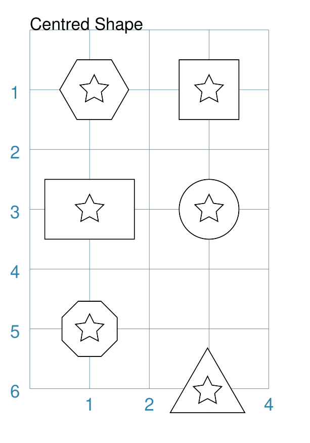

===== ======
|cs0| This example shows a number of shapes constructed as follows:

      .. code:: python

        small_star = star(radius=0.25)

        Polygon(
            cx=1, cy=5, radius=0.5, sides=8, centre_shape=small_star)
        EquilateralTriangle(
            x=2.35, y=5.5, side=1.25, centre_shape=small_star)
        Rectangle(
            x=0.5, y=2.5, height=1, width=1.25, centre_shape=small_star)
        Circle(
            cx=3, cy=3, radius=0.5, centre_shape=small_star)
        Hexagon(
            x=0.5, y=0.5, height=1, centre_shape=small_star)
        Square(
            x=2.5, y=0.5, height=1, centre_shape=small_star)

      At the start, a Star shape is defined by the lowercase ``star()``

      A lowercase command means the shape is not drawn at this time but is
      assigned to a named value and can be referred to further on.

      Each of the other shapes in the script can now use this named shape
      as their ``centre_shape``.

      Regardless of whether the primary shape's position is
      defined using ``x`` and ``y``, or  ``cx`` and ``cy``, the Star
      is still drawn in the centre of that shape.

===== ======

Example 2. Off-Centre
+++++++++++++++++++++

The centre-shape can be shifted from the centre by setting values for
*centre_shape_mx* and *centre_shape_my*.

===== ======
|cs1| This example shows two Hexagon shapes constructed as follows:

      .. code:: python

        small_star = star(radius=0.25)
        small_circle = circle(
            radius=0.33, fill="gray", centre_shape=small_star)

        Hexagon(
            x=1, y=0.5, height=2,
            hatch_count=5,
            dot=0.1,
            centre_shape=small_circle)

        Hexagon(
            x=1, y=3, height=2,
            centre_shape=small_circle,
            centre_shape_mx=0.3, centre_shape_my=0.6)

      As in the first example, the ``small_star`` is defined but not drawn.

      The ``small_star`` is assigned as the ``centre_shape``  to
      ``small_circle``; a shape that is also not drawn.

      This ``small_circle`` is now used as the ``centre_shape``
      for both of the Hexagons.

      The upper Hexagon shows how the centre-shape is drawn
      over other features, such as the hatches, in the Hexagon,
      **except** for the ``dot``.

      The lower Hexagon shows how the centre-shape can be moved with the
      ``*_mx`` and ``*_my`` values.

      Positive values move the shape down and to the right while
      negative values move it up and to the left.

===== ======
