Core Shapes
===========

.. |dash| unicode:: U+2014 .. EM DASH SIGN
.. |copy| unicode:: U+00A9 .. COPYRIGHT SIGN
   :trim:
.. |deg|  unicode:: U+00B0 .. DEGREE SIGN
   :ltrim:
.. |br| raw:: html

    

These descriptions of the available shapes assume you are familiar with
the concepts, terms and ideas for :doc:`protograf <index>` as presented
in the :doc:`Basic Concepts <basic_concepts>` - especially *units*,
*properties* and *defaults*. It will also help to at least browse through
the section on :doc:`Additional Concepts <additional_concepts>`.

.. _table-of-contents-core:

-  `Shape Index`_
-  `Overview`_
-  `Commonalities`_
-  `Linear Shapes`_
-  `Enclosed Shapes`_
-  `Compound Shapes`_
-  `Shapes Common Properties`_

.. _shape-index:

Shape Index
-----------

-  `Arc`_
-  `Arrow`_
-  `Blueprint`_
-  `Bezier`_
-  `Circle`_
-  `Chord`_
-  `Cross`_
-  `Dot`_
-  `DotGrid`_
-  `Ellipse`_
-  `Grid`_
-  `Hexagon`_
-  `Hexagons`_
-  `Image`_
-  `Line`_
-  `Lines`_
-  `Pod`_
-  `Polygon`_
-  `Polyline`_
-  `Polyshape`_
-  `QRCode`_
-  `Rectangle`_
-  `Rectangles`_
-  `Rhombus`_
-  `Sector`_
-  `Square`_
-  `Stadium`_
-  `Star`_
-  `Starfield`_
-  `Table`_
-  `Text`_
-  `Trapezoid`_
-  `Triangle`_

Overview
--------
`↑ <table-of-contents-core_>`_

Where possible, the basic examples first show how a shape would appear
on a page when **only** the default properties are used. This means that,
for most cases, that *lines* are drawn in **black** and shapes that have an
enclosed area are *filled* with a **white** color. The default length, width
or height in most cases is **1 cm**. The main change from default, for these
examples, has been to make the default line width (*stroke_width*) thicker
for easier viewing of the small PNG images that have been generated from the
original PDF output.

Most shapes can be styled by setting one or more of the
`Shapes Common Properties`_. Other shapes have additional properties
available that allow even further styling.

To make it easier to see where and how a shape has been drawn, most of these
examples have been created with a background grid, which **protograf**
refers to as a `Blueprint`_ shape, added to the page |dash| a small A8
"business card" size |dash| for cross-reference.

.. NOTE::

   The graphics for these examples were generated from either of the following
   scripts;
   `default_shapes <https://github.com/gamesbook/protograf/blob/master/examples/simple/default_shapes.py>`_ or
   `customised_shapes <https://github.com/gamesbook/protograf/blob/master/examples/simple/customised_shapes.py>`_.
   **protograf** first creates a PDF, then generates a PNG file for each page
   in the PDF.

Commonalities
--------------
`↑ <table-of-contents-core_>`_

There are some properties that can be set for almost all of the shapes;
examples of these are presented in the section on `Shapes Common Properties`_
at the end, rather than being described in detail for every single shape.

.. HINT::

   Bear in mind that if a property that it does **not** support is
   provided for a shape, then that property and its value will simply be
   ignored.

.. _linearIndex:

Linear Shapes
--------------
`↑ <shape-index_>`_

.. _arc-command:

Arc
~~~
`↑ <shape-index_>`_

An Arc is a curved line between two points located along the circumference
of a circle.

Example 1. Default Arc
++++++++++++++++++++++

===== ======
|arc| This example shows the shape constructed using the command with only
      defaults:

      .. code:: python

          Arc()

      It has the following properties based on the defaults:

      - origin is at x-position ``1`` cm and at y-position ``1`` cm
===== ======

Example 2. Customised Arc
+++++++++++++++++++++++++

.. |ac2| image:: images/customised/arc.png
   :width: 330

===== ======
|ac2| This example shows the shape constructed using the command with these
      properties:

      .. code:: python

          Arc(cx=1, cy=3, radius=2)
          Arc(cx=1, cy=6, radius=2,
              nested=6,
              angle_start=15, angle_width=60)

      To help with visualisation, the top Arc is surrounded by a red Rectangle:

      .. code:: python

            Rectangle(
                x=1, y=1, height=1, width=2, dot=0.02,
                stroke="red", fill=None,
                title="Arc(cx=1, cy=3, radius=2)")
            )

      The top Arc has the following properties:

      - origin is at x-position ``1`` cm and y-position ``3`` cm
      - the arc *radius* is ``2`` cm

      The default arc extent is from 0 |deg| (the line parallel to the
      top edge of the page) to 90 |deg| (the line parallel to the
      side edges of the page).

      The lower Arc has the following properties:

      - origin is at x-position ``1`` cm and y-position ``6`` cm
      - the arc *radius* is ``2`` cm
      - the arc extends from 15 |deg| to 75 |deg|  (ie. *angle_start* of
        15 |deg| + *angle_width* of 60 |deg|)
      - there are ``6`` *nested* arcs equally spaced between the arc
        origin position and the arc itself.

===== ======

.. _bezier-command:

Bezier
~~~~~~
`↑ <shape-index_>`_

A Bezier is a curve that has inflection points, allowing it to "bend".

Example 1. Default Bezier
+++++++++++++++++++++++++

.. |bez| image:: images/defaults/bezier.png
   :width: 330

===== ======
|bez| This example shows the shape constructed using the command with only
      defaults:

      .. code:: python

          Bezier()

      It has the following properties based on the defaults:

      - starts at x-position ``1`` cm and at y-position ``1`` cm
===== ======

Example 2. Customised Bezier
++++++++++++++++++++++++++++

.. |bz1| image:: images/customised/bezier_custom.png
   :width: 330

===== ======
|bz1| This example shows the shape constructed using the command with the
      following properties:

      .. code:: python

          Bezier(
            x=0, y=1,
            x1=4, y1=3,
            x2=3, y2=4,
            x3=4, y3=6,
            stroke_width=1)

      It has the following properties based on changes to the defaults:

      - starts at x-position ``0`` cm and at y-position ``1`` cm
      - has the inflection points set by:

        - *x1* and *y1*, and
        - *x2* and *y2*
      - ends at position *x3* of ``4`` cm and at *y3* of ``6`` cm
      - has a thicker *stroke_width*
===== ======

.. _chord-command:

Chord
~~~~~
`↑ <shape-index_>`_

A chord is a straight line joining two points on a circle's diameter.

Example 1. Customised Chord
+++++++++++++++++++++++++++

===== ======
|chd| If the shape constructed using only default properties, there will be
      nothing to see:

      .. code:: python

          Chord()

      This example then shows the shape constructed using the command with these
      properties:

      .. code:: python

          Chord(
              shape=Circle(radius=1, fill=None),
              angle=135,
              angle1=45)

      It has the following properties based on these values:

      - a small circle that defines boundaries for the chord line
      - the start of chord is at the intersection of the radius of the circle
        at 135 |deg| with the circle's circumference
      - the end of chord is at the intersection of the radius of the circle
        at 45 |deg| with the circle's circumference

===== ======

.. _cross-command:

Cross
~~~~~
`↑ <shape-index_>`_

A Cross shape is two thick bars that cross each other at 90 |deg|.  The
vertical bar is termed the "body" and the horizontal bar is the "arm".

In addition to the normal, common properties, the Cross also has:

- *thickness*: this is the width of the bars. The default value for this is
  one-fifth of the overall width.
- *arm_fraction*: this is the fraction **along** (up or down) the length of
  the body at which the arm crosses it. The default value for this is ``0.5``
  i.e. half-way along.

.. NOTE::

    Unlike most other shapes with a centre, the Cross uses as its centre
    the middle point of the arm of the cross |dash| rather a centre based on
    the overall height and width.

Example 1. Default Cross
++++++++++++++++++++++++

.. |cr1| image:: images/defaults/cross.png
   :width: 330

===== ======
|cr1| This example shows the shape constructed using the command with only
      defaults:

      .. code:: python

          Cross()

      It has the following properties based on the defaults:

      - top-left is at x-position ``1`` cm and at y-position ``1`` cm
      - default height and width of ``1`` cm
      - default bar thickness is one-fifth of the width

===== ======

Example 2. Customised Cross
+++++++++++++++++++++++++++

.. |cr2| image:: images/customised/cross.png
   :width: 330

===== ======
|cr2| This example shows the Cross constructed using the command with thes
      properties shown.

      Note the use of the :ref:`Common command <the-common-command>`
      to allow multiple Crosses to share the same properties.

      .. code:: python

        crs = Common(
            height=1.8, width=1.2,
            arm_fraction=0.70)
        Cross(
            stroke_width=1,
            stroke="red",
            fill="gold")
        Cross(
            cx=3, cy=1,
            thickness=0.33,
            fill_stroke="red")
        Cross(
            common=crs,
            cx=1, cy=3)
        Cross(
            common=crs,
            cx=3, cy=2.5,
            title="Title",
            label="Label",
            heading="Heading")
        Cross(
            common=crs,
            cx=3, cy=5,
            dot=0.1, cross=0.5)
        Cross(
            common=crs,
            cx=1, cy=5, height=1.8,
            rotation=45)

      The top-left example shows a default-sized cross with different
      *fill* and *stroke* colors, as well a thicker *stroke_width*.

      The top-right example shows a cross with matching *fill* and
      *stroke* colors.  It also changes the default size of the bar
      for the arm and body to have a *thickness* of ``0.33`` cm. The
      default is one-fifth of the overall width.

      The lower four examples all share a common height and width. They
      also use the *arm_fraction* property.  This is the fraction up the
      length of the body at which the arm crosses it; by default this is
      ``0.5`` (half-way up).  All these examples, as well as the top-right
      example "centre" the cross; in this case the centre corresponds to
      the middle point of the arm of the cross.

      The *label* and *rotation* properties are also based on the
      middle point of the arm of the cross.

===== ======

.. _dot-command:

Dot
~~~
`↑ <shape-index_>`_

A Dot shape is essentially a very small, pre-filled `Circle`_.

Example 1. Default Dot
++++++++++++++++++++++

===== ======
|dot| This example shows the shape constructed using the command with only
      defaults:

      .. code:: python

          Dot()

      It has the following properties based on the defaults:

      - top-left at x-position ``1`` cm and at y-position ``1`` cm
      - diameter of ``3`` points; there are 72 points in an inch, so this is
        1/24th of an inch, or approximately ``1`` mm (``0.1`` cm), in size
      - fill color for a Dot is the same as the stroke |dash| default is black

      The default diameter for a Dot can be changed by setting its *dot_width*
      which, like *stroke_width* for Text, is in point units.

===== ======

.. _line-command:

Line
~~~~
`↑ <shape-index_>`_

.. NOTE::

   There is more detail about the many properties that can be defined for a
   Line in the :ref:`customised Line <lineIndex>` section.

Example 1. Default Line
+++++++++++++++++++++++

.. |ln1| image:: images/defaults/line.png
   :width: 330

===== ======
|ln1| This example shows the shape constructed using the command with only
      defaults:

      .. code:: python

          Line()

      It has the following properties based on the defaults:

      - starts at x-position ``1`` cm and at y-position ``1`` cm
      - length of ``1`` cm
      - heading/default direction is 0 |deg| |dash| i.e. "eastwards"

      *Note* that direction means "anti-clockwise from 0 |deg|", where
      the zero lines runs in the "east" direction from the left.
===== ======

.. _polyline-command:

Polyline
~~~~~~~~
`↑ <shape-index_>`_

A Polyline is a series of one or more lines joining two or more points.

In addition to setting points directly, the Polyline can be constructed
using the *steps* property.  This define a series of values that represent
the x- and y-values **relative** to the last point drawn.

A Polyline can also be constructed using the *snail* property. This defines
a series of relative distances, plus optional rotational and/or facing
directions, that allow a sequence of lines and curves to be drawn.

The following examples illustrate these properties:

- `Example 1. Basic Polyline`_
- `Example 2. Customised Polyline`_
- `Example 3. Polyline with Arrow`_
- `Example 4. Polyline with Snail`_
- `Example 5. Polyline with Snail Curves`_

Example 1. Basic Polyline
+++++++++++++++++++++++++
`^ <polyline-command_>`_

===== ======
|py1| The shape cannot be constructed using only default properties:

      .. code:: python

          Polyline()

      Nothing will be visible; instead you will see a warning::

        WARNING:: There are no points to draw the Polyline

      The upper example then shows the shape constructed using the command with
      these properties:

      .. code:: python

          Polyline(points=[(0, 0), (1, 1), (2, 0)])

      It has the following properties based on these values:

      - starts at x-position ``0`` cm and at y-position ``0`` cm
      - second point is at x-position ``1`` cm and at y-position ``1`` cm
      - third point is at x-position ``2`` cm and at y-position ``0`` cm

      The *points* for a Polyline are in a list, as shown by the square
      brackets from ``[`` to ``]``, where:

      - each *x* and *y* are provided as a pair of values in round brackets
      - each *x* and *y* are separated by a comma
      - each pair of values in the list is separated by a comma

===== ======

Example 2. Customised Polyline
++++++++++++++++++++++++++++++
`^ <polyline-command_>`_

===== ======
|py2| The upper example shows the shape constructed using the command with
      these properties:

      .. code:: python

        Polyline(
          points=[(1, 2), (1, 1), (2, 0), (3, 1), (3, 2)],
          stroke_width=1, stroke="red")

      Here the points are arranged so as to create a basic 'house' outline.

      The lower example also shows how to create a Polyline using the command
      with these properties:

      .. code:: python

        Polyline(
          x=1, y=3, stroke_width=1,
          steps='0.5,0 0,1.5 1.5,0 0,-1.5 0.5,0 0,0.5 -2.5,0')

      Here, the *steps* property results in the drawing of an outline
      using a series of distances |dash| or offsets |dash| from the last
      point.  The start is provided by the *x* and *y* values.

      Each pair of comma-separated values are x- and y-distances
      respectively.

===== ======

Example 3. Polyline with Arrow
++++++++++++++++++++++++++++++
`^ <polyline-command_>`_

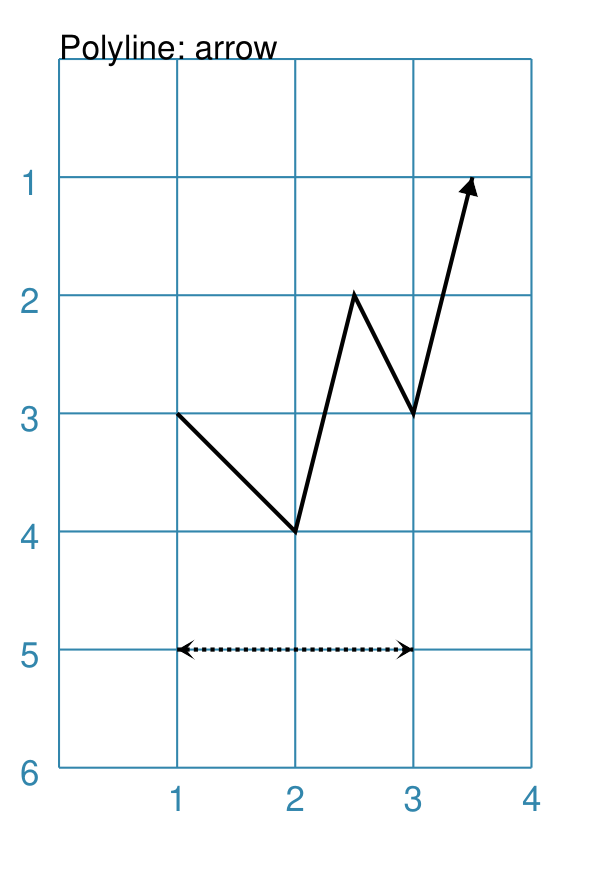

===== ======
|py3| The shape is constructed with these properties:

      .. code:: python

        Polyline(
            points=[(1,3), (2,4), (2.5,2), (3,3), (3.5,1)],
            stroke_width=1,
            arrow=True
        )
        Polyline(
            points=[(1,5), (3,5)],
            stroke_width=1,
            dotted=True,
            arrow_style='notch',
            arrow_double=True
        )

      This example makes use of the "arrow" properties available for a line.

      For more details on how arrows are used and set, see the
      :ref:`Line with Arrow <line-with-arrow>` example.

===== ======

Example 4. Polyline with Snail
++++++++++++++++++++++++++++++
`^ <polyline-command_>`_

The *snail* property is loosely based on the concept and approach of the
Turtle graphics drawing module available for Python (see:
https://docs.python.org/3/library/turtle.html).

Instead of using points, the idea of the *snail* is to create a Polyline
based on a series of lines of given length, where the line direction |dash|
or orientation |dash| will already have been set.  Each line is then drawn
starting from the end point of the previous line.

A *snail* property consists of a series of terms, each separated by a space.
Each term either relates to a **direction** change or to drawing a line of a
certain **length**

Directions can be set as follows:

- a *compass direction*: one of n, e, w, s, ne, se, sw, or nw
- an **absolute** *angle*: an ``a`` followed by a value in degrees, from
  0 to 360, measured counter-clockwise from the east direction
- a **relative** angle:

  - a ``r`` or ``-`` sign (followed by a value in degrees): will *decrease*
    the current angle i.e. alter it in a clockwise direction
  - a ``l`` or ``+`` sign (followed by a value in degrees): will *increase*
    the current angle i.e. alter it in an anti-clockwise direction

Creating a line is done as follows:

- a normal value |dash| whole or fractional |dash| will draw a line that
  distance, in the last direction that was set
- using a pair of asterixes (``**``) ` will draw a line from the current
  point back to the start

Moving - **without** creating a line - is done as follows:

- a **relative** move: a ``j`` followed by a value which is the distance,
  at which the new point will be set |dash| according to the last direction
  that was set; no line will be drawn between the points
- a **fixed point** move: a single asterix (``*``) will set the next, new
  point to match the one at the start; no line will be drawn between the
  points

.. NOTE::

    The *snail* line always starts at the x- and y-point defined for the
    Polyline; and the starting direction is "e" or 0 |deg|.  The first term
    in the *snail* property can either be a direction or a distance.

.. raw:: html

   <small>Apologies to users for using "jump" as the term to cause a move
   to happen without drawing a line; the idea of a snail jumping was just
   too absurd **not** to use!</small>

.. |py4| image:: images/customised/polyline_snail.png
   :width: 330

===== ======
|py4| The Polyline shape is constructed with these properties:

      .. code:: python

        snail_line = "n 3 e 2 -45 2 w 1 sw 3 **"
        Polyline(
            y=0.5,
            snail="2 s 1 w 2 n 1",
            stroke_width=1,
            stroke="red",
            arrow=True)
        Polyline(
            x=0, y=5,
            snail=snail_line,
            stroke_width=1)
        Polyline(
            x=0, y=5,
            snail=snail_line,
            stroke_width=1,
            scaling=0.5)
        Polyline(
            x=3.5, y=1,
            snail="s 0.4 j0.1 "*8,
            stroke_width=1,
            stroke="green")
        Polyline(
            y=3, x=2,
            snail="e 1 s 1 w 1 n 1 s j1 "*3,
            stroke_width=2,
            stroke="blue")

      The top example is a simple red line going in a square.  It starts by
      going east |dash| the default direction |dash| for ``2cm`` then south
      for ``1cm``, west for ``2cm`` and finally north for ``0.5cm``.  The
      *arrow* property is set to ``True`` so a default size arrowhead is
      drawn at the end of the line.

      The two examples with the black lines share the same *snail* line,
      assigned to ``snail_line``.  This example shows the use of the ``-``
      to represent turning right, in this case by 45 |deg|.  It also shows
      how the ``**`` term constructs a line back to the start.  The "smaller"
      example is constructed using the *scaling* fraction |dash| in this case
      set to ``0.5`` to make it half the size. Note that both lines have the
      same starting point.

      The example with the green line shows how a dotted line can be
      constructed using the "jump" (``j``) term to create a space in the same
      direction as the drawn line.  The ``*8`` then repeats the snail line
      eight times |dash| actually, the full string get constructed by joining
      eight copies of this same string, so that is why a space is needed at
      the end.

      The example with the blue line shows how a shape |dash| in this case a
      square |dash| is constructed multiple times using the `*3`` to
      repeat the outline three times. Again, the "jump" (``j``) term is used
      to move to a different location before the next shape is drawn. Note
      that in this case the start direction is set explicitly, rather than
      just using the default!

===== ======

Example 5. Polyline with Snail Curves
+++++++++++++++++++++++++++++++++++++
`^ <polyline-command_>`_

In addition to all the options for *snail* as described in
`Example 4. Polyline with Snail`_, there is also the option to draw
**curves** as part of the line.

A curve is specified by a series of three values, enclosed in round brackets;
for example ``(1.118 60 1)``. These values are as follows:

- the first value is the distance to the curve's *inflection point*;
- the second value is the angle to the curve's *inflection point*;
- the third value is the distance to the curve's end-point.

So, the curve is drawn from the current point on the line, to a second
point whose location is determined by a combination of the distance |dash|
specified by the third value |dash| and the "current" direction, determined
at the time just before the curve is drawn.  The curve will then bend, based
on the location of the *inflection point* |dash| note that the curve does
**not** go to that inflection point, but is rather "pulled" towards it to
form the bend.

.. |py5| image:: images/customised/polyline_snail_curve.png
   :width: 330

===== ======
|py5| The Polyline shape is constructed with these properties:

      .. code:: python

        Polyline(
            y=1, x=0,
            snail="(1.118 60 1) (1.118 -60 1) "*2,
            stroke_width=1,
            stroke="red")
        Polyline(
            y=2, x=0,
            snail="(1.118 60 1) (1.118 -60 1) "*8,
            scaling=0.25,
            stroke_width=1,
            stroke="red")
        Polyline(
            y=4, x=0,
            snail="a45 (0.6 60 0.707) e 0.5 "*3,
            stroke_width=1,
            stroke="red")
        Polyline(
            y=5, x=2,
            snail="r60 (1.118 r60 1) * "*6,
            stroke_width=1,
            stroke="red")

      All these examples show repetion in effect; the same basic set of
      lines repeated multiple times. Again, note that a space is needed at
      the end of the snail's text string in order to support this repeat.

      The first three examples use absolute angles for the curve |dash|
      whether positive or negative |dash| but the last example uses a relative
      angle, so that the curve, starting each time from the home location,
      changes its orientation because the "current direction" is constantly
      increasing.

===== ======

.. _text-command:

Text
~~~~
`↑ <shape-index_>`_

It may seem strange to view text as a "shape" but, from a drawing point of
view, it's really just a series of complex lines drawn in a particular pattern!
Thus text has a position in common with many other shapes, along with *stroke*
to set its line color, as well as its own special properties.

The basic properties that can be set are:

- *text* - the text string to be displayed
- *font_size* - default is ``12`` points
- *font_name* - the default is ``Helvetica``
- *stroke* - the default text color is ``black``
- *align* - the default alignment is ``centre``; it can be changed to be
  ``left`` or ``right``

.. NOTE::

   There is more detail about the various properties that can be defined for
   Text in the :ref:`customised text <table-of-contents-text>`
   doc.

Example 1. Default Text
+++++++++++++++++++++++

.. |t01| image:: images/defaults/text.png
   :width: 330

===== ======
|t01| This example shows the shape constructed using the command with mostly
      defaults.

      Only the *text* property is changed from a blank string |dash| otherwise
      there would nothing to see!

      .. code:: python

          Text(text="Hello World")

      It otherwise has the following properties based on the defaults:

      - located is at x-position ``1`` cm and at y-position ``1`` cm
      - text is at the ``center`` of the position
      - default *font_size* is ``12`` points
      - default *font_name* is ``Helvetica``

===== ======

Enclosed Shapes
---------------
`↑ <table-of-contents-core_>`_

These shapes are created by enclosing an area, the most basic being a simple rectangle.
They effectively have two dimensions: *height* and *width*.

The difference between enclosed and linear shapes is that the area enclosed by
the shape can be filled with a color. The default fill color is *white*.
There is an overview on how color is used in the
:doc:`Basic Concepts section <basic_concepts>`

.. HINT:::

   **protograf** comes with a predefined set of named colors, shown in the
   `colors <https://github.com/gamesbook/protograf/blob/master/examples/colorset.pdf>`_
   PDF file.

.. _arrow-command:

Arrow
~~~~~~
`↑ <shape-index_>`_

An Arrow consists of two main parts: the tail (or body) and the head.  In terms
of **protograf** conventions, the tail is the part that takes on the common
properties of *height* and *width*; while the dimensions for the head, if not
provided, are calculated from those.

Example 1. Default Arrow
++++++++++++++++++++++++

.. |ar0| image:: images/defaults/arrow.png
   :width: 330

===== ======
|ar0| This example shows the shape constructed using the command with only
      defaults:

      .. code:: python

          Arrow()

      It has the following properties based on the defaults:

      - centre-bottom point at x-position ``1`` cm and at y-position ``1`` cm
      - *height* of the tail portion of ``1`` cm
      - *head_height* of the head portion of ``1`` cm (based on the *height*)
      - *head_width* of the head portion of ``2`` cm; the maximum distance
        between the two arrowhead "wingtips" - for which the default value is
        calculated as equal to twice the *width*
===== ======

Example 2. Rotated Arrow
++++++++++++++++++++++++

===== ======
|ar1| This example shows the shape constructed using the commands as follows:

      .. code:: python

        Arrow(
            x=1, y=5.5,
            title="The Arrow", heading="An arrow",
            dot=0.1, cross=0.5)

        Arrow(
            x=2.5, y=3, title="0\u00B0",
            dot=0.15, dotted=True)

        Arrow(
            x=2.5, y=3, title="45\u00B0",
            dot=0.1, dot_stroke="red",
            fill=None, stroke="red", rotation=45)

        Arrow(
            x=3, y=5.5,
            label="arrow")

      The shapes all set the following properties:

      - centre-bottom point at *x* and *y*
      - *title* - appears below the shape
      - *dot* - small, filled circle |dash| **centre** of the
        Arrow

      The lower-left Arrow also sets the following properties:

      - *heading* - appears above the shape
      - *cross* - small pair of lines at the Arrow's centre

      The lower-right Arrow also sets the following properties:

      - *label* - appears in the middle of the shape

      The two arrows in the top-right are superimposed.

      The red outline Arrow shares the same centre as the black dotted
      Arrow before/below it.

      The red arrow is rotated 45 |deg| to the left about the centre.

      .. NOTE::

         The degrees sign is a Unicode character i.e. a "\\u" followed by four
         numbers and/or letters.

         For access to full Unicode lists as well as
         the option to search for characters by name, see:
         https://www.compart.com/en/unicode/plane/U+0000

===== ======

Example 3. Styled Arrow
+++++++++++++++++++++++

.. |ar2| image:: images/customised/arrow_sizes.png
   :width: 330

===== ======
|ar2| This example shows the shape constructed using the commands as follows:

      .. code:: python

        Arrow(
            x=1, y=5, height=1, width=0.5,
            head_height=0.5, head_width=0.75)
        Arrow(
            x=2, y=5, height=1, width=0.5,
            head_height=0.5, head_width=0.75,
            tail_width=0.75,
            stroke="tomato", fill="lightsteelblue",
            stroke_width=2, transparency=50)
        Arrow(
            x=3, y=5, height=1, width=0.5,
            head_height=0.5, head_width=0.75,
            tail_width=0.01,
            fill_stroke="gold")
        Arrow(
            x=1, y=3, height=1, width=0.25,
            head_height=0.5, head_width=1,
            points_offset=-0.25,
            fill="chartreuse")
        Arrow(
            x=2, y=3, height=1, width=0.25,
            head_height=1, head_width=0.75,
            points_offset=0.25,
            fill="tomato")
        Arrow(
            x=3, y=3, height=1, width=0.5,
            head_height=0.5, head_width=0.5,
            tail_notch=0.25,
            stroke="black", fill="cyan", stroke_width=1)

      The shapes all set the following properties:

      - centre-bottom point at *x* and *y*
      - *height* of the tail portion (``1`` cm for all)
      - *width* of the tail portion
      - *head_height* sets height of the head (triangular) portion
      - *head_width* sets width of the head (triangular) portion

      The *head_width* represents the maximum distance between the outer
      arrowhead "wingtips".

      The **silver** arrow has these properties:

      - *tail_width* of ``0.75`` cm
      - *transparency* - set to ``50`` %; the grid is partly visible through it

      The smaller *tail_width* means the base of the arrow is wider
      than the body i.e. the width at the top of the tail section.

      The **gold** arrow has these properties:

      - *tail_width* of ``0.01`` cm

      The near-zero *tail_width*  means the base of the arrow is nearly
      shown as a point.

      The **green** (``chartreuse`` fill) arrow has these properties:

      - *points_offset* of ``-0.25`` cm

      The *points_offset* here means that the two "wingtips" of the arrowhead
      are moved back towards the tail.

      The **red** (``tomato`` fill)  arrow has these properties:

      - *points_offset* of ``0.25`` cm;

      The *points_offset* here means that the two "wingtips" of the arrowhead
      are moved forwards away from the tail.

      In this case, the head has been been made narrower and longer.

      The **blue** (``cyan`` fill) arrow has these properties:

      - *tail_notch* of ``0.25`` cm; the base has a small inwards-facing
        triangle "cut out"

      The blue arrow also has matching *width* and *head_width* (of ``0.5`` cm)
      which means that there are no visible arrowhead "wingtips".

===== ======

.. _circle-command:

Circle
~~~~~~
`↑ <shape-index_>`_

.. NOTE::

   There is more detail about the many properties that can be defined for a
   Circle in the :ref:`customised Circles <circleIndex>` section.

Example 1. Default Circle
+++++++++++++++++++++++++

===== ======
|ccl| This example shows the shape constructed using the command with only
      defaults:

      .. code:: python

          Circle()

      It has the following properties based on the defaults:

      - upper-left "corner" at x-position ``1`` cm and at y-position ``1`` cm
      - diameter of ``1`` cm
===== ======

.. _ellipse-command:

Ellipse
~~~~~~~
`↑ <shape-index_>`_

Example 1. Default Ellipse
++++++++++++++++++++++++++

===== ======
|ell| This example shows the shape constructed using the command with only
      defaults:

      .. code:: python

          Ellipse()

      It has the following properties based on the defaults:

      - upper-left "corner" at x-position ``1`` cm and at y-position ``1`` cm
      - height of ``1`` cm
      - width of ``1`` cm

      Because the *height* and *width* default to the same value, it appears
      as a `Circle`_.

===== ======

Example 2. Customised Ellipse
+++++++++++++++++++++++++++++

.. |el1| image:: images/customised/ellipse_custom.png
   :width: 330

===== ======
|el1| This example shows the shape constructed using the command with these
      properties:

      .. code:: python

          Ellipse(cx=2, cy=3, width=3, height=4, dot=0.1)

      It has the following properties set for it:

      - centre at x-position ``2`` cm and at y-position ``3`` cm
      - *height* of ``4`` cm
      - *width* of ``3`` cm

      Because the *height* is greater than the *width* it has more of an egg-shape.
===== ======

.. _triangle-command:

Triangle
~~~~~~~~
`↑ <shape-index_>`_

A Triangle is a three-sided polygon.  It can have uniform sides, in which case
it is an *equilateral* triangle |dash| the default; two matching sides, in
which case it is an *isosceles* triangle; or all sides unequal, in which case
it is an *irregular* triangle.

.. NOTE::

   There is more detail about the various properties that can be defined for
   a Triangle in the :ref:`customised shapes' Triangle <triIndex>` section.

Example 1. Default Triangle
+++++++++++++++++++++++++++
`^ <triangle-command_>`_

.. |eqi| image:: images/defaults/equiangle.png
   :width: 330

===== ======
|eqi| This example shows the shape constructed using the command with only
      defaults:

      .. code:: python

          Triangle()

      It has the following properties based on the defaults:

      - lower-left "corner" at x-position ``1`` cm and y-position ``1`` cm
      - side - ``1`` cm i.e. all sides are equal (*equilateral* triangle)

===== ======

.. _hexagon-command:

Hexagon
~~~~~~~
`↑ <shape-index_>`_

.. NOTE::

   There is more detail about the many properties that can be defined for a
   Hexagon in the :ref:`customised shapes' Hexagon <hexIndex>` section.

Example 1. Default Hexagon
++++++++++++++++++++++++++

===== ======
|hx1| This example shows the shape constructed using the command with only
      defaults:

      .. code:: python

          Hexagon()

      It has the following properties based on the defaults:

      - upper-left "corner" at x-position ``1`` cm and at y-position ``1`` cm
      - flat-to-flat |dash| opposite edges |dash| distance of ``1`` cm
      - "flat" top - top edge is parallel to top of paper
===== ======

Example 2. Pointy Hexagon
+++++++++++++++++++++++++

===== ======
|hx2| This example shows the shape constructed using the command with only
      one change to the defaults:

      .. code:: python

          Hexagon(orientation="pointy")

      It has the following properties based on the defaults:

      - upper-left "corner" at x-position ``1`` cm and at y-position ``1`` cm
      - flat-to-flat height of ``1`` cm
      - *orientation* -``pointy`` i.e. side edge is parallel to side of paper
===== ======

.. _pod-command:

Pod
~~~
`↑ <shape-index_>`_

A pod is a symmetrical shape constructed from two matching curved lines,
each drawn on either side of a straight centre line.

The shape of each curve is controlled by setting *d* prefixed values for two
pairs of *control points*.  If only the first control point is set, then a
simple curve is created; but if both control points are set, then a *Bezier*
line is constructed.

.. HINT::

    It is not always obvious how exactly to construct a *Bezier* curve,
    so some experimentation may be needed to get the desired result!

Pod Properties
++++++++++++++

Apart from the common drawing properties shared with other shapes, a ``Pod``
has these available:

- *length* - the length of the centre line; by default this is ``1``
- *centre_line* - if set to ``True`` then the centre line will be displayed
- *dx1* and *dy1* - respectively the horizontal and vertical distance away
  from the start of the centre line for the first control point i.e. these
  are **relative** distances and not **absolute** points. By default, they
  are set to be equal to half the length of the centre line.
- *dx2* and *dy2* - respectively the horizontal and vertical distance away
  from the start of the centre line for the second control point i.e. these
  are **relative** distances and not **absolute** point values. By default,
  they are not set to any value.

The following examples shows different ways how a Pod can be constructed.

Example 1. Default Pod
++++++++++++++++++++++
`^ <pod-command_>`_

.. |pd1| image:: images/defaults/pod.png
   :width: 330

===== ======
|pd1| This example shows the shape constructed using the command with only
      defaults:

      .. code:: python

          Pod()

      It has the following properties based on the defaults:

      - the left point of the line running through the centre of the pod
        is at x-position ``1`` cm and at y-position ``1`` cm
      - the *length* of the pod defaults to ``1`` cm

===== ======

Example 2. Customised Pod
+++++++++++++++++++++++++
`^ <pod-command_>`_

.. |pd2| image:: images/customised/pod_custom.png
   :width: 330

===== ======
|pd2| This example shows pod shapes constructed using the command with the
      following properties:

      .. code:: python

        Pod()
        Pod(cx=3, cy=1,
            center_line=True)
        Pod(x=1, y=2, rotation=30)
        Pod(cx=3, cy=2, rotation=90)
        Pod(cx=2, cy=3,
            length=2)
        Pod(cx=2, cy=5,
            heading="Head",
            title="Title",
            label="Label")

      The top-left shape is the default.  The top-right shows how using the
      *centre_line* property enables a line to be drawn from one end of the
      Pod to the other.

      The smaller middle-left and middle-right shapes show how the Pod can
      be *rotated* counter-clockwise around its centre |dash| note that centre
      is calculated the same way regardless of whether the Pod is drawn using
      *x* and *y* or *cx* and *cy*.

      The large middle shape shows setting the shape's *length*, and how the
      default size of the curved lines is increased proportionally to it.

      The lower shape shows how the  *heading*, *label* and *title* are set
      |dash| see `Text Descriptions`_ for more details.

===== ======

Example 3. Customised Pods
++++++++++++++++++++++++++
`^ <pod-command_>`_

.. |pd3| image:: images/customised/pod_customised.png
   :width: 330

===== ======
|pd3| This example shows pod shapes constructed using the command with the
      following properties:

      .. code:: python

        Pod(cx=2, cy=1,
            length=2,
            center_line=True,
            fill="gold",
            stroke="red",
            stroke_width=1)
        Pod(cx=1, cy=3,
            dy1=1,
            fill="tan")
        Pod(cx=3, cy=3,
            dy1=1, dx1=0.1,
            fill="aqua")
        Pod(cx=1, cy=4.5,
            dy1=0.1,
            dy2=0.5, dx2=-1.2,
            fill="silver")
        Pod(cx=3, cy=4.5,
            dx1=-0.6, dy1=-0.5,
            dx2=0.15, dy2=-1,
            fill_stroke="tomato",
            rotation=-90)

      The top example shows setting of colors and line length for a
      longer, thicker pod.

      The middle-left example, drawn with a brown fill color, shows how the
      Pod curve size can be changed by setting the *dy1* property.

      The middle-right example, drawn with a blue fill color, shows how the
      Pod curve size can be changed by setting the *dy1* and *dx1* properties.

      The lower-left example, drawn with a grey fill color, shows how the
      Pod's Bezier curves can be set using the  *dy2* and *dx2* properties.

      The lower-right example shows how the Pod Bezier curve can be set
      using the  *dy2* and *dx2* properties as well as  *dy1* and *dx1*
      properties in order to create a more recognisable "heart" shape.

===== ======

.. _polygon-command:

Polygon
~~~~~~~
`↑ <shape-index_>`_

A polygon is a shape constructed of any number of sides of equal length.

For example, a hexagon is simply a polygon with 6 sides and an octagon
is a polygon with 8 sides.

    **HINT** Unlike the `Hexagon`_ shape, a Polygon can be rotated!

The following examples show how a Polygon can be constructed.

Example 1. Default Polygon
++++++++++++++++++++++++++
`^ <polygon-command_>`_

===== ======
|pol| This example shows the shape constructed using the command with only
      defaults:

      .. code:: python

          Polygon()

      It has the following properties based on the defaults:

      - centre at x-position ``1`` cm and at y-position ``1`` cm
      - ``6`` sides
      - a *side* length of  ``1`` cm
===== ======

Example 2. Polygon with Sides
+++++++++++++++++++++++++++++
`^ <polygon-command_>`_

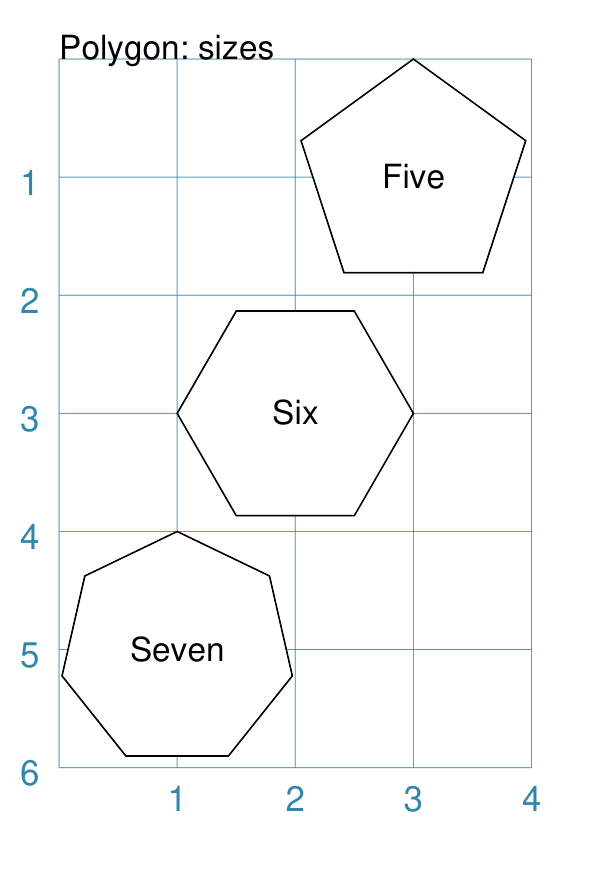

===== ======
|pl1| This example shows three shapes constructed using the command with the
      following properties:

      .. code:: python

        Polygon(
            cx=1, cy=5, sides=7,
            radius=1, label="Seven")
        Polygon(
            cx=2, cy=3, sides=6,
            radius=1, label="Six")
        Polygon(
            cx=3, cy=1, sides=5,
            radius=1, label="Five")

      It can be seen that each shape is constructed as follows:

      - *centre* - using *cx* and *cy* values
      - *radius* - ``1`` cm in each case
      - *sides* - varying from ``7`` down to ``5``

      Even-sided polygons have a "flat" top, whereas odd-sided ones are
      asymmetrical; this can be adjusted through `rotation`_.
===== ======

Example 3. Polygon Radii
++++++++++++++++++++++++
`^ <polygon-command_>`_

.. |pl2| image:: images/customised/polygon_radii.png
   :width: 330

===== ======
|pl2| This example shows the shape constructed using the command with the
      additional properties.

      The **lower** example:

      .. code:: python

          Polygon(
              cx=2, cy=4, sides=8, radius=1,
              radii="1,3,7")

      It has the following properties:

      - *centre* at x-position ``2`` cm and at y-position ``4`` cm, with a *radius*
        size of ``1`` cm
      - *sides* - ``8`` sides
      - *radii* - set to ``1, 3, 7`` to enable lines to be drawn from the centre
        of the polygon to three of its vertices  (starting from the top)

      The **top** example:

      .. code:: python

          Polygon(
              cx=2, cy=1, sides=10, radius=1,
              radii="*",
              radii_offset=0.75,
              radii_length=0.25,
              radii_stroke_width=1,
              dot=0.1, dot_stroke="red"
          )

      It has the following properties:

      - *centre* at x-position ``2`` cm and at y-position ``1`` cm, with a *radius*
        size of ``1`` cm
      - *sides* - ``10``
      - *radii* - set to ``*`` to enable lines to be drawn from the centre
        of the polygon to all of its vertices; the radii properties are then set:

        - *radii_offset* - set to ``0.75`` cm; distance away from the centre
          that the radii will start
        - *radii_length*  - set to ``0.25`` cm
        - *radii_stroke_width* - set to ``1`` point; a slightly thicker line

      .. NOTE::

        When the radii length is shorter than the distance from
        vertex to centre, the line will still go in the same direction
        but never touch the vertex.

===== ======

Example 4. Polygon with Perbii
++++++++++++++++++++++++++++++
`^ <polygon-command_>`_

The *perbii* |dash| "perbis" is short for "perpendicular bisector" and "perbii"
is the plural form |dash| defines lines that should be drawn from the centres
of the sides of the polygon to the polygon's centre.

===== ======
|pl3| This example shows the shape constructed using the command with the
      additional properties.

      The **lower** example:

      .. code:: python

          Polygon(
              cx=2, cy=4, sides=8,
              radius=1, perbii='*')

      It has the following properties:

      - *centre* at x-position ``2`` cm and at y-position ``4`` cm, with a *radius*
        size of ``1`` cm
      - *sides* - ``8`` sides (an octagon)
      - *perbii* - set to ``*``; this means lines are drawn from each of the
        centres of the sides of the polygon to its centre

      The **top** example:

      .. code:: python

          Polygon(
            cx=2, cy=1, sides=8, radius=1,
            perbii="2,4,7",
            perbii_offset=0.25,
            perbii_length=0.5,
            perbii_stroke_width=1,
            dot=0.1, dot_stroke="red")

      It has the following properties:

      - *centre* at x-position ``2`` cm and at y-position ``1`` cm
      - *radius* size of ``1`` cm
      - *sides* - ``8`` (an octagon)
      - *perbii* - lines drawn to sides 2, 4 and 7

      The edges of the polygon are numbered; the east-most facing edge is 1,
      and then numbers increase in an clockwise direction.

      Its properties can be set as follows:

      - *perbii* - a list of edges to use
      - *perbii_offset* - set to ``0.25`` cm; the distance away from the centre
        that the lines will start to be drawn
      - *perbii_length*  - set to ``0.5`` cm
      - *perbii_stroke_width* - set to ``1`` point; a slightly thicker line

      Note that when the *perbii length* is shorter than that the distance from
      centre point to edge, the line will still go in the same direction but
      never touch the vertex or the edge.

===== ======

Example 5. Polygon Rotation
+++++++++++++++++++++++++++
`^ <polygon-command_>`_

.. |pl4| image:: images/customised/polygon_rotation_flat.png
   :width: 330

===== ======
|pl4| This example shows five Polygons constructed using the command with
      additional properties.

      Note the use of the :ref:`Common command <the-common-command>`
      to allow multiple Polygons to share the same properties.

      .. code:: python

        poly6 = Common(
            fill=None,
            sides=6,
            diameter=1,
            stroke_width=1)

        Polygon(
            common=poly6,
            cy=1, cx=1.0, label="0")
        Polygon(
            common=poly6,
            cy=2, cx=1.5,
            rotation=15, label="15")
        Polygon(
            common=poly6,
            cy=3, cx=2.0,
            rotation=30, label="30")
        Polygon(
            common=poly6,
            cy=4, cx=2.5,
            rotation=45, label="45")
        Polygon(
            common=poly6,
            cy=5, cx=3.0,
            rotation=60, label="60")

      The examples have the following properties:

      - *common* - set shared diameter, sides and fill for all Polygons
      - *cx* and *cy* - set the centre location for the Polygon
      - *radius* - ``1`` cm in each case
      - *sides* - the default of ``6`` in each case (a `hexagon`_ shape)
      - *rotation* - varies from 0 |deg| to 60 |deg|

      The rotation defined here is anti-clockwise from the horizontal.

===== ======

Example 6. Polygon Slices
+++++++++++++++++++++++++
`^ <polygon-command_>`_

Slices are a set of colors that are drawn as triangles inside a
a Polygon in a clockwise direction starting from the "South East".
If there are fewer colors than all the possible triangles, then the
colors are repeated, starting from the first one.

===== ======
|pl5| This example shows a Polygon constructed using these commands:

      .. code:: python

        Polygon(
            cx=2, cy=1, sides=8, radius=1,
            slices=['red', 'orange', 'yellow', 'green',
                    'aqua', 'pink', 'violet', 'purple'])

      This example has the following properties:

      - *cx* and *cy* - set the centre location
      - *radius* - ``1`` cm
      - *sides* - set to ``8`` (an octagon)
      - *slices* - list of named colors that will be drawn
        seqentially
===== ======

.. _polyshape-command:

Polyshape
~~~~~~~~~
`↑ <shape-index_>`_

A Polyshape is an irregular `polygon`_, constructed using a series of points.

It's basic setup and construction  shares much in common with the
`Polyline <polyline-command_>`_ but with some differences, such as its
*fill* and centre properties.

The following examples illustrate these properties:

- `Example 1. Default Polyshape`_
- `Example 2. Polyshape: Centre and Steps`_
- `Example 3. Polyshape Offset`_
- `Example 4. Polyshape with Snail`_

Example 1. Default Polyshape
++++++++++++++++++++++++++++
`^ <polyshape-command_>`_

.. |shp| image:: images/customised/polyshape_default.png
   :width: 330

===== ======
|shp| If the shape is constructed using the command with only defaults:

      .. code:: python

        Polyshape()

      Then nothing will be visible; instead you will see a warning::

        WARNING:: There are no points to draw the Polyshape

      Like `polyline`_, the Polyshape requires a list of points to be constructed.

      This example shows how to do this using the command with these properties:

      .. code:: python

        Polyshape(
          points=[
              (1, 2),
              (1, 1),
              (2, 0),
              (3, 1),
              (3, 2)])

      It has the following properties:

      - starts at x-position ``1`` cm and y-position ``2`` cm
      - second point is at x-position ``1`` cm and y-position ``1`` cm
      - third point is at x-position ``2`` cm and y-position ``0`` cm
      - etc.

      The *points* for a Polyshape which represent its vertices are given in a
      list:

      - all points are listed inside the square brackets from ``[`` to ``]``
      - each *x* and *y* are provided as a pair of values in round brackets
      - each *x* and *y* are separated by a comma
      - each pair of values in the list is separated by a comma

      Lines are drawn between each successive point in the list; **including a
      line from the last to the first**.

      The default *stroke* and *fill* apply to this example of a Polyshape.

===== ======

Example 2. Polyshape: Centre and Steps
++++++++++++++++++++++++++++++++++++++
`^ <polyshape-command_>`_

While the Polyshape does not have the ability to be constructed using a
*cx* and *cy* pair to set its centre location |dash| like the symmetric
shapes |dash| it is possible to provide these values to the shape command,
and they can then be used for a label, plus the `dot and cross`_, similar
to those other shapes.

**NOTE** - the program has no way of knowing or "checking" that the values
for the *cx* and *cy* pair that you supply to it are correct!

In addition to setting points directly, the Polyshape can also be constructed
using the *steps* property.  This define a series of values that represent
the **relative** distance from the last point drawn.

.. |sh2| image:: images/customised/polyshape_custom.png
   :width: 330

===== ======
|sh2| The shape is constructed using the command with these properties:

      .. code:: python

        Polyshape(
            x=0, y=1,
            points=[(1, 2), (1, 1), (2, 0), (3, 1), (3, 2)],
            cx=2, cy=1,
            label='A House',
            label_stroke="seagreen",
            cross=0.5,
            fill="sandybrown",
            stroke="peru",
        )

      As in Example 1, the *points* are used to construct the outline of the
      "house" shape.

      Other properties include:

      - *x* and *y* are used to provide offsets for the start; in this case
        ``1`` is added to the start of the y-position, and for each value
        thereafter
      - the centre is *defined* to be at x-position ``2`` cm and y-position
        ``1`` cm
      - *cross* - sets the length of each of the two lines that cross at the
        centre to be ``0.5`` cm
      - *label* - sets the text appearing at the defined centre position
      - *fill* - color of ``sandybrown`` (hexadecimal value ``#F4A460``)
        for the shape's' interior
      - *stroke* - color of ``peru`` (hexadecimal value ``#CD853F``)

      *Reminder:* ``cx`` and ``cy`` affect the drawing of the cross and label
      but do **not** affect the drawing of the shape itself.

      The lower shape shows how create a Polyshape using the command with
      these properties:

      .. code:: python

        Polyshape(
          x=1, y=4,
          steps='0.5,0 0,1.5 1.5,0 0,-1.5 0.5,0 0,0.5 -2.5,0 0,-0.5',
          stroke="sandybrown",
          stroke_width=3,
          fill="seagreen")

      Here, the *steps* property results in the drawing of an outline
      using a series of distances |dash| or offsets |dash| from the last
      point.  The start is provided by the *x* and *y* values.

      Each pair of comma-separated values are x- and y-distances
      respectively.

===== ======

Example 3. Polyshape Offset
+++++++++++++++++++++++++++
`^ <polyshape-command_>`_

There are two other options available.

In addition to the *cx* and *cy* pair, an *x* and *y* pair can also be provided;
these values will be used to offset ("move") the Polyshape from the position it
would normally occupy.

It is also possible to provide the *points* as a string of space-separated
pairs of comma-separated values; so instead of ``[(0,0), (1,1)]`` just use
``"0,0 1,1"``.

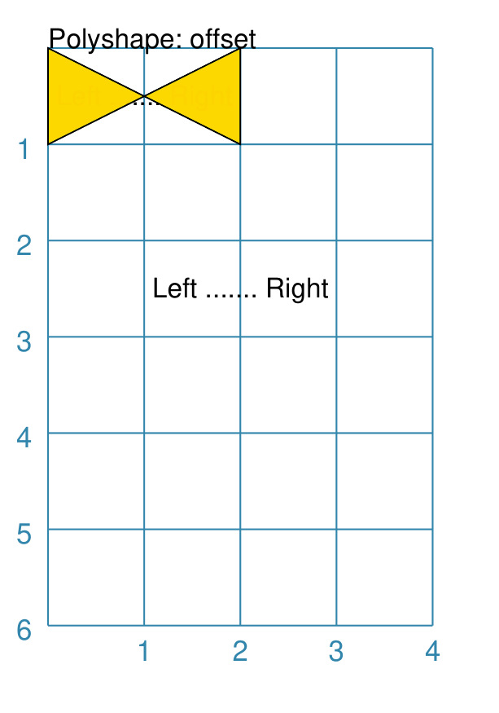

===== ======
|sh3| The following Polyshapes are constructed using the command with these
      properties:

      .. code:: python

        Polyshape(
            points="0,0 0,1 2,0 2,1 0,0",
            cx=1, cy=0.5,
            fill="gold",
            label="Left ....... Right")
        Polyshape(
            x=1, y=2,
            points="0,0 0,1 2,0 2,1 0,0",
            fill="chartreuse",
            label="Left ....... Right")

      As in Example 2, the *points* property is used to construct the outline
      of the Polyshape. In this case, the points are set by a string of
      space-separated pairs of values.

      The *fill* color defines the color of the interior of the shapes.

      For the ``gold`` color Polyshape, the *cx* and *cy* values have been set.
      These values **only** affect the drawing of the *label*, and **not** the
      shape itself!

      The points used to define the ``green`` Polyshape are the same as those
      used for ``gold`` one, but because the  *x* and *y* values have also
      been set, this causes the whole shape to be be drawn down and to the
      right.

      The ``green`` Polyshape has no *cx* and *cy* values set; therefore the
      label cannot be drawn!

===== ======

Example 4. Polyshape with Snail
+++++++++++++++++++++++++++++++
`^ <polyshape-command_>`_

The *snail* property is loosely based on the concept and approach of the
Turtle graphics drawing module available for Python (see:
https://docs.python.org/3/library/turtle.html).

Instead of using points, the idea of the *snail* is to create a Polyshape
based on a series of lines of given length, where the line direction |dash|
or orientation |dash| will already have been set.   Each line is then drawn
starting from the end point of the previous line.

A *snail* property consists of a series of terms, each separated by a space.
Each term either relates to a **direction** change or to drawing a line of a
certain **length**.

Directions can be set as follows:

- a *compass direction*: one of n, e, w, s, ne, se, sw, or nw
- an **absolute** *angle*: an ``a`` followed by a value in degrees, from
  0 to 360, measured counter-clockwise from the east direction
- a **relative** angle:

  - a ``r`` or ``-`` sign (followed by a value in degrees): will *decrease*
    the current angle i.e. alter it in a clockwise direction
  - a ``l`` or ``+`` sign (followed by a value in degrees): will *increase*
    the current angle i.e. alter it in an anti-clockwise direction

Creating a line is done as follows:

- a normal value |dash| whole or fractional |dash| will draw a line that
  distance, in the last direction that was set
- using a pair of asterixes (``**``) will draw a line from the current point
  back to the start

.. NOTE::

    The *snail* line always starts at the x- and y-point defined for the
    Polyshape; and the starting direction is "e" or 0 |deg|.  The first term
    in the *snail* property can either be a direction or a distance.

    Unlike the Polyline *snail*, no "jump" type movement is allowed; there
    must be a continuous line.

===== ======
|sh4| The Polyshapes are constructed using the command with these properties:

      .. code:: python

        Polyshape(
            x=0.5, y=1.5,
            snail="ne 1 r65 1 ne 1.5 r125 1.44 **",
            stroke_width=1,
            #scaling=0.25,
            stroke="red",
            fill="tan")
        Polyshape(
            x=1, y=2.5,
            snail="2 r160 "*9,
            stroke_width=0.5,
            #scaling=0.25,
            stroke="red",
            fill="yellow")
        Polyshape(
            x=1.5, y=4,
            snail='w .5 s .5 e 2.5 n .5 w .5 s 1.5 w 1.5 n .5',
            stroke="sandybrown",
            stroke_width=3,
            fill="seagreen")
        Polyshape(
            x=2, y=4.75,
            snail='w .5 s .5 e 2.5 n .5 w .5 s 1.5 w 1.5 n .5',
            scaling=0.25,
            stroke="sandybrown",
            stroke_width=1,
            fill="seagreen")

      The top example ilustrates the use of the ``r`` term to change the angle
      of the line to the "right" of the direction it was aimed at before (north
      east, in the first case). It also shows how the ``**`` term constructs a
      line back to the start.

      The middle example |dash| based on the one shown for the Turtle |dash|
      shows how a simple move-and-turn can be repeated multiple times (using
      the ``*`` multiplier to make copies) to construct a more complex shape.

      The lower example is a repeat of the one shown for
      `Example 2. Polyshape: Centre and Steps`_ but constructed with simple
      compass directions.  It may not be that much shorter, but it could be
      clearer.  In addition it can easily be scaled, as can be seen from the
      small "inset" shape - the same *snail* but shrunk in size using
      ``scaling=0.25``.

===== ======

.. _qrcode-command:

QRCode
~~~~~~
`↑ <shape-index_>`_

A QR Code is a square image containing a pattern of black squares and dots.
It represents encoded information that a device with a QR scanner, for example
a cell phone, can decode.

The properties that can be provided to a ``QRCode`` command, apart from the
usual *x* and *y*, to set the upper-left corner, and *height* and *width* to
set the size, are:

- *image* - this should be the first property and is the name of the file
  that will be created by the command
- *text* - this contains the information that is to be encoded (and decoded)
- *scaling* - the size of the indivdual QR Code squares, in pixels
- *stroke* - the color of the pattern containing the black squares and dots
- *fill* - the color that will appear as the background

.. NOTE::

    The QR Code images generated will be stored in the cache directory
    ``.protograf/images/qrcodes`` (or ``.protograf\images\qrcodes``);
    see :ref:`caching <protograf_caching>`.

Example 1. Default QRCode
+++++++++++++++++++++++++

.. |qrc| image:: images/customised/qr_code.png
   :width: 330

===== ======
|qrc| The shape cannot be constructed using only default properties:

      .. code:: python

          QRCode()

      Nothing will be visible; instead you will see a warning::

        WARNING:: No text supplied for the QRCode shape!

      This example shows the shape constructed using the commands with these
      properties:

      .. code:: python

        QRCode("qrcode1.png", text="Help")

      The first command uses the defaults which means it has the following
      properties automtically set for it:

      - upper-left corner at x-position ``1`` cm and at y-position ``1`` cm
      - *width* and *height* - default to ``1`` cm
      - *scaling* - default is ``1``, so 1 pixel per square
      - *stroke* - is ``black`` for the squares color
      - *fill* - is ``white`` for the background color

      The second command overides various of these defaults:

      .. code:: python

        QRCode(
            'qrcode2.png',
            text="Help me ObiWan",
            x=1, y=3,
            height=2, width=2,
            fill="gray",
            stroke="red",
            scaling=5
        )

      In this example, the QR Code is now larger with different colors.

===== ======

.. _rectangle-command:

Rectangle
~~~~~~~~~
`↑ <shape-index_>`_

.. NOTE::

   There is more detail about the many properties that can be defined for a
   Rectangle in the :ref:`customised Rectangle <rectangleIndex>` section.

Example 1. Default Rectangle
++++++++++++++++++++++++++++

===== ======
|rct| This example shows the shape constructed using the command with only
      defaults:

      .. code:: python

          Rectangle()

      It has the following properties set for it:

      - upper-left corner at x-position ``1`` cm and y-position ``1`` cm
      - *width* and *height* - default to ``1`` cm

      Because all sides of the Rectangle are equal, it appears as though it
      is a `Square`_.
===== ======

Example 2. Customised Rectangle
+++++++++++++++++++++++++++++++

===== ======
|rc1| This example shows the shape constructed using the command with these
      properties:

      .. code:: python

          Rectangle(cx=2, cy=3, width=3, height=4, dot=0.1)

      It has the following properties set for it:

      - *cx* and *cy* - set the centre at x-position ``2`` cm and
        y-position ``3`` cm
      - *height* - ``4`` cm
      - *width* - ``3`` cm
      - *dot* - small, filled circle placed at the centre of size ``0.1``

      Because the *height* is greater than the *width* the Rectangle has an
      appearance like a playing card.
===== ======

.. _rhombus-command:

Rhombus
~~~~~~~
`↑ <shape-index_>`_

Example 1. Default Rhombus
++++++++++++++++++++++++++

===== ======
|rh0| This example shows the shape constructed using the command with only
      defaults:

      .. code:: python

          Rhombus()

      It has the following properties based on the defaults:

      - upper-left at x-position ``1`` cm and at y-position ``1`` cm
      - *width* - ``1`` cm
      - *height* - ``1`` cm

      Because the sides are of equal length, the Rhombus appears to be a
      rotated Square.
===== ======

Example 2. Rhombus Centre & Dot
+++++++++++++++++++++++++++++++

.. |rh1| image:: images/customised/rhombus_custom.png
   :width: 330

===== ======
|rh1| This example shows the shape constructed using the command with these
      properties:

      .. code:: python

          Rhombus(cx=2, cy=3, width=2, height=3, dot=0.1)

      It has the following properties set for it:

      - centre at x-position ``2`` cm and at y-position ``3`` cm
      - *width* - ``2`` cm
      - *height* - ``3`` cm
      - *dot* - small, filled circle placed at the centre of size ``0.1``
===== ======

Example 3. Rhombus Border Styles
++++++++++++++++++++++++++++++++

.. |rh2| image:: images/customised/rhombus_borders.png
   :width: 330

===== ======
|rh2| This example shows the shape constructed using the command with these
      properties:

      .. code:: python

          Rhombus(
            cx=2, cy=3, width=2, height=3,
            borders=[
                ("nw", 2, gold),
                ("ne", 2, lime, True),
                ("se", 2, tomato, [0.1, 0.2]),
                ("sw", 2)
            ]
          )

      It has the following properties set for it:

      - centre at x-position ``2`` cm and at y-position ``3`` cm
      - *width* of ``2`` cm
      - *height* of ``3`` cm
      - *borders* - a list of sets of custom settings for each side; each set
        can contain:

        - `direction` - ne (northeast), se (southeast), nw (northwest),
          or sw (southwest)
        - `width` - the line thickness
        - `color` - either a named color or a hexadecimal value
        - `style` - ``True`` makes it dotted; a pair of values creates dashes

        Direction and width are required, but color and style are optional.

        Mutiple, spaced values can be used to draw lines e.g. ``ne se``.
===== ======

.. _sector-command:

Sector
~~~~~~
`↑ <shape-index_>`_

A Sector is like the triangular-shaped wedge that is often cut from a pizza
or cake. It extends from the centre of a "virtual" circle outwards to its
enclosing diameter.  The two "arms" of the sector will cover a certain number
of degrees of the circle (from 1 to 360).

Example 1. Default Sector
+++++++++++++++++++++++++

.. |sct| image:: images/defaults/sector.png
   :width: 330

===== ======
|sct| This example shows the shape constructed using the command with only
      defaults:

      .. code:: python

          Sector()

      It has the following properties based on the defaults:

      - upper-left "corner"at x-position ``1`` cm and at y-position ``1`` cm

      The sector is then drawn inside a circle of radius ``1`` cm, whose
      centre is at  x-position ``0.5`` cm and at y-position ``0.5`` cm.
      The default *angle_width* is 90 |deg|.
===== ======

Example 2. Customised Sector
++++++++++++++++++++++++++++

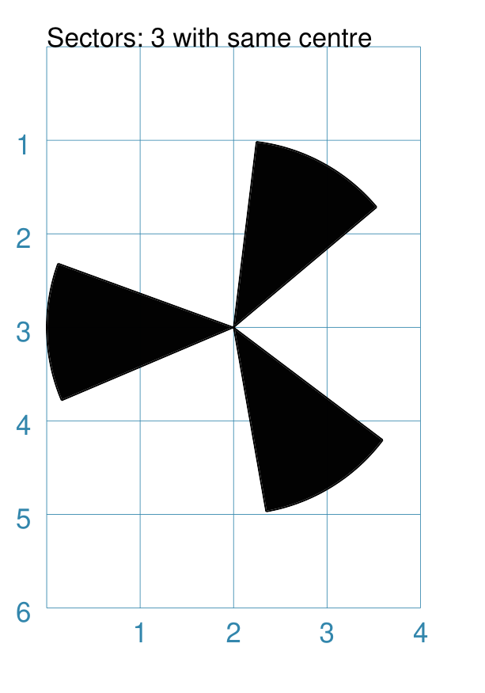

===== ======
|sc1| This example shows examples of the Sector constructed using commands
      with the following properties.

      Note the use of the :ref:`Common command <the-common-command>`
      to allow multiple Sectors to share the same properties.

      .. code:: python

        sctm = Common(
            cx=2, cy=3, radius=2,
            fill="black", angle_width=43)

        Sector(common=sctm, angle_start=40)
        Sector(common=sctm, angle_start=160)
        Sector(common=sctm, angle_start=280)

      These all have the following ``Common()`` properties:

      - centred at x-position ``2`` cm and at y-position ``3`` cm
      - *radius* of ``2`` cm for the enclosing "virtual" circle
      - *fill* color of black
      - *angle_width* - determines the coverage i.e. the "width" of the
        Sector; in all these cases it is 43 |deg|

      Each Sector in this example is drawn at a different *angle_start*.
      This represents a "virtual" centre-line extending through the sector,
      outwards from the centre of the enclosing "virtual" circle.
===== ======

.. _square-command:

Square
~~~~~~
`↑ <shape-index_>`_

A square shares almost all of the same properties as a `Rectangle`_ and so
that shape, which has additional customisation options available, should
also be referenced when working with this shape.

Example 1. Default Square
+++++++++++++++++++++++++

===== ======
|sqr| This example shows the shape constructed using the command with only
      defaults:

      .. code:: python

          Square()

      It has the following properties based on the defaults:

      - upper-left corner at:

        - x-position ``1`` cm, and
        - y-position ``1`` cm
      - side of ``1`` cm

===== ======

Example 2. Customised Square
++++++++++++++++++++++++++++

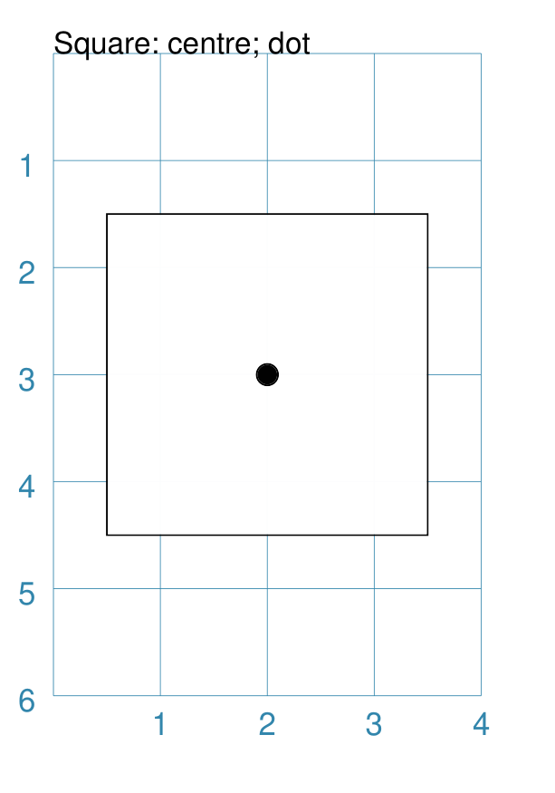

===== ======
|sq1| This example shows the shape constructed using the command with these
      properties:

      .. code:: python

          Square(cx=2, cy=3, side=3, dot=0.1)

      It has the following properties set for it:

      - centre at x-position ``2`` cm and at y-position ``3`` cm
      - *side* of ``3`` cm; both *width* and *height* match this
      - *dot* - small, filled circle placed at the centre of size ``0.1``

===== ======

.. _stadium-command:

Stadium
~~~~~~~
`↑ <shape-index_>`_

A Stadium is a shape constructed with a rectangle as a base, and then curved
projections added that extend from one or more of the sides.

In its default form, it may look like a pill.

Example 1. Default Stadium
++++++++++++++++++++++++++

.. |std| image:: images/defaults/stadium.png
   :width: 330

===== ======
|std| This example shows the shape constructed using the command with only
      defaults:

      .. code:: python

          Stadium()

      It has the following properties based on the defaults:

      - straight edge start at:

        - x-position ``1`` cm and
        - y-position ``1`` cm
      - height and width of ``1`` cm each

      The default curved ends extend from the east/right and west/left sides.

===== ======

Example 2. Customised Stadium
+++++++++++++++++++++++++++++

.. |st1| image:: images/customised/stadium_edges.png
   :width: 330

===== ======
|st1| This example shows example of the shape constructed using the command
      with the following properties:

      .. code:: python

        Stadium(
          x=0, y=1, height=1, width=1, edges='n',
          fill="tan", label="north")
        Stadium(
          x=3, y=1, height=1, width=1, edges='s',
          fill="tan", label="south")
        Stadium(
          x=0, y=3, height=1, width=1, edges='e',
          fill="tan", label="east")
        Stadium(
          x=3, y=4, height=1, width=1, edges='w',
          fill="tan", label="west")

      These have the following properties set:

      - *height* and *width* - of ``1`` cm and ``1`` cm respectively
      - *edges* - set the projection direction(s)

      The edges of the rounded projection(s) can be set using
      a letter to represent direction, where:

      - ``n`` is ``north`` ("up"),
      - ``s`` is ``south`` ("down"),
      - ``e`` is ``east`` ("right"), and
      - ``w`` is ``west`` ("left").

      One or more edge values can be used together with spaces between them
      e.g. ``n e`` to draw both north **and** east.

===== ======

.. _star-command:

Star
~~~~
`↑ <shape-index_>`_

A Star is a multi-pointed shape; essentially made by joining points spaced
equally around the circumference of an outer circle to points spaced
equally around the circumference of a smaller "inner" circle.

To create other kinds of stars, see the "triangle" or "sun" petal shapes
that can be created using a :ref:`customised Circle <circleIndex>`.

Properties
++++++++++

A Star shape has the following additional properties:

- *rays* - number of arms of the Star; defaults to ``5``
- *inner_fraction* - used to calulate the inner circle on which the other
  points used to draw the Star are placed; as this gets smaller, the width
  of the arms gets narrower; defaults to ``0.5`` (one-half)
- *show_radii* - if ``True``, then lines are drawn from the Star centre
  to all of the points (inner and outer); default is ``False``
- *slices* - a list of color values that will be used to color the triangles
  formed between the centre and the points of the rays

Example 1. Default Star
+++++++++++++++++++++++

.. |str| image:: images/defaults/star.png
   :width: 330

===== ======
|str| This example shows the shape constructed using the command with only
      defaults:

      .. code:: python

          Star()

      The Star has the following properties based on the defaults:

      - centre at x-position ``1`` cm and at y-position ``1`` cm
      - default *radius* of ``1`` cm
      - default of ``5`` *rays*
      - default *inner_fraction* of ``0.5``

===== ======

Example 2. Customised Star
++++++++++++++++++++++++++

.. |st2| image:: images/customised/star_custom.png
   :width: 330

===== ======
|st2| This example shows the shape constructed using the command with these
      properties:

      .. code:: python

        Star(cx=1, cy=1, radius=1,
             fill="red",
             stroke="gold",
             stroke_width=2,
             inner_fraction=0.4,
        )
        Star(cx=2, cy=3, radius=1,
             rays=6,
             show_radii=True,
             rotation=30,
        )
        Star(cx=3, cy=5, radius=1,
             fill=None,
             rays=12,
             inner_fraction=0.1,
        )

      These have the following properties that differ from the defaults:

      - centre defined at *cx* and  *cy*-position in cm
      - *radius* - ``1`` cm; length of the "rays" from centre to outer points

      The upper Star has the default number of *rays* i.e. ``5``, plus:

      - *fill* color - ``red`` for the interior of the Star
      - *stroke* color - ``yellow`` for the outline of the Star
      - *stroke_width*  - ``2`` for the line thickness of the outline of the Star
      - *inner_fraction* - changed to ``0.4``; which cause the lines to
        appear to "flatten" and align

      The middle Star has:

      - *rays* - changed to ``6``
      - *show_radii* - if ``True``, then lines are drawn from the Star centre
        to all of the points (inner and outer)
      - *rotation* - 30 |deg| anti-clockwise about the centre

      The lower Star has:

      - *rays* - changed to ``12``
      - *inner_fraction* - changed to ``0.1``; which causes the "spiky"
        appearance

===== ======

Example 3. Star with Slices
+++++++++++++++++++++++++++

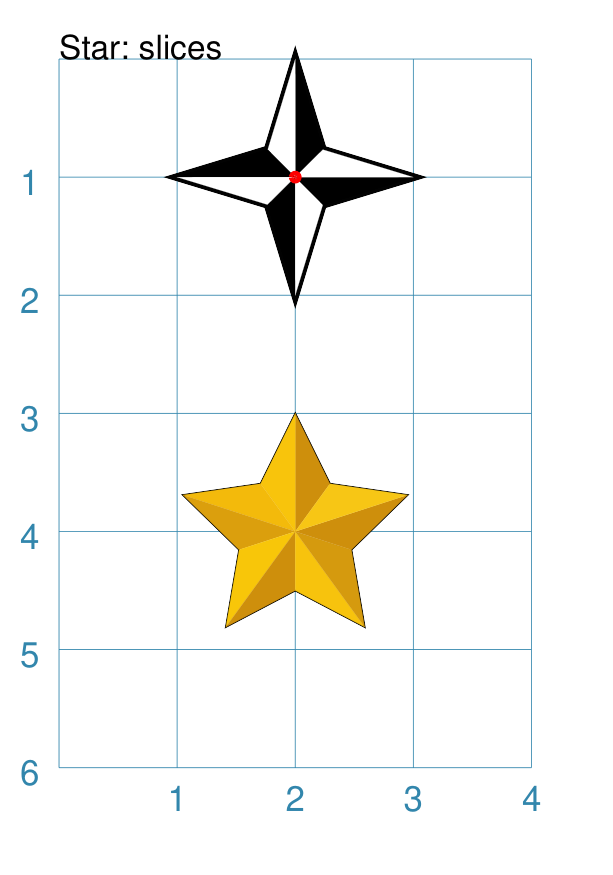

===== ======
|st3| This example shows the shape constructed using the command with these
      properties:

      .. code:: python

        Star(cx=2, cy=1, radius=1,
             rays=4,
             inner_fraction=0.33,
             stroke_width=2,
             slices=["black", "white"],
             dot=0.02,
             dot_stroke="red",
         )
        Star(cx=2, cy=4, radius=1,
             slices=[
                "#CE8F0C",
                "#F8C40C",
                "#F3BA0B",
                "#DB9F0D",
                "#F8C609",
                "#CE8F0C",
                "#F7C30D",
                "#D59A0E",
                "#CE8F0C",
                "#F7C615",
            ]
        )

      The upper Star has the following changes:

      - *rays* - changed to ``4``
      - *inner_fraction* - changed to ``0.33``; which makes rays more "spiky"
      - *dot* -  a small red dot is drawn in the centre of the Star
      - *slices* - only two colors are provided in the list, so they will be
        reused across all the rays

      The lower Star has the default number of *rays* i.e. ``5``, plus:

      - *slices* - the list contains a unique color for each triangle.

      **NOTE** that the coloring for the triangles starts in the righthand
      side of the "top" triangle |dash| by default, a Star's rays always start
      from 90 |deg|, or "north".

===== ======

.. _starfield-command:

Starfield
~~~~~~~~~
`↑ <shape-index_>`_

A Starfield is a shape in which a number of small dots are scattered at random
to simulate what might be seen when looking at a portion of the night sky.

The dots are drawn inside the boundaries of an "enclosure"; this can be a
rectangle, a circle, or a polygon |dash| but this shape is not, itself, drawn.

The number of dots drawn depends on the "density", which is the product of the
actual area of the shape multiplied by the density value.

.. HINT::

    If you want repeatable randomness - that is to say, the same sequence of
    random numbers being generated every time the program is run - then assign
    a value to the *seeding* property; for example:

    .. code:: python

      Starfield(seeding=42)

    The images used for this document are created with such a setting; but only
    to avoid the code repository detecting a "change" each time the script runs.

Example 1. Default Starfield
++++++++++++++++++++++++++++

.. |sf0| image:: images/defaults/starfield.png
   :width: 330

===== ======
|sf0| This example shows the shape constructed using the command with only
      defaults:

      .. code:: python

          Starfield()

      It has the following properties based on the defaults:

      - upper-left corner at x-position ``0`` cm and y-position ``0`` cm
      - an enclosing rectangle with *height* and *width* of ``1`` cm
      - 10 randomly placed ``white`` *color* 'dots' (the starfield *density*)

      Because the default fill color is ``white``, this example adds an extra
      `Rectangle()` shape, with a fill of ``black``, which is drawn first and
      is hence "behind" the field of dots.
===== ======

Example 2. Multiple Color Starfield
+++++++++++++++++++++++++++++++++++

===== ======
|sf1| This example shows the shape constructed using the command with the
      following properties:

      .. code:: python

        StarField(
            enclosure=rectangle(x=0, y=0, height=3, width=3),
            density=80,
            colors=[white, white, red, green, blue],
            sizes=[0.4]
        )

      It has the following properties set:

      - upper-left corner at x-position ``0`` cm and y-position ``0`` cm
      - *enclosure* - the rectangle size determines the boundaries of the area
        (*height* and *width* each of ``3`` cm) inside of which the stars (dots) are
        randomly drawn
      - *density* - there will be a total of "80 multiplied by the enclosure
        area" dots drawn
      - *colors* - is a list of colors, one of which will be randomly chosen
        each time before drawing a dot
      - *sizes* - is a list of randomly chosen dot sizes; in this case there is
        just one value and so all dots will be same size

      Because the default fill color is white, this example adds an extra
      `Rectangle()` shape, with a fill color of black, which is drawn first and
      is hence "behind" the field of dots.
===== ======

Example 3. Multiple Size Starfield
++++++++++++++++++++++++++++++++++

===== ======
|sf2| This example shows the shape constructed using the command with the
      following properties:

      .. code:: python

        StarField(
            enclosure=circle(x=0, y=0, radius=1.5),
            density=30,
            sizes=[0.15, 0.15, 0.15, 0.15, 0.3, 0.3, 0.5]
        )

      It has the following properties set:

      - upper-left "corner" at x-position ``0`` cm and at y-position ``0`` cm
      - *enclosure* - the `circle` radius (``1.5`` cm) determines the boundaries
        of the area inside of which the stars (dots) are randomly drawn
      - *density* - there will be a total of "30 multiplied by the enclosure
        area" dots drawn
      - *sizes* - is a list of available dot sizes, one of which is randomly
        chosen from the list each time before drawing a dot

      Because the default fill color is white, this example adds an extra
      `Circle()` shape, with a fill color of black, which is drawn first and is
      hence "behind" the field of dots.
===== ======

Example 4. Multiple Color & Size Starfield
++++++++++++++++++++++++++++++++++++++++++

===== ======
|sf3| This example shows the shape constructed using the command with the
      following properties:

      .. code:: python

        StarField(
            enclosure=polygon(x=1.5, y=1.4, sides=10, radius=1.5),
            density=50,
            colors=["white", "white", "white", "red", "green", "blue"],
            sizes=[0.15, 0.15, 0.15, 0.15, 0.3, 0.3, 0.45]
        )

      It has the following properties set:

      - upper-left "corner" at x-position ``1.5`` cm and y-position ``1.4`` cm
      - *enclosure* - the polygon radius (``1.5`` cm) determines the boundaries
        of the area inside of which the stars (dots) are randomly drawn
      - *density* - there will be a total of "50 multiplied by the enclosure
        area" dots drawn
      - *colors* - a list of available dot colors, one of which is randomly
        chosen from the list each time before drawing a dot
      - *sizes* - a list of available dot sizes, one of which is randomly
        chosen from the list each time before drawing a dot

      Because the default fill color is white, this example adds an extra
      `Polygon()` shape, with a fill color of black, which is drawn first and
      is hence "behind" the field of dots.
===== ======

.. _trapezoid-command:

Trapezoid
~~~~~~~~~
`↑ <shape-index_>`_

Example 1. Default Trapezoid
++++++++++++++++++++++++++++

===== ======
|trp| This example shows the shape constructed using the command with only
      defaults:

      .. code:: python

          Trapezoid()

      It has the following properties based on the defaults:

      - starts at x-position ``1`` cm and at y-position ``1`` cm
      - *width* of ``1`` cm
      - *height* of ``1`` cm
      - the lower edge of the shape defaults to half the *width*
===== ======

Example 2. Size & Flip Trapezoid
++++++++++++++++++++++++++++++++

.. |tr1| image:: images/customised/trapezoid_custom.png
   :width: 330

===== ======
|tr1| This example shows the shape constructed using the command with these
      properties:

      .. code:: python

          Trapezoid(
            cx=2, cy=3, width=3, top=2, height=4, flip='s', dot=0.1)

      It has the following properties set for it:

      - centre at x-position ``2`` cm and at y-position ``3`` cm
      - *width* of ``3`` cm
      - *height* of ``4`` cm
      - *top* of ``2`` cm
      - *flip* of ``s`` (for ``south``) means the "top" is drawn below the base

===== ======

Example 3. Trapezoid Borders
++++++++++++++++++++++++++++

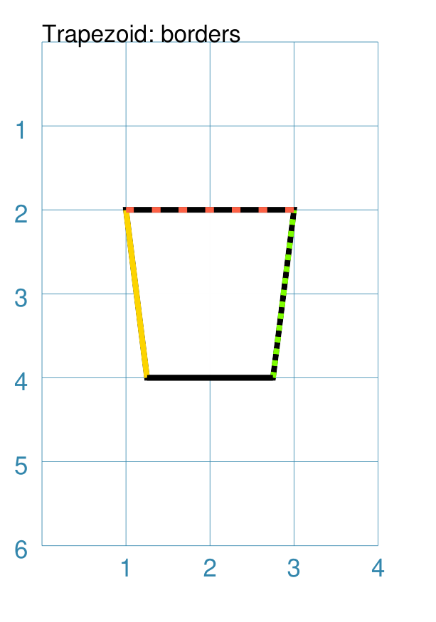

===== ======
|tr3| This example shows the shape constructed using the command with these
      properties:

      .. code:: python

        Trapezoid(
            cx=2, cy=3, width=2,
            height=2, top=1.5,
            stroke_width=2,
            borders=[
                ("w", 2, "gold"),
                ("e", 2, "chartreuse", True),
                ("n", 2, "tomato", [0.1, 0.2]),
                ("s", 2)
            ]
        )

      It has the following properties set for it:

      - centre at x-position ``2`` cm and at y-position ``3`` cm
      - *width* of ``2`` cm
      - *height* of ``3`` cm
      - *top* of ``1.5`` cm
      - *stroke_width* of 2 points
      - *borders* - a list of sets of custom settings for each side; each set
        can contain:

        - *direction* - one of n(orth), s(outh), e(ast) or w(est)
        - *width* - the line thickness
        - *color* - either a named color or a hexadecimal value
        - *style* - ``True`` makes it dotted; a list of values creates dashes

      Borders' direction and width are required, but color and style are
      optional.

      Multiple border directions can be used, with spaces between them,
      e.g. ``n s`` to draw lines on both north **and** south sides.

===== ======

.. _compoundIndex:

Compound Shapes
---------------
`↑ <table-of-contents-core_>`_

Compound shapes are ones composed of multiple elements; but the program takes
care of drawing all of them based on the properties supplied.

The following are all such shapes:

- `Blueprint`_
- `DotGrid`_
- `Grid`_
- `Hexagons`_
- `Image`_
- `Lines`_
- `Rectangles`_
- `Table`_

.. _blueprint-command:

Blueprint
~~~~~~~~~
`↑ <shape-index_>`_

This shape is primarily intended to support drawing while it is "in progress".
It provides a quick and convenient underlying grid that can help to orientate
and place other shapes that *are* required for the final product.  Typically,
one would just comment out this command when its purpose has been served.

On the grid, the values of **x** appear across the lower edge (increasing
from left to right); those for **y** along the left side (increasing from
top to bottom). The grid respects the margins that have been set but you will
observe that the Blueprint numbering itself is located inside the margin area!

Different styling options are provided that can make the Blueprint more
useful in different contexts.

.. NOTE::

   There is more detail about the various properties that can be defined for a
   Blueprint in the :ref:`customised Blueprint <blueprintIndex>` section.

Example 1. Defaults
+++++++++++++++++++

.. |blp| image:: images/defaults/blueprint.png
   :width: 330

===== ======
|blp| This example shows the shape constructed using the command with only
      defaults:

      .. code:: python

          Blueprint()

      It has the following properties based on the defaults:

      - starts at the upper-left corner, as defined by the page margins
      - has vertical and horizontal lines filling the page from the lower left
        corner up to the right-most and top-most margins
      - has interval between the lines of ``1`` cm
      - default line color is a shade of ``blue`` (hexadecimal ``#2F85AC``)
      - the x- and y-axis are numbered from the left and top respectively

===== ======

Example 2. Subdivisions & Style
+++++++++++++++++++++++++++++++

.. |bl2| image:: images/customised/blueprint_subdiv.png
   :width: 330

===== ======
|bl2| This example shows the shape constructed using the command with these
      properties:

      .. code:: python

          Blueprint(
            subdivisions=5,
            stroke_width=0.5,
            style='invert')

      It has the following properties set:

      - *subdivisions* - set to ``5``
      - *stroke_width* - set to ``0.5``; slightly thicker line makes
        the main grid more visible
      - *style* - set to ``invert`` so that the lines and number colors are white
        and the fill color is now a shade of ``blue`` (``#2F85AC``)

      The *subdivisions* are the thinner lines that are drawn between each pair
      of primary lines |dash| they do not have any numbering and are *dotted*.
===== ======

.. _dotgrid-command:

DotGrid
~~~~~~~
`↑ <shape-index_>`_

A DotGrid is a series of dots |dash| both in the vertical and horizontal
directions. This will, by default, fill the page, as far as possible,
between its margins.

Example 1. Defaults
+++++++++++++++++++

.. |dtg| image:: images/defaults/dotgrid.png
   :width: 330

===== ======
|dtg| This example shows the shape constructed using the command with only
      defaults::

          DotGrid()

      It has the following properties based on the defaults:

      - the upper-left of the grid is drawn at the default x-position
        of ``1`` cm and y-position ``1`` cm relative to the margins
      - default dot size of ``3`` points
      - default color of ``black``

===== ======

Example 2. Moleskine Grid
+++++++++++++++++++++++++

.. |dg1| image:: images/customised/dotgrid_moleskine.png
   :width: 330

===== ======
|dg1| This example shows the shape constructed using the command with the
      following properties:

      .. code:: python

        DotGrid(
            stroke="darkgray",
            x=0, y=0,
            width=0.5, height=0.5,
            dot_width=1,
            margin_fit=False)

      To simulate the dot grid found in Moleskine notebooks, it
      has the following properties set:

      - *x* and *y* - start the grid at the top-left of the page
      - *width* and *height* - intervals between the centre of the dots
        in the x- and y-directions respectively
      - *dot_width* - set to be smaller than the default of ``3``
      - *stroke* - set to ``darkgrey`` i.e. lighter than the default ``black``
      - *margin_fit* - set to ``False`` to ignore any page margins when
        calculating the *x* and *y* positions, and also when calculating the
        width and height of the grid

      .. HINT::

         For a notebook page for *actual* use, you could consider setting
         the page color.

         To change the page color, set the *fill* property of the ``Create()``
         command.

         A color like ``"cornsilk"`` might provide a suitable backdrop
         for the grey color of the dot grid.
===== ======

.. _grid-command:

Grid
~~~~
`↑ <shape-index_>`_

A Grid is a series of crossed lines |dash| both in the vertical and
horizontal directions. The Grid will, by default |dash| i.e. if the exact
number of rows and columns is not specified |dash| fill the page as far
as possible between its margins.

.. NOTE::

   The behaviour for a grid on a Card is little different, as a
   :ref:`Card <the-card-command>` has no margins; so all *x* and *y*
   settings, such as those used by a grid are relative to the card
   edges.

Examples showing how the Grid can be styled are described below.

- `Example 1. Defaults <gridDefaults_>`_
- `Example 2. Side & Stroke <gridSide_>`_
- `Example 3. Fixed Size <gridFixed_>`_
- `Example 4. Ignore Margins <gridMargins_>`_
- `Example 5. Omit Edges <gridEdges_>`_

.. _gridDefaults:

Example 1. Defaults
+++++++++++++++++++
`↑ <grid-command_>`_

.. |grd| image:: images/defaults/grid.png
   :width: 330

===== ======
|grd| This example shows the shape constructed using the command with only
      defaults:

      .. code:: python

          Grid()

      It has the following properties based on the defaults:

      - starts at upper-left corner of the page, as defined by the top- and
        left-margins
      - has a default grid interval of ``1`` cm in both the x- and y-direction

===== ======

.. _gridSide:

Example 2. Side & Stroke
++++++++++++++++++++++++
`↑ <grid-command_>`_

.. |gr2| image:: images/customised/grid_gray.png
   :width: 330

===== ======
|gr2| This example shows the shape constructed using the command with the
      following properties (and without a `Blueprint`_ background):

      .. code:: python

          Grid(
            side=0.85,
            stroke="gray",
            stroke_width=1)

      It has the following properties based on the defaults:

      - *side* - set to ``0.85`` cm (about 1/3 of an inch)
        which sets the size of both the x- and y-direction
      - *stroke_width* - set to ``1`` point; the thicker line makes the grid
        more visible
      - *stroke* - set to ``gray`` i.e. a lighter color than the default black

===== ======

.. _gridFixed:

Example 3. Fixed Size
+++++++++++++++++++++
`↑ <grid-command_>`_

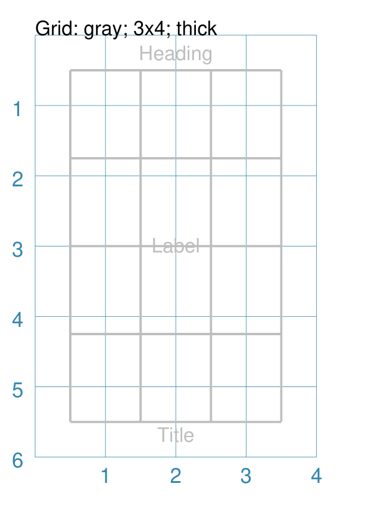

===== ======
|gr3| This example shows the shape constructed using the command with the
      following properties:

      .. code:: python

          Grid(
            x=0.5, y=0.5,
            height=1.25, width=1,
            cols=3, rows=4,
            stroke="gray",
            stroke_width=1,
            heading="Heading",
            label="Label",
            title="Title"
          )

      It has the following properties set for it:

      - *x* and *y* - each set to ``0.5`` cm; offsets the grid's upper-left
        corner from the page margin
      - *height* - value of ``1.25`` cm set for the row height
      - *width* - value of ``1`` cm set for the column width
      - *cols* and *rows* - ``3`` columns wide by ``4`` rows high
      - *stroke_width* - set to ``1`` point; the thicker line makes
        the grid clearly visible
      - *stroke* - set to ``gray`` i.e. a lighter color than the default black
      - *heading*, *label* and *title* - see `Text Descriptions`_ for details

      The grid now has a fixed "rows by columns" size, rather than being
      automatically calculated to fill up the page.

===== ======

.. _gridMargins:

Example 4. Ignore Margins
+++++++++++++++++++++++++
`↑ <grid-command_>`_

.. |gr4| image:: images/customised/grid_ignore_margins.png
   :width: 330

===== ======
|gr4| This example shows the shape constructed using the command with the
      following properties:

      .. code:: python

          Grid(
            x=0, y=0,
            height=1.2, width=1,
            stroke="gray",
            stroke_width=1,
            margin_fit=False,
            label="Grid Label")
          )

      It has the following properties set for it:

      - *x* and *y* - each set to ``0`` cm; grid's upper-left
        corner starts at the page edges (because of *margin_fit*)
      - *height* - value of ``0.9`` cm set for the row height
      - *width* - value of ``1`` cm set for the column width
      - *stroke_width* - set to ``1`` point; the thicker line makes
        the grid clearly visible
      - *stroke* - set to ``gray`` i.e. a lighter color than the default black
      - *label* - see `Text Descriptions`_ for details

      The grid size has being automatically calculated to fill up the page.

      Note the use of *margin_fit* set to ``False``, thereby causing the
      page margins to be ignored when calculating the top left of the
      grid, as well as its height and width.

===== ======

.. _gridEdges:

Example 5. Omit Edges
+++++++++++++++++++++
`↑ <grid-command_>`_

.. |gr5| image:: images/customised/grid_omit_edges.png
   :width: 330

===== ======
|gr5| This example shows the Grid constructed using the command with the
      following properties:

      .. code:: python

        Grid(
          x=0.5, y=0.5,
          rows=3, cols=3,
          side=0.5, stroke_width=0.5,
          omit_left=True)
        Grid(
          x=2.5, y=0.5,
          rows=3, cols=3,
          side=0.5, stroke_width=0.5,
          omit_bottom=True)
        Grid(
          x=1.5, y=2.5,
          rows=3, cols=3,
          side=0.5, stroke_width=0.5,
          omit_outer=True)
        Grid(
          x=0.5, y=4.5,
          rows=3, cols=3,
          side=0.5, stroke_width=0.5,
          omit_top=True)
        Grid(
          x=2.5, y=4.5,
          rows=3, cols=3,
          side=0.5, stroke_width=0.5,
          omit_right=True)

      Each of the grids have the following properties set:

      - *x* and *y* - set the grid's upper-left corner
      - *rows* and *cols* - set the number of "spaces" to drawn in the
        vertical and horizontal directions
      - *side* - value of ``0.5`` cm sets the row height **and** column width
      - *stroke_width* - set to ``0.5`` points; the thicker line makes
        the grid more visible

      In addition, each grid has an *outer_...* property set to ``True``.
      This means that the line on that edge of the grid is not drawn. Setting
      *omit_outer* to ``True`` means **all** edge lines are not drawn.

===== ======

.. _image-command:

Image
~~~~~
`↑ <shape-index_>`_

Pedantically speaking, an image is not like the other shapes in the sense that
it does not consist of lines and areas drawn by **protograf** itself.

An "image" refers to an external file which is simply inserted into the page
at the location.

The Image shape shares a number of common aspects with other shapes |dash| such
as its x & y ("top left") position, a width and a height, the ability to be
rotated, and the addition of text in form of a label, heading or title.

If an image has a transparent area, this will be respected and shapes
drawn previously by the script may then be visible "below" it (see
examples below). An image can also be "drawn over" by other shapes
appearing later on in the script.

The following examples show how an image can be added to, or altered:

- `Example 1. Default Image`_
- `Example 2. Rotation & Scaling`_
- `Example 3. Alignment`_
- `Example 4. Captions and Markings`_
- `Example 5. Sliced Images`_ (extract image "thirds")
- `Example 6: Operations`_ ("cutout" shapes, rounding, and blurred edges)

.. _image-default:

Example 1. Default Image
++++++++++++++++++++++++
`^ <image-command_>`_

.. |im1| image:: images/customised/image_default.png
   :width: 330

===== ======
|im1| If the Image was constructed using only default properties, there will
      be nothing to see and an error will be displayed:

      .. code:: python

          Image()

      Will show this message::

          FEEDBACK:: Unable to load image - no name provided

      This example then shows the shape constructed with just a single property:

      .. code:: python

        Image("sholes_typewriter.png")

      This first, unnamed property is the filename of the image.

      If no directory is supplied for the image, it is assumed to be
      in the same directory as that of the script.

      The image has the following other properties based on the defaults:

      - upper-left corner - x-position ``1`` cm and y-position ``1`` cm
      - *width* and *height* - default to ``1`` cm each

      .. HINT::

          The size set for the image may distort it if the ratios do not
          match those of the image itself.

===== ======

.. _image-rotation:

Example 2. Rotation & Scaling
+++++++++++++++++++++++++++++
`^ <image-command_>`_

.. NOTE::

   :doc:`protograf <index>` does not currently do image scaling in the
   sense of altering the image dimensions of the actual image file.
   Instead, by setting its ``height`` and ``width`` properties, the image
   can appear in the output at the size required.

   Bear in mind that larger images will increase the size of the output
   PDF file accordingly, regardless of how small they appear on a page.

.. |im2| image:: images/customised/images_normal_rotation.png
   :width: 330

===== ======
|im2| This example shows the Image constructed using the command with the
      following properties:

      .. code:: python

        Image(
          "sholes_typewriter.png",
          x=0, y=1,
          width=2.0, height=2.0,
          title="PNG")
        Image(
          "sholes_typewriter.png",
          x=2, y=1,
          width=1.5, height=1.5,
          title="60\u00B0",
          rotation=60)
        Image(
          "noun-typewriter-3933515.svg",
          x=0, y=4,
          width=2.0, height=2.0,
          title="SVG")
        Image(
          "noun-typewriter-3933515.svg",
          x=2, y=4,
          width=1.5, height=1.5,
          title="45\u00B0",
          rotation=45)

      Each image has the following properties set for it:

      - name of the image file; this must be the first property set
      - *x* and *y* - these values set the upper-left corner

      Each set of images has different sizes to simulate image scaling.

      The two left-hand images have:

      - *height* - set to ``2.0`` cm; this value may cause some distortion
      - *width* - set to ``2.0`` cm; this value may cause some distortion

      The two right-hand images have:

      - *height* - set to ``1.5`` cm; this value may cause some distortion
      - *width* - set to ``1.5`` cm; this value may cause some distortion

      The two right-hand images are rotated about a centre point:

      - *rotation* - degrees, anti-clockwise, about the centre

      The image centre is calculated based on it's height and width.

===== ======

.. _image-align:

Example 3. Alignment
++++++++++++++++++++
`^ <image-command_>`_

Image alignment is somewhat similar to alignment of Text.

Instead of the shape's ``x`` and ``y`` values defining the top-left position,
the use of either, or both, *align_horizontal* or *align_vertical* can cause
the shape to be located in a different relative position.

The *align_horizontal* property can take on values of ``"left"``, ``"centre"``
or ``"right"``; the *align_vertical* property can take on values of ``"top"``,
``"middle"`` or ``"bottom"``. These are illustrated in the exampe below.

.. |ia1| image:: images/customised/image_align.png
   :width: 330

===== ======
|ia1| This example shows the Image constructed using the command with the
      properties shown.

      Note the use of the :ref:`Common command <the-common-command>`
      to allow multiple Images to share the same properties.

      .. code:: python

        rdot = Common(fill_stroke="red", radius=0.05)
        image_file = "fantasy-forest-with-old-bridges.png"
        Image(image_file,
              width=1, height=1,
              x=0.5, y=0.5,
              title="no align")
        Circle(common=rdot, cx=0.5, cy=0.5)
        Image(image_file,
              width=1, height=1,
              cx=3, cy=1,
              title="centre x,y")
        Image(image_file,
              width=1, height=1,
              x=2, y=4,
              align_horizontal="right",
              align_vertical="bottom",
              title="bottom-right")
        Circle(common=rdot, cx=2, cy=4)
        Image(image_file,
              width=1, height=1,
              x=2, y=2,
              align_horizontal="left",
              align_vertical="top",
              title="top-left")
        Circle(common=rdot, cx=2, cy=2)
        Image(image_file,
              width=1, height=1,
              x=0, y=5,
              align_horizontal="left",
              align_vertical="mid",
              title="mid-left")
        Circle(common=rdot, cx=0, cy=5)
        Image(image_file,
              width=1, height=1,
              x=3, y=5,
              align_horizontal="centre",
              align_vertical="mid",
              title="mid-centre")
        Circle(common=rdot, cx=3, cy=5)

      The top-left image is set using defaults i.e. no alignment.

      The top right-hand image position is set using a centre point; for such
      a setting, no alignment can be used.

      The other images have a small red dot superimposed on them, set to the
      same value as the *x* and *y* used to position the shape; this helps
      show how the image is drawn relative to that position.

===== ======

.. _image-caption:

Example 4. Captions and Markings
++++++++++++++++++++++++++++++++
`^ <image-command_>`_

===== ======
|im3| This example shows shapes constructed using their command with the
      following properties:

      .. code:: python

        Text(common=txt, text="Image: label, heading, title")
        Rectangle(
            width=2.26, height=2, x=1, y=0.5,
            dotted=True, fill="silver")
        Image("sholes_typewriter.png",
              width=2.26, height=2, x=1, y=0.5,
              label="Label", label_stroke='red',
              cross=True)
        Rectangle(
            width=2.26, height=2, x=1, y=3.5,
            dotted=True, fill="silver")
        Image("sholes_typewriter.png",
              width=2.26, height=2, x=1, y=3.5,
              heading="Heading",
              title="Title",
              dot=0.1, dot_stroke='red')

      In this example, a grey-filled rectangle, with dotted border, is
      drawn just prior to the image.

      The same image is used in two places here to demonstrate the following:

      - how a "background" or "lower level" shape is visible through the
        transparency of a PNG image;
      - where the label, heading and title for an image will appear;
      - where the cross for an image will appear;
      - where the dot for an image will appear.

===== ======

.. _image-sliced:

Example 5. Sliced Images
++++++++++++++++++++++++
`^ <image-command_>`_

.. |im4| image:: images/customised/image_sliced.png
   :width: 330

===== ======
|im4| This example shows the Image constructed using the command with the
      following properties:

      .. code:: python

        Image("sholes_typewriter.png", sliced='l',
              width=1, height=3, x=0, y=0)
        Image("sholes_typewriter.png", sliced='c',
              width=1, height=3, x=1.5, y=0)
        Image("sholes_typewriter.png", sliced='r',
              width=1, height=3, x=3, y=0)

        Image("sholes_typewriter.png", sliced='t',
              width=3, height=1, x=0.5, y=3)
        Image("sholes_typewriter.png", sliced='m',
              width=3, height=1, x=0.5, y=4)
        Image("sholes_typewriter.png", sliced='b',
              width=3, height=1, x=0.5, y=5)

      Here the *sliced* property is used to "slice" off portions of the
      image. In the upper example:

      - *l* - the left fraction, matching the image's width:height ratio
      - *c* - the centre fraction, matching the image's width:height ratio
      - *r* - the right fraction, matching the image's width:height ratio

      In the lower example:

      - *t* - the top fraction, matching the image's height:width ratio
      - *m* - the middle fraction, matching the image's height:width ratio
      - *b* - the botttom fraction, matching the image's height:width ratio

===== ======

.. _image-operations:

Example 6: Operations
+++++++++++++++++++++
`^ <image-command_>`_

It is possible change the way an Image appears by either creating a "cut-out"
from it, or by blurring the edges.  These changes are termed *operations*.

Each operation is specified by its name, followed by one or more settings,
in list format (i.e. inside ``[...]`` brackets). Be aware that values used
for these operations are pixel-based values and do not correspond to the
units used elsewhere in **protograf**.

The cut-out operations are:

- *circle* (or ``c``): cut-out a circle; this must be followed by the radius,
  in pixels, of the circle
- *ellipse* (or ``e``): cut-out an ellipse; this must be followed by the width
  and height |dash| inside ``(...)`` brackets |dash| in pixels, of the ellipse
- *polygon* (or ``p``): cut-out a regular polygon; this must be followed by
  the radius, in pixels, of the polygon; and an optional number for the number
  of sides of the polygon |dash| the default is 6 (a hexagon)
- *rounding* (or ``r``): cut-out a rounded portion of each corner of the image;
  this must be followed by the radius, in pixels, of the cutout size

By default, the cutout center matches the center of the image; but it is
possible to shift the center by adding two values for the x- and y-shift,
in pixels, respectively.  This shift does **not** apply to *rounding*.

The blur operation is:

- *blur* (or ``b``): blur the edges; this must be followed by the radius,
  in pixels, of the size of the blur

.. |im5| image:: images/customised/image_operations.png
   :width: 330

===== ======
|im5| This example shows the Image constructed using the command with the
      following properties:

      .. code:: python

        Image("fantasy-forest-with-old-bridges.png",
              width=2, height=2,
              x=0, y=0)
        Image("fantasy-forest-with-old-bridges.png",
              width=1.5, height=1.5,
              x=2, y=0,
              operation=['circle', 100, 75, -75]
        )
        Image("fantasy-forest-with-old-bridges.png",
              width=1.5, height=1.5,
              x=2.5, y=0.5,
              operation=['circle', 100, -75, 75]
        )
        Image("fantasy-forest-with-old-bridges.png",
              width=2, height=2,
              x=0, y=2,
              operation=['rounding', 50]
        )
        Image("fantasy-forest-with-old-bridges.png",
              width=2, height=2,
              x=2, y=2,
              operation=['ellipse', (160, 240)]
        )
        Image("fantasy-forest-with-old-bridges.png",
              width=2, height=2,
              x=0, y=4,
              operation=['polygon', 140, 5]
        )
        Image("fantasy-forest-with-old-bridges.png",
              width=2, height=2,
              x=2, y=4,
              operation=['blur', 20]
        )

      The top-left image is the original, while the others show the result
      of an operation.

      Note that the two *circle* operations use offset values to move the
      centre of where the cutout happens.

===== ======

.. _hexagons-command:

Hexagons
~~~~~~~~
`↑ <shape-index_>`_

Hexagons are often drawn in a "honeycomb" arrangement to form a grid. For games
this is often used to delineate the spaces in which playing pieces can be placed
and their movement regulated.

.. NOTE::

   Very detailed information about using hexagons in grids can be found in the
   section on :doc:`Hexagonal Grids <hexagonal_grids>`.

Example 1. Hexagons Defaults
++++++++++++++++++++++++++++

.. |hex| image:: images/defaults/hexagons-2x2.png
   :width: 330

===== ======
|hex| This example shows the shape constructed using the command with two
      basic properties; the number of rows and columns in the grid:

      .. code:: python

          Hexagons(rows=3, cols=3)

      It has the following properties based on the defaults:

      - upper-left "corner" at x-position ``1`` cm and at y-position ``1`` cm
      - flat-to-flat hexagon *height* of ``1`` cm
      - "flat" top hexagons
      - size of ``3`` *rows* by ``3`` *cols* ("columns")
      - the "even" columns are offset by one-half hexagon height "downwards"
===== ======

.. _lines-command:

Lines
~~~~~~
`↑ <shape-index_>`_

Lines are simply a series of parallel lines drawn over repeating rows - for
horizontal lines - or columns - for vertical lines.

Example 1. Lines Defaults
+++++++++++++++++++++++++

.. |ls0| image:: images/defaults/lines.png
   :width: 330

===== ======
|ls0| This example shows the shape constructed using the command with only
      defaults:

      .. code:: python

          Lines()

      It has the following properties based on the defaults:

      - starts at x-position ``1`` cm and at y-position ``1`` cm
      - heading/default direction is 0 |deg| (anti-clockwise from 0 |deg| "east")
      - has a default number of lines of ``1``
      - line length of ``1`` cm
===== ======

Example 2. Customised Lines
+++++++++++++++++++++++++++

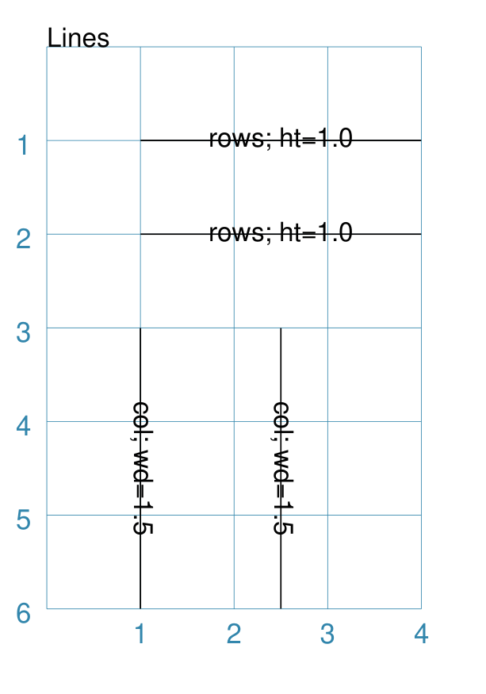

===== ======
|ls1| This example shows the shapes constructed using the command with the
      following properties:

      .. code:: python

        Lines(
            x=1, y=1, x1=4, y1=1,
            rows=2, height=1,
            label_size=8, label="rows; ht=1.0")
        Lines(
            x=1, y=3, x1=1, y1=6,
            cols=2, width=1.5,
            label_size=8, label="col; wd=1.5")

      The first command has the following properties:

      - *x* and *y* - both set at ``1`` cm for the left starting point
      - *x1* and *y1* - set ``4`` cm and ``1`` cm for the right end point
      - *rows* - set to ``2`` to create two parallel horizontal lines
      - *height* - value of ``1`` cm set for the row height; this is the
        separation between each line

      The second command has the following properties:

      - *x* and *y* - set to ``1`` cm and ``3`` cm  for the left starting point
      - *x1* and *y1* - set ``1`` cm and ``6`` cm for the right end point
      - *cols* - set to ``2`` to create two parallel vertical lines
      - *width* - value of ``1.5`` cm set for the column width; this sets the
        separation between each line

      Note that the *label* that has been set applies to **every** line that is
      drawn.

===== ======

.. _rectangles-command:

Rectangles
~~~~~~~~~~
`↑ <shape-index_>`_

Rectangles can be drawn in a row-by-column layout to form a grid. For games
this is often used to delineate a track or other spaces in which playing pieces
can be placed.

Example 1. Rectangles: Columns and Rows
+++++++++++++++++++++++++++++++++++++++

===== ======
|rc0| This example shows the shape constructed using the command with these
      properties:

      .. code:: python

          Rectangles(
              rows=3, cols=2,
              stroke_width=1)

      It has the following properties:

      - top-left corner at defaults of x-position ``0`` cm and
        y-position ``0`` cm
      - *height* and *width* of default ``1`` cm each
      - *stroke_width* of ``1``

      There are 3 rows |dash| the y-direction |dash| and 2 columns
      |dash| the x-direction.

===== ======

Example 2. Customised Rectangles
++++++++++++++++++++++++++++++++

.. |rn1| image:: images/customised/rectangles_custom.png
   :width: 330

===== ======
|rn1| This example shows the Rectangles constructed using the command with
      these properties:

      .. code:: python

          Rectangles(
             cols=2, rows=4,
             width=1.5, height=1.25,
             fill="chartreuse",
             dotted=True)

      It has the following properties based on the defaults:

      - starts at x-position ``0`` cm and y-position ``0`` cm
      - *width* - ``1.5`` cm set for each Rectangle's width
      - *height* - ``1.25`` cm set for each Rectangle's height
      - *fill* color of ``chartreuse``
      - *dotted* border lines for each Rectangle

===== ======

.. _table-command:

Table
~~~~~~~~~~
`↑ <shape-index_>`_

Tables are an arrangement of rectangles in a row-by-column layout.

Either the rows and columns are split evenly across the Table's
height and width, or the values of each row and column can be set via
lists of values.

Example 1. Table: Basic
+++++++++++++++++++++++

===== ======
|tb0| This example shows the Table constructed using the command with these
      properties:

      .. code:: python

        Table(cols=2, rows=2)

        Table(y=2.5,
              width=3, height=2,
              cols=3, rows=4)

      The first Table has the following properties:

      - top-left corner at defaults of x-position ``1`` cm and
        y-position ``1`` cm
      - *height* and *width* of default ``1`` cm each

      There are 2 rows |dash| in the y-direction |dash| and 2 columns in
      |dash| the x-direction.  This is the minimum allowed.

      The second Table has the following properties:

      - top-left corner at x-position ``1`` cm and
        y-position ``2.5`` cm
      - *height* and *width* of ``3`` cm and ``2`` cm respectively

      There are 4 rows |dash| in the y-direction |dash| and 3 columns in
      |dash| the x-direction. Each row is equal in size as is each column.

===== ======

Example 2. Customised Table
+++++++++++++++++++++++++++

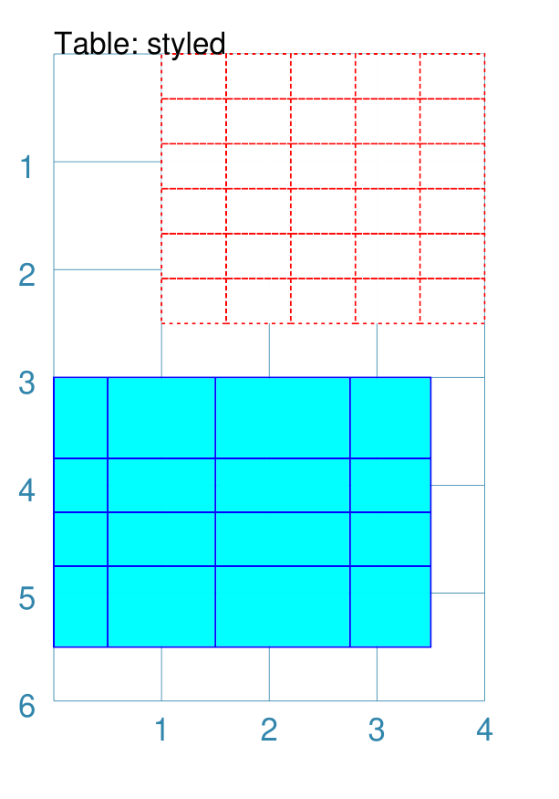

===== ======
|tb1| This example shows the Table constructed using the command with
      these properties:

      .. code:: python

        Table(y=0,
              width=3, height=2.5,
              cols=5, rows=6,
              stroke="red", dotted=True)
        Table(y=3, x=0,
              cols=[0.5, 1, 1.25, 0.75],
              rows=[0.75, 0.5, 0.5, 0.75],
              stroke="blue", fill="aqua")

      The first Table has the following properties:

      - starts at x-position ``1`` cm and y-position ``0`` cm
      - *height* and *width* of ``2.5`` cm and ``3`` cm respectively
      - *stroke* color of ``red``
      - *dotted* border lines for each Rectangle

      The second Table has the following properties:

      - starts at x-position ``1`` cm and y-position ``3`` cm
      - *cols* is a list of column widths
      - *rows* is a list of row heights
      - *stroke* color of ``blue``
      - *fill* color of ``aqua``

===== ======

.. _shapes-common-properties:

Shapes Common Properties
------------------------
`↑ <table-of-contents-core_>`_

The following are properties common to many shapes that can be set to create
the desired output:

- `x and y`_
- `cx and cy`_
- `Centre Shape`_
- `Centre Shapes`_
- `Dot and Cross`_
- `Fill and Stroke`_
- `Rotation`_
- `Radii Shapes`_
- `Perbii Shapes`_
- `Text Descriptions`_
- `Transparency`_
- `Vertex Shapes`_
- `Wave Styles`_

.. NOTE::

  The term "common" in this section is referring to the concept that many
  shapes are properrties with the same names and similar behaviour.  This
  makes it a bit easier to use and remember them.  In **protograf** the
  :ref:`Common command <the-common-command>` has the specific meaning of
  setting the same property value(s) to be used in multiple shapes in the
  same script |dash| as seen in various of the examples here.

.. _coreShapeXY:

x and y
~~~~~~~
`^ <shapes-common-properties_>`_

Almost every shape will need to have its :ref:`position <position-concept>` set.
"Position" here usually refers to a point corresponding to the top-left of that
shape.

The common way to do this is by setting a value for **x** |dash| the distance
from the left margin of the page (or card) to the left edge of the shape;
and/or **y** |dash| the distance from the top margin of the page (or card)
to the top edge of the shape.

.. NOTE::

    Its more appropriate to think of this position as that of the "bounding
    box" of the shape i.e. imagine a rectangle drawn such that the shape
    just fits inside it; the "position" is the point corresponding to the
    top-left of that imaginary Rectangle.

.. _coreShapeCxCy:

cx and cy
~~~~~~~~~
`^ <shapes-common-properties_>`_

Almost every shape will need to have its :ref:`position <position-concept>` set.
"Position" here refers to a point corresponding to the centre of that shape.

For shapes that support it, the way to do this is by setting a value for **cx**
|dash| the distance from the left margin of the page (or card) to the centre
position of the shape and/or **cy** |dash| the distance from the bottom margin
of the page (or card) to the centre position of the shape.

.. _coreShapeFillStroke:

Fill and Stroke
~~~~~~~~~~~~~~~
`^ <shapes-common-properties_>`_

Almost every single shape will have a *stroke*, corresponding to the color of
the line used to draw it, and a *stroke_width* which is the thickness in
points (72 points per inch); the default line color is *black*.

All `Enclosed Shapes`_ will have a *fill* corresponding to the color used for
the area inside it; the default fill color is *white*.

A "shortcut" to setting both fill and stroke to be the same for a shape,
is to use the property *fill_stroke* (see Example 2 below).

If the fill is set to the :ref:`keyword <reserved-names-concept>` ``None``
(note the uppercase "N"), the area will have no fill color, and effectively
becomes transparent.

If the stroke is set to the :ref:`keyword <reserved-names-concept>` ``None``
(note the uppercase "N"), the line will have no color, and effectively
becomes transparent.

Example 1. Fill & Stroke
++++++++++++++++++++++++
`↑ <coreShapeFillStroke_>`_

.. |fsb| image:: images/defaults/fill-stroke.png
   :width: 330

===== ======
|fsb| This example shows a shape constructed using the command:

      .. code:: python

          Rectangle(
              fill="yellow", stroke="red",
              stroke_width=6)

      The shape has the following properties that differ from the defaults:

      - *fill* color of ``yellow`` for the interior of the shape
      - *stroke* color of ``red`` for the border of the shape
      - *stroke_width* - set to ``6`` points (about 2mm or 0.2cm)

      It can be seen that very thick lines "straddle" a centre line running
      through the defined location.

      In this case the Rectangle is both larger in outer dimensions than the
      expected 1x1 cm and smaller in inner dimensions than the expected 1x1 cm
      due to the thickness of the lines used to construct it.

===== ======

Example 2. Fill_Stroke
++++++++++++++++++++++
`↑ <coreShapeFillStroke_>`_

The *fill_stroke* property is a "shortcut" which sets **both** the
*fill* and *stroke* color at same time.

.. |fst| image:: images/defaults/fill-and-stroke.png
   :width: 330

===== ======
|fst| This example shows a shape constructed using the command:

      .. code:: python

          Circle(fill_stroke="cyan")

      The shape has the following property that differ from the defaults:

      - *fill_stroke* color of ``cyan``

      Here, the line color used to draw the circumference is the same as
      the fill color of the interior.

===== ======

.. _coreShapeDotCross:

Dot and Cross
~~~~~~~~~~~~~
`^ <shapes-common-properties_>`_

For shapes that have a definable centre e.g. a `Circle`_, a `Square`_
or a `Hexagon`_, it is possible to place a dot, a cross, or both at this
location.

The color for the dot and cross will, if not provided, take on the stroke
color of the shape of which they are part |dash| see the `Stadium` example
below.

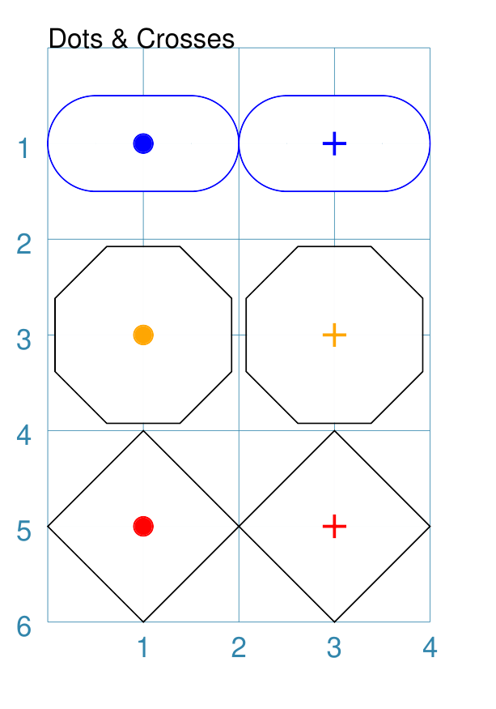

===== ======
|dnc| This example shows various shapes constructed using the following
      commands:

      .. code:: python

        Stadium(
            cx=1, cy=1, side=0.66,
            stroke="blue",
            dot=0.1)
        Stadium(
            cx=3, cy=1, side=0.66,
            stroke="blue",
            cross=0.25,
            cross_stroke_width=1)

        Polygon(
            cx=1, cy=3, sides=8,
            radius=1,
            dot=0.1,
            dot_stroke="orange")
        Polygon(
            cx=3, cy=3, sides=8, diameter=2,
            cross=0.25,
            cross_stroke="orange",
            cross_stroke_width=1)

        Rhombus(
            cx=1, cy=5, side=1.25,
            dot=0.1,
            dot_stroke="red")
        Rhombus(
            cx=3, cy=5, side=1.25,
            cross=0.25,
            cross_stroke="red",
            cross_stroke_width=1)

      The shapes have their properties set as follows:

      - *cx* and *cy* set the centre point of the shape
      - *dot* - sets the size of dot at the centre
      - *dot_stroke*  - sets the color (and fill) of the dot; defaults to match the
        *stroke* of the shape that it is part of
      - *cross* - sets the length of each of the two lines that cross at the
        centre
      - *cross_stroke*  - sets the color of the cross lines; defaults to the
        stroke of the shape that it is part of
      - *cross_stroke_width* - sets the thickness of the cross lines
===== ======

.. _coreShapeRotation:

Rotation
~~~~~~~~
`^ <shapes-common-properties_>`_

Every shape, whose *centre* can be calculated, will support a *rotation*
property. Rotation takes place in anti-clockwise direction, from the horizontal,
around the centre of the shape, in *degrees*.

Example 1. Rhombus Rotation
+++++++++++++++++++++++++++
`↑ <coreShapeRotation_>`_

.. |rt1| image:: images/customised/rhombus_red_rotation.png
   :width: 330

===== ======
|rt1| This example shows the shape constructed using these commands:

      .. code:: python

        Rhombus(
            cx=2, cy=3,
            width=1.5,
            height=2*equilateral_height(1.5),
            fill=None, stroke="black",
            dot=0.06)
        Rhombus(
            cx=2, cy=3,
            width=1.5,
            height=2*equilateral_height(1.5),
            fill=None, stroke="red",
            dot=0.03,
            rotation=60)

      The shape with the *black* outline and large dot in the centre is the
      "normal" Rhombus.

      The shape with the *red* outline and smaller, red dot in the centre is
      the rotated Rhombus. It has these properties:

      - *fill* color - `None` so no fill is used; this makes it completely
        transparent.
      - *rotation* - ``60`` is the number of degrees, anti-clockwise, that
        it has been rotated

      The shapes are completely transparent, so its possible to see
      how the second is drawn relative to the first.
===== ======

Example 2. Polygon Rotation
+++++++++++++++++++++++++++
`↑ <coreShapeRotation_>`_

.. |rt2| image:: images/customised/polygon_rotation_flat.png
   :width: 330

===== ======
|rt2| This example shows five Polygons constructed using the command with
      additional properties.

      Note the use of the :ref:`Common command <the-common-command>`
      to allow multiple Polygons to share the same properties.

      .. code:: python

        poly6 = Common(
          fill=None,
          sides=6,
          diameter=1,
          stroke_width=1)

        Polygon(common=poly6,
                y=1, x=1.0, label="0")
        Polygon(common=poly6,
                y=2, x=1.5, rotation=15,
                label="15")
        Polygon(common=poly6,
                y=3, x=2.0, rotation=30,
                label="30")
        Polygon(common=poly6,
                y=4, x=2.5, rotation=45,
                label="45")
        Polygon(common=poly6,
                y=5, x=3.0, rotation=60,
                label="60")

      The examples have the following properties:

      - *centre* - using `cx` and `cy` values
      - *radius* - ``1`` cm in each case
      - *sides* - the default of 6 in each case ("hexagon" shape)
      - *rotation* - varies from 0 |deg| to 60 |deg| (anti-clockwise from the
        horizontal)

===== ======

Example 3. Shapes Rotation
++++++++++++++++++++++++++
`↑ <coreShapeRotation_>`_

.. |rt3| image:: images/customised/shape_rotation.png
   :width: 330

===== ======
|rt3| This example shows different shapes constructed using commands with
      some :ref:`Common <the-common-command>` properties:

      .. code:: python

        props = Common(
            stroke="black",
            cross=0.5, cross_stroke="red",
            cross_stroke_width=1,
            rotation=45, label_size=6)

        Star(
            x=1, y=1, vertices=5, radius=0.75,
            common=props, label="star")
        Ellipse(
            cx=3, cy=1, height=1, width=1.5,
            common=props, label="ellipse")
        Polygon(
            cx=1, cy=3, sides=6, side=0.75,
            common=props, label="polygon")
        Stadium(
            cx=3, cy=3, side=0.6,
            common=props, label="stadium")
        Rectangle(
            cx=1, cy=5, height=1, width=1.5,
            common=props, label="rectangle")
        Rhombus(
            cx=3, cy=5, side=1.25,
            common=props, label="rhombus")

      The shapes share common properties for the cross at the centre,
      with a rotation of 45 |deg| each.

===== ======

Example 4. Rotation with Hatches
++++++++++++++++++++++++++++++++
`↑ <coreShapeRotation_>`_

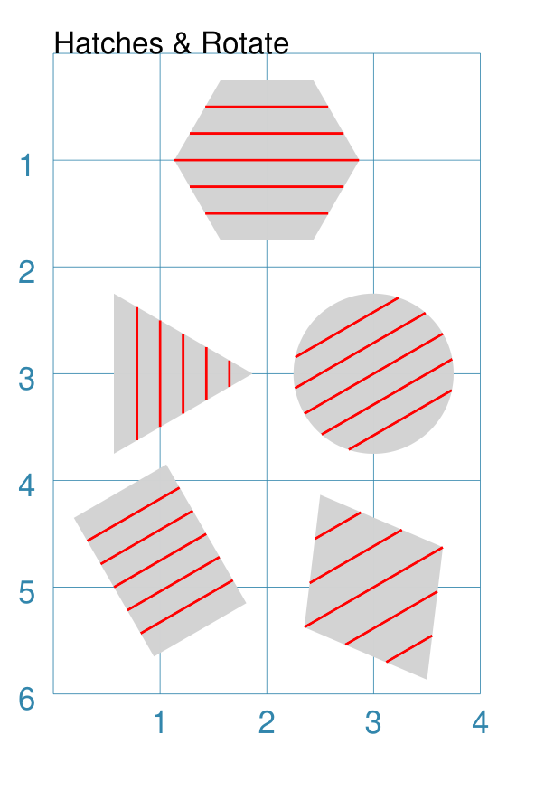

===== ======
|rt4| This example shows different shapes constructed using commands with
      some ``Common`` properties for the ``hatches`` effect:

      .. code:: python

        htch = Common(
            fill='lightgray', stroke=None,
            hatches_count=5,
            hatches='w',
            hatches_stroke="red",
            hatches_stroke_width=0.75,
            rotation=30)

        Hexagon(
            common=htch,
            cx=2, cy=1, height=1.5,
        )
        Triangle(
            common=htch,
            cx=1, cy=3, side=1.5,
        )
        Circle(
           common=htch,
           cx=3, cy=3, radius=0.75,
        )
        Rectangle(
            common=htch,
            x=0.5, y=4, height=1.5, width=1,
        )
        Rhombus(
           common=htch,
           cx=3, cy=5, height=2, width=1.5,
        )

      The shapes share common properties for the number, direction and style
      of hatches, with a rotation of 30 |deg| each.

===== ======

.. _coreRadiiShapes:

Radii Shapes
~~~~~~~~~~~~
`^ <shapes-common-properties_>`_

A number of shapes, that are formed by drawing lines between a set of
vertices ("corner points"), can be styled by placing other shapes which
can be located relative to those vertices.

Radii shapes are constructed using the following properties:

- *radii_shapes* - this a list (values in ``[...]``) of value sets that
  determine the "where and what" should be drawn along the line of
  specific radius.  Each set, enclosed in brackets ``(...)`` can consist
  of three comma-separated parts:

  - the first is the **direction**, or directions, of the relevant radii;
    this can be a string e.g. ``"n e"`` or a list e.g. ``["n", "e"]``.
    Note that for a ``Circle`` the direction is the number of degrees
    (anti-clockwise from 0 |deg| in the east direction) whereas for
    other shapes it will be a :ref:`compass direction <termsDirection>`.
  - the second is the **shape** to be drawn
  - the optional third part is the **fractional distance** along the line
    at which the shape should be drawn; by default this is ``1`` i.e. the
    length of the radial line |dash| if it is less than ``1`` the radii
    shape will be drawn inside of the parent shape; and if it is more than
    ``1`` the radii shape will be drawn outside of, or away from, the parent
    shape
- *radii_shapes_rotated* - an optional property which, if ``True``, will
  rotate the vertex shapes such they "point" away from the centre of the
  parent shape

Radii shapes can be constructed for:

- :ref:`Circle <circle-command>`
- :ref:`Hexagon <hexagon-command>`
- :ref:`Rectangle <rectangle-command>`
- :ref:`Rhombus <rhombus-command>`
- :ref:`Triangle <triangle-command>`

Example 1. Radii Shapes
++++++++++++++++++++++++

.. |vr1| image:: images/customised/radii_shapes.png
   :width: 330

===== ======
|vr1| This example shows radii shapes constructed as follows:

      .. code:: python

        ccom = Common(radius=0.15, fill="gold", label_size=6)

        Hexagon(
            cx=1, cy=1,
            radius=0.8,
            orientation="pointy",
            radii_shapes=[
                ('n', circle(common=ccom, label="n")),
                ('se', circle(common=ccom, label="se"), 1.25),
                ('sw', circle(common=ccom, label="sw"), 0.5 ),
            ],
            radii_shapes_rotated=True,
        )
        Hexagon(
            cx=3, cy=1,
            radius=0.8,
            radii_shapes=[
               ('ne', circle(common=ccom, label="ne")),
               ('se', circle(common=ccom, label="se"), 1.25),
               ('sw', circle(common=ccom, label="sw"), 0.5),
            ],
            radii_shapes_rotated=True,
        )
        Rectangle(
            cx=1, cy=3,
            height=1, width=1.5,
            radii_shapes=[
                ('ne', circle(common=ccom, label="ne")),
                ('se', circle(common=ccom, label="se")),
                ('sw', circle(common=ccom, label="sw")),
                ('nw', circle(common=ccom, label="nw")),
            ],
            radii_shapes_rotated=True,
        )
        Rhombus(
            cx=3, cy=3,
            width=1, height=1.5,
            radii_shapes=[
                ('n', circle(common=ccom, label="n")),
                ('s', circle(common=ccom, label="s")),
                ('e', circle(common=ccom, label="e")),
                ('w', circle(common=ccom, label="w")),
            ],
            radii_shapes_rotated=True,
        )
        Triangle(
            cx=1, cy=5,
            side=1.25,
            radii_shapes=[
                ('n', circle(common=ccom, label="n")),
                ('se', circle(common=ccom, label="se")),
                ('sw', circle(common=ccom, label="sw")),
            ],
            radii_shapes_rotated=True,
        )
        Circle(
            cx=3, cy=5,
            radius=0.75,
            radii_shapes=[
                ('30 90 150 210 270 330',
                  circle(common=ccom, label="A")),
            ],
            radii_shapes_rotated=True,
        )

      All of these examples use a common settings in ``ccom`` to draw
      the vertex shape |dash| a circle; but the *label* property is set
      as a visual indicator.

      Note that in some cases, setting the *fractional_distance* (the
      third value in the set) causes the radii shape to be moved
      closer to, or further away from, the centre.

      The use of ``radii_shapes_rotated=True`` will means all of these
      examples have the radii shapes rotated to face "away" from the
      parent shape's centre.

      .. HINT::

          Although not shown above, multiple entries can be made for a given
          direction; for example, to draw a circle and a dot along the ``ne``
          radius for a rectangle |dash| in the case below the ``Dot()`` will
          be drawn halfway between the rectangle's centre and it's north-east
          corner:

          .. code:: python

            Rectangle(
                cx=1, cy=3,
                height=1, width=1.5,
                radii_shapes=[
                    ('ne', circle(common=ccom, label="ne")),
                    ('ne', dot(), 0.5),
                ],
                radii_shapes_rotated=True,
            )

===== ======

.. _corePerbiiShapes:

Perbii Shapes
~~~~~~~~~~~~~
`^ <shapes-common-properties_>`_

A number of shapes, that are formed by drawing lines between a set of
vertices ("corner points"), can be styled by placing other shapes which
can be located relative to the centre point of lines joining those
vertices.

Perbii shapes are constructed using the following properties:

- *perbii_shapes* - this a list (values in ``[...]``) of value sets that
  determine the "where and what" should be drawn along the line of
  specific perbis.  Each set, enclosed in brackets ``(...)`` can consist
  of three comma-separated parts:

  - the first is the **direction**, or directions, of the relevant perbii;
    this can be a string e.g. ``"n e"`` or a list e.g. ``["n", "e"]``.
    Note that this will be a :ref:`compass direction <termsDirection>`.
  - the second is the **shape** to be drawn
  - the optional third part is the **fractional distance** along the line
    at which the shape should be drawn; by default this is ``1`` i.e. the
    length of the perbis line |dash| if it is less than ``1`` the perbii
    shape will be drawn inside of the parent shape; and if it is more than
    ``1`` the perbii shape will be drawn outside of, or away from, the parent
    shape
- *perbii_shapes_rotated* - an optional property which, if ``True``, will
  rotate the vertex shapes such they "point" away from the centre of the
  parent shape

Perbii shapes can be constructed for:

- :ref:`Hexagon <hexagon-command>`
- :ref:`Rectangle <rectangle-command>`
- :ref:`Rhombus <rhombus-command>`
- :ref:`Triangle <triangle-command>`

.. NOTE::

    Actually, because a Rhombus can have an "elongated" shape, it is not
    really possible to have true perbis lines for this shape.  What is drawn
    are lines from the midpoints of each side to the centre. This in turn
    means that rotated shapes can seem to have an "awkward" angle |dash| use
    with care. The same is true for any non-equilateral Triangle.

Example 1. Perbii Shapes
++++++++++++++++++++++++

.. |vr2| image:: images/customised/perbii_shapes.png
   :width: 330

===== ======
|vr2| This example shows perbii shapes constructed as follows:

      .. code:: python

        ccom = Common(radius=0.15, fill="gold", label_size=6)

        Hexagon(
            cx=1, cy=1,
            radius=0.8,
            orientation="pointy",
            perbii_shapes=[
                ('ne', circle(common=ccom, label="ne")),
                ('se', circle(common=ccom, label="se"), 1.25),
                ('w', circle(common=ccom, label="w"), 0.5 ),
            ],
            perbii_shapes_rotated=True,
        )
        Hexagon(
            cx=3, cy=1,
            radius=0.8,
            perbii_shapes=[
               ('n', circle(common=ccom, label="n")),
               ('se', circle(common=ccom, label="se"), 1.25),
               ('sw', circle(common=ccom, label="sw"), 0.5),
            ],
            perbii_shapes_rotated=True,
        )
        Rectangle(
            cx=1, cy=3,
            height=1, width=1.5,
            perbii_shapes=[
                ('n', circle(common=ccom, label="n")),
                ('s', circle(common=ccom, label="s.")),
                ('w', circle(common=ccom, label="w")),
                ('e', circle(common=ccom, label="e")),
            ],
            perbii_shapes_rotated=True,
        )
        Rhombus(
            cx=3, cy=3,
            width=1, height=1.5,
            perbii="ne se nw sw",
            perbii_shapes=[
                ('ne', circle(common=ccom, label="ne")),
                ('se', circle(common=ccom, label="se")),
                ('nw', circle(common=ccom, label="nw")),
                ('sw', circle(common=ccom, label="sw")),
            ],
            perbii_shapes_rotated=True,
        )
        Triangle(
            cx=1, cy=5,
            side=1.25,
            perbii_shapes=[
                ('ne', circle(common=ccom, label="ne")),
                ('s', circle(common=ccom, label="s.")),
                ('nw', circle(common=ccom, label="nw")),
            ],
            perbii_shapes_rotated=True,
        )

      All of these examples use a common settings in ``ccom`` to draw
      the vertex shape |dash| a circle; and the *label* property is set
      as a visual indicator.

      Note that in some cases, setting the *fractional_distance* (the
      third value in the set) causes the perbii shape to be moved
      closer to, or further away from, the centre.

      The use of ``perbii_shapes_rotated=True`` will means all of these
      examples have the perbii shapes rotated to face "away" from the
      parent shape's centre.

      As per the note above, the *perbii_shapes* for the Rhombus are
      aligned in the direction of the *perbii* lines and **not** with
      the shape's edges.

      .. HINT::

          Although not shown above, multiple entries can be made for a given
          direction; for example, to draw a circle and a dot along the ``n``
          perbis for a rectangle |dash| in the case below the ``Dot()`` will
          be drawn halfway between the rectangle's centre and it's north edge:

          .. code:: python

            Rectangle(
                cx=1, cy=3,
                height=1, width=1.5,
                perbii_shapes=[
                    ('n', circle(common=ccom, label="n")),
                    ('n', dot(), 0.5),
                ],
                perbii_shapes_rotated=True,
            )

===== ======

.. _coreShapeText:

Text Descriptions
~~~~~~~~~~~~~~~~~
`^ <shapes-common-properties_>`_

Being able to associate a description, or identifier, with a shape can be
useful.

There are three kinds of text that can be added to a shape, without having to
specify their location or other details.

.. NOTE::

   Obviously, a `Text`_ shape can also be placed anywhere, including being
   superimposed on another shape, in order to handle more complex text needs.

The three "simple" text types that can be added to a shape are:

- *heading* - this appears above the shape (slightly offset)
- *label* - this appears in the middle of the shape
- *title* - this appears below the shape (slightly offset)

All types are, by default, centred horizontally. Each type can be customised
in terms of its color, size and font family by appending *_stroke*, *_size*
and *_font* respectively to the text type's name; so ``heading_font="Courier``
will set the font family for the heading appearing above the shape.

The *label* text can, in addition, be **moved** relative to the shape's centre
by using the *mx* and *my* properties; positive values will move the text to
the right and down; and negative values will move the text to the left and up.

Example 1. Heading, Label and Title
+++++++++++++++++++++++++++++++++++
`↑ <coreShapeText_>`_

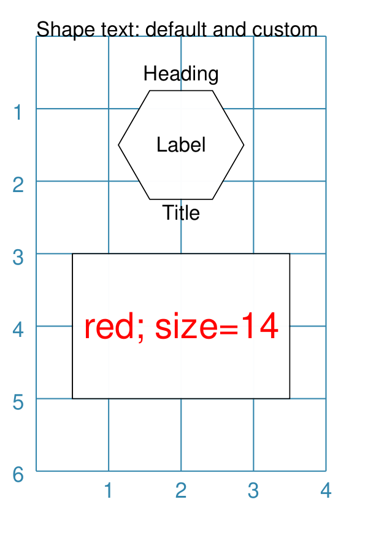

===== ======
|tx1| This example shows two shapes constructed using these commands to change
      default properties:

      .. code:: python

        Hexagon(
            cx=2, cy=1.5, height=1.5,
            title="Title",
            label="Label",
            heading="Heading")

        Rectangle(
            x=0.5, y=3, width=3, height=2,
            label="red; size=14",
            label_stroke="red", label_size=14)

      The Hexagon shows where the *heading*, *label* and *title* appear
      relative to the shape's boundaries, with default font size of 12 points.

      The Rectangle shows how the *label* can be customised in terms of its
      *stroke* (``red``) and font *size* (``14`` points).
===== ======

Example 2. Label Offsets
++++++++++++++++++++++++
`↑ <coreShapeText_>`_

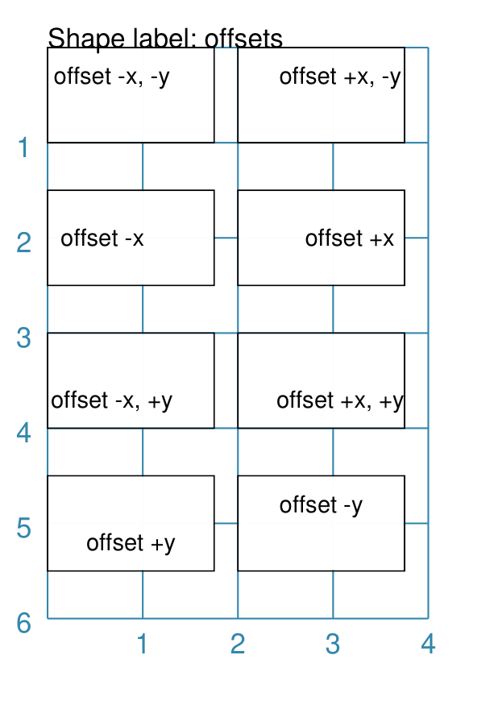

===== ======
|tx2| This example shows six Rectangles constructed using the command with
      additional properties:

      .. code:: python

        rct = Common(
          height=1.0, width=1.75,
          stroke_width=0.5, label_size=7)

        Rectangle(
          common=rct, x=0, y=0.0, label="offset -x, -y",
          label_mx=-0.2, label_my=-0.2)
        Rectangle(
          common=rct, x=0, y=1.5, label="offset -x",
          label_mx=-0.3)
        Rectangle(
          common=rct, x=0, y=3.0, label="offset -x, +y",
          label_mx=-0.2, label_my=0.2)
        Rectangle(
          common=rct, x=2, y=0.0, label="offset +x, -y",
          label_mx=0.2, label_my=-0.2)
        Rectangle(
          common=rct, x=2, y=1.5, label="offset +x",
          label_mx=0.3)
        Rectangle(
          common=rct, x=2, y=3.0, label="offset +x, +y",
          label_mx=0.2, label_my=0.2)
        Rectangle(
          common=rct, x=0, y=4.5, label="offset -y",
          label_my=-0.2)
        Rectangle(
          common=rct, x=2, y=4.5, label="offset +y",
          label_my=0.2)

      Setting values for *label_my* and *label_mx* cause the label to
      shift away from centre.

      Positive values move the label down and to the right while
      negative values move it up and to the left.

===== ======

.. _coreTransparency:

Transparency
~~~~~~~~~~~~
`^ <shapes-common-properties_>`_

All `Enclosed Shapes`_, that have a *fill*, can have a transparency value set
that will affect the fill color used for the area inside them.

If a shape needs to be completely transparent - i.e. no color at all being
visible - then set the *fill* value to ``None``.

===== ======
|trn| This example shows a number of Rectangles constructed as follows:

      .. code:: python

        Rectangle(
            x=1, y=3, height=1, width=2,
            fill="#008000", stroke="#C0C0C0",
            transparency=25, label="25%")
        Rectangle(
            x=1, y=4, height=1, width=2,
            fill="#008000", stroke="#C0C0C0",
            transparency=50, label="50%")
        Rectangle(
            x=1, y=5, height=1, width=2,
            fill="#008000", stroke="#C0C0C0",
            transparency=75, label="75%")

        Rectangle(
            x=0, y=0, height=2, width=2,
            fill="yellow", stroke="yellow")
        Rectangle(
            x=1, y=1, height=2, width=2,
            fill="red", stroke="red",
            transparency=50)

      The three green Rectangles shapes have the following property set:

      - *transparency* - the higher the value, the more "see through" the color

      The red Rectangle, which also has a *transparency* value, is drawn
      partially over the yellow Rectangle on the upper-left.

      When overdrawn, there is a color change in the overlapping section
      i.e. "bleed through" occurs.
===== ======

.. _coreCentreShape:

Centre Shape
~~~~~~~~~~~~
`^ <shapes-common-properties_>`_

Any shape that can be defined using its centre, may have another shape |dash|
called a "centre shape" |dash| placed inside of it.

.. NOTE::

   In terms of drawing order, the  "centre shape" is drawn after most of the
   shape's other properties: only a dot, cross or label (if any of these are
   defined) will be drawn superimposed on the centre-shape.

Example 1. Default Centre Shape
+++++++++++++++++++++++++++++++
`↑ <coreCentreShape_>`_

.. |cs0| image:: images/customised/shape_centred.png
   :width: 330

===== ======
|cs0| This example shows a number of shapes constructed as follows:

      .. code:: python

        small_star = star(radius=0.25)

        Polygon(
            cx=1, cy=5, radius=0.5, sides=8,
            centre_shape=small_star)
        Triangle(
            x=2.35, y=5.5, side=1.25,
            centre_shape=small_star)
        Rectangle(
            x=0.5, y=2.5, height=1, width=1.25,
            centre_shape=small_star)
        Circle(
            cx=3, cy=3, radius=0.5,
            centre_shape=small_star)
        Hexagon(
            x=0.5, y=0.5, height=1,
            centre_shape=small_star)
        Square(
            x=2.5, y=0.5, height=1,
            centre_shape=small_star)

      At the start, a Star shape is defined by the lowercase ``star()``

      A lowercase command means the shape is not drawn at this time but is
      assigned to a named value and can be referred to further on.

      Each of the other shapes in the script can now use this named shape
      as their ``centre_shape``.

      Regardless of whether the primary shape's position is
      defined using ``x`` and ``y``, or  ``cx`` and ``cy``, the Star
      is still drawn in the centre of that shape.

===== ======

Example 2. Off-Centre
+++++++++++++++++++++
`↑ <coreCentreShape_>`_

.. |cs1| image:: images/customised/shape_centred_move.png
   :width: 330

The centre-shape can be shifted from the centre by setting values for
*centre_shape_mx* and *centre_shape_my*.

===== ======
|cs1| This example shows two Hexagon shapes constructed as follows:

      .. code:: python

        small_star = star(radius=0.25)
        small_circle = circle(
            radius=0.33, fill="gray",
            centre_shape=small_star)

        Hexagon(
            x=1, y=0.5, height=2,
            hatches_count=5,
            dot=0.1,
            centre_shape=small_circle)

        Hexagon(
            x=1, y=3, height=2,
            centre_shape=small_circle,
            centre_shape_mx=0.3, centre_shape_my=0.6)

      As in the first example, the ``small_star`` is defined but not drawn.

      The ``small_star`` is assigned as the ``centre_shape``  to
      ``small_circle``; a shape that is also not drawn.

      This ``small_circle`` is now used as the ``centre_shape``
      for both of the Hexagons.

      The upper Hexagon shows how the centre-shape is drawn
      over other features, such as the hatches, in the Hexagon,
      **except** for the ``dot``.

      The lower Hexagon shows how the centre-shape can be moved with the
      ``*_mx`` and ``*_my`` values.

      Positive values move the shape down and to the right while
      negative values move it up and to the left.

===== ======

Example 3. Customised Centres
+++++++++++++++++++++++++++++
`↑ <coreCentreShape_>`_

The centre-shape can be any type of shape that has a defined centre;
and this shape itself can be customised.

===== ======
|cs2| This example shows Rectangle shapes, each constructed with a
      ``centre_shape`` as follows:

      .. code:: python

        Rectangle(x=0, y=1, side=1,
                  centre_shape=polygon(
                      radius=0.4,
                      sides=7,
                      fill=None,
                      perbii='*',
                      stroke="red"))
        Rectangle(x=1, y=2, side=1,
                  centre_shape=circle(
                      radius=0.3,
                      radii=[0,60,120,180,240,300],
                      fill=None,
                      stroke="green"))
        Rectangle(x=2, y=1, side=1,
                  centre_shape=hexagon(
                      radius=0.4,
                      stroke="purple",
                      fill=None,
                      borders=[("sw n se", 2)]))
        Rectangle(x=3, y=2, side=1,
                  centre_shape=stadium(
                      side=0.4,
                      stroke="orange"))
        Rectangle(x=0, y=3, side=1,
                  centre_shape=ellipse(
                      height=0.8,
                      width=0.5,
                      fill=None,
                      stroke="olive"))
        Rectangle(x=1, y=4, side=1,
                  centre_shape=square(
                      side=0.6,
                      stroke="gold",
                      fill=None,
                      hatches='d', hatches_count=5,
                      borders=[("n s", 2, "black")]))
        Rectangle(x=2, y=3, side=1,
                  centre_shape=rhombus(
                      side=0.8,
                      stroke="gray",
                      fill=None,
                      borders=[("ne sw", 2, "black")]))
        Rectangle(x=3, y=4, side=1,
                  centre_shape=trapezoid(
                      width=0.6, top=0.4, height=0.8,
                      stroke="aqua",
                      fill=None,
                      flip='south',
                      borders=[("e w", 2, "black")]))

      These various shapes and their custom properties are described
      elsewhere in the documentation; this example just serves to show
      how they can be used together.

===== ======

.. _coreCentreShapes:

Centre Shapes
~~~~~~~~~~~~~
`^ <shapes-common-properties_>`_

Any shape that can be defined using its centre, may have multiple shapes |dash|
called "centre shapes" |dash| placed inside of it.

These shapes are supplied as a list of sets; for example ``[(shape1), (shape2)]``

.. NOTE::

   In terms of drawing order, the  "centre shapes" are drawn after most of the
   shape's other properties: only a dot, cross or label (if any of these are
   defined) will be drawn superimposed on the centre shapes.

Example 1. Centres
++++++++++++++++++

.. |ss1| image:: images/customised/shapes_centred.png
   :width: 330

Any centre-shape can be shifted from the centre by setting values for
the change in ``x`` and ``y`` values as part of the set.

===== ======
|ss1| This example shows centre shapes constructed as follows:

      .. code:: python

        small_dot = dot(dot_width=4, fill="red")
        big_dot = dot(dot_width=8)

        Hexagon(
            x=0.5, y=0.5, height=1,
            centre_shapes=[
                (small_dot), (big_dot, 0.2, 0.2)])
        Rhombus(
            x=2.4, y=0.3,
            height=1.5, width=1.25,
            centre_shapes=[
                (small_dot), (big_dot, 0.2, 0.2)])
        Rectangle(
            x=0.5, y=2.5,
            height=1, width=1.25,
            centre_shapes=[
                (small_dot), (big_dot, 0.2, 0.2)])
        Circle(
            cx=3, cy=3,
            radius=0.5,
            centre_shapes=[
                (small_dot), (big_dot, 0.2, 0.2)])
        Polygon(
            cx=1, cy=5,
            radius=0.5, sides=8,
            centre_shapes=[
                (small_dot), (big_dot, 0.2, 0.2)])
        Triangle(
            x=2.35, y=5.5, side=1.25,
            centre_shapes=[
                (small_dot), (big_dot, 0.2, 0.2)])

      At the start, two Dot shapes are defined by the lowercase ``dot()``

      A lowercase command means the shapes are not drawn at this time but
      assigned to named values and can be referred to further on.

      Each of the other shapes in the script can now use these named shapes
      as their ``centre_shapes``.

      The ``small_dot`` (which is red )is used "as is" and so by default is
      drawn at the centre of its parent shape; the ``big_dot`` is given offset
      values for the x and y positions - so is drawn below and to the right
      of centre.

===== ======

.. _coreVertexShapes:

Vertex Shapes
~~~~~~~~~~~~~
`^ <shapes-common-properties_>`_

A number of shapes, that are formed by drawing lines between a set of
vertices ("corner points"), can be styled by placing other shapes which
will be centered on those points.

Vertex shapes are constructed using the following properties:

- *vertex_shapes* - this a list (values in ``[...]``) of shapes that
  should be placed on vertices, in the order that these vertices are
  drawn
- *vertex_shapes_rotated* - an optional setting which, if ``True``, will
  rotate the vertex shapes such they "point" away from the centre of the
  parent shape

Vertex shapes can be constructed for:

- :ref:`Hexagon <hexagon-command>`
- :ref:`Polygon <polygon-command>`
- :ref:`Rectangle <rectangle-command>`
- :ref:`Rhombus <rhombus-command>`
- :ref:`Star <star-command>`
- :ref:`Triangle <triangle-command>`

Example 1. Vertex Shapes
++++++++++++++++++++++++

===== ======
|vs1| This example shows vertex shapes constructed as follows:

      .. code:: python

        Rectangle(
            cx=1, cy=1,
            height=1,
            width=1.5,
            vertex_shapes=[
                circle(radius=0.15, label="R")] * 4,
            vertex_shapes_rotated=True)
        Hexagon(
            cx=3, cy=1,
            radius=1,
            vertex_shapes=[
                circle(radius=0.15, label="H")] * 6,
            vertex_shapes_rotated=True)
        Polygon(
            cx=1, cy=3,
            sides=5,
            radius=1,
            vertex_shapes=[
                circle(radius=0.15, label="P")] * 5,
            vertex_shapes_rotated=True)
        Trapezoid(
            cx=3, cy=3,
            width=1.5, top=1, height=1.25,
            vertex_shapes=[
                circle(radius=0.15, label="T")] * 5,
            vertex_shapes_rotated=True)
        Triangle(
            cx=1, cy=5,
            side=1.5,
            vertex_shapes=[
                circle(radius=0.15, label="E")] * 3,
            vertex_shapes_rotated=True)
        Star(
            cx=3, cy=5,
            radius=1,
            rays=5,
            vertex_shapes=[
                circle(radius=0.15, label="S")] * 5,
            vertex_shapes_rotated=True)

      All of these examples use the shortcut approach to create the correct
      number of vertex shapes i.e. ``[SomeShape] * N`` where ``N`` is the
      number of repeats of that shape.  In other cases, it could be that
      this is a list of distinctly different shapes.  Any vertices which
      should be omitted can just use the ``None`` value to indicate that.

      The use of ``vertex_shapes_rotated=True`` will means all of these
      examples have the vertex shapes rotated to face "away" from the
      parent shape's centre.

===== ======

.. _coreWave:

Wave Styles
~~~~~~~~~~~
`^ <shapes-common-properties_>`_

A number of shapes, that make use of straight line properties, can be styled
using their "wave" property.

These include the *radii* and *perbii* properties of Circle, Hexagon, Polygon
and Rectangle (for details on those properties, see the section on
:doc:`Customised Shapes <customised_shapes>`).  In addition, the lines used
to construct a Polyshape and Polyline can also be styled like waves.

Example 1. Radii and perbii
+++++++++++++++++++++++++++

===== ======
|ws1| This example shows various shapes constructed as follows:

      .. code:: python

        Line(
            x=0, y=0.5, length=1.5,
            stroke="purple", stroke_width=1,
            wave_style='wave', wave_height=0.1
        )
        Line(
            x=2, y=0.5, length=1.5,
            stroke="firebrick", stroke_width=1,
            wave_style='sawtooth', wave_height=0.1
        )
        Polygon(
            perbii_stroke="purple",
            perbii_stroke_width=1,
            perbii_wave_style='wave',
            perbii_wave_height=0.1,
            cx=1, cy=1.5, sides=8, radius=0.75,
            perbii="2,4,7"
        )
        Polygon(
            radii_stroke="firebrick",
            radii_stroke_width=1,
            radii_wave_style='sawtooth',
            radii_wave_height=0.1,
            cx=3, cy=1.5, sides=8, radius=0.75,
            radii="*")
        Rectangle(
            perbii_stroke="purple",
            perbii_stroke_width=1,
            perbii_wave_style='wave',
            perbii_wave_height=0.1,
            cx=1, cy=3.25, height=1, width=2,
            perbii="n s e w",
        )
        Circle(
            radii_stroke="firebrick",
            radii_stroke_width=1,
            radii_wave_style='sawtooth',
            radii_wave_height=0.1,
            cx=3, cy=3.25, radius=0.75,
            radii=[60, 180, 300],
        )
        Hexagon(
            cx=1, cy=5, radius=0.75,
            perbii='*',
            perbii_stroke="purple",
            perbii_stroke_width=1,
            perbii_wave_style='wave',
            perbii_wave_height=0.1
        )
        Hexagon(
            cx=3, cy=5, radius=0.75,
            radii="ne se w",
            radii_stroke="firebrick",
            radii_stroke_width=1,
            radii_wave_style='sawtooth',
            radii_wave_height=0.1
        )

      The purple lines have:

      - *perbii_wave_style*  set to ``'wave'`` creating a wave-like effect
      - *perbii_wave_height* set to ``0.1`` for the height of each "peak"

      The dark red lines have:

      - *radii_wave_style*  set to ``'sawtooth'`` creating a "zig-zag" effect
      - *radii_wave_height* set to ``0.1`` for the height of each "peak"

===== ======

Example 2. Polyshape and Polyline
+++++++++++++++++++++++++++++++++

===== ======
|ws2| This example shows poly-shapes constructed as follows:

      .. code:: python

        Polyshape(
            points=[(1,2), (1,1), (2 0), (3,1), (3,2)],
            wave_style="wave", wave_height=0.03,
            fill="gold")
        Polyline(
            points='1,3 1,4 2,4 4,3',
            stroke="red", stroke_width=2,
            wave_style="sawtooth", wave_height=0.03)
        Polyline(
            points='1,5 1,6 2,6 4,5',
            stroke="purple", stroke_width=2,
            wave_style="wave", wave_height=0.05)

      The top Polyshape, with a default line stroke, has:

      - *perbii_wave_style*  set to ``'wave'`` creating a wave-like effect
      - *perbii_wave_height* set to ``0.03`` for the height of each "peak"

      The dark red thick Polyline has:

      - *radii_wave_style*  set to ``'sawtooth'`` creating a "zig-zag" effect
      - *radii_wave_height* set to ``0.03`` for the height of each "peak"

      The purple thick Polyline has:

      - *perbii_wave_style*  set to ``'wave'`` creating a wave-like effect
      - *perbii_wave_height* set to ``0.05`` for the height of each "peak"

===== ======
