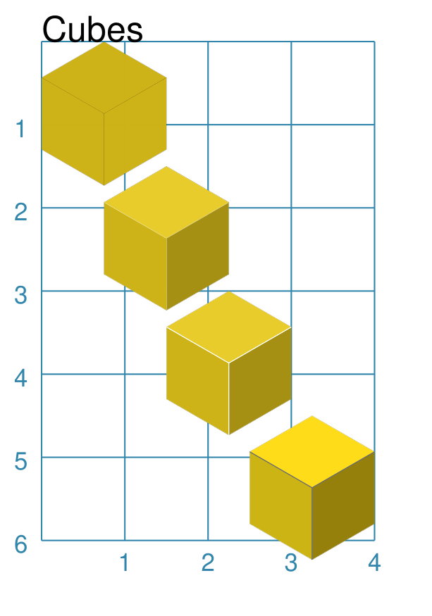

=====
Cubes
=====

.. |dash| unicode:: U+2014 .. EM DASH SIGN

This section assumes you are very familiar with the concepts, terms and ideas
for :doc:`protograf <index>`  as presented in the
:doc:`Basic Concepts <basic_concepts>` , that you understand all of the
:doc:`Additional Concepts <additional_concepts>` and that you've created some
basic scripts of your own using the :doc:`Core Shapes <core_shapes>`. You also
be familiar with the various types of shape's properties described in the
:doc:`Customised Shapes <customised_shapes>`

.. _cubeOver:

Overview
========

Cubes are widely used in many games, so being able to easily add them to
a graphic layout can be useful.

.. _cube-object:

Cube Properties
===============

The hexagonal-shaped object ``Cube`` shares all of the properties of the
:ref:`Hexagon <hexIndex>`; in addition, it has its own property called
*shades*.

Cube Examples
=============

The examples below shows how a Cube can be created and styled.

Cube Styling
------------
`^ <cubeOver_>`_

===== ======
|cu1| This example shows Cube objects constructed using these commands:

      .. code:: python

        YELLOW = "#CEB316"  # old gold

        Cube(x=0, y=0, height=1.5,
             fill=YELLOW)
        Cube(x=0.75, y=1.5,
             height=1.5,
             shades=YELLOW)
        Cube(x=1.5, y=3, height=1.5,
             shades=YELLOW,
             radii_stroke="white",
             radii_stroke_width=0.4)
        Cube(x=2.5, y=4.5, height=1.5,
             shades=["#FFDC17", "#957F0A", "#CCB412"],
             radii_stroke="dimgray",
             radii_stroke_width=0.2)

      All of the Cube shapes are constructed in the same way |dash| setting an
      *x* and *y* value as well as *height*.  The height is the distance
      between opposing flat sides.

      The top example shows a Cube with only a *fill* color set.  In this case,
      the three *radii* are automatically drawn in the default *stroke* color
      in order to create the cube "effect".

      The second example shows a Cube with a single color set for *shades*.
      In this case, the program will automatically create the darker and
      lighter shades of that color and use them to style the Cube.  Note
      that radii are now **not** drawn.

      The third example shows a Cube with a single color set for *shades*.
      In this case, the program will automatically create the darker and
      lighter shades of that color and use them to style the Cube. The
      *radii_stroke* color has been set and this will cause the three
      *radii* to be automatically drawn.

      The final example at the bottom shows a Cube with a three colors
      set for the *shades*. These will be used "as is" |dash| no darker
      or lighter ones created |dash| for the three "sides" of the cube.
      The *radii_stroke* color has been set and this will cause the
      three  *radii* to be automatically drawn.

===== ======
