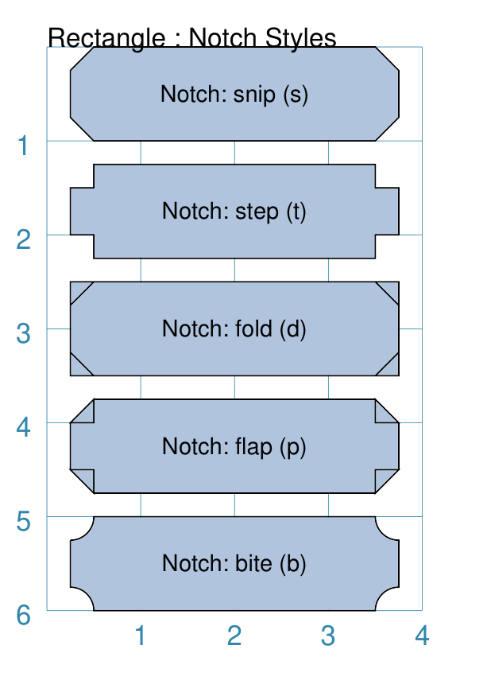
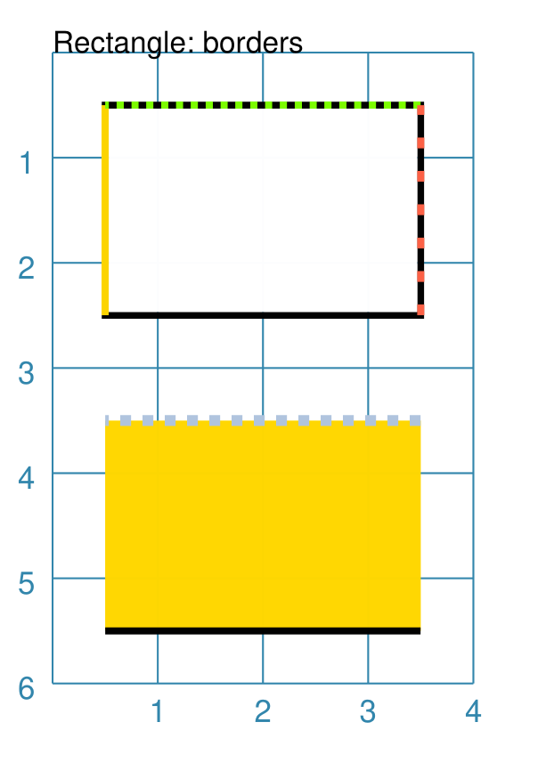
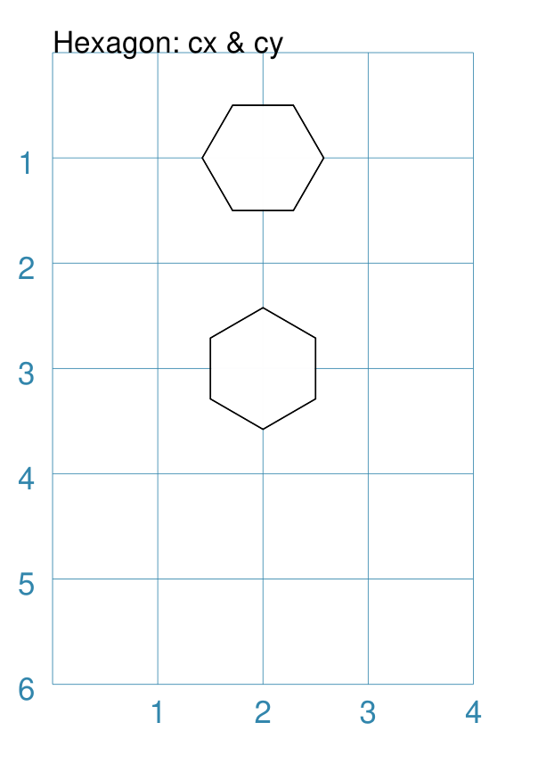
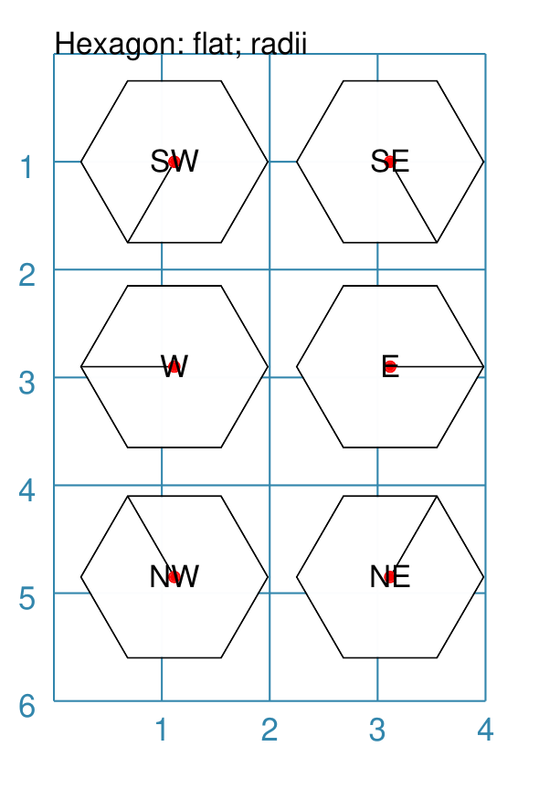
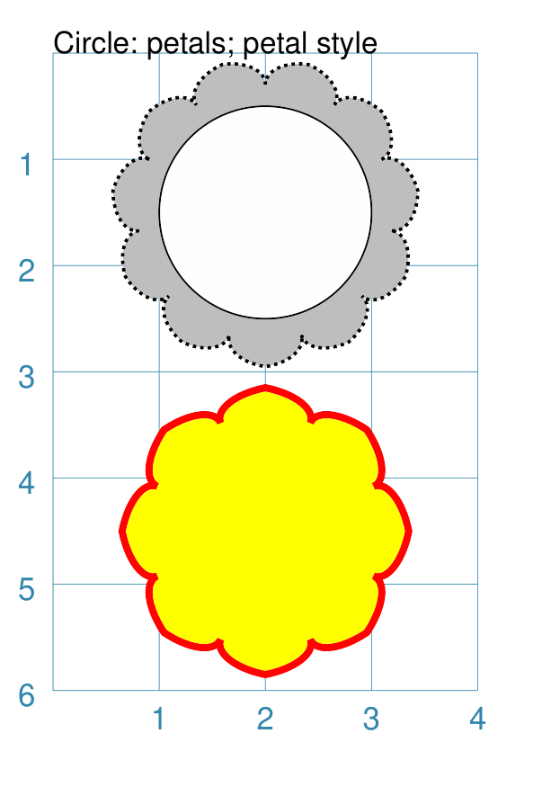
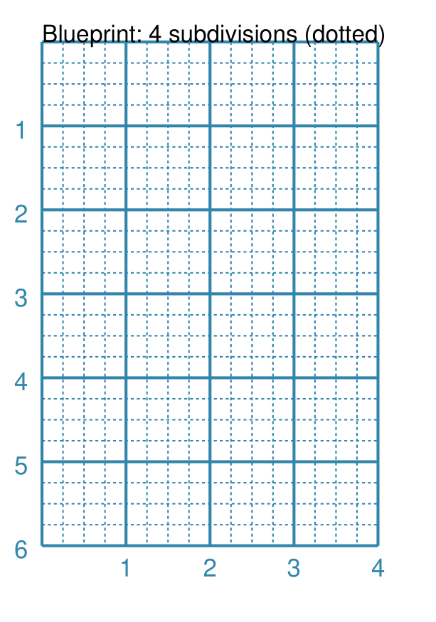

=================
Customised Shapes
=================

.. |dash| unicode:: U+2014 .. EM DASH SIGN
.. |copy| unicode:: U+000A9 .. COPYRIGHT SIGN
   :trim:
.. |deg|  unicode:: U+00B0 .. DEGREE SIGN
   :ltrim:

The descriptions here assume you are familiar with the concepts, terms
and ideas for :doc:`protograf <index>` as presented in the
:doc:`Basic Concepts <basic_concepts>` |dash| especially *units*,
*properties* and *defaults*.

You should have already seen how these shapes were created, with defaults,
in :doc:`Core Shapes <core_shapes>`.

.. _table-of-contents-custom:

- `Overview`_
- `Line`_
- `Rectangle`_
- `Hexagon`_
- `Circle`_
- `Blueprint`_


Overview
========
`↑ <table-of-contents-custom_>`_

To make it easier to see where and how a shape has been drawn, most of these
examples have been created with a background grid (which **protograf**
refers to as a `Blueprint`_ shape) added to the page |dash| a small A8
"business card" size |dash| for cross-reference. In addition, the default
line width (aka *stroke_width*) has been made thicker for easier viewing of
the small PNG images that were generated from the original PDF output.

A number of examples also use the :ref:`Common command <the-common-command>`
|dash| this allows shared properties to be defined once and then used by any
number of shapes.


.. _lineIndex:

Line
====
`↑ <table-of-contents-custom_>`_

A Line is a very common shape in many designs; there are a number of ways
that it can be customised.

- `Dotted, Dashed and Angled <lineDotDash_>`_
- `Centred <lineCentred_>`_
- `Arrowheads <line-with-arrow_>`_

Basic Properties
----------------
`^ <lineIndex_>`_

A Line has the following properties, in addition to the basic ones of
*x* and *y* for the starting point, and its *label* properties.

- *angle* - the number of degrees clockwise from the baseline; used in
  conjunction with *length*
- *cx* and *cy* - if set, will replace the use of *x* and *y* for the
  starting point, and work in conjunction with *angle* and *length* to
  create the line around a centre point
- *dotted* - if ``True``, create a series of small lines i.e. the
  "dots", followed by gaps, of sizes equal to the line's *stroke_width*
- *dashed* - a list of two numbers: the first is the length of the dash;
  the second is the length of the space between each dash
- *length* - sets the specific size of the line; used in conjunction
  with *angle* (which defaults to 0 |deg|)
- *rounded* - if ``True``, draw small semicircles at the ends of the line
- *stroke* - the color of the line
- *stroke_width* - the thickness of the line, in points
- *x1* and *y1* - a fixed endpoint for the line end (if not calculated by
  *angle* and *length*)

In addition, a line can have **arrows** at either or both ends. See the
details in the `arrowheads example <line-with-arrow_>`_.


.. _lineDotDash:

Example 1. Dotted, Dashed and Angled Lines
------------------------------------------
`^ <lineIndex_>`_

.. |ln2| image:: images/customised/line_custom.png
   :width: 330

===== ======
|ln2| This example shows a Line constructed using commands with the
      following properties:

      .. code:: python

        # black lines
        Line(
            x=0, y=0.5,
            stroke_width=0.2,
            dotted=True,
            label="0.2", font_size=6)
        Line(
            x=1, y=0.5,
            stroke_width=0.4, dotted=True,
            label="0.4", font_size=6)
        Line(
            x=2, y=0.5,
            stroke_width=0.8, dotted=True,
            label="0.8", font_size=6)
        Line(
            x=3, y=0.5,
            stroke_width=1.6, dotted=True,
            label="1.6", font_size=6)

        # colored lines
        Line(
            x=0, y=4, x1=4, y1=5,
            stroke="blue", stroke_width=1,
            dashed=[0.2, 0.1],
            label="dashed:[0.2,0.1]", font_size=6)
        Line(
            x=0, y=3,
            length=4.1, angle=15,
            stroke="red",
            label="15", font_size=6)
        Line(
            x=0, y=2, length=4,
            stroke="gold", stroke_width=2)
        Line(
            x=1, y=1.5, length=2,
            stroke="chartreuse", stroke_width=10,
            rounded=True)

      The various black lines have these properties:

      - *x* and *y* set as their starting point
      - a default length of ``1`` cm
      - *stroke_width* - set as value in points and labelled accordingly
      - *dotted* - has a value of ``True``

      The dotted line is just a series of small lines i.e. the "dots",
      followed by gaps, of sizes equal to the line's *stroke_width*.

      The thin red line has:

      - *angle* - of ``15`` |deg| from the baseline, clockwise

      The angle guides the direction in which the line is drawn; if not
      given |dash| as in the case of the thick green line |dash| this
      will be 0 |deg|. The line length is then calculated based on these
      points.

      The thick green, thick gold and thin red lines all have:

      - *x* and *y* set as their starting point
      - *length* - sets the specific size of the line

      The thick green line and the thick gold line do **not** have
      any *angle* property; this defaults to 0 |deg| which means the
      line is drawn to the "east" (or right of the start).

      The thick gold line has:

      - *rounded* set to ``True`` so semi-circles are drawn at line ends

      The medium blue line has:

      - *dashed* - length of ``2`` mm and spacing of ``1`` mm
      - *x1* and *y1* set as the ending point

      Dashes are a list of two numbers. The first is the length of the dash;
      the second is the length of the space between each dash.

===== ======


.. _lineCentred:

Example 2. Centred Line
-----------------------
`^ <lineIndex_>`_

A line can be drawn at a centre point by providing the following properties:

- centre - set using *cx* and *cy* values
- *length* - the length of the line
- *angle* - the rotation of the line, anti-clockwise from the baseline

.. |ln4| image:: images/customised/line_centred.png
   :width: 330

===== ======
|ln4| This example shows a Line constructed using commands with the
      following properties:

      .. code:: python

        Line(cx=1, cy=1, angle=45,
             length=2, stroke="red")
        Line(cx=3, cy=1, angle=225,
             length=2, stroke_width=1.5)

        Circle(cx=2, cy=3, radius=1)
        Line(cx=2, cy=3, angle=45, length=2,
             stroke="red", arrow_width=0.2)
        Line(cx=2, cy=3, angle=135, length=2,
             stroke_width=1.5, arrow_width=0.2)

        Line(cx=1, cy=5, angle=135,
             length=2, stroke_width=1.5)
        Line(cx=3, cy=5, angle=315,
             length=2, stroke="red")

      The top two lines are rotated at 45 |deg| (red) and 255 |deg|
      (thick black).

      The bottom two lines are rotated at 135 |deg| (thick black) and
      315 |deg| (red).

      While each pair appears to be "in the same direction", the use of the
      arrow property will display the actual direction; so the 45 |deg| (red)
      line in the circle points to 45 |deg|, while the 135 |deg|
      (thick black) points to 135 |deg|.

===== ======


.. _line-with-arrow:

Example 3. Arrowheads on Line
-----------------------------
`^ <lineIndex_>`_

In addition to styling a Line, it is also possible to specify an arrow
(also called an "arrowhead") for the line; a small "pointing" symbol to
signify direction.

This is different from the standalone :ref:`Arrow <arrow-command>` which
allows a much higher degree of customisation.

The following properties can be set:

- *arrow* - if set to ``True`` will cause a default arrow to be drawn
- *arrow_style* - can be set to ``notch``, ``angle``, or ``spear`` to change
  the default shape of the arrow
- *arrow_fill* - set the color of the arrow, which otherwise defaults to the
  color of the line
- *arrow_stroke* - set the color of the arrow with style ``angle``, which
  otherwise defaults to the color of the line
- *arrow_width* - set the width of the arrow at its base,  which otherwise
  defaults to a multiple of the line width
- *arrow_height* - set the height of the arrow, which otherwise
  defaults to a value proportional to the arrow *width* |dash| specifically,
  the height of the equilateral triangle used for the default arrow style
- *arrow_position* - set a value (single number), or values (list of numbers),
  that represents the fractional distance along the line at which the arrow tip,
  or tips, must be positioned relative to the start of the line
- *arrow_double* - if set to ``True`` make a copy of the same arrow, with the
  same properties as above, but facing in the opposite direction

.. |ln3| image:: images/customised/arrowheads.png
   :width: 330

===== ======
|ln3| This example shows a Line constructed using commands with the
      various properties.

      Note the use of the :ref:`Common command <the-common-command>`
      for when multiple Lines all need to share the same properties.

      .. code:: python

        # black styled arrows
        Line(x=0.5, y=1, x1=0.5, y1=0,
             arrow=True)
        Line(x=1.5, y=1, x1=1.5, y1=0,
             arrow_style='notch')
        Line(x=2.5, y=1, x1=2.5, y1=0,
             arrow_style='angle')
        Line(x=3.5, y=1, x1=3.5, y1=0,
             arrow_style='spear')
        # rotated lines; double arrow
        dbl_ang = Common(
            arrow_style='angle',
            arrow_double=True)
        Line(common=dbl_ang,
             x=0, y=1.75, x1=1, y1=1.25)
        Line(common=dbl_ang,
             x=2, y=1.5, x1=1, y1=1.5)
        Line(common=dbl_ang,
             x=2, y=1.25, x1=3, y1=1.75)
        Line(common=dbl_ang,
             x=3, y=1.5, x1=4, y1=1.5)
        # colored lines and arrows
        Line(x=0, y=3, x1=1, y1=2,
             arrow=True)
        Line(x=1, y=3, x1=2, y1=2,
             arrow_style='notch',
             stroke="tomato")
        Line(x=2, y=3, x1=3, y1=2,
             arrow_style='angle',
             stroke="chartreuse")
        Line(x=3, y=3, x1=4, y1=2,
             arrow_style='spear',
             stroke="aqua")
        # set size of arrow heads
        bigger = Common(
            arrow_width=0.2,
            arrow_height=0.3)
        Line(common=bigger,
             x=0, y=4, x1=1, y1=3,)
        Line(common=bigger,
             x=1, y=4, x1=2, y1=3,
             arrow_style='notch')
        Line(common=bigger,
             x=2, y=4, x1=3, y1=3,
             arrow_style='angle')
        Line(common=bigger,
             x=3, y=4, x1=4, y1=3,
             arrow_style='spear')
        # sized and colored arrow heads
        big_color = Common(
            arrow_width=0.2,
            arrow_height=0.3,
            arrow_fill="yellow",
            arrow_stroke="red")
        Line(common=big_color,
             x=0, y=5, x1=1, y1=4,)
        Line(common=big_color,
             x=1, y=5, x1=2, y1=4,
             arrow_style='notch')
        Line(common=big_color,
             x=2, y=5, x1=3, y1=4,
             arrow_style='angle')
        Line(common=big_color,
             x=3, y=5, x1=4, y1=4,
             arrow_style='spear')
        # positioned arrow heads
        Line(x=0.5, y=6, x1=0.5, y1=5,
             stroke_width=1,
             dotted=True,
             arrow_position=0.66,
             arrow_double=True)
        Line(x=1, y=6, x1=2, y1=5,
             arrow_position=[0.25, 0.5, 0.75])
        Line(x=2.5, y=6, x1=2.5, y1=5,
             arrow_position=[1.0, 0.93])

        # two lines superimposed
        Line(x=3, y=6, x1=4, y1=5,
             arrow_style='spear',
             arrow_height=0.15)
        Line(x=3, y=6, x1=4, y1=5,
             arrow_style='angle',
             arrow_width=0.15,
             arrow_position=[0.1, 0.15, 0.2])

      The first row shows default-sized arrows of differing styles;
      ``triangle`` (the default), ``notch``,  ``angle``, and ``spear``.
      As with other types of styles, these can be referred to by their
      initial letters: *t*, *n*, *a*, or *s*.

      To enable an arrow display, either use ``arrow=True`` **or**  set one
      of the properties described in this example.

      The second row shows the default arrow but with the line rotated in
      different directions. In this case ``arrow_double=True`` means the
      same arrow is drawn twice; facing in each direction.

      The third row shows how arrows take on the stroke color of the line
      to which they are attached.

      The fourth row shows how the arrow's *height* and *width* (across the
      "base" of the arrow) can be set to control it's size. **Note** that the
      ``spear`` arrow is always twice the height of the others!

      The fifth row shows how the arrow can be set to a different color from
      that of its line.  **Note** that the ``angle`` arrow there is no *fill*
      color, and that for the other styles, the *stroke* color is set to match
      the *fill* color.

      The sixth row shows how the *arrow_position* property can be set. The
      value, or values, represent the fractional distance along the line at
      which the arrow tip, or tips, is positioned relative to the start of
      the line. So, ``0.66`` represents a distance 66% along the line from
      the start towards the end. A list (inside the ``[``..``]`` brackets)
      of values means the arrow is drawn in multiple places along the line.

      The bottom left image shows how the default arrow expands in size
      proportional to the thickness (*stroke_width*) of the Line. Again,
      because ``arrow_double=True`` the same arrow is drawn twice; facing
      in each direction, but the ``arrow_position=0.66`` property means
      the arrows are each drawn about two-thirds of the way along the line,
      relative to their different "starts".

      The bottom right image is a "cheat" of sorts.  Two lines are drawn in
      the same location but with different styled arrows in different
      positions.

===== ======


.. _rectangleIndex:

Rectangle
=========
`↑ <table-of-contents-custom_>`_

A Rectangle is a very common shape in many designs; there are a number of ways
that it can be customised.

- `Borders <rectBorders_>`_
- `Centred <rectCentred_>`_
- `Cross and Dot <rectCross_>`_
- `Chevron <rectChevron_>`_
- `Hatch <rectHatch_>`_
- `Notch <rectNotch_>`_
- `Peak <rectPeak_>`_
- `Rotation <rectRotation_>`_
- `Rounding <rectRounding_>`_
- `Roof <rectRoof_>`_

.. _rectCentred:

Centred
-------
`^ <rectangleIndex_>`_


===== ======
|rcn| This example shows a Rectangle constructed using the command:

      .. code:: python

         Rectangle(cx=2, cy=3)

      It has the following properties that differ from the defaults:

      - *cx* and *cy* are used to set the centre of the Rectangle at
        ``2`` and ``3`` centimetres respectively

===== ======

.. _rectCross:

Cross and Dot
-------------
`^ <rectangleIndex_>`_

A cross or a dot are symbols that mark the centre of the Rectangle.
They are usually the last parts that are drawn.


===== ======
|rdc| This example shows a Rectangle constructed using the command:

      .. code:: python

        Rectangle(height=3, width=2, cross=0.75, dot=0.15)

      It has the following properties that differ from the defaults:

      - *height* and *width* are used to set the size of the Rectangle at ``3``
        and ``2`` centimetres respectively
      - *cross* - the length of each of the two lines that cross at the centre
        is set to ``0.75`` cm (7.5mm)
      - *dot* - a circle with a diameter of ``0.15`` cm (1.5mm); the fill color
        for the dot is the same as its stroke

===== ======

.. _rectChevron:

Chevron
-------
`^ <rectangleIndex_>`_

A chevron converts opposite sides of the Rectangle into two triangular peaks
that both point in a specified direction.  This creates an arrow-like effect.

.. |rcv| image:: images/custom/rectangle/chevron.png
   :width: 330


===== ======
|rcv| This example shows Rectangles constructed using these commands:

      .. code:: python

        Rectangle(
            x=3, y=2, height=2, width=1, font_size=4,
            label="chevron:N:0.5", title="title-N", heading="head-N",
            chevron='N', chevron_height=0.5
        )
        Rectangle(
            x=0, y=2, height=2, width=1, font_size=4,
            label="chevron:S:0.5", title="title-S", heading="head-S",
            chevron='S', chevron_height=0.5
        )
        Rectangle(
            x=1, y=4.5, height=1, width=2, font_size=4,
            label="chevron:W:0.5", title="title-W", heading="head-W",
            chevron='W', chevron_height=0.5
        )
        Rectangle(
            x=1, y=0.5, height=1, width=2, font_size=4,
            label="chevron:E:0.5", title="title-E", heading="head-E",
            chevron='E', chevron_height=0.5
        )

      The Rectangles all have the following properties that differ from
      the defaults:

      - *x* and *y*, *height* and *width* - set the basic configuration
      - *label*, *title* and *heading* - text to describe the shape's setting
      - *chevron* - the primary compass direction in which the chevron is
        pointing; N(orth), S(outh), E(ast) or W(est)
      - *chevron_height* - the distance of the chevron peak from the side of
        the rectangle it is adjacent to

      Note that the *label* is centered in the rectangle and **not** between
      the chevrons.

===== ======

.. _rectHatch:

Hatch
-----
`^ <rectangleIndex_>`_

Hatches are a set of parallel lines that are drawn, in a specified direction, across
the length or width of the Rectangle in a vertical, horizontal or diagonal direction.

.. |rht| image:: images/custom/rectangle/hatch.png
   :width: 330

===== ======
|rht| This example shows Rectangles constructed using these commands:

      .. code:: python

        htch = Common(
          height=1.5, width=1, hatch_count=5,
          hatch_width=0.1, hatch_stroke="red")

        Rectangle(
          common=htch, x=0, y=0,  hatch='w', label="W")
        Rectangle(
          common=htch, x=1.5, y=0, hatch='e', label="E")
        Rectangle(
          common=htch, x=3, y=0, hatch='ne', label="NE\nSW")

        Rectangle(
          common=htch, x=0, y=2,  hatch='s', label="S")
        Rectangle(
          common=htch, x=1.5, y=2, hatch='n', label="N")
        Rectangle(
          common=htch, x=3, y=2, hatch='nw', label="NW\nSE")

        Rectangle(
          common=htch, x=0, y=4, label="all")
        Rectangle(
          common=htch, x=1.5, y=4, hatch='o', label="O")
        Rectangle(
          common=htch, x=3, y=4, hatch='d', label="D")

      These Rectangles all share the following Common properties that
      differ from the defaults:

      - *height* and *width* - set the basic configuration
      - *hatch_count* - sets the **number** of lines to be drawn; the
        intervals between them are equal and depend on the direction
      - *hatch_width* - set to ``0.1`` point; a fairly thin line
      - *hatch_stroke* - set to the color ``red`` to make it stand out
        from the rectangle sides

      Each Rectangle has its own setting for:

      - *x* and *y* - different positions on the page for the lower-left
        corner
      - *label* - text to help identify it
      - *hatch* - if not specified, hatches will be drawn
        in all directions - otherwise:

        - ``n`` (North) or ``s`` (South) draws vertical lines;
        - ``w`` (West) or ``e`` (East) draws horizontal lines;
        - ``nw`` (North-West) or ``se`` (South-East) draws diagonal lines
          from top-left to bottom-right;
        - ``ne`` (North-East) or ``sw`` (South-West) draws diagonal lines
          from bottom-left to top-right;
        - ``o`` (orthogonal) draws vertical **and** horizontal lines;
        - ``d`` (diagonal) draws diagonal lines between adjacent sides.

===== ======

.. _rectNotch:

Notch
-----
`^ <rectangleIndex_>`_

Notches are small indents |dash| or outdents |dash| that are drawn in the
corners of the Rectangle.

.. |rnt| image:: images/custom/rectangle/notch.png
   :width: 330



Example 1. Size & Location
++++++++++++++++++++++++++

===== ======
|rnt| This example shows Rectangles constructed using these commands:

      .. code:: python

        Rectangle(
            x=2, y=1, height=2, width=1,
            label="notch:0.5", label_size=5,
            notch=0.25,
        )
        Rectangle(
            x=1, y=4, height=1, width=2,
            label="notch:.25/.5 loc: NW, SE", label_size=5,
            notch_x=0.5, notch_y=0.25,
            notch_corners="NW SE",
        )

      These share the following properties:

      - *x* and *y*, *height* and *width* - set the basic configuration
      - *label*, *label_size* - text to describe the shape's setting

      The first Rectangle has:

      - *notch* - the size of the triangular shape that will be "cut" off the
        corners of the rectangle

      The second Rectangle has:

      - *notch_x* - the distance from the corner in the x-direction where the
        notch will start
      - *notch_y* - the distance from the corner in the Y-direction where the
        notch will start
      - *notch_corners* - the specific corners of the rectangle where the notch
        will be applied

===== ======

Example 2. Styles
+++++++++++++++++

===== ======
|rns| These examples shows Rectangles constructed using these commands:

      .. code:: python

        styles = Common(
          height=1, width=3.5, x=0.25,
          notch=0.25, label_size=7, fill="lightsteelblue")

        Rectangle(
          common=styles, y=0,  notch_style='snip',
          label='Notch: snip (s)')
        Rectangle(
          common=styles, y=1.5, notch_style='step',
          label='Notch: step (t)')
        Rectangle(
          common=styles, y=3, notch_style='fold',
          label='Notch: fold (o)')
        Rectangle(
          common=styles, y=4.5, notch_style='flap',
          label='Notch: flap (l)')

      These Rectangles all share the following Common properties that differ from the
      defaults:

      - *height* and *width* - set the basic configuration
      - *x* - sets the position of the left edge
      - *fill* - set to the color ``lightsteelblue``
      - *notch* - size of notch, in terms of distance from the corner

      Each *notch_style* results in a slightly different effect:

      - *snip* - is a small triangle "cut out"; this is the default style
      - *step* - is sillohette of a step "cut out"
      - *fold* - makes it appear there is a crease across the corner
      - *flap* - makes it appear that the corner has a small, liftable flap

===== ======

.. _rectPeak:

Peak
----
`^ <rectangleIndex_>`_

A peak is small triangular shape that juts out from the side of a Rectangle in
a specified direction.

.. |rpk| image:: images/custom/rectangle/peak.png
   :width: 330

===== ======
|rpk| This example shows Rectangles constructed using these commands:

      .. code:: python

        Rectangle(
            x=1, y=1, width=2, height=1,
            font_size=6, label="peaks = *",
            peaks=[("*", 0.2)]
        )
        Rectangle(
            x=1, y=3, width=2, height=1,
            font_size=6, label="points = s,e",
            peaks=[("s", 1), ("e", 0.25)]
        )

      The Rectangles all have the following properties that differ from the defaults:

      - *x* and *y*; *width* and *height* - set the basic configuration
      - *label*, *font_size* - for the text to describe the shape's peak setting
      - *peaks* - the value(s) used to create the peak

      The *peaks* property is a list:

      - the square brackets (``[`` to ``]``) contain one or more sets
      - each set is enclosed by round brackets, consisting of a *direction*
        and a peak *size*:

        - Directions are the primary compass directions - (n)orth,
          (s)outh, (e)ast and (w)est,
        - Sizes are the distances of the centre of the peak from the edge
          of the Rectangle.

      *Note*: If the value ``*`` is used for a direction, it is a short-cut
      meaning that peaks should drawn in all four directions.

===== ======

.. _rectRotation:

Rotation
--------
`^ <rectangleIndex_>`_

.. |rrt| image:: images/custom/rectangle/rotation.png
   :width: 330

Rotation takes place in anti-clockwise direction, from the horizontal, around
the centre of the Rectangle.

===== ======
|rrt| This example shows Rectangles constructed using the commands:

      .. code:: python

        Rectangle(
            cx=2, cy=3, width=1.5, height=3, dot=0.06)
        Rectangle(
            cx=2, cy=3, width=1.5, height=3, dot=0.04,
            fill=None,
            stroke="red", stroke_width=0.3, rotation=45,)

      The first, upright, Rectangle is a normal one, with a black outline.

      It is centred at x-location ``2`` cm and y-location ``3`` cm with a small
      black centred *dot*.

      The second Rectangle is similar to the first, except:

      - *dot* - has the same color as the *stroke* (by default) and is smaller
        than the *dot* of the  first Rectangle
      - *fill* - set to ``None`` to make it fully transparent, allowing
        the first Rectangle to show "below"
      - *stroke* - set to ``red`` to highlight it
      - *rotation* - of 45 |deg|; anti-clockwise from the horizontal

===== ======

.. _rectRounding:

Rounding
--------
`^ <rectangleIndex_>`_

Rounding changes the corners of a Rectangle from a sharp, right-angled, join
into the arc of a quarter-circle.

.. |rnd| image:: images/custom/rectangle/rounding.png
   :width: 330

===== ======
|rnd| This example shows Rectangles constructed using the commands:

      .. code:: python

        rct = Common(
            x=0.5, height=1.5, width=3.0, stroke_width=.5,
            hatch_stroke="red", hatch='o')

        Rectangle(
            common=rct, y=1, rounding=0.1, hatch_count=10)
        Rectangle(
            common=rct, y=4, rounding=0.5,  hatch_count=3)

      Both Rectangles share the Common properties of:

      - *x* - left side location
      - *height* and *width* - ``1.5`` and ``3.0`` cm respectively
      - *hatch_stroke* - set to ``red``
      - *hatch* directions of ``o`` (for orthogonal)

      These properties set the color and directions of the lines crossing
      the Rectangles.

      The upper Rectangle has these specific properties:

      - *rounding* - set to ``0.1``; the radius of the circle used for the corner
      - *hatch_count* - set to  ``10``; the number of lines
        in both vertical and horizontal directions

      The lower Rectangle has these specific properties:

      - *rounding* - set to ``0.5``; the radius of the circle used for the corner
      - *hatch_count* - set to ``3``; the number of lines
        in both vertical and horizontal directions.

      It should be noted that if the rounding is too large in comparison with
      the number of hatches, as in this example:

        .. code:: python

          Rectangle(common=rct, y=2, rounding=0.5, hatch_count=10)

      then the program will issue an error::

        No hatching permissible with this size rounding in the rectangle

===== ======

.. _rectRoof:

Roof
----
`^ <rectangleIndex_>`_

The roof-related command enables the rectangle to be filled with
colored triangular or quadilateral shapes.  Depending on the settings
in use, this can be thought of to resemble a certain type of house roof,
as viewed from above.

.. NOTE::

    Roof areas are drawn **after** the rectangle has been drawn, and so
    may obscure the stroke outline and fill color of the rectangle.

.. |rf1| image:: images/custom/rectangle/roof.png
   :width: 330

===== ======
|rf1| This example shows Rectangles constructed using the commands:

      .. code:: python

        Rectangle(
            x=1, y=0.5,
            roof=['tomato', 'aqua'],
            fill=None)
        Rectangle(
            x=1, y=2,
            height=1.5, width=1.5,
            roof=['tomato', 'aqua', 'gold', 'chartreuse'],
            fill=None)
        Rectangle(
            x=1, y=4,
            height=2, width=3,
            roof=['#FDAE74', '#F6965F', '#C66A3D', '#F6965F'],
            roof_line=1.25,
            roof_stroke="silver",
            fill=None)

      The top example shows the minimum required; the *roof* property is a
      list of **two** colors (``[ ]`` with comma-separated color strings).
      This causes **two** triangles to be drawn |dash| one in the top-left,
      and one in the bottom-right of the rectangle.

      The middle example shows what happens when the *roof* property is given
      a list of **four** colors (``[ ]`` with comma-separated color strings).
      This causes **four** triangles to be drawn |dash| the rectangle is thus
      subdivided into four triangular spaces.  Colors are allocated from the
      top-most triangle, going clock-wise.

      The lower example shows what happens when the *roof* property is given
      a list of **four** colors, plus a *roof_line* and a *roof_stroke*.
      The *roof_line* is drawn centered in the rectangle, and then the two
      triangles are created at either end, with quadilaterals forming the top
      and bottom shapes. All lines are drawn with the  *roof_stroke* color.

===== ======

.. |rf2| image:: images/custom/rectangle/roof_custom.png
   :width: 330

===== ======
|rf2| This example shows Rectangles constructed using the commands:

      .. code:: python

        Rectangle(
            x=1, y=2,
            height=2, width=4,
            roof=['#555656', '#555656', '#767982', '#555656'],
            roof_line=4,
            roof_stroke="#767982",
            rotation=90)
        Rectangle(
            x=0, y=3,
            height=2, width=2,
            roof=['#767982', '#636C73', '#555656', '#636C73'],
            roof_line=2,
            roof_stroke="#767982",
            roof_line_mx=0.5)

      Both examples shows what happens when the *roof* property is given
      a list of **four** colors, plus a *roof_line* and a *roof_stroke*.
      In both cases, the *roof_line* length is equal to the length of the
      rectangle itself (``4`` and ``2`` cm respectively).

      The right-hand rectangle shows how it appears to be subdivided into
      two areas; this is because the *roof_line* runs the full length of the
      rectangle so the end triangles have a height of zero and effectively
      become "invisible".  In addition, because the rectangle has been
      rotated by 90 |deg| (around its centre) the dividing line displays as
      vertical.

      The left-hand rectangle has an additional property *roof_line_mx*
      which causes the middle-line to move that distance to the right (or
      to the left, if it was a negative value).  This causes the right-hand
      triangle to "project" to the right of the rectangle.

===== ======


.. _rectBorders:

Borders
-------
`^ <rectangleIndex_>`_

The ``Borders`` property allows for the normal line that is drawn around the
Rectangle to be overwritten on specific sides by another type of line.

The ``Borders`` property is specified by providing a set of values, which are
comma-separated inside round brackets, in the following order:

- direction - one of (n)orth, (s)outh, (e)ast or (w)est
- width - the line thickness
- color - either a named color or a hexadecimal value
- style - ``True`` makes it dotted; or a list of values creates dashes

Direction and width are required, but color and style are optional.  One
or more border values can be used together with spaces between them
e.g. ``n s`` to draw both lines on both north **and** south sides.



===== ======
|rb1| This example shows Rectangles constructed using these commands:

      .. code:: python

        Rectangle(
            x=0.5, y=3.5, height=2, width=3, stroke=None, fill="gold",
            borders=[
                ("n", 2, "lightsteelblue", True),
                ("s", 2),
            ]
        )
        Rectangle(
         x=0.5, y=0.5, height=2, width=3, stroke_width=1.9,
            borders=[
                ("w", 2, "gold"),
                ("n", 2, "chartreuse", True),
                ("e", 2, "tomato", [0.1, 0.2]),
            ]
        )

      The lower rectangle has a yellow *fill* but no *stroke* i.e. no lines are
      drawn around it.

      There are two *borders* that are set in the list (shown in
      the square brackets going from ``[`` to ``]``):

      - first border sets a thick grey dotted line for the top (north) edge
      - second border sets a thick line for the bottom (south) edge; no color
        is given so it defaults to black

      The top rectangle has a thick *stroke_width* as its outline, with a
      default *fill* of white and default *stroke* of black.

      There are three *borders* that are set in the list (the square brackets
      going from ``[`` to ``]``):

      - first border sets a thick yellow line for the left (west) edge
      - second border sets a thick green *dotted* line for the top (north) edge
      - third border sets a thick red dashed line for the right (east) edge

      **Note** that for both dotted and dashed lines, any underlying color or
      image will "show though" the gaps in the line

===== ======


.. _hexIndex:

Hexagon
=======
`↑ <table-of-contents-custom_>`_

A key property for a hexagon is its *orientation*; this can either be *flat*,
which is the default, or *pointy*. The examples below show how each can be
customised in a similar way.

- `Borders <hexBorders_>`_
- `Centre <hexCentre_>`_
- `Dot and Cross <hexCross_>`_
- `Hatch: Flat <hexHatchFlat_>`_
- `Hatch: Pointy <hexHatchPointy_>`_
- `Radii: Flat <hexRadiiFlat_>`_
- `Radii: Pointy <hexRadiiPointy_>`_
- `Perbis: Flat <hexPerbisFlat_>`_
- `Perbis: Pointy <hexPerbisPointy_>`_
- `Text: Flat <hexTextFlat_>`_
- `Text: Pointy <hexTextPointy_>`_

.. _hexCentre:

Centre
------
`^ <hexagon_>`_



===== ======
|hcn| This example shows Hexagons constructed using these commands:

      .. code:: python

          Hexagon(cx=2, cy=1)
          Hexagon(cx=2, cy=3, orientation='pointy')

      Both Hexagons are located via their centres - *cx* and *cy*.

      The upper Hexagon has the default *orientation* value of ``flat``.

      The lower Hexagon also has the *orientation* property set to
      ``pointy``, ensuring that the "peak" is at the top.

===== ======

.. _hexCross:

Dot & Cross
-----------
`^ <hexagon_>`_


===== ======
|hcd| This example shows Hexagons constructed using these commands:

      .. code:: python

        Hexagon(x=0, y=1, height=2,
                dot=0.1, dot_stroke="red",
                orientation='pointy')
        Hexagon(x=2, y=1, height=2,
                cross=0.25, cross_stroke="red",
                cross_stroke_width=1,
                orientation='pointy')

        Hexagon(x=-0.25, y=4, height=2,
                dot=0.1, dot_stroke="red")
        Hexagon(x=1.75, y=3.5, height=2,
                cross=0.25, cross_stroke="red",
                cross_stroke_width=1)

      These Hexagons have properties set as follows:

      - *x* and *y* - set the lower-left position of the Hexagon
      - *height* - sets the distance from flat-edge to flat-edge
      - *dot* - sets the size of dot at the centre
      - *dot_stroke*  - sets the color of the dot (the dot is "filled
        in" with the same color)
      - *cross* - sets the length of each of the two lines that cross at the centre
      - *cross_stroke*  - sets the color of the cross lines
      - *cross_stroke_width* - sets the thickness of the cross lines
      - *orientation* - if set to `pointy`, there will be a "peak" at the top

===== ======

.. _hexHatchFlat:

Hatch: Flat
-----------
`^ <hexagon_>`_

Hatches are a set of parallel lines that are drawn across
a Hexagon from one opposing side to another in a vertical, horizontal or
diagonal direction.

.. |hhf| image:: images/custom/hexagon/hatch_flat.png
   :width: 330

===== ======
|hhf| This example shows Hexagons constructed using these commands:

      .. code:: python

        hxgn = Common(
            x=1, height=1.5, orientation='flat',
            hatch_count=5, hatch_stroke="red")

        Hexagon(common=hxgn, y=0, hatch='e', label="e/w")
        Hexagon(common=hxgn, y=2, hatch='ne', label="ne/sw")
        Hexagon(common=hxgn, y=4, hatch='nw', label="nw/se")

      These Hexagons all share the following Common properties that differ
      from the defaults:

      - *x* and *height* - set the basic configuration
      - *orientation* - set to ``flat``, so there will be no "peak" at the top
      - *hatch_count* - sets the **number** of equally-spaced lines
      - *hatch_stroke* - set to the color ``red`` to make it stand out from the
        hexagon sides

      Each Hexagon has its own setting for:

      - *y* - different positions on the page for the upper "corner"
      - *label* - text for identification
      - *hatch* - if not specified, hatches will be drawn in all directions;
        otherwise:

        - ``e`` (East) or ``w`` (West) draws horizontal lines
        - ``ne`` (North-East) or ``sw`` (South-West) draws diagonal lines from
          bottom-left to top-right
        - ``nw`` (North-West) or ``se`` (South-East) draws diagonal lines from
          top-left to bottom-right

===== ======

.. _hexHatchPointy:

Hatch: Pointy
-------------
`^ <hexagon_>`_

Hatches are a set of parallel lines that are drawn, in a specified direction,
across the Hexagon from one opposing side to another in a vertical, horizontal
or diagonal direction.

.. |hhp| image:: images/custom/hexagon/hatch_pointy.png
   :width: 330

===== ======
|hhp| This example shows Hexagons constructed using these commands:

      .. code:: python

        hxgn = Common(
            x=1, height=1.5, orientation='pointy',
            hatch_count=5, hatch_stroke="red")

        Hexagon(common=hxgn, y=0, hatch='n', label="n/s")
        Hexagon(common=hxgn, y=2, hatch='ne', label="ne/sw")
        Hexagon(common=hxgn, y=4, hatch='nw', label="nw/se")

      These Hexagons all share the following Common properties that differ
      from the defaults:

      - *x* and *height* - set the basic configuration
      - *orientation* - set to ``pointy``, so there will be a "peak" at the top
      - *hatch_count* - sets the **number** of equally-spaced lines
      - *hatch_stroke* - set to the color ``red`` to make it stand out from the
        Hexagon sides

      Each Hexagon has its own setting for:

      - *y* - different positions on the page for the upper corner
      - *label* -text for identification
      - *hatch* - if not specified, hatches will be drawn in all directions;
        otherwise:

        - ```n`` (North) or ``s`` (South) draws vertical lines
        - ``ne`` (North-East) or ``sw`` (South-West) draws diagonal lines from
          bottom-left to top-right
        - ``nw`` (North-West) or ``se`` (South-East) draws diagonal lines from
          top-left to bottom-right

===== ======

.. _hexRadiiFlat:

Radii: Flat
-----------
`^ <hexagon_>`_

Radii are like spokes of a bicycle wheel; they are drawn from the centre
of a Hexagon towards its vertices.



===== ======
|hrf| This example shows Hexagons constructed using these commands:

      .. code:: python

        hxg = Common(
            height=1.5, font_size=8,
            dot=0.05, dot_stroke="red",
            orientation="flat")

        Hexagon(common=hxg, x=0.25, y=0.25, radii='sw', label="SW")
        Hexagon(common=hxg, x=0.25, y=2.15, radii='w', label="W")
        Hexagon(common=hxg, x=0.25, y=4, radii='nw', label="NW")
        Hexagon(common=hxg, x=2.25, y=4, radii='ne', label="NE")
        Hexagon(common=hxg, x=2.25, y=2.15, radii='e', label="E")
        Hexagon(common=hxg, x=2.25, y=0.25, radii='se', label="SE")

      These have the following properties:

      - *common* - sets Common values assigned to ``hxg``
      - *x* and *y* to set the lower-left position
      - *radii* - a compass direction in which the radius is drawn
        (centre to vertex)
      - *label* - the text displayed in the centre shows the compass direction

===== ======

.. _hexRadiiPointy:

Radii: Pointy
-------------
`^ <hexagon_>`__

Radii are like spokes of a bicycle wheel; they are drawn from the centre
of a Hexagon towards its vertices.


===== ======
|hrp| This example shows Hexagons constructed using these commands:

      .. code:: python

        hxg = Common(
            height=1.5, font_size=8,
            dot=0.05, dot_stroke="red",
            orientation="pointy")

        Hexagon(common=hxg, x=0.25, y=0.25, radii='sw', label="SW")
        Hexagon(common=hxg, x=0.25, y=2.15, radii='nw', label="NW")
        Hexagon(common=hxg, x=0.25, y=4, radii='n', label="N")
        Hexagon(common=hxg, x=2.25, y=4, radii='ne', label="NE")
        Hexagon(common=hxg, x=2.25, y=0.25, radii='s', label="S")
        Hexagon(common=hxg, x=2.25, y=2.15, radii='se', label="SE")

      These have the following properties:

      - *common* - sets Common values assigned to ``hxg``
      - *x* and *y* to set the lower-left position
      - *radii* - a compass direction in which the radius is drawn
        (centre to vertex)
      - *label* - the text displayed in the centre

===== ======


.. _hexPerbisFlat:

Perbis: Flat
------------
`^ <hexagon_>`_

"Perbis" is a shortcut name for "perpendicular bisector". These lines are like
spokes of a bicycle wheel; they are drawn from the centre of a Hexagon towards
the mid-points of the edges.

.. |hpf| image:: images/custom/hexagon/perbis_flat.png
   :width: 330

===== ======
|hpf| This example shows Hexagons constructed using these commands:

      .. code:: python

        hxg = Common(
            height=1.5, font_size=8,
            dot=0.05, dot_stroke="red",
            orientation="flat")

        Hexagon(common=hxg, x=0.25, y=0.25, perbis='sw', label="SW")
        Hexagon(common=hxg, x=0.25, y=2.15, perbis='w', label="W")
        Hexagon(common=hxg, x=0.25, y=4, perbis='nw', label="NW")
        Hexagon(common=hxg, x=2.25, y=4, perbis='ne', label="NE")
        Hexagon(common=hxg, x=2.25, y=2.15, perbis='e', label="E")
        Hexagon(common=hxg, x=2.25, y=0.25, perbis='se', label="SE")

      These have the following properties:

      - *common* - sets Common values assigned to ``hxg``
      - *x* and *y* to set the lower-left position
      - *perbis* - a compass direction in which the bisector is drawn
        (centre to mid-point)
      - *label* - the text displayed in the centre shows the compass direction

===== ======

.. _hexPerbisPointy:

Perbis: Pointy
--------------
`^ <hexagon_>`__

"Perbis" is a shortcut name for "perpendicular bisector". These lines are like
spokes of a bicycle wheel; they are drawn from the centre of a Hexagon towards
the mid-points of the edges.

.. |hpp| image:: images/custom/hexagon/perbis_pointy.png
   :width: 330

===== ======
|hpp| This example shows Hexagons constructed using these commands:

      .. code:: python

        hxg = Common(
            height=1.5, font_size=8,
            dot=0.05, dot_stroke="red",
            orientation="pointy")

        Hexagon(common=hxg, x=0.25, y=0.25, perbis='sw', label="SW")
        Hexagon(common=hxg, x=0.25, y=2.15, perbis='nw', label="NW")
        Hexagon(common=hxg, x=0.25, y=4, perbis='n', label="N")
        Hexagon(common=hxg, x=2.25, y=4, perbis='ne', label="NE")
        Hexagon(common=hxg, x=2.25, y=0.25, perbis='s', label="S")
        Hexagon(common=hxg, x=2.25, y=2.15, perbis='se', label="SE")

      These have the following properties:

      - *common* - all Hexagons drawn with the Common value of ``hxg`` will
        share the same properties; height, font size, dot and orientation
      - *x* and *y* to set the lower-left position
      - *perbis* - a compass direction in which the bisector is drawn
        (centre to mid-point)
      - *label* - the text displayed in the centre

===== ======


.. _hexTextFlat:

Text: Flat
----------
`^ <hexagon_>`_

.. |htf| image:: images/custom/hexagon/hatch_text_flat.png
   :width: 330

===== ======
|htf| This example shows a Hexagon constructed using this command:

      .. code:: python

        Hexagon(
            y=2,
            height=2,
            title="Title",
            label="Label",
            heading="Heading")

      It has the following properties that differ from the defaults:

      - *y* and *height* used to draw the shape
      - *heading* - this text appears above the shape  (slightly offset)
      - *label* - this text appears in the middle of the shape
      - *title* - this test appears below the shape (slightly offset)

      All of this text is, by default, centred horizontally.

      Each text item can be further customised in terms of its color, size and
      font family.

      The can be done by appending *_stroke*, *_stroke_width*, *_size* and
      *_font* respectively to the text type's name.

===== ======

.. _hexTextPointy:

Text: Pointy
------------
`^ <hexagon_>`_

.. |htp| image:: images/custom/hexagon/hatch_text_pointy.png
   :width: 330

===== ======
|htp| This example shows a Hexagon constructed using this command:

      .. code:: python

        Hexagon(
            y=2,
            height=2,
            orientation='pointy',
            title="Title",
            label="Label",
            heading="Heading")

      It has the following properties that differ from the defaults:

      - *y* and *height* used to draw the shape
      - *heading* - this text appears above the shape  (slightly offset)
      - *label* - this text appears in the middle of the shape
      - *title* - this text appears below the shape (slightly offset)

      All of this text is, by default, centred horizontally.

      Each text item can be further customised in terms of its color, size and
      font family.

      The can be done by appending *_stroke*, *_stroke_width*, *_size* and
      *_font* respectively to the text type's name. For example, using
      ``label_stroke_width=2`` to create a thicker line for the label.

===== ======


.. _hexBorders:

Borders
-------
`^ <hexagon_>`_

The ``Borders`` property allows for the normal line, that is drawn around a
Hexagon, to be overwritten on specific sides by another type of line.

The ``Borders`` property is specified by providing a set of values, which are
comma-separated inside of round brackets, in the following order:

- direction - one of (n)orth, (s)outh, (e)ast, (w)est, ne(northeast),
  se(southeast), nw(northwest), or sw(southwest)
- width - the line thickness
- color - either a named color or a hexadecimal value
- style - ``True`` makes it dotted; or a list of values creates dashes

Direction and width are required, but color and style are optional.

One or more border values can be used together with spaces between them
e.g. ``ne se`` to draw lines on both northeast **and** southeast.

.. |hb1| image:: images/custom/hexagon/borders_flat.png
   :width: 330

Example 1. Flat
+++++++++++++++

===== ======
|hb1| This example shows ``flat`` Hexagons constructed using these commands:

      .. code:: python

        hxg = Common(
          height=1.5, orientation="flat", font_size=8)

        Hexagon(common=hxg, x=0.25, y=0.25, borders=('sw', 2, "gold"), label="SW")
        Hexagon(common=hxg, x=0.25, y=2.15, borders=('nw', 2, "gold"), label="NW")
        Hexagon(common=hxg, x=0.25, y=4.00, borders=('n', 2, "gold"), label="N")
        Hexagon(common=hxg, x=2.25, y=4.00, borders=('s', 2, "gold"), label="S")
        Hexagon(common=hxg, x=2.25, y=0.25, borders=('ne', 2, "gold"), label="NE")
        Hexagon(common=hxg, x=2.25, y=2.15, borders=('se', 2, "gold"), label="SE")

      Each Hexagon has a normal *stroke_width* as its outline, with a
      default *fill* and *stroke* color of black.

      For each Hexagon, there is a single thick yellow line on one side set by
      the direction in  *borders*.

===== ======


Example 2. Pointy
+++++++++++++++++

===== ======
|hb2| This example shows ``pointy`` Hexagons constructed using these commands:

      .. code:: python

        hxg = Common(
          height=1.5, orientation="pointy", font_size=8)

        Hexagon(common=hxg, x=0.25, y=0.25, borders=('sw', 2, "gold"), label="SW")
        Hexagon(common=hxg, x=0.25, y=2.15, borders=('nw', 2, "gold"), label="NW")
        Hexagon(common=hxg, x=0.25, y=4.00, borders=('w', 2, "gold"), label="W")
        Hexagon(common=hxg, x=2.25, y=4.00, borders=('e', 2, "gold"), label="E")
        Hexagon(common=hxg, x=2.25, y=0.25, borders=('ne', 2, "gold"), label="NE")
        Hexagon(common=hxg, x=2.25, y=2.15, borders=('se', 2, "gold"), label="SE")

      Each Hexagon has a normal *stroke_width* as its outline, with a
      default *fill* and *stroke* color of black.

      For each Hexagon, there is a single thick yellow line on one side set by
      the direction in *borders*.

===== ======


.. _circleIndex:

Circle
======
`↑ <table-of-contents-custom_>`_

A Circle is a very common shape in many designs; it provides a number of
ways that it can be customised.

- `Dot and Cross <circleCross_>`_
- `Hatch <circleHatch_>`_
- `Radii <circleRadii_>`_
- `Radii Labels <circleRadiiLabels_>`_
- `Petals: petal <circlePetalsPetal_>`_
- `Petals: triangle <circlePetalsTriangle_>`_

.. _circleCross:

Dot & Cross
-----------
`^ <circle_>`_

.. |ccd| image:: images/custom/circle/dot_cross.png
   :width: 330

===== ======
|ccd| This example shows Circles constructed using these commands:

      .. code:: python

        Circle(
            cx=1, cy=3, radius=1,
            dot=0.1, dot_stroke="green")
        Circle(
            cx=3, cy=3, radius=1,
            cross=0.25, cross_stroke="green",
            cross_stroke_width=1)

      These Circles have properties set as follows:

      - *cx* and *cy* - set the centre position of the Circle
      - *radius* - sets the distance from centre to circumference
      - *dot* - sets the size of dot at the centre
      - *dot_stroke*  - sets the color of the dot. Note that the dot is
        "filled in" with that same color.
      - *cross* - sets the length of each of the two lines that cross
        at the centre
      - *cross_stroke*  - sets the color of the cross lines
      - *cross_stroke_width* - sets the thickness of the cross lines

===== ======

.. _circleHatch:

Hatch
-----
`^ <circle_>`_

Hatches are a set of parallel lines that are drawn, in a specified direction,
across the Circle from one opposing side to another in a vertical, horizontal
or diagonal direction.

.. |chf| image:: images/custom/circle/hatch.png
   :width: 330

===== ======
|chf| This example shows Circles constructed using these commands:

      .. code:: python

        htc = Common(
          radius=0.7, hatch_count=5, hatch_stroke="red")
        Circle(common=htc, cx=2, cy=5.2, label='5')
        Circle(common=htc, cx=1, cy=3.7, hatch='o', label='o')
        Circle(common=htc, cx=3, cy=3.7, hatch='d', label='d')
        Circle(common=htc, cx=1, cy=2.2, hatch='e', label='e')
        Circle(common=htc, cx=3, cy=2.2, hatch='n', label='n')
        Circle(common=htc, cx=1, cy=0.7, hatch='ne', label='ne')
        Circle(common=htc, cx=3, cy=0.7, hatch='nw', label='nw')

      These Circles all share the following Common properties that differ
      from the defaults:

      - *radius* - sets the basic size
      - *hatch_count* - sets the **number** of equi-spaced lines to be drawn
      - *hatch_stroke* - set to the color `red` to set the line off from the
        circumference

      Each Circle has its own setting for:

      - *cx* and *cy* - different positions on the page for the centres
      - *label* - text to help identify it
      - *hatch* - if not specified, hatches will be drawn in **all**
        directions |dash| as seen in lower-most circle |dash| otherwise:

        - ``ne`` (North-East) or ``sw`` (South-West) draws diagonal lines from
          bottom-left to top-right
        - ``nw`` (North-West) or ``se`` (South-East) draws diagonal lines from
          top-left to bottom-right
        - ``e`` (East) or ``w`` (West) draws horizontal lines
        - ``n`` (North) or ``s`` (South) draws vertical lines
        - ``o`` (orthogonal) draws  horizontal and vertical lines
        - ``d`` (diagonal) draws diagonal lines (``ne`` and ``nw``)

===== ======

.. _circleRadii:

Radii
-----
`^ <circle_>`_

Radii are like spokes of a bicycle wheel; they are drawn from the centre
of a Circle towards its circumference.


===== ======
|crr| This example shows Circles constructed using these commands:

      .. code:: python

        Circle(x=0, y=0, radius=2,
               fill=None,
               radii=[45,135,225,315],
               radii_stroke_width=1,
               radii_dotted=True,
               radii_offset=1,
               radii_length=1.25)
        Circle(x=0, y=0, radius=2,
               fill=None,
               radii=[0,90,180,270],
               radii_stroke_width=3,
               radii_stroke="red")

        Circle(cx=3, cy=5, radius=1,
               fill="green", stroke="orange", stroke_width=1,
               radii=[0,90,180,270,45,135,225,315],
               radii_stroke_width=8,
               radii_stroke="orange",
               radii_length=0.8)

      The top two circles are drawn at the same location with the same
      basic properties; with their *fill* set to ``None`` to make them
      transparent.

      These Circles also have some of the following properties, which
      demonstrate how radii can be set and customised:

      - *x* and *y* to set the lower-left position; or *cx* and *cy* to set the
        centre
      - *radii* - a list of angles (in N|deg|) sets the directions at which the
        radii lines are drawn
      - *radii_stroke_width* - if set, will determine the thickness of the radii
      - *radii_dotted* - if set to True, will make the radii lines dotted
      - *radii_stroke* - determines the color of the radii
      - *radii_length* - changes the length of the radii lines
        (centre to circumference)
      - *radii_offset* - moves the endpoint of the radii line
        **away** from the centre

===== ======

.. _circleRadiiLabels:

Radii - Labels
--------------
`^ <circle_>`_

Radii labels are text lines linked to one or more radii. Text can be repeated
or unique. It can also be rotated |dash| relative to the radius line it is
on |dash| and styled with stroke color, size, and face.

.. |crl| image:: images/custom/circle/radii_labels.png
   :width: 330

===== ======
|crl| This example shows Circles constructed using these commands:

      .. code:: python

        Circle(cx=1, cy=1, radius=1,
               radii=[30, 150, 270],
               radii_stroke="white",
               radii_labels=["A", "B", "C"],
               radii_labels_rotation=270,
               radii_labels_stroke="red",
               radii_labels_font="Courier",
               dot=0.05)

        Circle(cx=3, cy=3, radius=1,
               radii=[30, 150, 270],
               radii_labels="A,B,C",
               radii_labels_rotation=90,
               dot=0.05)

        Circle(cx=1, cy=5, radius=1,
               radii=[30, 150, 270],
               radii_labels="ABC",
               dot=0.05)

      Apart from the `radii lines <circleRadii_>`_ themselves, the labels'
      properties can be set:

      - *radii_labels* - a string or list of strings used for text
      - *radii_labels_font* - name of the font used for the labels
      - *radii_labels_rotation* - rotation in degrees relative to radius angle
      - *radii_labels_size* - point size of labels
      - *radii_labels_stroke* - the color of the labels
      - *radii_labels_stroke_width* - thickness of the labels

      The top example shows how text strings are created with a list.

      The middle example shows how the text string is split using commas;
      this results in a list whose members are used to create the labels.

      The lower example shows how the same text is repeated for all radii.

      The top example also shows how text is rotated and styled. The radii
      lines' stroke color is set to match the circle fill, thereby making it
      "invisible".

      The label rotation is relative to its upright position on the line;
      so 90 |deg| turns the text to the left and onto its "side", as shown
      in the middle example.

===== ======

.. _circlePetalsPetal:

Petals - petal
--------------
`^ <circle_>`_

Petals are projecting shapes drawn from the circumference of a Circle outwards
at regular intervals.  They are typically used to create a "flower" or "sun"
effect.



===== ======
|cpp| This example shows Circles constructed using these commands:

      .. code:: python

        Circle(cx=2, cy=1.5, radius=1,
               petals=11,
               petals_style="petal",
               petals_offset=0.2,
               petals_stroke_width=1,
               petals_dotted=1,
               petals_height=0.5,
               petals_fill="gray")

        Circle(cx=2, cy=4.5, radius=1,
               fill_stroke="yellow",
               petals=8,
               petals_style="p",
               petals_offset=0.1,
               petals_stroke_width=2,
               petals_height=0.8,
               petals_stroke="red",
               petals_fill="yellow")

      These Circles have the following properties:

      - *cx*, *cy*, *radius*, *stroke* and *fill* - set the properties of the
        `Circle`_; if these are set to ``None`` then the *petal_fill*
        setting will be used for the whole area
      - *petals* - sets the number of petals to drawn
      - *petals_style* - a style of ``p`` or ``petal`` causes petals
        to be drawn as arcs
      - *petals_offset* - sets the distance of the lowest point of the petal
        line away from the circle's circumference
      - *petals_stroke_width* - sets the thickness of the line used to draw
        the petals
      - *petals_fill* - sets the color of the area inside the line used to
        draw the petals. Any *fill* or *stroke* settings for the circle itself
        may appear superimposed on this area.
      - *petals_dotted* -if ``True``, sets the line style to *dotted*
      - *petals_height* - sets the distance between the highest and the lowest
        points of the petal line

===== ======


.. _circlePetalsTriangle:

Petals - triangle
-----------------
`^ <circle_>`_

Petals are projecting shapes drawn from the circumference of a Circle outwards
at regular intervals.  They are typically used to create a "flower" or "sun"
effect.


===== ======
|cpt| This example shows Circles constructed using these commands:

      .. code:: python

        Circle(cx=2, cy=1.5, radius=1,
               petals=11,
               petals_offset=0.25,
               petals_stroke_width=1,
               petals_dotted=True,
               petals_height=0.25,
               petals_fill="grey")
        Circle(cx=2, cy=4.5, radius=1,
               stroke=None, fill=None,
               petals=8,
               petals_stroke_width=3,
               petals_height=0.25,
               petals_stroke="red",
               petals_fill="yellow")

      These Circles have the following properties:

      - *cx*, *cy*, *radius*, *stroke* and *fill* - set the properties of the
        `Circle`_; if these are set to ``None`` then the *petal_fill*
        setting will be used for the whole area
      - *petals* - sets the number of petals to drawn
      - *petals_offset* - sets the distance of the lowest point of the petal
        line away from the circle's circumference
      - *petals_stroke_width* - sets the thickness of the line used to draw
        the petals
      - *petals_fill* - sets the color of the area inside the line used to
        draw the petals. Any *fill* or *stroke* settings for the circle itself
        may appear superimposed on this area.
      - *petals_dotted* - if ``True``, sets the line style to *dotted*
      - *petals_height* - sets the distance between the highest and the lowest
        points of the petal line

      Note that these petals have a default *petals_style* of
      ``t`` or ``triangle``.

===== ======


.. _blueprintIndex:

Blueprint
=========
`↑ <table-of-contents-custom_>`_

This shape is primarily intended to support drawing while it is "in progress".

It can take on the appearance of typical "cutting board", so it provides a quick
and convenient way to orientate and place other shapes that *are* required for
the final product.

Typically one would just comment out the Blueprint command when its purpose has
been served.

Properties
----------

In addition to the basic line styling properties, a Blueprint can also be
customised with the following properties:

- *subdivisions* - a number indicating how many lines should be drawn
  within each square; these are evenly spaces; use *subdivisions_dashed*
  to enhance these lines
- *style* - set to one of: *blue*, *green* or *grey*
- *decimals* - set to to an integer number for the decimal points which
  are used for the grid numbers (default is ``0``)
- *edges* - can be set to any combination of *n*, *s*, *e*, or *w* in a
  single comma-delimited string; grid numbers will then be drawn on
  any of the edges specified
- *edges_y* - the number set for this determines where a horizontal line
  of grid numbers will be drawn
- *edges_x* - the number set for this determines where a vertical line
  of grid numbers will be drawn

Examples showing how the Blueprint can be styled are described below.

- `Subdivisions <blueSub_>`_
- `Subdivisions - dashed <blueSubDash_>`_
- `Style: Blue <blueStyleBlue_>`_
- `Style: Green <blueStyleGreen_>`_
- `Style: Gray <blueStyleGray_>`_
- `Stroke <blueStroke_>`_
- `Fill <blueFill_>`_
- `Decimals <blueDec_>`_
- `Edge Numbering <blueEdge_>`_
- `Edge Numbering at x and y <blueEdgeXY_>`_


.. _blueSub:

Subdivisions
------------
`↑ <blueprint_>`_



===== ======
|bl0| This example shows the Blueprint constructed using the command with these
      properties:

        .. code:: python

          Blueprint(subdivisions=5, stroke_width=0.5)

      It has the following properties set:

      - *subdivisions* - ``5`` thinner lines between each pair of primary lines
      - *stroke_width* - set to ``0.5`` |dash| thicker and more visible

      .. NOTE::

          *subdivisions* are **not** numbered and are automatically
          drawn with a thinner line in a *dotted* style.

===== ======


.. _blueSubDash:

Subdivisions - Dashed
---------------------
`↑ <blueprint_>`_

.. |bl1| image:: images/custom/blueprint/subdivisions_dashed.png
   :width: 330

===== ======
|bl1| This example shows the Blueprint constructed using the command with these
      properties:

        .. code:: python

          Blueprint(
              stroke_width=0.5,
              subdivisions=5,
              subdivisions_dashed=[0.2, 0.1])

      It has the following properties set:

      - *stroke_width* - set to ``0.5`` |dash| thicker and more visible
      - *subdivisions* - ``5`` thinner lines between each pair of primary lines
      - *subdivisions_dashed* - a list with the length of the dash followed by
        the length of the space between two dashes - ``2`` and ``1`` mm.

      .. NOTE::

          *subdivisions* are **not** numbered and are automatically
          drawn with a thinner line using the dash settings.

===== ======

.. _blueStyleBlue:

Style - Blue
------------
`↑ <blueprint_>`_


===== ======
|bl2| This example shows the Blueprint constructed using the command with these
      properties:

        .. code:: python

          Blueprint(style='blue')

      It has the following properties set:

      - *style* - set to ``blue``; this affects both the line and the
        background colors

===== ======

.. _blueStyleGreen:

Style - Green
-------------
`↑ <blueprint_>`_


===== ======
|bl3| This example shows the Blueprint constructed using the command with these
      properties:

        .. code:: python

          Blueprint(style='green')

      It has the following properties set:

      - *style* - set to `green`; this affects both the line and the background
        colors

===== ======

.. _blueStyleGray:

Style - Gray
------------
`↑ <blueprint_>`_


===== ======
|bl4| This example shows the Blueprint constructed using the command with these
      properties:

        .. code:: python

          Blueprint(style='gray')

      It has the following properties set:

      - *style* - set to ``gray``; this affects both the line and the background
        colors

===== ======

.. _blueStroke:

Stroke
------
`↑ <blueprint_>`_


===== ======
|bl5| This example shows the Blueprint constructed using the command with these
      properties:

        .. code:: python

          Blueprint(stroke_width=1, stroke="red")

      It has the following properties set:

      - *stroke* - set to ``red`` for the grid line color
      - *stroke_width* - set to ``1`` |dash| thicker and more visible

===== ======

.. _blueFill:

Fill
----
`↑ <blueprint_>`_

.. |bl6| image:: images/custom/blueprint/style_stroke.png
   :width: 330

===== ======
|bl6| This example shows the Blueprint constructed using the command with these
      properties:

        .. code:: python

          Blueprint(style="gray", stroke="purple")

      It has the following properties set:

      - *style* - see `Style: Gray <blueStyleGray_>`_ above
      - *stroke* - set to ``purple`` to changes the grid line color

      **Note**: changes to line stroke, and line and fill color, will
      override the defaults for a chosen style.

===== ======

.. _blueDec:

Decimals
--------
`↑ <blueprint_>`_

.. |bl7| image:: images/custom/blueprint/decimals.png
   :width: 330

===== ======
|bl7| This example shows the Blueprint constructed using the command with these
      properties:

        .. code:: python

          Blueprint(decimals=1)

      It has the following properties set:

      - *decimals* - set to ``1``; number of decimal points used for the grid
        numbers

===== ======

.. _blueEdge:

Edge Numbering
--------------
`↑ <blueprint_>`_

.. |bl8| image:: images/custom/blueprint/edges.png
   :width: 330

===== ======
|bl8| This example shows the Blueprint constructed using the command with these
      properties:

        .. code:: python

          Blueprint(edges='n,s,e,w')

      It has the following properties set:

      - *edges* - set to ``'n,s,e,w'``; grid numbers will be drawn on
        all of the four edges

      Choose which edges should be numbered by using them in the list;
      e.g. ``'e,w'`` will only number left and right edges.

===== ======

.. _blueEdgeXY:

Edges Numbering at x and y
--------------------------
`↑ <blueprint_>`_

.. |bl9| image:: images/custom/blueprint/edges_x_y.png
   :width: 330

===== ======
|bl9| This example shows the Blueprint constructed using the command with these
      properties:

        .. code:: python

          Blueprint(
              edges_y=3, edges_x=2)

      It has the following properties set:

      - *edges_y* - set to ``3``; a horizontal line of grid numbers will be
        drawn where ``y`` is equal to 3
      - *edges_x* - set to ``2``; a vertical line of grid numbers will be
        drawn where ``x`` is equal to 2

      This is not very useful for a tiny grid, but for a very large page size
      it can be helpful to set (or reset) such grid numbering while working
      on a complex design.

===== ======
