=================
Customised Shapes
=================

.. |dash| unicode:: U+2014 .. EM DASH SIGN
.. |copy| unicode:: U+000A9 .. COPYRIGHT SIGN
   :trim:
.. |deg|  unicode:: U+00B0 .. DEGREE SIGN
   :ltrim:

The descriptions here assume you are familiar with the concepts, terms
and ideas for :doc:`protograf <index>` as presented in the
:doc:`Basic Concepts <basic_concepts>` |dash| especially *units*,
*properties* and *defaults*.

You should have already seen how these shapes were created, with defaults,
in :doc:`Core Shapes <core_shapes>`.

However, while all shapes can be customised to some extent, and share some
customisation options, these shapes in particular provide many more options
which are described here.

.. _table-of-contents-custom:

- `Overview`_
- `Blueprint`_
- `Circle`_
- `Hexagon`_
- `Line`_
- `Rectangle`_
- `Triangle`_


Overview
========
`↑ <table-of-contents-custom_>`_

To make it easier to see where and how a shape has been drawn, most of these
examples have been created with a background grid (which
:doc:`protograf <index>` refers to as a `Blueprint`_ shape) added to the page
|dash| a small A8 "business card" size |dash| for cross-reference. In addition,
the default Blueprint line width (aka *stroke_width*) has been made thicker
for easier viewing of the small PNG images that were generated from the
original PDF output.

A number of examples also use the :ref:`Common command <the-common-command>`
|dash| this allows shared properties to be defined once and then used by any
number of shapes.


.. _blueprintIndex:

Blueprint
=========
`↑ <table-of-contents-custom_>`_

This shape is primarily intended to support drawing while it is "in progress".

It can take on the appearance of typical "cutting board", so it provides a quick
and convenient way to orientate and place other shapes that *are* required for
the final product.

Typically one would just comment out the Blueprint command when its purpose has
been served.

Properties
----------

In addition to the basic line styling properties, a Blueprint can also be
customised with the following properties:

- *subdivisions* - a number indicating how many lines should be drawn
  within each square; these are evenly spaces; use *subdivisions_dashed*
  to enhance these lines
- *style* - set to one of: *blue*, *green* or *grey*
- *decimals* - set to to an integer number for the decimal points which
  are used for the grid numbers (default is ``0``)
- *edges* - can be set to any combination of *n*, *s*, *e*, or *w* in a
  single comma-delimited string; grid numbers will then be drawn on
  any of the edges specified
- *edges_y* - the number set for this determines where a horizontal line
  of grid numbers will be drawn
- *edges_x* - the number set for this determines where a vertical line
  of grid numbers will be drawn

Examples showing how the Blueprint can be styled are described below.

- `Subdivisions <blueSub_>`_
- `Subdivisions - dashed <blueSubDash_>`_
- `Style: Blue <blueStyleBlue_>`_
- `Style: Green <blueStyleGreen_>`_
- `Style: Gray <blueStyleGray_>`_
- `Stroke <blueStroke_>`_
- `Fill <blueFill_>`_
- `Decimals <blueDec_>`_
- `Edge Numbering <blueEdge_>`_
- `Edge Numbering at x and y <blueEdgeXY_>`_


.. _blueSub:

Subdivisions
------------
`↑ <blueprint_>`_

.. |bl0| image:: images/custom/blueprint/subdivisions.png
   :width: 330

===== ======
|bl0| This example shows the Blueprint constructed using the command with these
      properties:

        .. code:: python

          Blueprint(subdivisions=5, stroke_width=0.5)

      It has the following properties set:

      - *subdivisions* - ``5`` thinner lines between each pair of primary lines
      - *stroke_width* - set to ``0.5`` |dash| thicker and more visible

      .. NOTE::

          *subdivisions* are **not** numbered and are automatically
          drawn with a thinner line in a *dotted* style.

===== ======


.. _blueSubDash:

Subdivisions - Dashed
---------------------
`↑ <blueprint_>`_

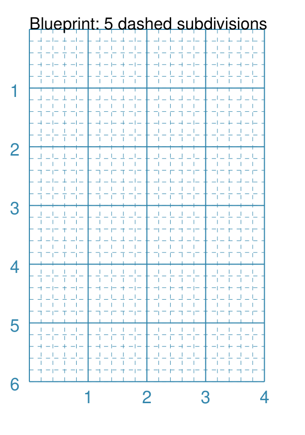

===== ======
|bl1| This example shows the Blueprint constructed using the command with these
      properties:

        .. code:: python

          Blueprint(
              stroke_width=0.5,
              subdivisions=5,
              subdivisions_dashed=[0.2, 0.1])

      It has the following properties set:

      - *stroke_width* - set to ``0.5`` |dash| thicker and more visible
      - *subdivisions* - ``5`` thinner lines between each pair of primary lines
      - *subdivisions_dashed* - a list with the length of the dash followed by
        the length of the space between two dashes - ``2`` and ``1`` mm.

      .. NOTE::

          *subdivisions* are **not** numbered and are automatically
          drawn with a thinner line using the dash settings.

===== ======

.. _blueStyleBlue:

Style - Blue
------------
`↑ <blueprint_>`_

.. |bl2| image:: images/custom/blueprint/style_blue.png
   :width: 330

===== ======
|bl2| This example shows the Blueprint constructed using the command with these
      properties:

        .. code:: python

          Blueprint(style='blue')

      It has the following properties set:

      - *style* - set to ``blue``; this affects both the line and the
        background colors

===== ======

.. _blueStyleGreen:

Style - Green
-------------
`↑ <blueprint_>`_

.. |bl3| image:: images/custom/blueprint/style_green.png
   :width: 330

===== ======
|bl3| This example shows the Blueprint constructed using the command with these
      properties:

        .. code:: python

          Blueprint(style='green')

      It has the following properties set:

      - *style* - set to `green`; this affects both the line and the background
        colors

===== ======

.. _blueStyleGray:

Style - Gray
------------
`↑ <blueprint_>`_

.. |bl4| image:: images/custom/blueprint/style_grey.png
   :width: 330

===== ======
|bl4| This example shows the Blueprint constructed using the command with these
      properties:

        .. code:: python

          Blueprint(style='gray')

      It has the following properties set:

      - *style* - set to ``gray``; this affects both the line and the background
        colors

===== ======

.. _blueStroke:

Stroke
------
`↑ <blueprint_>`_

.. |bl5| image:: images/custom/blueprint/stroke_width_red.png
   :width: 330

===== ======
|bl5| This example shows the Blueprint constructed using the command with these
      properties:

        .. code:: python

          Blueprint(stroke_width=1, stroke="red")

      It has the following properties set:

      - *stroke* - set to ``red`` for the grid line color
      - *stroke_width* - set to ``1`` |dash| thicker and more visible

===== ======

.. _blueFill:

Fill
----
`↑ <blueprint_>`_

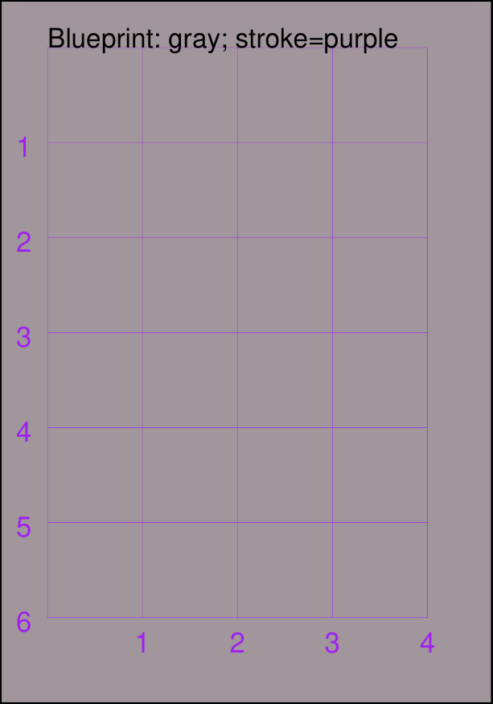

===== ======
|bl6| This example shows the Blueprint constructed using the command with these
      properties:

        .. code:: python

          Blueprint(style="gray", stroke="purple")

      It has the following properties set:

      - *style* - see `Style: Gray <blueStyleGray_>`_ above
      - *stroke* - set to ``purple`` to changes the grid line color

      **Note**: changes to line stroke, and line and fill color, will
      override the defaults for a chosen style.

===== ======

.. _blueDec:

Decimals
--------
`↑ <blueprint_>`_


===== ======
|bl7| This example shows the Blueprint constructed using the command with these
      properties:

        .. code:: python

          Blueprint(decimals=1)

      It has the following properties set:

      - *decimals* - set to ``1``; number of decimal points used for the grid
        numbers

===== ======

.. _blueEdge:

Edge Numbering
--------------
`↑ <blueprint_>`_


===== ======
|bl8| This example shows the Blueprint constructed using the command with these
      properties:

        .. code:: python

          Blueprint(edges='n,s,e,w')

      It has the following properties set:

      - *edges* - set to ``'n,s,e,w'``; grid numbers will be drawn on
        all of the four edges

      Choose which edges should be numbered by using them in the list;
      e.g. ``'e,w'`` will only number left and right edges.

===== ======

.. _blueEdgeXY:

Edges Numbering at x and y
--------------------------
`↑ <blueprint_>`_


===== ======
|bl9| This example shows the Blueprint constructed using the command with these
      properties:

        .. code:: python

          Blueprint(
              edges_y=3, edges_x=2)

      It has the following properties set:

      - *edges_y* - set to ``3``; a horizontal line of grid numbers will be
        drawn where ``y`` is equal to 3
      - *edges_x* - set to ``2``; a vertical line of grid numbers will be
        drawn where ``x`` is equal to 2

      This is not very useful for a tiny grid, but for a very large page size
      it can be helpful to set (or reset) such grid numbering while working
      on a complex design.

===== ======


.. _lineIndex:

Line
====
`↑ <table-of-contents-custom_>`_

A Line is a very common shape in many designs; there are a number of ways
that it can be customised.

- `Dotted, Dashed, Angled and Wavy <lineDotDash_>`_
- `Centred <lineCentred_>`_
- `Arrowheads <line-with-arrow_>`_
- `Connections: Circles <lineConnectionsCircle_>`_
- `Connections: Shapes <lineConnectionsShapes_>`_
- `Connections with Arrows <lineConnectionsArrow_>`_
- `Connections as Spokes <lineConnectionsSpoke_>`_

Basic Properties
----------------
`^ <lineIndex_>`_

A Line has the following properties, in addition to the basic ones of
*x* and *y* for the starting point, and its *label* properties.

- *angle* - the number of degrees clockwise that the line is rotated from
  the baseline about its start point; used in conjunction with *length*
- *cx* and *cy* - if set, will replace the use of *x* and *y* for the
  starting point, and work in conjunction with *angle* and *length* to
  create the line around a centre point
- *connections* - a list of one or more shapes that will be
  connected by the line; this property overrides any others that may have
  been set to determine **where** the line is drawn
- *connections_style* - if set to ``spoke``, will draw lines from the first
  shape to each of the other shapes in the *connections* list
- *dotted* - if ``True``, create a series of small lines i.e. the
  "dots", followed by gaps, of sizes equal to the line's *stroke_width*
- *dashed* - a list of two numbers: the first is the length of the dash;
  the second is the length of the space between each dash
- *length* - sets the specific size of the line; used in conjunction
  with *angle* (which defaults to 0 |deg|)
- *rounded* - if ``True``, draw small circles, centred at the ends of the line
- *squared* - if ``True``, draw small squares, centred at the ends of the line
- *stroke* - the color of the line
- *stroke_width* - the thickness of the line, in points
- *wave_style* - can be set to ``'wave'`` or ``'sawtooth'``
- *wave_height* - a numeric value for the height of each wave's "peak"
- *x1* and *y1* - a fixed endpoint for the line end (if not calculated by
  *angle* and *length*)

In addition, a line can have **arrows** at either or both ends. See the
details in the `arrowheads example <line-with-arrow_>`_.


.. _lineDotDash:

Example 1. Dotted, Dashed, Angled and Wavy Lines
------------------------------------------------
`^ <lineIndex_>`_


===== ======
|ln2| This example shows a Line constructed using commands with the
      following properties:

      .. code:: python

        # black lines
        Line(
            x=0, y=0.5,
            stroke_width=0.2,
            dotted=True,
            label="0.2", font_size=6)
        Line(
            x=1, y=0.5,
            stroke_width=0.4, dotted=True,
            label="0.4", font_size=6)
        Line(
            x=2, y=0.5,
            stroke_width=0.8, dotted=True,
            label="0.8", font_size=6)
        Line(
            x=3, y=0.5,
            stroke_width=1.6, dotted=True,
            label="1.6", font_size=6)

        # thick colored lines
        Line(
            x=1, y=1, stroke_width=10,
            length=2, stroke="chartreuse",
            )
        Line(
            x=1, y=1.5, stroke_width=10,
            length=2, stroke="aqua",
            stroke_ends="rounded")
        Line(
            x=1, y=2, stroke_width=10,
            length=2, stroke="gold",
            stroke_ends="squared")

        # thin colored lines
        Line(
            x=0, y=5, x1=4, y1=5.9,
            stroke="blue", stroke_width=1,
            dashed=[0.2, 0.1],
            label="dashed:[0.2,0.1]", font_size=6)
        Line(
            x=0, y=3.6,
            length=4.1, angle=15,
            stroke="red",
            label="15", font_size=6)
        Line(
            x=0, y=2.5, length=4,
            stroke="pink", stroke_width=2)

        Line(
            x=0, y=4, x1=4, y1=4,
            stroke="purple", stroke_width=1,
            wave_style='wave', wave_height=1.9)

        Line(
            x=0, y=4, x1=4, y1=4,
            stroke="firebrick", stroke_width=1,
            wave_style='sawtooth', wave_height=0.1)


      The various black lines have these properties:

      - *x* and *y* set as their starting point
      - a default length of ``1`` cm
      - *stroke_width* - set as value in points and labelled accordingly
      - *dotted* - has a value of ``True``

      The dotted line is just a series of small lines i.e. all of the "dots",
      followed by gaps, are of sizes equal to the line's *stroke_width*.

      The thin, bright red line has:

      - *angle* - of ``15`` |deg| from the baseline, clockwise

      The angle guides the direction in which the line is drawn; if not
      given |dash| as in the case of most of the other lines |dash| this
      will be 0 |deg|. The line length is then calculated based on these
      points.

      The green, gold, pink, bright red and aqua lines all have:

      - *x* and *y* set as their starting point
      - *length* - sets the specific size of the line

      The thick green, gold, aqua and pink lines do **not** have
      any *angle* property; this defaults to 0 |deg| which means the
      line is drawn to the "east" (or right of the start).

      The thick aqua line has:

      - *stroke_ends* set to ``rounded`` so circles are drawn at line ends centres

      The thick gold line has:

      - *stroke_ends* set to ``squared`` so squares are drawn at line end centres

      The dark blue line has:

      - *dashed* - length of ``2`` mm and spacing of ``1`` mm
      - *x1* and *y1* set as the ending point

      Dashes are a list of two numbers. The first is the length of the dash;
      the second is the length of the space between each dash.

      The purple line has:

      - *wave_style*  set to ``'wave'`` creating a wave-like effect
      - *wave_height* set to ``1.9`` for the height of each "peak"

      The dark red line has:

      - *wave_style*  set to ``'sawtooth'`` creating a "zig-zag" effect
      - *wave_height* set to ``0.1`` for the height of each "peak"

===== ======


.. _lineCentred:

Example 2. Centred Line
-----------------------
`^ <lineIndex_>`_

A line can be drawn at a centre point by providing the following properties:

- centre - set using *cx* and *cy* values
- *length* - the length of the line
- *angle* - the rotation of the line, anti-clockwise from the baseline

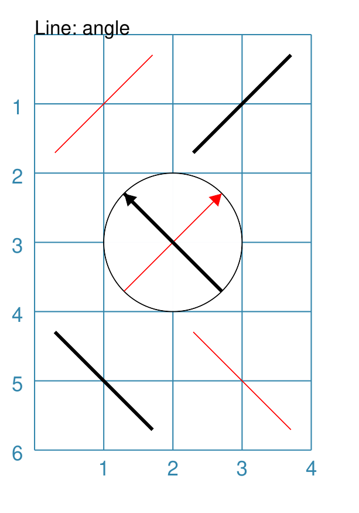

===== ======
|ln4| This example shows a Line constructed using commands with the
      following properties:

      .. code:: python

        Line(cx=1, cy=1, angle=45,
             length=2, stroke="red")
        Line(cx=3, cy=1, angle=225,
             length=2, stroke_width=1.5)

        Circle(cx=2, cy=3, radius=1)
        Line(cx=2, cy=3, angle=45, length=2,
             stroke="red", arrow_width=0.2)
        Line(cx=2, cy=3, angle=135, length=2,
             stroke_width=1.5, arrow_width=0.2)

        Line(cx=1, cy=5, angle=135,
             length=2, stroke_width=1.5)
        Line(cx=3, cy=5, angle=315,
             length=2, stroke="red")

      The top two lines are rotated at 45 |deg| (red) and 255 |deg|
      (thick black).

      The bottom two lines are rotated at 135 |deg| (thick black) and
      315 |deg| (red).

      While each pair appears to be "in the same direction", the use of the
      arrow property will display the actual direction; so the 45 |deg| (red)
      line in the circle points to 45 |deg|, while the 135 |deg|
      (thick black) points to 135 |deg|.

===== ======


.. _line-with-arrow:

Example 3. Arrowheads on Line
-----------------------------
`^ <lineIndex_>`_

In addition to styling a Line, it is also possible to specify an arrow
(also called an "arrowhead") for the line; a small "pointing" symbol to
signify direction.

This is different from the standalone :ref:`Arrow <arrow-command>` which
allows a much higher degree of customisation.

The following properties can be set:

- *arrow* - if set to ``True`` will cause a default arrow to be drawn
- *arrow_style* - can be set to ``notch``, ``angle``, or ``spear`` to change
  the default shape of the arrow
- *arrow_fill* - set the color of the arrow, which otherwise defaults to the
  color of the line
- *arrow_stroke* - set the color of the arrow with style ``angle``, which
  otherwise defaults to the color of the line
- *arrow_width* - set the width of the arrow at its base,  which otherwise
  defaults to a multiple of the line width
- *arrow_height* - set the height of the arrow, which otherwise
  defaults to a value proportional to the arrow *width* |dash| specifically,
  the height of the equilateral triangle used for the default arrow style
- *arrow_position* - set a value (single number), or values (list of numbers),
  that represents the fractional distance along the line at which the arrow tip,
  or tips, must be positioned relative to the start of the line
- *arrow_double* - if set to ``True`` make a copy of the same arrow, with the
  same properties as above, but facing in the opposite direction


===== ======
|ln3| This example shows a Line constructed using commands with the
      various properties.

      Note the use of the :ref:`Common command <the-common-command>`
      for when multiple Lines all need to share the same properties.

      .. code:: python

        # black styled arrows
        Line(x=0.5, y=1, x1=0.5, y1=0,
             arrow=True)
        Line(x=1.5, y=1, x1=1.5, y1=0,
             arrow_style='notch')
        Line(x=2.5, y=1, x1=2.5, y1=0,
             arrow_style='angle')
        Line(x=3.5, y=1, x1=3.5, y1=0,
             arrow_style='spear')
        # rotated lines; double arrow
        dbl_ang = Common(
            arrow_style='angle',
            arrow_double=True)
        Line(common=dbl_ang,
             x=0, y=1.75, x1=1, y1=1.25)
        Line(common=dbl_ang,
             x=2, y=1.5, x1=1, y1=1.5)
        Line(common=dbl_ang,
             x=2, y=1.25, x1=3, y1=1.75)
        Line(common=dbl_ang,
             x=3, y=1.5, x1=4, y1=1.5)
        # colored lines and arrows
        Line(x=0, y=3, x1=1, y1=2,
             arrow=True)
        Line(x=1, y=3, x1=2, y1=2,
             arrow_style='notch',
             stroke="tomato")
        Line(x=2, y=3, x1=3, y1=2,
             arrow_style='angle',
             stroke="chartreuse")
        Line(x=3, y=3, x1=4, y1=2,
             arrow_style='spear',
             stroke="aqua")
        # set size of arrow heads
        bigger = Common(
            arrow_width=0.2,
            arrow_height=0.3)
        Line(common=bigger,
             x=0, y=4, x1=1, y1=3,)
        Line(common=bigger,
             x=1, y=4, x1=2, y1=3,
             arrow_style='notch')
        Line(common=bigger,
             x=2, y=4, x1=3, y1=3,
             arrow_style='angle')
        Line(common=bigger,
             x=3, y=4, x1=4, y1=3,
             arrow_style='spear')
        # sized and colored arrow heads
        big_color = Common(
            arrow_width=0.2,
            arrow_height=0.3,
            arrow_fill="yellow",
            arrow_stroke="red")
        Line(common=big_color,
             x=0, y=5, x1=1, y1=4,)
        Line(common=big_color,
             x=1, y=5, x1=2, y1=4,
             arrow_style='notch')
        Line(common=big_color,
             x=2, y=5, x1=3, y1=4,
             arrow_style='angle')
        Line(common=big_color,
             x=3, y=5, x1=4, y1=4,
             arrow_style='spear')
        # positioned arrow heads
        Line(x=0.5, y=6, x1=0.5, y1=5,
             stroke_width=1,
             dotted=True,
             arrow_position=0.66,
             arrow_double=True)
        Line(x=1, y=6, x1=2, y1=5,
             arrow_position=[0.25, 0.5, 0.75])
        Line(x=2.5, y=6, x1=2.5, y1=5,
             arrow_position=[1.0, 0.93])

        # two lines superimposed
        Line(x=3, y=6, x1=4, y1=5,
             arrow_style='spear',
             arrow_height=0.15)
        Line(x=3, y=6, x1=4, y1=5,
             arrow_style='angle',
             arrow_width=0.15,
             arrow_position=[0.1, 0.15, 0.2])

      The first row shows default-sized arrows of differing styles;
      ``triangle`` (the default), ``notch``,  ``angle``, and ``spear``.
      As with other types of styles, these can be referred to by their
      initial letters: *t*, *n*, *a*, or *s*.

      To enable an arrow display, either use ``arrow=True`` **or**  set one
      of the properties described in this example.

      The second row shows the default arrow but with the line rotated in
      different directions. In this case ``arrow_double=True`` means the
      same arrow is drawn twice; facing in each direction.

      The third row shows how arrows take on the stroke color of the line
      to which they are attached.

      The fourth row shows how the arrow's *height* and *width* (across the
      "base" of the arrow) can be set to control it's size. **Note** that the
      ``spear`` arrow is always twice the height of the others!

      The fifth row shows how the arrow can be set to a different color from
      that of its line.  **Note** that the ``angle`` arrow there is no *fill*
      color, and that for the other styles, the *stroke* color is set to match
      the *fill* color.

      The sixth row shows how the *arrow_position* property can be set. The
      value, or values, represent the fractional distance along the line at
      which the arrow tip, or tips, is positioned relative to the start of
      the line. So, ``0.66`` represents a distance 66% along the line from
      the start towards the end. A list (inside the ``[``..``]`` brackets)
      of values means the arrow is drawn in multiple places along the line.

      The bottom left image shows how the default arrow expands in size
      proportional to the thickness (*stroke_width*) of the Line. Again,
      because ``arrow_double=True`` the same arrow is drawn twice; facing
      in each direction, but the ``arrow_position=0.66`` property means
      the arrows are each drawn about two-thirds of the way along the line,
      relative to their different "starts".

      The bottom right image is a "cheat" of sorts.  Two lines are drawn in
      the same location but with different styled arrows in different
      positions.

===== ======

.. _lineConnectionsCircle:

Example 4. Connections: Circle
------------------------------
`^ <lineIndex_>`_

To connect two or more shapes, supply a list of them, together with a
*connection point*, for the *connections* property of the line.

The *connection point* for circular shapes |dash| ``Circle`` and ``Dot`` |dash|
is not required, as the connecting line is always drawn to/from the centre
of such a shape.

For non-circular shapes |dash| for example, ``Rectangle`` or ``Hexagon`` |dash|
such a shape must have either/or vertex points, or perbis points, that can be
specified as the *connection point* to which the line will connect. This point
must be set along with the shape, in the  *connections* property setting.

.. NOTE::

  Use of the *connections* property overrides any other properties that may
  have been set to specify **where** the line will be drawn.  The other
  properties that specify **how** the line will be appear will still be used.


.. |ln7| image:: images/customised/line_connections_circle.png
   :width: 330

===== ======
|ln7| This example shows a Line constructed using commands with the
      following properties:

      .. code:: python

        cc = Circle(cx=2, cy=3, radius=0.5)

        cy = Circle(cx=1, cy=1, radius=0.5,
                    fill_stroke="yellow")
        Line(connections=[cc, cy])

        ca = Circle(cx=1, cy=5, radius=0.5,
                    fill_stroke="aqua")
        Line(connections=[cc, ca])

        cr = Circle(cx=3, cy=1,
                    radius=0.5, fill_stroke="red")
        Line(connections=[cc, cr])

        co = Circle(cx=3, cy=5, radius=0.5,
                    fill_stroke="orange")
        Line(connections=[cc, co])

        # orthogonal
        Line(
            connections=[cy, cr, co, ca, cy],
            stroke_width=2)

      This example shows how Circles that are defined and drawn as normal
      can be assigned to a name e.g. ``cc`` for the white Circle, and then
      connected by a Line via the *connections* property.

      The *connections* property requires two or more shapes in a
      list so that the Line can be drawn between them.

      Using the *connections* property means that the normal point locations,
      or line angle, are **not** used but are superceded by calculated values.
      The "start" of the line is at the centre of the first circular shape
      and the "end" of the line is at the centre of the second circular shape.
      However, the line itself is only drawn between the boundaries of those
      shapes.

      The thick black line is drawn between a series of shapes, starting and
      ending at the yellow circle.

===== ======

.. _lineConnectionsShapes:

Example 5. Connections: Shapes
------------------------------
`^ <lineIndex_>`_

To connect two or more non-circular shapes |dash| for example, ``Rectangle``
or ``Hexagon`` |dash| supply a list of these, along with the settings for
each of their *connection points*, as the *connections* property of the line.

The *connection point* setting for non-circular shapes must specify:

- the shape name;
- the connection type |dash| either a vertex point (``v``) or a perbis
  point (``p``);
- the connection location, as a :ref:`compass direction <termsDirection>`.

.. NOTE::

  Use of the *connections* property overrides any other properties that may
  have been set to specify **where** the line will be drawn.  The other
  properties that specify **how** the line will be appear will still be used.


.. |ln8| image:: images/customised/line_connections_shapes.png
   :width: 330

===== ======
|ln8| This example shows a Line constructed using commands with the
      following properties:

      .. code:: python

        s1 = Square(
          xx=1, cy=4, side=1,
          fill="yellow")
        s2 = Square(
          cx=3, cy=2, side=1)
        Line(
          connections=[
            (s1, 'v', 'ne'),
            (s2, 'p', 'w')
          ],
          stroke="red",
          stroke_width=2)

      This example shows how Squares that are defined and drawn as normal
      can be assigned to a name e.g. ``r1`` for the yellow Square, and then
      connected by a Line via the *connections* property.

      The *connections* property requires two or more shapes, together with
      their connection points, in a  list so that the Line can be drawn between
      them.

      Using the *connections* property means that the normal point locations,
      or line angle, are **not** used but are superceded by the calculated
      values for the start and end of the line.  In this case, for example,
      the start of the line is at the north-east vertex of the yellow square,
      and the end of the line is at the west perbis point of the white square.

===== ======


.. _lineConnectionsArrow:

Example 6. Connections - Arrow
------------------------------
`^ <lineIndex_>`_

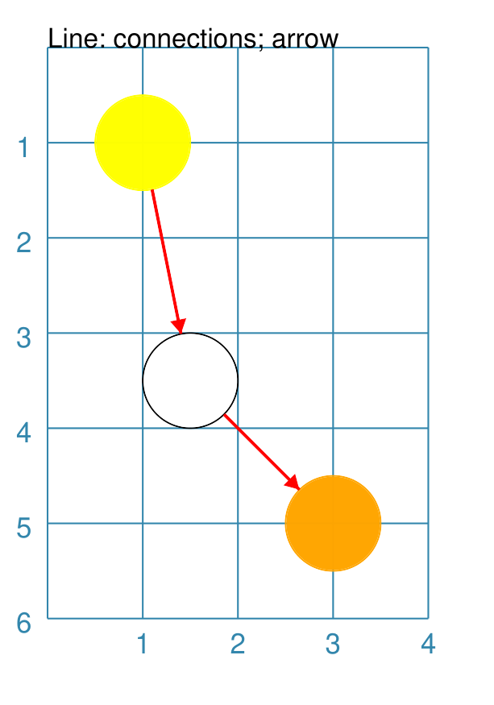

===== ======
|ln5| This example shows a Line constructed using commands with the
      following properties:

      .. code:: python

        cc = Circle(cx=1.5, cy=3.5, radius=0.5)
        cy = Circle(cx=1, cy=1, radius=0.5,
                    fill_stroke="yellow")
        co = Circle(cx=3, cy=5, radius=0.5,
                    fill_stroke="orange")
        Line(connections=[cy, cc, co],
             stroke="red",
             stroke_width=1,
             arrow=True,
             )

      Similarly to `Example 4 <lineConnectionsCircle_>`_, the line is drawn
      between a series of ``Circle`` shapes.

      In this case, the line has been styled with color and thickness, and
      the *arrow* has been "switched on".  The arrow points in the direction
      corresponding to the order of the shapes in the *connections* list.

===== ======

.. _lineConnectionsSpoke:

Example 7. Connections - Spoke
------------------------------
`^ <lineIndex_>`_

.. |ln6| image:: images/customised/line_connections_spoke.png
   :width: 330

===== ======
|ln6| This example shows a Line constructed using commands with the
      following properties:

      .. code:: python

        cc = Dot(cx=1.5, cy=3.5, dot_width=2)
        cr = Circle(cx=3, cy=1, radius=0.5,
                    fill_stroke="red")
        co = Circle(cx=3, cy=5, radius=0.5,
                    fill_stroke="orange")
        ca = Circle(cx=1, cy=5, radius=0.5,
                    fill_stroke="aqua")
        Line(connections=[cc, cr, co, ca],
             connections_style='spoke',
             stroke="green",
             stroke_width=1,
             arrow=True,
             )

      Similarly to `Example 6 <lineConnectionsArrow_>`_, the line is drawn
      as an arrow between the shapes.

      However, the use of the ``connections_style='spoke'`` property means
      each line is drawn from the first shape in the list to each of the
      others, rather than as a series of connections.

      Note that ``Dot()`` shape is used here instead of a ``Circle()``.

===== ======


.. _rectangleIndex:

Rectangle
=========
`↑ <table-of-contents-custom_>`_

A Rectangle is a very common shape in many designs; there are a number of ways
that it can be customised.

- `Borders <rectBorders_>`_
- `Centred <rectCentred_>`_
- `Corners <rectCorners_>`_
- `Cross and Dot <rectCross_>`_
- `Chevron <rectChevron_>`_
- `Hatches <rectHatches_>`_
- `Notch <rectNotch_>`_
- `Peak <rectPeak_>`_
- `Perbii <rectPerbii_>`_
- `Prows <rectProws_>`_
- `Radii <rectRadii_>`_
- `Rotation <rectRotation_>`_
- `Rounding <rectRounding_>`_
- `Slices <rectSlices_>`_
- `Stripes <rectStripes_>`_
- `Ordering of Properties <rectOrder_>`_

.. _rectCentred:

Centred
-------
`^ <rectangleIndex_>`_

.. |rcn| image:: images/custom/rectangle/centre.png
   :width: 330

===== ======
|rcn| This example shows a Rectangle constructed using the command:

      .. code:: python

         Rectangle(cx=2, cy=3)

      It has the following properties that differ from the defaults:

      - *cx* and *cy* are used to set the centre of the Rectangle at
        ``2`` and ``3`` centimetres respectively

===== ======

.. _rectCorners:

Corners
-------
`^ <rectangleIndex_>`_

The corners property can superimpose a drawing onto each corner of the
Rectangle.  Each corner drawing can support customisation of its size,
stroke color, fill color and style.  The available styles are:

- *line* - a simple line
- *triangle* - a triangular shape
- *curve* - a triangular shape with a curved inner edge
- *photo* - a triangular shape with a cut-out notch

It is possible to limit where the corners are drawn by setting the
*corner_directions* property to one or more of the secondary compass
directions e.g. ``corner_directions="ne sw"``.

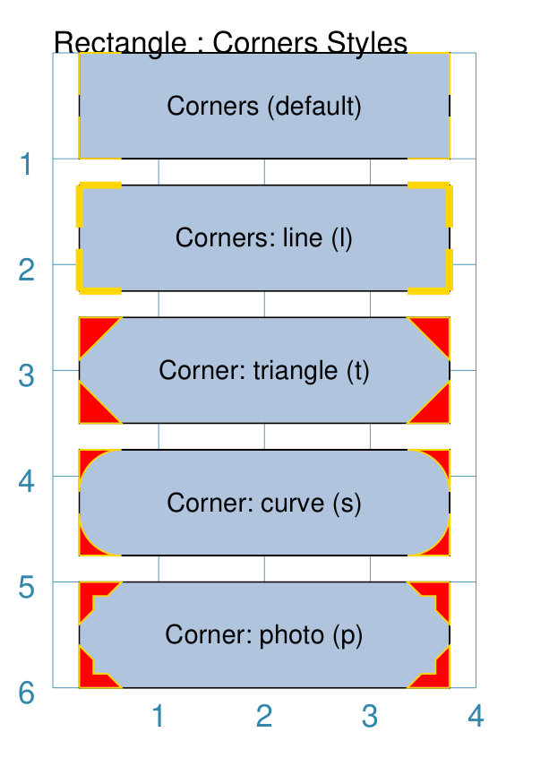

===== ======
|rcr| This example shows a Rectangle constructed using the command:

      .. code:: python

        styles = Common(
            height=1, width=3.5, x=0.25,
            label_size=7,
            fill="lightsteelblue",
            corner=0.4,
            corner_stroke="gold",
            corner_fill='red',
        )
        Rectangle(
            common=styles, y=0,
            label='Corner (default)')
        Rectangle(
            common=styles, y=1.25,
              corner_style='line',
              corner_stroke_width=2,
              label='Corner: line (l)')
        Rectangle(
            common=styles, y=2.5,
            corner_style='triangle',
            label='Corner: triangle (t)')
        Rectangle(
            common=styles, y=3.75,
            corner_style='curve',
            label='Corner: curve (s)')
        Rectangle(
            common=styles, y=5,
            corner_style='photo',
            label='Corner: photo (p)')

      Here all corners share a common stroke (``red``) and fill (``gold``),
      as well as a size (``0.4``).  The "size" is the length of the corner
      drawing along the side of the Rectangle.  It is possible to set different
      sizes in the x- and y- direction by using the properties *corner_x* and
      *corner_y*.

      The default corner is a simple line, as shown in the top rectangle.

===== ======


.. _rectCross:

Cross and Dot
-------------
`^ <rectangleIndex_>`_

A cross or a dot are symbols that mark the centre of the Rectangle.
They are usually the last parts that are drawn.

.. |rdc| image:: images/custom/rectangle/dot_cross.png
   :width: 330

===== ======
|rdc| This example shows a Rectangle constructed using the command:

      .. code:: python

        Rectangle(height=3, width=2, cross=0.75, dot=0.15)

      It has the following properties that differ from the defaults:

      - *height* and *width* are used to set the size of the Rectangle at ``3``
        and ``2`` centimetres respectively
      - *cross* - the length of each of the two lines that cross at the centre
        is set to ``0.75`` cm (7.5mm)
      - *dot* - a circle with a diameter of ``0.15`` cm (1.5mm); the fill color
        for the dot is the same as its stroke

===== ======

.. _rectChevron:

Chevron
-------
`^ <rectangleIndex_>`_

A chevron converts opposite sides of the Rectangle into two triangular peaks
that both point in a specified direction.  This creates an arrow-like effect.

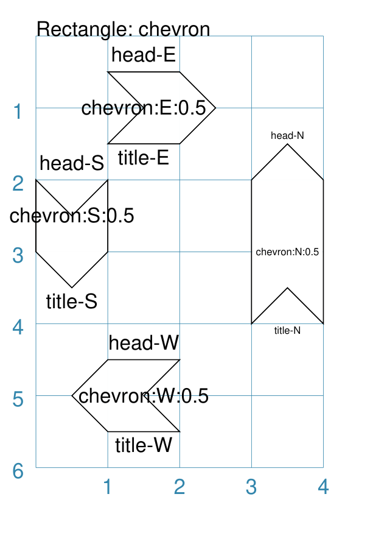


===== ======
|rcv| This example shows Rectangles constructed using these commands:

      .. code:: python

        styles = Common(
            height=2, width=1,
            font_size=4)

        Rectangle(
            common=styles,
            x=3, y=2,
            chevron='N',
            chevron_height=0.5,
            label="chevron:N:0.5",
            title="title-N",
            heading="head-N",
            )
        Rectangle(
            x=0, y=2,
            chevron='S',
            chevron_height=0.5,
            label="chevron:S:0.5",
            title="title-S",
            heading="head-S",
            )
        Rectangle(
            x=1, y=4.5,
            chevron='W',
            chevron_height=0.5,
            label="chevron:W:0.5",
            title="title-W",
            heading="head-W",
            )
        Rectangle(
            x=1, y=0.5,
            chevron='E',
            chevron_height=0.5,
            label="chevron:E:0.5",
            title="title-E",
            heading="head-E",
            )

      These Rectangles all share the following Common properties that
      differ from the defaults:

      - *height* and *width* - set the basic configuration
      - *font_size* - the default size for any text associated with the
        Rectangle

      Each Rectangle has its own setting for:

      - *x* and *y* - different positions on the page for the upper-left
        corner
      - *label*, *title* and *heading* - text to describe the shape's setting
      - *chevron* - the primary compass direction in which the chevron is
        pointing; N(orth), S(outh), E(ast) or W(est)
      - *chevron_height* - the distance of the chevron peak from the side of
        the Rectangle it is adjacent to

      Note that the *label* is centered in the Rectangle and **not** between
      the chevrons.

===== ======

.. _rectHatches:

Hatches
-------
`^ <rectangleIndex_>`_

Hatches are a set of parallel lines that are drawn, in a specified direction,
across the length or width of the Rectangle in a vertical, horizontal or
diagonal direction.  Hatches are equally spaced across the height or width
of the Rectangle.

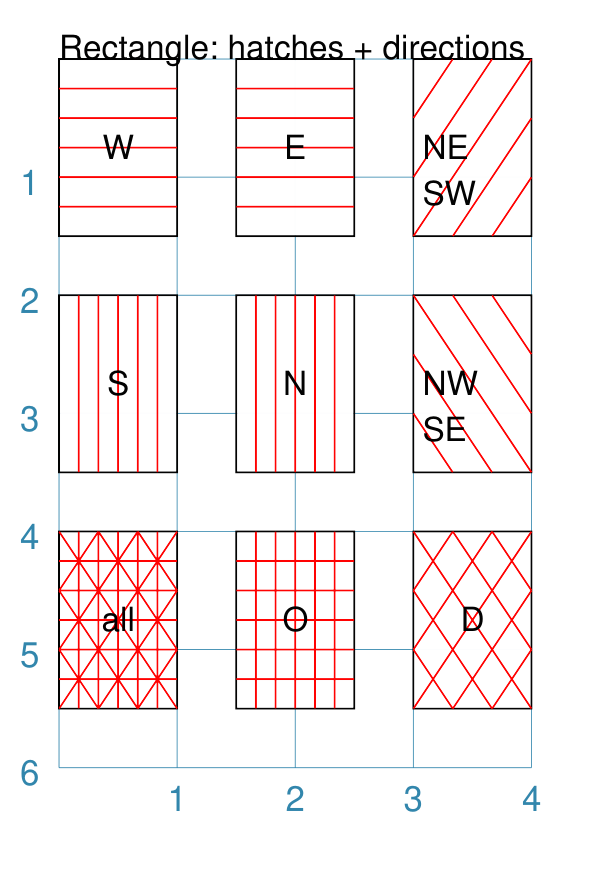

===== ======
|rht| This example shows Rectangles constructed using these commands:

      .. code:: python

        htch = Common(
          height=1.5, width=1,
          hatches_count=5,
          hatches_stroke_width=0.1,
          hatches_stroke="red")

        Rectangle(
          common=htch, x=0, y=0,  hatches='w', label="W")
        Rectangle(
          common=htch, x=1.5, y=0, hatches='e', label="E")
        Rectangle(
          common=htch, x=3, y=0, hatches='ne', label="NE\nSW")

        Rectangle(
          common=htch, x=0, y=2,  hatches='s', label="S")
        Rectangle(
          common=htch, x=1.5, y=2, hatches='n', label="N")
        Rectangle(
          common=htch, x=3, y=2, hatches='nw', label="NW\nSE")

        Rectangle(
          common=htch, x=0, y=4, label="all")
        Rectangle(
          common=htch, x=1.5, y=4, hatches='o', label="O")
        Rectangle(
          common=htch, x=3, y=4, hatches='d', label="D")

      These Rectangles all share the following Common properties that
      differ from the defaults:

      - *height* and *width* - set the basic configuration
      - *hatches_count* - sets the **number** of lines to be drawn; the
        intervals between them are equal and depend on the direction
      - *hatches_stroke_width* - set to ``0.1`` point; a fairly thin line
      - *hatches_stroke* - set to the color ``red`` to make it stand out
        from the rectangle sides

      Each Rectangle has its own setting for:

      - *x* and *y* - different positions on the page for the upper-left
        corner
      - *label* - text to help identify it
      - *hatches* - if not specified, hatches will be drawn
        in all directions |dash| otherwise:

        - ``n`` (North) or ``s`` (South) draws vertical lines;
        - ``w`` (West) or ``e`` (East) draws horizontal lines;
        - ``nw`` (North-West) or ``se`` (South-East) draws diagonal lines
          from top-left to bottom-right;
        - ``ne`` (North-East) or ``sw`` (South-West) draws diagonal lines
          from bottom-left to top-right;
        - ``o`` (orthogonal) draws vertical **and** horizontal lines;
        - ``d`` (diagonal) draws diagonal lines between adjacent sides.

===== ======

.. _rectNotch:

Notch
-----
`^ <rectangleIndex_>`_

Notches are small indents |dash| or outdents |dash| that are drawn in the
specified corners of the Rectangle.


.. |rns| image:: images/custom/rectangle/notch_style.png
   :width: 330

Example 1. Size & Location
++++++++++++++++++++++++++

===== ======
|rnt| This example shows Rectangles constructed using these commands:

      .. code:: python

        Rectangle(
            x=2, y=1, height=2, width=1,
            label="notch:0.5", label_size=5,
            notch=0.25,
        )
        Rectangle(
            x=1, y=4, height=1, width=2,
            label="notch:.25/.5 loc: NW, SE", label_size=5,
            notch_x=0.5, notch_y=0.25,
            notch_directions="NW SE",
        )

      These share the following properties:

      - *x* and *y*, *height* and *width* - set the basic configuration
      - *label*, *label_size* - text to describe the shape's setting

      The first Rectangle has:

      - *notch* - the size of the triangular shape that will be "cut" off the
        corners of the rectangle'; because no *notch_directions* property is set,
        **all** corners will have a notch

      The second Rectangle has:

      - *notch_x* - the distance from the corner in the x-direction where the
        notch will start
      - *notch_y* - the distance from the corner in the y-direction where the
        notch will start
      - *notch_directions* - the direction of the specific corner or corners of
        the rectangle where the notch will be applied

===== ======

Example 2. Styles
+++++++++++++++++

===== ======
|rns| These examples shows Rectangles constructed using these commands:

      .. code:: python

        styles = Common(
          height=1, width=3.5, x=0.25,
          notch=0.25, label_size=7, fill="lightsteelblue")

        Rectangle(
          common=styles, y=0,  notch_style='snip',
          label='Notch: snip (s)')
        Rectangle(
          common=styles, y=1.25, notch_style='step',
          label='Notch: step (t)')
        Rectangle(
          common=styles, y=3.5, notch_style='fold',
          label='Notch: fold (o)')
        Rectangle(
          common=styles, y=4.25, notch_style='flap',
          label='Notch: flap (l)')
        Rectangle(
          common=styles,
          y=5.0, notch_style='bite',
          label='Notch: bite (b)')

      These Rectangles all share the following Common properties that differ from the
      defaults:

      - *height* and *width* - set the basic configuration
      - *x* - sets the position of the left edge
      - *fill* - set to the color ``lightsteelblue``
      - *notch* - size of notch, in terms of distance from the corner

      Each *notch_style* results in a slightly different corner effect:

      - *snip* - is a small triangle "cut out"; this is the default style
      - *step* - is sillohette of a step "cut out"
      - *fold* - makes it appear there is a crease across the corner
      - *flap* - makes it appear that the corner has a small, liftable flap
      - *bite* - a curved portion is "cut out"; this will be a quarter-circle
        if *notch_x* and *notch_y* are equal

===== ======

.. _rectPeak:

Peak
----
`^ <rectangleIndex_>`_

A peak is small triangular shape that juts out from the side of a Rectangle in
a specified direction.

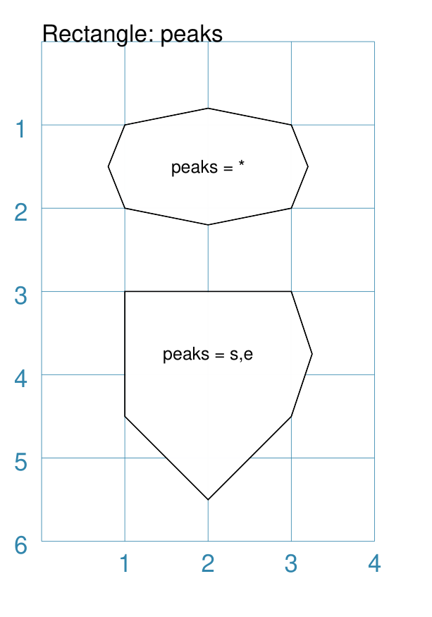

===== ======
|rpk| This example shows Rectangles constructed using these commands:

      .. code:: python

        Rectangle(
            x=1, y=1, width=2, height=1,
            font_size=6, label="peaks = *",
            peaks=[("*", 0.2)]
        )
        Rectangle(
            x=1, y=3, width=2, height=1,
            font_size=6, label="points = s,e",
            peaks=[("s", 1), ("e", 0.25)]
        )

      The Rectangles all have the following properties that differ from the defaults:

      - *x* and *y*; *width* and *height* - set the basic configuration
      - *label*, *font_size* - for the text to describe the shape's peak setting
      - *peaks* - the value(s) used to create the peak

      The *peaks* property is a list:

      - the square brackets (``[`` to ``]``) contain one or more sets
      - each set is enclosed by round brackets, consisting of a *direction*
        and a peak *size*:

        - Directions are the primary compass directions - (n)orth,
          (s)outh, (e)ast and (w)est,
        - Sizes are the distances of the centre of the peak from the edge
          of the Rectangle.

      *Note*: If the value ``*`` is used for a direction, it is a short-cut
      meaning that peaks should drawn in all four directions.

===== ======


.. _rectPerbii:

Perbii
------
`^ <rectangleIndex_>`_

"Perbis" is a shortcut name for "perpendicular bisector"; and "perbii" is the
the plural. These lines are drawn from the centre of a Rectangle towards the
mid-points of its edges.


===== ======
|rpb| This example shows Rectangles constructed using these commands:

      .. code:: python

        prbs = Common(
            height=2, width=1,
            perbii_stroke_width=2,
            perbii_stroke="red")
        Rectangle(
            common=prbs, x=0.5, y=1,
            perbii='n', label="N")
        Rectangle(
            common=prbs, x=2.5, y=1,
            perbii='s', label="S")
        Rectangle(
            common=prbs, x=0.5, y=4,
            perbii='w', label="W")
        Rectangle(
            common=prbs, x=2.5, y=4,
            perbii='e', label="E")

      These Rectangles all share the following Common properties that
      differ from the defaults:

      - *height* and *width* - set the basic configuration
      - *perbii_stroke_width* - set to ``2`` points; a thick line
      - *perbii_stroke* - set to the color ``red`` to make it stand out
        from the Rectangle

      Each Rectangle has its own setting for:

      - *x* and *y* - different positions on the page for the upper-left
        corner
      - *label* - text to help identify it
      - *perbii* - if specified with a ``*`` then perbii will be drawn
        in all directions |dash| otherwise:

        - ``n`` (North) or ``s`` (South) draw a vertical line
        - ``w`` (West) or ``e`` (East) draw a horizontal line

===== ======


.. _rectProws:

Prows
-----
`^ <rectangleIndex_>`_

A *prow* is a pair of curved lines that jut out from the side of a Rectangle
in a specified direction to a specifed distance.

The *prow* property is a list of one or more sets of values |dash|
``[(..), (...), ...]``.

Each set **must** start with a compass direction |dash| n, s, e, or w |dash|
indicating at which side the prow must be drawn. Using a value of ``"*"``
means that the prow will be drawn in all directions.

The default *prow* will be two curves extending to a point ``1`` unit away
from the edge of the rectangle.

A set can also contain the *prow* height |dash| the distance away from the
from the edge of the rectangle.

Finally, a set can contain a pair of values that represent the positioning of
a "control" point that will change the amount of the curvature of the prow
lines.  This pair is: the *x* distance relative to the perpendicular line
through the centre of the edge; and the *y* distance relative to the edge
|dash| for top- and bottom edges; and vice-versa for the vertical edges.
Both height and control values can be negative which will affect the direction
of drawing.

Example 1. Defaults etc.
++++++++++++++++++++++++


===== ======
|rw1| This example shows Rectangles constructed using these commands:

      .. code:: python

        Rectangle(
            cx=1, cy=1, width=1, height=1,
            prows=[("e",)]
        )
        Rectangle(
            cx=1, cy=3, width=1, height=1,
            prows=[("n", 0.5)]
        )
        Rectangle(
            cx=3, cy=3, width=1, height=1,
            fill="silver",
            prows=[("*", -0.1)]
        )
        Rectangle(
            cx=1, cy=5, width=1, height=1,
            prows=[("*", 0.8, (0.3, 0.45))]
        )
        Rectangle(
            cx=3, cy=5, width=1, height=1,
            fill="gold",
            prows=[("*", -0.8, (-0.3, -0.45))]
        )

      The top rectangle has a single prow extending in the east direction;
      this has a default distance of ``1`` cm away from the edge.

      The middle-left rectangle has a single prow extending in the north
      direction; this has a specified distance of ``0.5`` cm.  Because the
      prow distance is equal to half the length of the edge, each curve of the
      prow forms a quarter-circle and the prow as a whole forms a semi-circle.

      The bottom-left rectangle has prows extending in all directions (``*``)
      to a specified distance of ``0.8`` cm. The settings of *x* and *y*
      values for the control point affect the shape of the prow curves.

      The grey middle-right rectangle has a negative height of ``-0.1`` cm
      for all directions and so all the lines are drawn inwards.

      The yellow bottom-right rectangle has prows extending in all directions
      and negative height and negative control point values.  This results in
      the unusual pattern shown.

===== ======

Example 2. Inwards
++++++++++++++++++


===== ======
|rw2| This example shows a Rectangle constructed using these properties:

      .. code:: python

        Rectangle(
            x=1.5, y=2, width=1, height=2,
            fill="gold",
            stroke="orange",
            stroke_width=2,
            prows=[
                ("n", 2, (0.22, 0.22)),
                ("s", 2, (0.22, 0.22)),
                ("e", 1.5, (0.33, 0.33)),
                ("w", 1.5, (0.33, 0.33)),
            ]
        )

      This example shows how an almost-seamless star-like shape can be formed
      by appropriate setting of the control points for a rectangle.

===== ======

Example 3. Outwards
+++++++++++++++++++


===== ======
|rw3| This example shows a Rectangle constructed using these properties:

      .. code:: python

        Rectangle(
            x=1.5, y=2, width=1, height=3,
            fill="silver",
            stroke="darkgrey",
            stroke_width=2,
            prows=[
                ("n", 1, (0.44, 0.44)),
                ("s", 0.2, (0.2, 0.2)),
            ]
        )

      This example shows how a ship-like shape can be formed by appropriate
      setting of the heights and control points for a rectangle.

===== ======

.. _rectRadii:

Radii
-----
`^ <rectangleIndex_>`_

Radii are lines from the centre of a Rectangle towards its vertices.

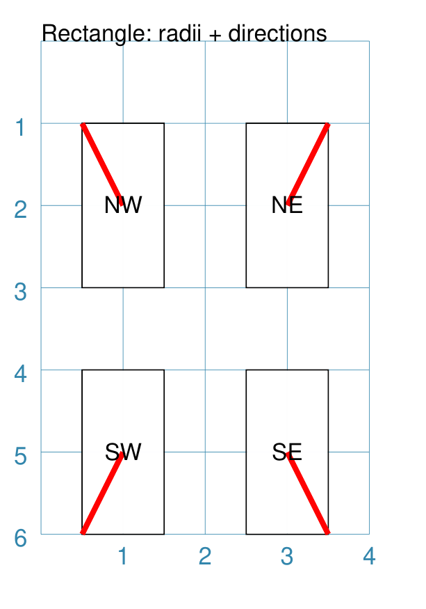

===== ======
|rpi| This example shows Rectangles constructed using these commands:

      .. code:: python

        rds = Common(
            height=2, width=1,
            radii_stroke_width=2,
            radii_stroke="red")
        Rectangle(
            common=rds, x=0.5, y=1,
            radii='nw', label="NW")
        Rectangle(
            common=rds, x=2.5, y=1,
            radii='ne', label="NE")
        Rectangle(
            common=rds, x=0.5, y=4,
            radii='sw', label="SW")
        Rectangle(
            common=rds, x=2.5, y=4,
            radii='se', label="SE")

      These Rectangles all share the following Common properties that
      differ from the defaults:

      - *height* and *width* - set the basic configuration
      - *radii_stroke_width* - set to ``2`` points; a thick line
      - *radii_stroke* - set to the color ``red`` to make it stand out
        from the Rectangle

      Each Rectangle has its own setting for:

      - *x* and *y* - different positions on the page for the upper-left
        corner
      - *label* - text to help identify it
      - *radii* - if specified with a ``*`` then radii will be drawn
        in all directions |dash| otherwise:

        - ``ne`` (NorthEast) or ``nw`` (NorthWest) draw a upward sloping line
        - ``se`` (SouthEast) or ``sw`` (SouthWest) draw a downward sloping line

===== ======


.. _rectRotation:

Rotation
--------
`^ <rectangleIndex_>`_


Rotation takes place in anti-clockwise direction, from the horizontal, around
the centre of the Rectangle.

===== ======
|rrt| This example shows Rectangles constructed using the commands:

      .. code:: python

        Rectangle(
            cx=2, cy=3, width=1.5, height=3, dot=0.06)
        Rectangle(
            cx=2, cy=3, width=1.5, height=3, dot=0.04,
            fill=None,
            stroke="red", stroke_width=0.3, rotation=45,)

      The first, upright, Rectangle is a normal one, with a black outline.

      It is centred at x-location ``2`` cm and y-location ``3`` cm with a small
      black centred *dot*.

      The second Rectangle is similar to the first, except:

      - *dot* - has the same color as the *stroke* (by default) and is smaller
        than the *dot* of the  first Rectangle
      - *fill* - set to ``None`` to make it fully transparent, allowing
        the first Rectangle to show "below"
      - *stroke* - set to ``red`` to highlight it
      - *rotation* - of 45 |deg|; anti-clockwise from the horizontal

===== ======

.. _rectRounding:

Rounding
--------
`^ <rectangleIndex_>`_

Rounding changes the corners of a Rectangle from a sharp, right-angled, join
into the arc of a quarter-circle.


===== ======
|rnd| This example shows Rectangles constructed using the commands:

      .. code:: python

        rct = Common(
            x=0.5,
            height=1.5, width=3.0,
            stroke_width=.5,
            hatches_stroke="red",
            hatches='o')

        Rectangle(
            common=rct, y=1,
            rounding=0.1,
            hatches_count=10)
        Rectangle(
            common=rct, y=4,
            rounding=0.5,
            hatches_count=3)

      Both Rectangles share the Common properties of:

      - *x* - left side location
      - *height* and *width* - ``1.5`` and ``3.0`` cm
      - *hatches_stroke* - set to ``red``
      - *hatches* directions of ``o`` (for orthogonal)

      These properties set the color and directions of the lines crossing
      the Rectangles.

      The upper Rectangle has these specific properties:

      - *rounding* - set to ``0.1``; circle corner radius
      - *hatches_count* - set to  ``10``; the number of lines
        in both vertical and horizontal directions

      The lower Rectangle has these specific properties:

      - *rounding* - set to ``0.5``; circle corner radius
      - *hatches_count* - set to ``3``; the number of lines
        in both vertical and horizontal directions.

      It should be noted that if the rounding is too large in comparison with
      the number of hatches, as in this example:

        .. code:: python

          Rectangle(
              common=rct, y=2,
              rounding=0.5,
              hatches_count=10)

      then the program will issue an error::

        No hatching permissible with this size rounding

===== ======

.. _rectSlices:

Slices
------
`^ <rectangleIndex_>`_

The slices-related command enables the Rectangle to be filled with
colored triangular or quadilateral shapes.

.. NOTE::

    Slices are drawn **after** the rectangle has been drawn, and so
    may obscure the stroke outline and fill color of the rectangle.


===== ======
|rf1| This example shows Rectangles constructed using the commands:

      .. code:: python

        Rectangle(
            x=1, y=0.5,
            slices=['tomato', 'aqua'],
            fill=None)
        Rectangle(
            x=3, y=0.5,
            slices=['#D7D8D5', '#7E7347'],
            fill=None,
            centre_shape=square(
                side=0.8, fill_stroke="#BEBC9D"))
        Rectangle(
            x=1, y=2,
            height=1.5, width=1.5,
            slices=['tomato', 'aqua', 'gold', 'chartreuse'],
            fill=None)
        Rectangle(
            x=1, y=4,
            height=2, width=3,
            slices=['#FDAE74', '#F6965F', '#C66A3D', '#F6965F'],
            slices_line=1.25,
            slices_stroke="silver",
            fill=None)

      The top-left example shows the minimum required; the *slices* property is
      a list of **two** colors (``[ ]`` with comma-separated color strings).
      This causes **two** triangles to be drawn |dash| one in the top-left,
      and one in the bottom-right of the rectangle.

      The top-right example is similar to the top-left, but the addition of
      a centred square of intermediate color creates a "3D" effect.

      The middle example shows what happens when the *slices* property is given
      a list of **four** colors (``[ ]`` with comma-separated color strings).
      This causes **four** triangles to be drawn |dash| the rectangle is thus
      subdivided into four triangular spaces.  Colors are allocated from the
      top-most triangle, going clock-wise.

      The lower-most example shows what happens when the *slices* property is
      given a list of **four** colors, plus a *slices_line* and a
      *slices_stroke*. The *slices_line* is drawn centered in the rectangle,
      and then the two triangles are created at either end, with quadilaterals
      forming the top and bottom shapes. All lines are drawn with the
      *slices_stroke* color.

===== ======


===== ======
|rf2| This example shows Rectangles constructed using the commands:

      .. code:: python

        Rectangle(
            x=1, y=2,
            height=2, width=4,
            slices=['#555656', '#555656', '#767982', '#555656'],
            slices_line=4,
            slices_stroke="#767982",
            rotation=90)
        Rectangle(
            x=0, y=3,
            height=2, width=2,
            slices=['#767982', '#636C73', '#555656', '#636C73'],
            slices_line=2,
            slices_stroke="#767982",
            slices_line_mx=0.5)

      Both examples shows what happens when the *slices* property is given
      a list of **four** colors, plus a *slices_line* and a *slices_stroke*.
      In both cases, the *slices_line* length is equal to the length of the
      rectangle itself (``4`` and ``2`` cm respectively).

      The right-hand rectangle shows how it appears to be subdivided into
      two areas; this is because the *slices_line* runs the full length of the
      rectangle so the end triangles have a height of zero and effectively
      become "invisible".  In addition, because the rectangle has been
      rotated by 90 |deg| (around its centre) the dividing line displays as
      vertical.

      The left-hand rectangle has an additional property *slices_line_mx*
      which causes the middle-line to move that distance to the right (or
      to the left, if it was a negative value).  This causes the right-hand
      triangle to "project" to the right of the rectangle.

===== ======


.. _rectStripes:

Stripes
-------
`^ <rectangleIndex_>`_

Stripes are a set of equal-width parallel areas that are drawn, in a specified
direction, across the length or width of the Rectangle in vertical, horizontal
or diagonal directions.

The key properties to draw stripes are:

- *stripes* - sets the **number** of stripes to be drawn; the intervals
  between them are calculated equally and depend on the direction and the
  breadth of the stripes
- *stripes_directions* - sets the compass direction for the stripes to be
  drawn; defaults to ``n`` (North)
- *stripes_breadth* - sets **width** of the stripe to be drawn; if not given,
  will be calculated to give 0a size that will result in equally sized stripes
  and gaps

In addition, the usual properties for stroke, stroke_width, fill and
transparency can also be set.


===== ======
|rs1| This example shows Rectangles constructed using these commands:

      .. code:: python

        strp = Common(
           height=1.75, width=1.25,
           stripes=3,
           stripes_breadth=0.2,
           stripes_stroke="red",
           stripes_fill="gold"

        Rectangle(
          common=strp, x=0, y=0,
          stripes_directions='w', label="W")
        Rectangle(
          common=strp, x=1.5, y=0,
          stripes_directions='e', label="E")
        Rectangle(
          common=strp, x=3, y=0,
          stripes_directions='ne', label="NE\nSW")

        Rectangle(
          common=strp, x=0, y=2,
          stripes_directions='s', label="S")
        Rectangle(
          common=strp, x=1.5, y=2,
          stripes_directions='n', label="N")
        Rectangle(
          common=strp, x=3, y=2,
          stripes_directions='nw', label="NW\nSE")

        Rectangle(
          common=strp, x=0, y=4,
          stripes_directions='*',
          label="all")
        Rectangle(
          common=strp, x=1.5, y=4,
          stripes_directions='o', label="O")
        Rectangle(
          common=strp, x=3, y=4,
          stripes_directions='d', label="D")

      These Rectangles all share the following Common properties that
      differ from the defaults:

      - *height* and *width* - set the basic configuration
      - *stripes* - sets the **number** of stripes to be drawn; the
        intervals between them are equal and depend on the direction
      - *stripes_breadth* - sets **width** of the stripe to be drawn
      - *stripes_stroke* - set to the color ``red`` to make it stand out
        from the rectangle sides
      - *stripes_fill* - set to the color ``gold``

      Each Rectangle has its own setting for:

      - *x* and *y* - different positions on the page for the upper-left
        corner
      - *label* - text to help identify it
      - *stripes_directions* - if not specified, stripes will be drawn
        in the ``n`` (North) direction |dash|:

        - ``n`` (North) or ``s`` (South) draws vertical lines;
        - ``w`` (West) or ``e`` (East) draws horizontal lines;
        - ``nw`` (North-West) or ``se`` (South-East) draws diagonal lines
          from top-left to bottom-right;
        - ``ne`` (North-East) or ``sw`` (South-West) draws diagonal lines
          from bottom-left to top-right;
        - ``o`` (orthogonal) draws vertical **and** horizontal lines;
        - ``d`` (diagonal) draws diagonal lines between adjacent sides;
        - ``*`` draws diagonal **and** othorgonal lines between **all** sides.

===== ======


.. _rectBorders:

Borders
-------
`^ <rectangleIndex_>`_

The ``Borders`` property allows for the normal line that is drawn around the
Rectangle to be overwritten on specific sides by another type of line.

The ``Borders`` property is specified by providing a set of values, which are
comma-separated inside round brackets, in the following order:

- direction - one of (n)orth, (s)outh, (e)ast or (w)est
- width - the line thickness
- color - either a named color or a hexadecimal value
- style - ``True`` makes it dotted; or a list of values creates dashes

Direction and width are required, but color and style are optional.  One
or more border values can be used together with spaces between them
e.g. ``n s`` to draw both lines on both north **and** south sides.

.. |rb1| image:: images/custom/rectangle/borders.png
   :width: 330

===== ======
|rb1| This example shows Rectangles constructed using these commands:

      .. code:: python

        Rectangle(
            x=0.5, y=3.5,
            height=2, width=3,
            stroke=None, fill="gold",
            borders=[
                ("n", 2, "lightsteelblue", True),
                ("s", 2),
            ]
        )
        Rectangle(
            x=0.5, y=0.5,
            height=2, width=3,
            stroke_width=1.9,
            borders=[
                ("w", 2, "gold"),
                ("n", 2, "chartreuse", True),
                ("e", 2, "tomato", [0.1, 0.2]),
            ]
        )

      The lower rectangle has a yellow *fill* but no *stroke* i.e. no lines are
      drawn around it.

      There are two *borders* that are set in the list (shown in
      the square brackets going from ``[`` to ``]``):

      - first border sets a thick grey dotted line for the top (north) edge
      - second border sets a thick line for the bottom (south) edge; no color
        is given so it defaults to black

      The top rectangle has a thick *stroke_width* as its outline, with a
      default *fill* of white and default *stroke* of black.

      There are three *borders* that are set in the list (the square brackets
      going from ``[`` to ``]``):

      - first border sets a thick yellow line for the left (west) edge
      - second border sets a thick green *dotted* line for the top (north) edge
      - third border sets a thick red dashed line for the right (east) edge

      **Note** that for both dotted and dashed lines, any underlying color or
      image will "show though" the gaps in the line

===== ======


.. _rectOrder:

Ordering of Properties
----------------------
`^ <rectangleIndex_>`_

There is a default order in which the various properties of a Rectangle are
drawn. There are three ways to change this drawing order:

- *order_first* - a list of properties that will be drawn, in the order given
  in the list, **before** any others
- *order_last* - a list of properties that will be drawn, in the order given
  in the list, **after** any others
- *order_all* - a list of the **only** properties that will be drawn, in the
  order given in the list

The available property names, shown in their default order, are:

#. base - this represents the Rectangle itself including those properties
   which control the way the edges are drawn; for example, the *peak* or
   *prow* settings
#. pattern
#. slices
#. stripes
#. hatches
#. radii
#. corners
#. radii_shapes
#. perbii_shapes
#. centre_shape
#. centre_shapes
#. vertex_shapes
#. dot
#. cross
#. text
#. numbering


.. _hexIndex:

Hexagon
=======
`↑ <table-of-contents-custom_>`_

A Hexagon is a regular, six-sided, polygon whose sides are all equal.

A key property for a Hexagon is its *orientation*; this can either be *flat*,
which is the default, with two opposing sides parallel to the top and bottom
edges of the page or card, or *pointy* with two opposing sides parallel to
the left and right edges of the page or card.

The examples below show how each orientation of a Hexagon can be customised
in a similar way.

- `Borders <hexBorders_>`_
- `Centre <hexCentre_>`_
- `Dot and Cross <hexCross_>`_
- `Hatches: Flat <hexHatchesFlat_>`_
- `Hatches: Pointy <hexHatchesPointy_>`_
- `Radii: Flat <hexRadiiFlat_>`_
- `Radii: Pointy <hexRadiiPointy_>`_
- `Perbii: Flat <hexPerbiiFlat_>`_
- `Perbii: Pointy <hexPerbiiPointy_>`_
- `Path: Flat & Pointy <hexPath_>`_
- `Slices: Flat <hexSlicesFlat_>`_
- `Slices: Pointy <hexSlicesPointy_>`_
- `Spikes <hexSpikes_>`_
- `Text: Flat <hexTextFlat_>`_
- `Text: Pointy <hexTextPointy_>`_
- `Ordering of Properties <hexOrder_>`_

.. _hexCentre:

Centre
------
`^ <hexagon_>`_

.. |hcn| image:: images/custom/hexagon/centre.png
   :width: 330

===== ======
|hcn| This example shows Hexagons constructed using these commands:

      .. code:: python

          Hexagon(cx=2, cy=1)
          Hexagon(
              cx=2, cy=3,
              orientation='pointy')

      Both Hexagons are positioned via their centres - *cx* and *cy*.

      The upper Hexagon has the default *orientation* value of ``flat``.

      The lower Hexagon also has the *orientation* property set to
      ``pointy``, ensuring that the "peak" is at the top.

===== ======

.. _hexCross:

Dot & Cross
-----------
`^ <hexagon_>`_

.. |hcd| image:: images/custom/hexagon/dot_cross.png
   :width: 330

===== ======
|hcd| This example shows Hexagons constructed using these commands:

      .. code:: python

        Hexagon(
            x=0, y=1, height=2,
            dot=0.1, dot_stroke="red",
            orientation='pointy')
        Hexagon(
            x=2, y=1, height=2,
            cross=0.25, cross_stroke="red",
            cross_stroke_width=1,
            orientation='pointy')
        Hexagon(
            x=-0.25, y=4, height=2,
            dot=0.1, dot_stroke="red")
        Hexagon(
            x=1.75, y=3.5, height=2,
            cross=0.25, cross_stroke="red",
            cross_stroke_width=1)

      These Hexagons have properties set as follows:

      - *x* and *y* - set the upper-left position of the Hexagon
      - *height* - sets the distance from flat-edge to flat-edge
      - *dot* - sets the size of dot at the centre
      - *dot_stroke*  - sets the color of the dot (the dot is "filled
        in" with the same color)
      - *cross* - sets the length of each of the two lines that cross at the centre
      - *cross_stroke*  - sets the color of the cross lines
      - *cross_stroke_width* - sets the thickness of the cross lines
      - *orientation* - if set to ``pointy``, there will be a "peak" at the top

===== ======

.. _hexHatchesFlat:

Hatches: Flat
-------------
`^ <hexagon_>`_

Hatches are a set of parallel lines that are drawn across a Hexagon from
one opposing side to another in a vertical, horizontal or diagonal
direction. Hatches are equally spaced across the diameter of the Hexagon.


===== ======
|hhf| This example shows Hexagons constructed using these commands:

      .. code:: python

        hxgn = Common(
            x=1, height=1.5, orientation='flat',
            hatches_count=5, hatches_stroke="red")

        Hexagon(
            common=hxgn, y=0,
            hatches='e', label="e/w")
        Hexagon(
            common=hxgn, y=2,
            hatches='ne', label="ne/sw")
        Hexagon(
            common=hxgn, y=4,
            hatches='nw', label="nw/se")

      These Hexagons all share the following Common properties that differ
      from the defaults:

      - *x* and *height* - set the basic configuration
      - *orientation* - set to ``flat``, so there will be no "peak" at the top
      - *hatches_count* - sets the **number** of equally-spaced lines
      - *hatches_stroke* - set to the color ``red`` to make it stand out from the
        hexagon sides

      Each Hexagon has its own setting for:

      - *y* - different positions on the page for the upper "corner"
      - *label* - text for identification
      - *hatches* - if not specified, hatches will be drawn in all directions;
        otherwise:

        - ``e`` (East) or ``w`` (West) draws horizontal lines
        - ``ne`` (North-East) or ``sw`` (South-West) draws diagonal lines from
          bottom-left to top-right
        - ``nw`` (North-West) or ``se`` (South-East) draws diagonal lines from
          top-left to bottom-right

===== ======

.. _hexHatchesPointy:

Hatches: Pointy
---------------
`^ <hexagon_>`_

Hatches are a set of parallel lines that are drawn, in a specified direction,
across the Hexagon from one opposing side to another in a vertical, horizontal
or diagonal direction. Hatches are equally spaced across the diameter of the
Hexagon.


===== ======
|hhp| This example shows Hexagons constructed using these commands:

      .. code:: python

        hxgn = Common(
            x=1, height=1.5,
            orientation='pointy',
            hatches_count=5,
            hatches_stroke="red")

        Hexagon(
            common=hxgn, y=0,
            hatches='n', label="n/s")
        Hexagon(
            common=hxgn, y=2,
            hatches='ne', label="ne/sw")
        Hexagon(
            common=hxgn, y=4,
            hatches='nw', label="nw/se")

      These Hexagons all share the following Common properties that differ
      from the defaults:

      - *x* and *height* - set the basic configuration
      - *orientation* - set to ``pointy``, so there will be a "peak" at the top
      - *hatches_count* - sets the **number** of equally-spaced lines
      - *hatches_stroke* - set to the color ``red`` to make it stand out from the
        Hexagon sides

      Each Hexagon has its own setting for:

      - *y* - different positions on the page for the upper corner
      - *label* -text for identification
      - *hatches* - if not specified, hatches will be drawn in all directions;
        otherwise:

        - ```n`` (North) or ``s`` (South) draws vertical lines
        - ``ne`` (North-East) or ``sw`` (South-West) draws diagonal lines from
          bottom-left to top-right
        - ``nw`` (North-West) or ``se`` (South-East) draws diagonal lines from
          top-left to bottom-right

===== ======

.. _hexRadiiFlat:

Radii: Flat
-----------
`^ <hexagon_>`_

Radii are like spokes of a bicycle wheel; they are drawn from the centre
of a Hexagon towards its vertices.

.. |hrf| image:: images/custom/hexagon/radii_flat.png
   :width: 330

===== ======
|hrf| This example shows Hexagons constructed using these commands:

      .. code:: python

        hxg = Common(
            height=1.5, font_size=8,
            dot=0.05,
            dot_stroke="red",
            orientation="flat")

        Hexagon(
            common=hxg, x=0.25, y=0.25,
            radii='sw', label="SW")
        Hexagon(
            common=hxg, x=0.25, y=2.15,
            radii='w', label="W")
        Hexagon(
            common=hxg, x=0.25, y=4,
            radii='nw', label="NW")
        Hexagon(
            common=hxg, x=2.25, y=4,
            radii='ne', label="NE")
        Hexagon(
            common=hxg, x=2.25, y=2.15,
            radii='e', label="E")
        Hexagon(
            common=hxg, x=2.25, y=0.25,
            radii='se', label="SE")

      These have the following properties:

      - *common* - sets Common values assigned to ``hxg``
      - *x* and *y* to set the upper-left position
      - *radii* - a compass direction in which the radius is drawn
        (centre to vertex)
      - *label* - the text displayed in the centre shows the compass direction

===== ======

.. _hexRadiiPointy:

Radii: Pointy
-------------
`^ <hexagon_>`__

Radii are like spokes of a bicycle wheel; they are drawn from the centre
of a Hexagon towards its vertices.

.. |hrp| image:: images/custom/hexagon/radii_pointy.png
   :width: 330

===== ======
|hrp| This example shows Hexagons constructed using these commands:

      .. code:: python

        hxg = Common(
            height=1.5, font_size=8,
            dot=0.05, dot_stroke="red",
            orientation="pointy")

        Hexagon(
            common=hxg, x=0.25, y=0.25,
            radii='sw', label="SW")
        Hexagon(
            common=hxg, x=0.25, y=2.15,
            radii='nw', label="NW")
        Hexagon(
            common=hxg, x=0.25, y=4,
            radii='n', label="N")
        Hexagon(
            common=hxg, x=2.25, y=4,
            radii='ne', label="NE")
        Hexagon(
            common=hxg, x=2.25, y=0.25,
            radii='s', label="S")
        Hexagon(
            common=hxg, x=2.25, y=2.15,
            radii='se', label="SE")

      These have the following properties:

      - *common* - sets Common values assigned to ``hxg``
      - *x* and *y* to set the upper-left position
      - *radii* - a compass direction in which the radius is drawn
        (centre to vertex)
      - *label* - the text displayed in the centre

===== ======


.. _hexPerbiiFlat:

Perbii: Flat
------------
`^ <hexagon_>`_

"Perbis" is a shortcut name for a "perpendicular bisector"; and "perbii" is the
the plural. These lines are like spokes of a bicycle wheel; they are drawn from
the centre of a Hexagon towards the mid-points of the edges.

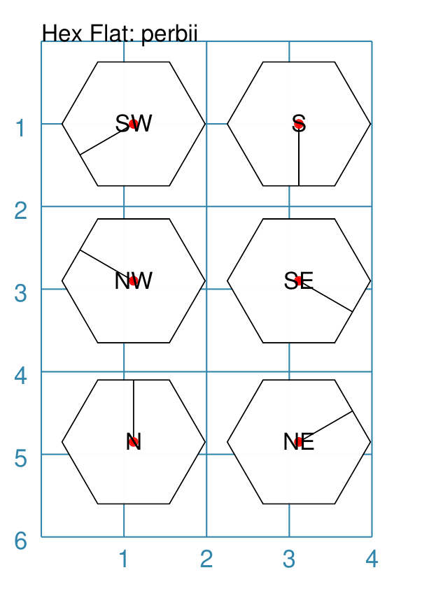

===== ======
|hpf| This example shows Hexagons constructed using these commands:

      .. code:: python

        hxg = Common(
            height=1.5, font_size=8,
            dot=0.05, dot_stroke="red",
            orientation="flat")

        Hexagon(
            common=hxg, x=0.25, y=0.25,
            perbii='sw', label="SW")
        Hexagon(
            common=hxg, x=0.25, y=2.15,
            perbii='w', label="W")
        Hexagon(
            common=hxg, x=0.25, y=4,
            perbii='nw', label="NW")
        Hexagon(
            common=hxg, x=2.25, y=4,
            perbii='ne', label="NE")
        Hexagon(
            common=hxg, x=2.25, y=2.15,
            perbii='e', label="E")
        Hexagon(
            common=hxg, x=2.25, y=0.25,
            perbii='se', label="SE")

      These have the following properties:

      - *common* - sets Common values assigned to ``hxg``
      - *x* and *y* to set the upper-left position
      - *perbii* - a compass direction in which the bisector is drawn
        (centre to mid-point)
      - *label* - the text displayed in the centre shows the compass direction

===== ======

.. _hexPerbiiPointy:

Perbii: Pointy
--------------
`^ <hexagon_>`__

"Perbii" is a shortcut name for "perpendicular bisector". These lines are like
spokes of a bicycle wheel; they are drawn from the centre of a Hexagon towards
the mid-points of the edges.


===== ======
|hpp| This example shows Hexagons constructed using these commands:

      .. code:: python

        hxg = Common(
            height=1.5, font_size=8,
            dot=0.05, dot_stroke="red",
            orientation="pointy")

        Hexagon(
            common=hxg, x=0.25, y=0.25,
            perbii='sw', label="SW")
        Hexagon(
            common=hxg, x=0.25, y=2.15,
            perbii='nw', label="NW")
        Hexagon(
            common=hxg, x=0.25, y=4,
            perbii='n', label="N")
        Hexagon(
            common=hxg, x=2.25, y=4,
            perbii='ne', label="NE")
        Hexagon(
            common=hxg, x=2.25, y=0.25,
            perbii='s', label="S")
        Hexagon(
            common=hxg, x=2.25, y=2.15,
            perbii='se', label="SE")

      These have the following properties:

      - *common* - all Hexagons drawn with the Common value of ``hxg`` will
        share the same properties; height, font size, dot and orientation
      - *x* and *y* to set the upper-left position
      - *perbii* - a compass direction in which the bisector is drawn
        (centre to mid-point)
      - *label* - the text displayed in the centre

===== ======

.. _hexPath:

Path: Flat & Pointy
-------------------
`^ <hexagon_>`__

Path lines are drawn between the mid-points of two edges; they can be arcs
or straight lines depending on which edges they connnect.


===== ======
|pp1| This example shows Hexagons constructed using these commands:

      .. code:: python

        hxg = Common(
            height=1.5, font_size=8,
            dot=0.05, dot_stroke="red")

        Hexagon(
            common=hxg, x=0.25, y=0.25,
            orientation="pointy",
            paths=["ne sw", "e w",  "se nw"])
        Hexagon(
            common=hxg, x=0.25, y=2.15,
            orientation="pointy",
            paths=["ne e", "e se", "se sw", "sw w", "w nw", "nw ne"],
            paths_stroke="gold")
        Hexagon(
            common=hxg, x=0.25, y=4.1,
            paths=["sw ne", "se nw", "s n"])
        Hexagon(
            common=hxg, x=2.25, y=4.1,
            paths=["s ne", "se sw", "s nw", "nw ne", "n se", "n sw"],
            paths_dotted=True)
        Hexagon(
            common=hxg, x=2.25, y=2.15,
            paths=["ne n", "ne se", "se s", "sw s", "sw nw", "nw n"],
            paths_stroke="gold")
        Hexagon(
            common=hxg, x=2.25, y=0.25,
            orientation="pointy",
            paths=["ne se", "e sw", "se w", "sw nw", "w ne", "nw e"],
            paths_dotted=True)

      These have the following properties:

      - *common* - all Hexagons drawn with the Common value of ``hxg`` will
        share the same properties; height, font size, dot and orientation
      - *x* and *y* to set the upper-left position
      - *paths* - a list of one or more pairs of compass directions between
        which a line |dash| straight or an arc |dash| is drawn

      The Hexagons with normal line styles have connections between opposing
      edges.

      The Hexagons with gold colored line have connections between adjacent
      edges.

      The Hexagons with dotteed line styles have connections between edges
      that are not opposite or adjacent.

===== ======

.. _hexSlicesFlat:

Slices: Flat
------------
`^ <hexagon_>`_

Slices are a set of colors that are drawn as triangles inside a
a Hexagon in a clockwise direction starting from the "North East".
If there are fewer colors than the six possible triangles, then the
colors are repeated, starting from the first one.


===== ======
|hsf| This example shows Hexagons constructed using these commands:

      .. code:: python

        hxg = Common(height=1.5, dot=0.05, dot_stroke="white", font_size=8)
        Hexagon(
            common=hxg,
            cx=1.5, cy=1.5,
            slices=['red', 'blue'],
            orientation="flat")
        Hexagon(
            common=hxg, cx=1.5, cy=3.5,
            slices=['red', 'orange', 'yellow', 'green', 'blue', 'pink'],
            orientation="flat")

      These Hexagons all share the following Common properties that differ
      from the defaults:

      - *height*, *dot* and *dot_stroke* - set the basic configuration
      - *orientation* - set to ``flat``, so there will be no "peak" at the top

      Each Hexagon has its own setting for:

      - *slices* - slices are drawn seqentially

===== ======

.. _hexSlicesPointy:

Slices: Pointy
--------------
`^ <hexagon_>`_

Slices are a set of colors that are drawn as triangles inside a
a Hexagon in a clockwise direction starting from the "North East".
If there are fewer colors than the six possible triangles, then the
colors are repeated, starting from the first one.


===== ======
|hsp| This example shows Hexagons constructed using these commands:

      .. code:: python

        hxg = Common(
            height=1.5,
            dot=0.05, dot_stroke="white")
        Hexagon(
            common=hxg,
            cx=1.5, cy=1.5,
            slices=['red', 'blue'], orientation="pointy")
        Hexagon(
            common=hxg,
            cx=1.5, cy=3.5,
            slices=['red', 'orange', 'yellow', 'green', 'blue', 'pink'],
            orientation="pointy")

      These Hexagons all share the following Common properties that differ
      from the defaults:

      - *height*, *dot* and *dot_stroke* - set the basic configuration
      - *orientation* - set to ``pointy``, so there will be a "peak" at the top

      Each Hexagon has its own setting for:

      - *slices* - slices are drawn seqentially

===== ======

.. _hexSpikes:

Spikes
------
`^ <hexagon_>`_

Spikes are a set of one or more triangles drawn at the "perbii points" i.e.
with the base of the triangles centred on the middle of Hexagon edges.

If the height of the spike is given as a **negative** number, then the
triangle will point to the **inside** of the Hexagon.


===== ======
|hsa| This example shows Hexagons constructed using these commands:

      .. code:: python

        hxg = Common(
            height=1.5,
            dot=0.05, dot_stroke="red",
            spikes_width=0.25)
        Hexagon(
            common=hxg, x=0.25, y=0.25,
            orientation="pointy",
            spikes=["ne", "w",  "se"],
            spikes_height=0.5)
        Hexagon(
            common=hxg, x=2.25, y=4.1,
            spikes=["s", "sw", "nw", "ne", "se", "n"],
            spikes_dotted=True,
            spikes_height=-0.5)
        Hexagon(
            common=hxg, x=2.25, y=0.25,
            orientation="pointy",
            spikes=["ne", "se", "sw", "w", "nw", "e"],
            spikes_height=-0.5,
            spikes_dotted=True)
        Hexagon(
            common=hxg, x=0.25, y=2.15,
            orientation="pointy",
            spikes=["ne", "se", "sw", "w", "nw", "e"],
            spikes_stroke="gold",
            spikes_fill="gold")
        Hexagon(
            common=hxg, x=0.25, y=4.1,
            spikes=["ne", "nw", "s"],
            spikes_height=0.5)
        Hexagon(
            common=hxg, x=2.25, y=2.15,
            spikes=["s", "sw", "nw", "ne", "se", "n"],
            spikes_height=0.5,
            spikes_stroke="gold",
            spikes_fill="gold")

      These Hexagons all share the following Common properties that differ
      from the defaults:

      - *height*, *dot* and *dot_stroke* - set the basic Hexagon properties
      - *spikes_width* - sets the width at base of the triangle; if not
        given, this will default to one-tenth of the edge length

      The directions of all of the *spikes* are given in list form; but a
      string format such as ``"n ne nw"`` is also usable.

      The top- and bottom-left hexagons show typical spikes, each with a
      *spikes_height* of ``0.5`` cm.

      The centre left and right hexagons show spikes with a default height
      equal to the hexagon's edge length.  They also have their line and fill
      color both set to ``gold``.

      The top- and bottom-right hexagons show inner-facing spikes, each with a
      *spikes_height* of ``-0.5`` cm.  They also have their line style set to
      ``dotted``.

===== ======


.. _hexTextFlat:

Text: Flat
----------
`^ <hexagon_>`_


===== ======
|htf| This example shows a Hexagon constructed using this command:

      .. code:: python

        Hexagon(
            y=2,
            height=2,
            title="Title",
            label="Label",
            heading="Heading")

      It has the following properties that differ from the defaults:

      - *y* and *height* used to draw the shape
      - *heading* - this text appears above the shape  (slightly offset)
      - *label* - this text appears in the middle of the shape
      - *title* - this test appears below the shape (slightly offset)

      All of this text is, by default, centred horizontally.

      Each text item can be further customised in terms of its color, size and
      font family.

      The can be done by appending *_stroke*, *_stroke_width*, *_size* and
      *_font* respectively to the text type's name.

===== ======

.. _hexTextPointy:

Text: Pointy
------------
`^ <hexagon_>`_


===== ======
|htp| This example shows a Hexagon constructed using this command:

      .. code:: python

        Hexagon(
            y=2,
            height=2,
            orientation='pointy',
            title="Title",
            label="Label",
            heading="Heading")

      It has the following properties that differ from the defaults:

      - *y* and *height* used to draw the shape
      - *heading* - this text appears above the shape  (slightly offset)
      - *label* - this text appears in the middle of the shape
      - *title* - this text appears below the shape (slightly offset)

      All of this text is, by default, centred horizontally.

      Each text item can be further customised in terms of its color, size and
      font family.

      The can be done by appending *_stroke*, *_stroke_width*, *_size* and
      *_font* respectively to the text type's name. For example, using
      ``label_stroke_width=2`` to create a thicker line for the label.

===== ======


.. _hexBorders:

Borders
-------
`^ <hexagon_>`_

The ``Borders`` property allows for the normal line, that is drawn around a
Hexagon, to be overwritten on specific sides by another type of line.

The ``Borders`` property is specified by providing a set of values, which are
comma-separated inside of round brackets, in the following order:

- direction - one of (n)orth, (s)outh, (e)ast, (w)est, ne(northeast),
  se(southeast), nw(northwest), or sw(southwest)
- width - the line thickness
- color - either a named color or a hexadecimal value
- style - ``True`` makes it dotted; or a list of values creates dashes

Direction and width are required, but color and style are optional.

One or more border values can be used together with spaces between them
e.g. ``ne se`` to draw lines on both northeast **and** southeast.


Example 1. Flat
+++++++++++++++

===== ======
|hb1| This example shows ``flat`` Hexagons constructed using these commands:

      .. code:: python

        hxg = Common(
          height=1.5, orientation="flat", font_size=8)

        Hexagon(
            common=hxg, x=0.25, y=0.25,
            borders=('sw', 2, "gold"), label="SW")
        Hexagon(
            common=hxg, x=0.25, y=2.15,
            borders=('nw', 2, "gold"), label="NW")
        Hexagon(
            common=hxg, x=0.25, y=4.00,
            borders=('n', 2, "gold"), label="N")
        Hexagon(
            common=hxg, x=2.25, y=4.00,
            borders=('s', 2, "gold"), label="S")
        Hexagon(
            common=hxg, x=2.25, y=0.25,
            borders=('ne', 2, "gold"), label="NE")
        Hexagon(
            common=hxg, x=2.25, y=2.15,
            borders=('se', 2, "gold"), label="SE")

      Each Hexagon has a normal *stroke_width* as its outline, with a
      default *fill* and *stroke* color of black.

      For each Hexagon, there is a single thick yellow line on one side set by
      the direction in  *borders*.

===== ======

.. |hb2| image:: images/custom/hexagon/borders_pointy.png
   :width: 330

Example 2. Pointy
+++++++++++++++++

===== ======
|hb2| This example shows ``pointy`` Hexagons constructed using these commands:

      .. code:: python

        hxg = Common(
          height=1.5, orientation="pointy", font_size=8)

        Hexagon(
            common=hxg, x=2.25, y=4.00,
            common=hxg, x=0.25, y=0.25,
            borders=('sw', 2, "gold"), label="SW")
        Hexagon(
            common=hxg, x=0.25, y=2.15,
            borders=('nw', 2, "gold"), label="NW")
        Hexagon(
            common=hxg, x=0.25, y=4.00,
            borders=('w', 2, "gold"), label="W")
        Hexagon(
            common=hxg, x=2.25, y=4.00,
            borders=('e', 2, "gold"), label="E")
        Hexagon(
            common=hxg, x=2.25, y=0.25,
            borders=('ne', 2, "gold"), label="NE")
        Hexagon(
            common=hxg, x=2.25, y=2.15,
            borders=('se', 2, "gold"), label="SE")

      Each Hexagon has a normal *stroke_width* as its outline, with a
      default *fill* and *stroke* color of black.

      For each Hexagon, there is a single thick yellow line on one side set by
      the direction in *borders*.

===== ======


.. _hexOrder:

Ordering of Properties
----------------------
`^ <hexagon_>`_

There is a default order in which the various properties of a Hexagon are
drawn. There are three ways to change this drawing order:

- *order_first* - a list of properties that will be drawn, in the order given
  in the list, **before** any others
- *order_last* - a list of properties that will be drawn, in the order given
  in the list, **after** any others
- *order_all* - a list of the **only** properties that will be drawn, in the
  order given in the list

The available property names, shown in their default order, are:

#. base - this represents the Hexagon itself
#. borders
#. shades
#. slices
#. spikes
#. hatches
#. links
#. perbii
#. paths
#. radii_shapes
#. perbii_shapes
#. centre_shape
#. centre_shapes
#. vertex_shapes
#. dot
#. cross
#. text
#. numbering


Example 1.
++++++++++

===== ======
|ho1| This example shows ``flat`` Hexagons constructed using these commands:

      .. code:: python

        hxg = Common(height=1.5,
                     dot=0.05, dot_stroke="red")

        Hexagon(common=hxg, x=0.25, y=0.1,
                slices=['red', 'orange', 'yellow'],
                spikes=["ne", "nw", "s"],
                spikes_height=-0.7,
                spikes_width=0.25)
        Hexagon(common=hxg, x=2.25, y=0.1,
                slices=['red', 'orange', 'yellow'],
                spikes=["ne", "nw", "s"],
                spikes_height=-0.7,
                spikes_width=0.25
                order_first=["spikes"])
        Hexagon(common=hxg, x=0.25, y=2.1,
                hatches_count=5, hatches_stroke="red",
                hatches_stroke_width=2, hatches='nw',
                radii='sw e',
                radii_stroke_width=2)
        Hexagon(common=hxg, x=2.25, y=2.1,
                hatches_count=5, hatches_stroke="red",
                hatches_stroke_width=2, hatches='nw',
                radii='sw e',
                radii_stroke_width=2,
                order_last=["hatcheses"])
        Hexagon(common=hxg, x=0.25, y=4.1,
                perbii='sw n')
        Hexagon(common=hxg, x=2.25, y=4.1,
                perbii='sw n',
                order_all=["base", "dot"])

      The top-most pair of Hexagons show how changing the *order_first* property
      means that the *spikes* are not visible because they are drawn before the
      *slices* (which overwrite them).

      The middle pair of Hexagons show how changing the *order_last* property
      means that *hatches* are drawn after the *radii*, instead of before.

      The lower-most pair of Hexagons show how setting the *order_all* property
      means that only the Hexagon and the centre Dot will drawn, and not the
      *perbii*.

===== ======

.. _circleIndex:

Circle
======
`↑ <table-of-contents-custom_>`_

A Circle is a very common shape in many designs; it provides a number of
ways that it can be customised.

- `Dot and Cross <circleCross_>`_
- `Hatches <circleHatches_>`_
- `Radii <circleRadii_>`_
- `Radii Labels <circleRadiiLabels_>`_
- `Petals: petal <circlePetalsPetal_>`_
- `Petals: triangle <circlePetalsTriangle_>`_
- `Petals: sun <circlePetalsSun_>`_
- `Slices <circleSlices_>`_
- `Nested <circleNested_>`_
- `Ordering of Properties <circleOrder_>`_

.. _circleCross:

Dot & Cross
-----------
`^ <circle_>`_


===== ======
|ccd| This example shows Circles constructed using these commands:

      .. code:: python

        Circle(
            cx=1, cy=3, radius=1,
            dot=0.1, dot_stroke="green")
        Circle(
            cx=3, cy=3, radius=1,
            cross=0.25, cross_stroke="green",
            cross_stroke_width=1)

      These Circles have properties set as follows:

      - *cx* and *cy* - set the centre position of the Circle
      - *radius* - sets the distance from centre to circumference
      - *dot* - sets the size of dot at the centre
      - *dot_stroke*  - sets the color of the dot. Note that the dot is
        "filled in" with that same color.
      - *cross* - sets the length of each of the two lines that cross
        at the centre
      - *cross_stroke*  - sets the color of the cross lines
      - *cross_stroke_width* - sets the thickness of the cross lines

===== ======

.. _circleHatches:

Hatches
-------
`^ <circle_>`_

Hatches are a set of parallel lines that are drawn, in a specified direction,
across the Circle from one opposing side to another in a vertical, horizontal
or diagonal direction. Hatches are equally spaced across the diameter of the
Circle.


===== ======
|chf| This example shows Circles constructed using these commands:

      .. code:: python

        htc = Common(
          radius=0.7,
          hatches_count=5,
          hatches_stroke="red")

        Circle(
            common=htc, cx=2, cy=5.2,
            label='5')
        Circle(
            common=htc, cx=1, cy=3.7,
            hatches='o', label='o')
        Circle(
            common=htc, cx=3, cy=3.7,
            hatches='d', label='d')
        Circle(
            common=htc, cx=1, cy=2.2,
            hatches='e', label='e')
        Circle(
            common=htc, cx=3, cy=2.2,
            hatches='n', label='n')
        Circle(
            common=htc, cx=1, cy=0.7,
            hatches='ne', label='ne')
        Circle(
            common=htc, cx=3, cy=0.7,
            hatches='nw', label='nw')

      These Circles all share the following Common properties that differ
      from the defaults:

      - *radius* - sets the basic size
      - *hatches_count* - sets the **number** of equi-spaced lines to be drawn
      - *hatches_stroke* - set to the color `red` to set the line off from the
        circumference

      Each Circle has its own setting for:

      - *cx* and *cy* - different positions on the page for the centres
      - *label* - text to help identify it
      - *hatches* - if not specified, hatches will be drawn in **all**
        directions |dash| as seen in lower-most circle |dash| otherwise:

        - ``ne`` (North-East) or ``sw`` (South-West) draws diagonal lines from
          bottom-left to top-right
        - ``nw`` (North-West) or ``se`` (South-East) draws diagonal lines from
          top-left to bottom-right
        - ``e`` (East) or ``w`` (West) draws horizontal lines
        - ``n`` (North) or ``s`` (South) draws vertical lines
        - ``o`` (orthogonal) draws  horizontal and vertical lines
        - ``d`` (diagonal) draws diagonal lines (``ne`` and ``nw``)

===== ======

.. _circleRadii:

Radii
-----
`^ <circle_>`_

Radii are like spokes of a bicycle wheel; they are drawn from the centre
of a Circle towards its circumference.

.. |crr| image:: images/custom/circle/radii.png
   :width: 330

===== ======
|crr| This example shows Circles constructed using these commands:

      .. code:: python

        Circle(x=0, y=0, radius=2,
               fill=None,
               radii=[45,135,225,315],
               radii_stroke_width=1,
               radii_dotted=True,
               radii_offset=1,
               radii_length=1.25)
        Circle(x=0, y=0, radius=2,
               fill=None,
               radii=[0,90,180,270],
               radii_stroke_width=3,
               radii_stroke="red")

        Circle(cx=3, cy=5, radius=1,
               fill="green",
               sstroke="orange", stroke_width=1,
               radii=[0,90,180,270,45,135,225,315],
               radii_stroke_width=8,
               radii_stroke="orange",
               radii_length=0.8)

      The top two circles are drawn at the same location with the same
      basic properties; with their *fill* set to ``None`` to make them
      transparent.

      These Circles also have some of the following properties, which
      demonstrate how radii can be set and customised:

      - *x* and *y* to set the upper-left position; or *cx* and *cy* to set the
        centre
      - *radii* - a list of angles (in N|deg|) sets the directions at which the
        radii lines are drawn
      - *radii_stroke_width* - if set, will determine the thickness of the radii
      - *radii_dotted* - if set to True, will make the radii lines dotted
      - *radii_stroke* - determines the color of the radii
      - *radii_length* - changes the length of the radii lines
        (centre to circumference)
      - *radii_offset* - moves the endpoint of the radii line
        **away** from the centre

===== ======

.. _circleRadiiLabels:

Radii - Labels
--------------
`^ <circle_>`_

Radii labels are text lines linked to one or more radii. Text can be repeated
or unique. It can also be rotated |dash| relative to the radius line it is
on |dash| and styled with stroke color, size, and face.

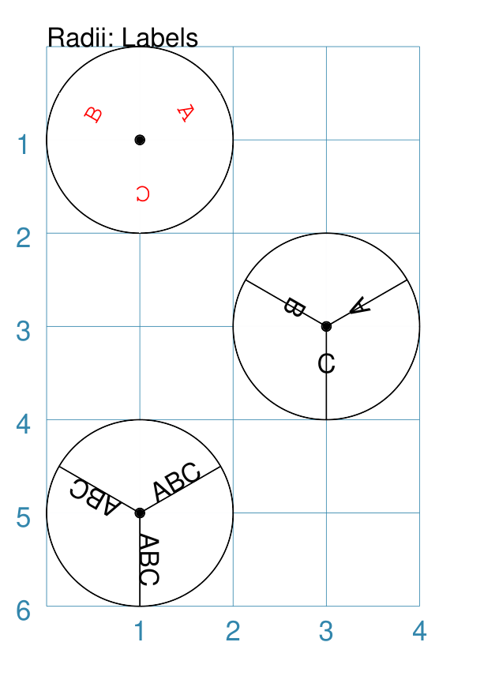

===== ======
|crl| This example shows Circles constructed using these commands:

      .. code:: python

        Circle(cx=1, cy=1, radius=1,
               radii=[30, 150, 270],
               radii_stroke="white",
               radii_labels=["A", "B", "C"],
               radii_labels_rotation=270,
               radii_labels_stroke="red",
               radii_labels_font="Courier",
               dot=0.05)

        Circle(cx=3, cy=3, radius=1,
               radii=[30, 150, 270],
               radii_labels="A,B,C",
               radii_labels_rotation=90,
               dot=0.05)

        Circle(cx=1, cy=5, radius=1,
               radii=[30, 150, 270],
               radii_labels="ABC",
               dot=0.05)

      Apart from the `radii lines <circleRadii_>`_ themselves, the labels'
      properties can be set:

      - *radii_labels* - a string or list of strings used for text
      - *radii_labels_font* - name of the font used for the labels
      - *radii_labels_rotation* - rotation in degrees relative to radius angle
      - *radii_labels_size* - point size of labels
      - *radii_labels_stroke* - the color of the labels
      - *radii_labels_stroke_width* - thickness of the labels

      The top-most example shows how text strings are created with a list.

      The middle example shows how the text string is split using commas;
      this results in a list whose members are used to create the labels.

      The lower-most example shows how the same text is repeated for all radii.

      The top example also shows how text is rotated and styled. The radii
      lines' stroke color is set to match the circle fill, thereby making it
      "invisible".

      The label rotation is relative to its upright position on the line;
      so 90 |deg| turns the text to the left and onto its "side", as shown
      in the middle example.

===== ======

.. _circlePetalsPetal:

Petals - petal
--------------
`^ <circle_>`_

Petals are projecting shapes drawn from the circumference of a Circle outwards
at regular intervals.  They are typically used to create a "flower" or "sun"
effect.

.. |cpp| image:: images/custom/circle/petals_petal.png
   :width: 330

===== ======
|cpp| This example shows Circles constructed using these commands:

      .. code:: python

        Circle(cx=2, cy=1.5, radius=1,
               petals=11,
               petals_style="petal",
               petals_offset=0.2,
               petals_stroke_width=1,
               petals_dotted=1,
               petals_height=0.25,
               petals_fill="gray")

        Circle(cx=2, cy=4.5, radius=1,
               fill_stroke="yellow",
               petals=8,
               petals_style="p",
               petals_offset=0.1,
               petals_stroke_width=2,
               petals_height=0.25,
               petals_stroke="red",
               petals_fill="yellow")

      These Circles have the following properties:

      - *cx*, *cy*, *radius*, *stroke* and *fill* - set the properties of the
        `Circle`_; if these are set to ``None`` then the *petal_fill*
        setting will be used for the whole area
      - *petals* - sets the number of petals to drawn
      - *petals_style* - a style of ``p`` or ``petal`` causes petals
        to be drawn as arcs
      - *petals_offset* - sets the distance of the lowest point of the petal
        line away from the circle's circumference
      - *petals_stroke_width* - sets the thickness of the line used to draw
        the petals
      - *petals_fill* - sets the color of the area inside the line used to
        draw the petals. Any *fill* or *stroke* settings for the circle itself
        may appear superimposed on this area.
      - *petals_dotted* -if ``True``, sets the line style to *dotted*
      - *petals_height* - sets the distance between the highest and the lowest
        points of the petal line

===== ======


.. _circlePetalsTriangle:

Petals - triangle
-----------------
`^ <circle_>`_

Petals are projecting shapes drawn from the circumference of a Circle outwards
at regular intervals.  They are typically used to create a "flower" or "sun"
effect.

.. |cpt| image:: images/custom/circle/petals_triangle.png
   :width: 330

===== ======
|cpt| This example shows Circles constructed using these commands:

      .. code:: python

        Circle(cx=2, cy=1.5, radius=1,
               petals=11,
               petals_offset=0.25,
               petals_stroke_width=1,
               petals_dotted=True,
               petals_height=0.25,
               petals_fill="grey")
        Circle(cx=2, cy=4.5, radius=1,
               stroke=None, fill=None,
               petals=8,
               petals_stroke_width=3,
               petals_height=0.25,
               petals_stroke="red",
               petals_fill="yellow")

      These Circles have the following properties:

      - *cx*, *cy*, *radius*, *stroke* and *fill* - set the properties of the
        `Circle`_; if these are set to ``None`` then the *petal_fill*
        setting will be used for the whole area
      - *petals* - sets the number of petals to drawn
      - *petals_offset* - sets the distance of the lowest point of the petal
        line away from the circle's circumference
      - *petals_stroke_width* - sets the thickness of the line used to draw
        the petals
      - *petals_fill* - sets the color of the area inside the line used to
        draw the petals. Any *fill* or *stroke* settings for the circle itself
        may appear superimposed on this area.
      - *petals_dotted* - if ``True``, sets the line style to *dotted*
      - *petals_height* - sets the distance between the highest and the lowest
        points of the petal line

      Note that these petals have a default *petals_style* of
      ``t`` or ``triangle``.

===== ======


.. _circlePetalsSun:

Petals - sun
------------
`^ <circle_>`_

Petals are projecting shapes drawn from the circumference of a Circle outwards
at regular intervals.  They are typically used to create a "flower" or "sun"
effect.


===== ======
|cps| This example shows Circles constructed using these commands:

      .. code:: python

        Circle(cx=2, cy=1.5, radius=1,
               petals=11,
               petals_style="sun",
               petals_offset=0.25,
               petals_stroke_width=1,
               petals_dotted=True,
               petals_height=0.5,
               petals_fill="grey")
        Circle(cx=2, cy=4.5, radius=1,
               stroke=None, fill=None,
               petals=8,
               petals_style="s",
               petals_stroke_width=3,
               petals_height=0.5,
               petals_stroke="red",
               petals_fill="yellow")

      These Circles have the following properties:

      - *cx*, *cy*, *radius*, *stroke* and *fill* - set the properties of the
        `Circle`_; if these are set to ``None`` then the *petal_fill*
        setting will be used for the whole area
      - *petals* - sets the number of petals to drawn
      - *petals_offset* - sets the distance of the lowest point of the petal
        line away from the circle's circumference
      - *petals_stroke_width* - sets the thickness of the line used to draw
        the petals
      - *petals_fill* - sets the color of the area inside the line used to
        draw the petals. Any *fill* or *stroke* settings for the circle itself
        may appear superimposed on this area.
      - *petals_dotted* - if ``True``, sets the line style to *dotted*
      - *petals_height* - sets the distance between the highest and the lowest
        points of the petal line

      Note that these petals have the *petals_style* of ``s`` or ``sun``.

===== ======

.. _circleSlices:

Slices
------
`^ <circleIndex_>`_

The slices property enables the Circle to be filled with colored pie-shaped
wedges.

These are the relevant properties that can be set:

- *slices* - this is a list of colors (named or hexadecimal); if ``None`` is
  used then no slice will be drawn in that position
- *slices_fractions* - this is the "length" of the slices; if not specified,
  then by default all slices will have their fraction set to ``1`` meaning they
  are equal to the radius of the circle |dash| values smaller than ``1`` will
  result in them being drawn inside the circle and values larger than ``1``
  will  result in them extending outside of the circle
- *slices_angles* - this is the "width" of the slices; if not specified,
  then by default all slices will be of equally-sized angles and will extend
  from the centre to the full circumference of the circle
- *slices_transparency* - the higher the value (on a scale of 0 to 100),
  the more "see through" the fill of the slices will be

Both the list of  *slice_fractions*  and  *slice_angles* must be of equal
length to the  *slice* list.

.. NOTE::

    Slices are drawn **after** the circle has been drawn, and so
    may obscure the stroke outline, fill color and other properties
    of the circle.


===== ======
|cs1| This example shows Circles constructed using the commands:

      .. code:: python

        Circle(cx=1, cy=1, radius=1,
               slices=["red", "gold", "aqua"],
               dot=0.05)
        Circle(cx=2, cy=3, radius=1,
               slices=["red", None, "red", None, "red", None],
               dot=0.05)
        Circle(cx=3, cy=5, radius=1,
               slices=["red", "gold", "aqua", "red", "gold", "aqua"],
               rotation=30,
               dot=0.05)
        Circle(cx=3, cy=1, radius=1,
               slices=["black", "grey", "silver"],
               slices_fractions=[0.33, 0.75, 0.5])
        Circle(cx=1, cy=5, radius=1, fill="gold",
               slices=["black", None, "grey", "silver"],
               slices_fractions=[0.33, None, 1.5, 0.75],
               slices_angles=[60, 45, 45, 120])

      The top-left example shows the minimum required; the *slices* property is
      a list of colors (``[ ]`` with comma-separated color strings).
      This causes **three** slices to be drawn |dash| starting from 0 |deg| to the
      east, and continuing anti-clockwise.  Each slice is 120 |deg| in width.

      The middle example shows what happens when the *slices* property includes
      the ``None`` value; in this case, no slice is drawn between each ``red``
      slice.  Each slice, including the "blanks" is 60 |deg| in width.

      The lower-right example shows what happens when the *rotation* property
      is also set; the slices start position is offset that many degrees
      anti-clockwise from the 0 |deg| (east) position.

      The top-right example shows the use of the *slices_fractions* property;
      because values are less than ``1`` this causes the "length" of the
      pie-slice to be shortened to that fraction of the circle's radius.

      The bottom-left example show the use of the *slices_fractions* property
      and what happens when the *slices* property and the matching
      *slices_fractions* property both include the ``None`` value; in this
      case, no slice is drawn.  A fraction of ``1.5`` means the slice will
      extend beyond the circumference of the circle.  This example also
      shows the use of *slices_angles* to control the width of the slices;
      in this case they do not occupy the full circumference because the total
      angles amount is less than 360 |deg|.

      **NOTE** All slice lines are drawn with the  *slices_stroke* color,
      which defaults to the slice color itself.

===== ======

.. _circleNested:

Nested
------
`^ <circleIndex_>`_

The *nested* property enables the Circle to be filled with a series of
concentric circles.


===== ======
|cn1| This example shows Circles constructed using the commands:

      .. code:: python

        Circle(
            cx=1, cy=1, radius=1,
            nested=2)
        Circle(
            cx=2, cy=3, radius=1,
            nested=[0.8, 0.1, 0.4])
        Circle(
            cx=3, cy=5, radius=1,
            nested=4,
            dotted=True,
            stroke="red",
            fill="yellow")

      The *nested* property can either be a single whole number or a list of
      fractional numbers.

      **NOTE** All nested Circles are drawn with the same line and fill
      properties as the Circle shape to which they are part of.  For more
      control over such features, rather use the *centre_shape* property
      instead, as this will permit construction of such a circle with any/all
      properties being set.

===== ======


.. _circleOrder:

Ordering of Properties
----------------------
`^ <circleIndex_>`_

There is a default order in which the various properties of a Circle are
drawn. There are three ways to change this drawing order:

- *order_first* - a list of properties that will be drawn, in the order given
  in the list, **before** any others
- *order_last* - a list of properties that will be drawn, in the order given
  in the list, **after** any others
- *order_all* - a list of the **only** properties that will be drawn, in the
  order given in the list

The available property names, shown in their default order, are:

#. petals
#. base - this represents the Circle itself
#. nested
#. slices
#. hatches
#. radii
#. radii_shapes
#. centre_shape
#. centre_shapes
#. dot
#. cross
#. text


.. _triIndex:

Triangle
========
`↑ <table-of-contents-custom_>`_

- `Triangle overview`_
- `Triangle construction`_
- `Triangle construction examples`_
- `Triangle customisation`_
- `Triangle ordering of properties`_

Triangle overview
-----------------

A triangle is a three-sided polygon.  It can have uniform sides, in which case
it is an *equilateral* triangle |dash| the default; two sides of matching
length, in which case it is an *isosceles* triangle; or all sides of unequal
length, in which case it is an *irregular* triangle.

A triangle is considered to have three *vertices* located using the
following compass directions; ``n`` (north), ``sw`` (south-west), and ``se``
(south-east).  Similarly, the three sides are located at ``ne`` (north-east),
``nw`` (north-west), and ``s`` (south).

A triangle has a *centroid*, or "center of mass", which is the point where
the three lines from the vertices to the midpoints of the opposite sides
intersect. It is used as the point around which all elements of triangle
can be *rotated*.

.. _triConstruction:

Triangle construction
---------------------
`^ <triIndex_>`_

The starting point for drawing a triangle is the ``sw`` vertice.  The ``s``
line is then drawn, usually in the ``e`` direction, followed by the ``ne``
line, and finally the ``ne``.

.. NOTE::

    Unlike most other shapes, the Triangle's *x* and *y* positions are
    **NOT** at the top-left "corner".  This breaks with convention, but
    the concept of such a corner just does not seem to work in this case.

All triangles require the starting point to be set, if different from the
default of ``1`` for both the *x* and *y* positions.

A triangle's drawing can be affected by its *pivot* which is an angle used to
alter the direction of the bottom edge |dash| the ``s`` line. By default this
line is drawn in the eastwards direction, i.e. a pivot of ``0`` |deg|, but if
set will cause that line to be rotated anti-clockwise around the ``sw`` vertex.

Equilateral triangles
+++++++++++++++++++++

Equilateral triangles are the simplest to construct. Apart from the starting
point, all that is required is the length of the *side* to be set. All sides
share the same length.

Because :doc:`protograf <index>` uses a default value of ``1`` for the *side*
property, an equilateral triangle is the default one that will be constructed
unless more properties are set. See `Example 1. Default Triangle`_.

Equilateral triangles can also be constructed using their centroid position,
instead of the usual  *x* and *y* positions. See
`Example 2. Custom Equilateral`_

.. NOTE::

  An Equilateral triangle constructed via its centroid position cannot also
  have a value set for *pivot*.  This is because this setting would effectively
  be acting in the same way as the *rotation*.

Isosceles triangles
+++++++++++++++++++

Isosceles triangles require both the length of the bottom edge to be set
|dash| via the *side* property |dash| as well as the *height*.  The other
two sides will be equal in length and calculated from the *side* and
*height* properties.  See `Example 3. Custom Isosceles`_.

Irregular triangles
+++++++++++++++++++

Irregular triangles are the most complex to construct. There are a number
of options to do so.

1. Set the values for *side2* and *side3*.  Their total must exceed the value
   set for *side*.
2. Set the values for *side2* and *angle*.  This will draw the second line,
   of length *side2*, at the given angle relative to *side*.
3. Set the value for *side2*. This will set the *angle* to 90 |deg| and cause
   a *right-angled triangle* to be drawn.

For illustrations of these construction options, see
`Example 4a. Custom Irregular I`_ and `Example 4b. Custom Irregular II`_.


Triangle construction examples
------------------------------
`^ <triIndex_>`_

Example 1. Default Triangle
+++++++++++++++++++++++++++
`^ <triConstruction_>`_

.. |tc1| image:: images/defaults/equiangle.png
   :width: 330

===== ======
|tc1| This example shows the Triangle constructed using the command with only
      defaults:

      .. code:: python

          Triangle()

      It has the following properties based on the defaults:

      - lower-left, or south-west (``sw``) vertex at x-position ``1`` cm
        and y-position ``1`` cm
      - side - ``1`` cm i.e. all sides are equal

===== ======

Example 2. Custom Equilateral
+++++++++++++++++++++++++++++
`^ <triConstruction_>`_

.. |tc2| image:: images/custom/triangle/triangle_equilateral.png
   :width: 330

===== ======
|tc2| This example shows the Triangle constructed using the command as follows:

      .. code:: python

        Triangle(
            cx=2, cy=3,
            side=3,
            stroke_width=1,
            fill="gold",
            title="Equilateral")

      It has the following properties:

      - *cx* and *cy* - set the centroid position
      - *side* - ``3`` cm i.e. all sides are equal
      - *stroke_width* - set the thickness of the Triangle's border line
      - *fill* - set the area color
      - *title* - set the text below the Triangle; note that the x-position
        is centred below the centroid

===== ======

Example 3. Custom Isosceles
+++++++++++++++++++++++++++
`^ <triConstruction_>`_

.. |tc3| image:: images/custom/triangle/triangle_isosceles.png
   :width: 330

===== ======
|tc3| This example shows the Triangle constructed using the command as follows:

      .. code:: python

        Triangle(
            x=0.5, y=5,
            side=3, height=4,
            stroke_width=1,
            fill="lime",
            title="Isosceles")

      It has the following properties:

      - *x* and *y* - set the lower-left, or ``sw`` vertex
      - *side* - ``3`` cm for the base, or lower edge
      - *height* - set to ``4`` cm; used to calculate length of other sides
      - *stroke_width* - set the thickness of the Triangle's border line
      - *fill* - set the area color
      - *title* - set the text below the Triangle; note that the x-position
        is centred below the centroid

===== ======

Example 4a. Custom Irregular I
++++++++++++++++++++++++++++++
`^ <triConstruction_>`_

.. |tc4| image:: images/custom/triangle/triangle_irregular.png
   :width: 330

===== ======
|tc4| This example shows the Triangle constructed using the command as follows:

      .. code:: python

        Triangle(
            x=1, y=4,
            side=3, side2=4.5, side3=2.5,
            stroke_width=1,
            fill="tomato",
            title="Irregular")

      It has the following properties:

      - *x* and *y* - set the lower-left, or ``sw`` vertex
      - *side* - ``3`` cm for the base, or lower edge (``s``)
      - *side2* - ``4.5`` cm for the next edge in anti-clockwise direction
        (``ne``)
      - *side3* - ``2.5`` cm for the final edge in anti-clockwise direction
        (``nw``)
      - *stroke_width* - set the thickness of the Triangle's border line
      - *fill* - set the area color
      - *title* - set the text below the Triangle; note that the x-position
        is centred below the centroid

===== ======

Example 4b. Custom Irregular II
+++++++++++++++++++++++++++++++
`^ <triConstruction_>`_

.. |tc5| image:: images/custom/triangle/triangle_irregular_options.png
   :width: 330

===== ======
|tc5| This example shows the Triangle constructed using the command as follows:

      .. code:: python

        Triangle(
            x=0, y=2,
            side=1.5, side2=1.75, side3=2.55,
            stroke_width=0.5,
            dot=0.06,
            title="3xsides",
            title_size=7)
        Triangle(
            x=2, y=2,
            side=1.5, side2=1.75, side3=2.55,
            pivot=30,
            stroke_width=0.5,
            dot=0.06,
            title="pivot:30",
            title_size=7)

        Triangle(
            x=0, y=4,
            side=1.5, side2=1.75, angle=115,
            stroke_width=0.5,
            dot=0.06,
            title="2xsides; 115",
            title_size=7)
        Triangle(
            x=2, y=4,
            side=2, side2=1.5,
            stroke_width=0.5,
            dot=0.06,
            title="2xsides; rightangle",
            title_size=7)

        Triangle(
            x=0, y=6,
            side=1.5, side2=1.5, side3=1.5,
            pivot=30,
            stroke_width=0.5,
            dot=0.06,
            title="equi; pivot:45",
            title_size=7)
        Triangle(
            x=3.5, y=6,
            side=1.25, side2=1.75, side3=1.75,
            pivot=90,
            stroke_width=0.5,
            dot=0.06,
            title="iso; pivot:90",
            title_size=7)

      These examples illustrate the various construction techniques.

      The lower two examples show how the other types of triangles can
      also be constructed via setting the appropriate properties of an
      irregular triangle.

===== ======

.. _triCustomisation:

Triangle customisation
----------------------
`^ <triIndex_>`_

There are a number of ways that a Triangle can be customised.

- `Cross and Dot <triCross_>`_
- `Hatches <triHatches_>`_
- `Perbii <triPerbii_>`_
- `Radii <triRadii_>`_
- `Rotation <triRotation_>`_
- `Slices <triSlices_>`_
- `Pivot <triPivot_>`_


.. _triCross:

Cross and Dot
-------------
`^ <triCustomisation_>`_

A cross or a dot are symbols that are used to mark the centroid of the
Triangle. They are usually the last elements that are drawn.

Example 5. Triangle: Cross & Dot
++++++++++++++++++++++++++++++++

.. |td1| image:: images/custom/triangle/triangle_dot_cross.png
   :width: 330

===== ======
|td1| This example shows Triangles constructed using the commands:

      .. code:: python

        Triangle(
            x=1, y=2, side=2,
            stroke_width=1,
            dot=.05,
            cross=0.33, cross_stroke="red",
            cross_stroke_width=1,
            title="Equilateral")
        Triangle(
            x=1, y=4,
            side=2, height=1.25,
            stroke_width=1,
            dot=.05,
            cross=0.33, cross_stroke="red",
            cross_stroke_width=1,
            title="Isosceles")
        Triangle(
            x=1.25, y=5.5,
            side=2, side2=2.5, side3=1.25,
            stroke_width=1,
            dot=.05,
            cross=0.33, cross_stroke="red",
            cross_stroke_width=1,
            title="Irregular")

      The top example shows a dot, superimposed with a red cross, at the
      centroid position of an equilateral Triangle.

      The middle example shows a dot, superimposed with a red cross, at the
      centroid position of an isosceles Triangle.

      The lower example shows a dot, superimposed with a red cross, at the
      centroid position of an irregular Triangle.

===== ======


.. _triHatches:

Hatches
-------
`^ <triCustomisation_>`_

Hatches are a set of parallel lines that are drawn, in a specified direction,
across the Triangle from one opposing side to another. Hatch starting points
are equally spaced across each of the sides of the Triangle.

Example 6. Triangle: Hatches
++++++++++++++++++++++++++++

.. |th1| image:: images/custom/triangle/triangle_hatch.png
   :width: 330

===== ======
|th1| This example shows the shape constructed using the command with the
      various properties.

      .. code:: python

        Triangle(
            x=1, y=2, side=2,
            hatches_count=5,
            hatches_stroke="red",
            title="Equilateral")
        Triangle(
            x=1, y=4,
            side=2, height=1.25,
            hatches_count=5,
            hatches_stroke="red",
            title="Isosceles")
        Triangle(
            x=1.25, y=5.5,
            side=2, side2=2.5, side3=1.25,
            hatches_count=5,
            hatches_stroke="red",
            title="Irregular")

      The top example shows hatches constructed in all directions for a
      equilateral Triangle.

      The middle example shows hatches constructed in all directions for a
      isosceles Triangle.

      The lower example shows hatches constructed in all directions for a
      irregular Triangle.

===== ======


.. _triPerbii:

Perbii
------
`^ <triCustomisation_>`_

"Perbis" is a shortcut name for "perpendicular bisector"; and *perbii* is the
the plural. These lines are drawn from the *centroid* of a Triangle towards
the mid-points of its edges.

Example 7. Triangle: Perbii
+++++++++++++++++++++++++++

.. |tp1| image:: images/custom/triangle/triangle_perbii.png
   :width: 330

===== ======
|tp1| This example shows triangles constructed using these
      commands:

      .. code:: python

        a_dot = dot(dot_width=4, fill="white")
        Triangle(
            cx=2, cy=3,
            side=1.5,
            perbii="s ne nw",
            centre_shapes=[(a_dot)],
            title="perbii",
            fill="gold")

      All examples share a common small circle, or ``Dot`` drawn at their
      centroid via the *centre_shapes* property.

      The top example shows perbii constructed in all directions for an
      equilateral Triangle.

      The middle example shows perbii constructed in all directions for an
      isosceles Triangle.

      The lower example shows perbii constructed in all directions for an
      irregular Triangle.

===== ======


.. _triRotation:

Rotation
--------
`^ <triCustomisation_>`_

Rotation takes place in anti-clockwise direction, from the horizontal, around
the *centroid* of the Triangle.

Example 8. Triangle: Rotation
+++++++++++++++++++++++++++++

.. |to1| image:: images/custom/triangle/triangle_rotation.png
   :width: 330

===== ======
|to1| This example shows Triangles constructed using these commands:

      .. code:: python

        Triangle(
            x=1, y=2, side=2,
            stroke_width=1,
            rotation=45,
            dot=.05,
            title="Equilateral")
        Triangle(
            x=1, y=4,
            side=2, height=1.25,
            stroke_width=1,
            rotation=45,
            dot=.05,
            title="Isosceles")
        Triangle(
            x=1.25, y=5.5,
            side=2, side2=2.5, side3=1.25,
            stroke_width=1,
            rotation=45,
            dot=.05,
            title="Irregular")

      The top example shows rotation of 45 |deg| anti-clockwise for an
      equilateral Triangle.

      The middle example shows rotation of 45 |deg| anti-clockwise for an
      isosceles Triangle.

      The lower example shows rotation of 45 |deg| anti-clockwise for an
      irregular Triangle.

===== ======


.. _triRadii:

Radii
-----
`^ <triCustomisation_>`_

*Radii* are the lines drawn from the *centroid* of a Triangle towards its
vertices.

Example 9. Triangle: Radii
++++++++++++++++++++++++++

.. |ti1| image:: images/custom/triangle/triangle_radii.png
   :width: 330

===== ======
|ti1| This example shows Triangles constructed using these
      commands:

      .. code:: python

        a_dot = dot(dot_width=4, fill="white")
        Triangle(
            x=1, y=2, side=2,
            stroke_width=1,
            radii="n se sw",
            centre_shapes=[(a_dot)],
            title="Equilateral")
        Triangle(
            x=1, y=4,
            side=2, height=1.25,
            stroke_width=1,
            radii="n se sw",
            centre_shapes=[(a_dot)],
            title="Isosceles")
        Triangle(
            x=1.25, y=5.5,
            side=2, side2=2.5, side3=1.25,
            stroke_width=1,
            radii="n se sw",
            centre_shapes=[(a_dot)],
            title="Irregular")

      All examples share a common small circle, or ``Dot`` drawn at their
      centroid via the *centre_shapes* property.

      The top example shows radii constructed in all directions for an
      equilateral Triangle.

      The middle example shows radii constructed in all directions for an
      isosceles Triangle.

      The lower example shows radii constructed in all directions for an
      irregular Triangle.

===== ======


.. _triSlices:

Slices
------
`^ <triCustomisation_>`_

*Slices* are a set of colors that are drawn as triangles inside an
Triangle in a clockwise direction starting from the "north-east" (``ne``)
vertex.

If there are fewer colors than the three possible triangles, then the colors
are repeated, starting from the first one.

The term ``None`` can be used to skip drawing of a slice i.e. the normal
fill color of the Triangle will appear in that area.

Example 10. Triangle: Slices
++++++++++++++++++++++++++++

.. |ts1| image:: images/custom/triangle/triangle_slices.png
   :width: 330

===== ======
|ts1| This example shows triangles constructed using these
      commands:

      .. code:: python

        a_dot = dot(dot_width=4, fill="white")
        Triangle(
            x=1, y=2, side=2,
            stroke_width=1,
            slices=["tomato", "gold", "lime"],
            centre_shapes=[(a_dot)],
            title="Equilateral")
        Triangle(
            x=1, y=4,
            side=2, height=1.25,
            stroke_width=1,
            slices=["tomato", "gold", "lime"],
            centre_shapes=[(a_dot)],
            title="Isosceles")
        Triangle(
            x=1.25, y=5.5,
            side=2, side2=2.5, side3=1.25,
            stroke_width=1,
            slices=["tomato", "gold", "lime"],
            centre_shapes=[(a_dot)],
            title="Irregular")

      All examples share a common small circle, or ``Dot`` drawn at their
      centroid via the *centre_shapes* property.

      The top example shows slices constructed in three different colors for
      an equilateral Triangle.

      The middle example shows slices constructed in three different colors
      for an isosceles Triangle.

      The lower example shows slices constructed in three different colors for
      an irregular Triangle.

===== ======


.. _triPivot:

Pivot
------
`^ <triCustomisation_>`_

A *pivot*  is the number of degrees, in an anti-clockwise direction from
the east, by which a Triangle is rotated around its "south-west" (``sw``)
vertex.

.. NOTE::

    This type of rotation does **not** affect the drawing of the text or
    cross for the Triangle; for this to change direction, the Triangle must
    be rotated.

Example 11. Triangle: Pivot
++++++++++++++++++++++++++++

.. |tv1| image:: images/custom/triangle/triangle_pivot.png
   :width: 330

===== ======
|tv1| This example shows triangles constructed using these
      commands:

      .. code:: python

        Triangle(
            x=1, y=2, side=2,
            stroke_width=1,
            pivot=30,
            dot=.05,
            title="Equilateral")
        Triangle(
            x=1, y=4,
            side=2, height=1.25,
            stroke_width=1,
            pivot=30,
            dot=.05,
            title="Isosceles")
        Triangle(
            x=1.25, y=5.5,
            side=2, side2=2.5, side3=1.25,
            stroke_width=1,
            pivot=30,
            dot=.05,
            title="Irregular")

      All examples share a common small circle, drawn at their
      centroid via the *dot* property.

      The top example shows a pivot of 30 |deg| around the south-west vertex
      for an equilateral Triangle.

      The middle example shows a pivot of 30 |deg| around the south-west vertex
      for an isosceles Triangle.

      The lower example shows a pivot of 30 |deg| around the south-west vertex
      for an irregular Triangle.

===== ======


.. _triOrder:

Triangle ordering of properties
-------------------------------
`^ <triIndex_>`_

There is a default order in which the various properties of a Triangle are
drawn. There are three ways to change this drawing order:

- *order_first* - a list of properties that will be drawn, in the order given
  in the list, **before** any others
- *order_last* - a list of properties that will be drawn, in the order given
  in the list, **after** any others
- *order_all* - a list of the **only** properties that will be drawn, in the
  order given in the list

The available property names, shown in their default order, are:

#. base - this represents the Triangle itself
#. slices
#. hatches
#. perbii
#. radii
#. centre_shape
#. centre_shapes
#. vertex_shapes
#. cross
#. dot
#. text
