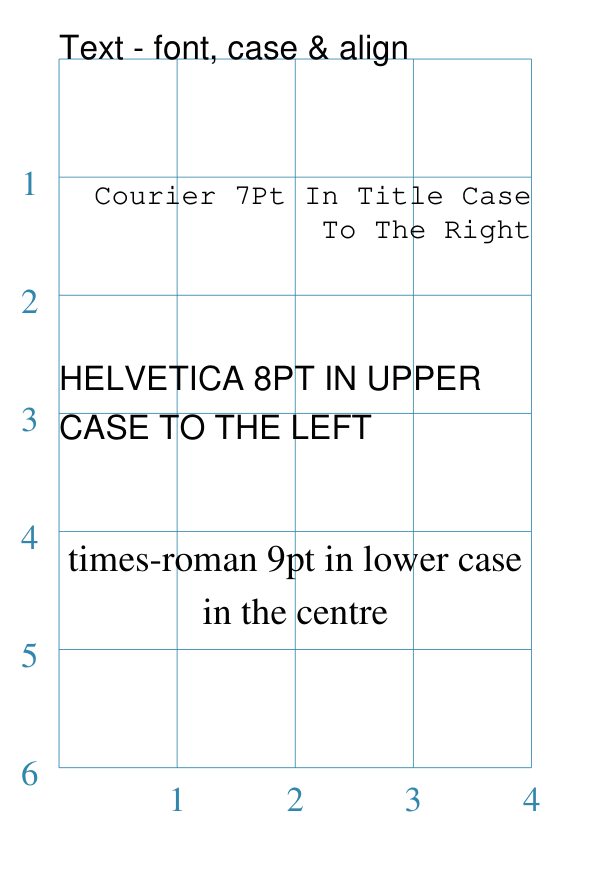
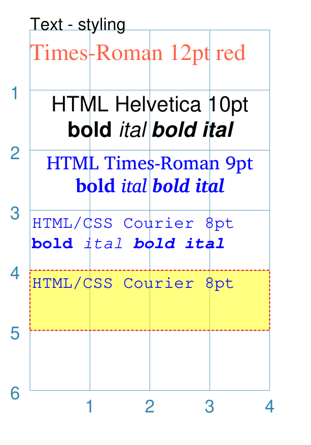
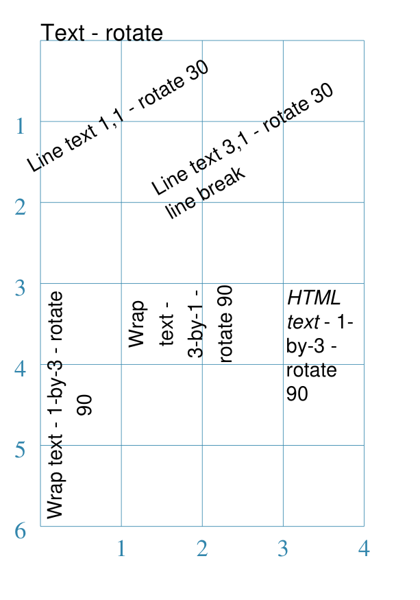

===============
Customised Text
===============

.. |dash| unicode:: U+2014 .. EM DASH SIGN
.. |copy| unicode:: U+000A9 .. COPYRIGHT SIGN
   :trim:
.. |deg|  unicode:: U+00B0 .. DEGREE SIGN
   :ltrim:

The descriptions here assume you are familiar with the concepts, terms
and ideas for :doc:`protograf <index>` as presented in the
:doc:`Basic Concepts <basic_concepts>` |dash| especially *units*,
*properties* and *defaults*.

You should have already seen how default text can be created,
in :doc:`Core Shapes <core_shapes>`.

.. _table-of-contents-text:

- `Overview`_
- `Properties`_
- `Line of Text`_
- `Wrapped Text Box`_
- `HTML Text Box`_
- `Examples`_

.. _textIndex:

Overview
========
`↑ <table-of-contents-text_>`_

Adding text to a design is a very common practice.

:doc:`protograf <index>` offers four similar, but differing, ways to this.

The first is through directly "embedding" the text as part of a shape. The
:doc:`Customised Shapes <customised_shapes>` section has many examples
showing how, for example, properties such as *label_text* or *heading_text*
can be used to display text at predefined locations relative to where the
shape is positioned.  Such text has the advantage that it automatically
"moves" when the shape is repositioned; but the styling options for such
text are limited.

The other three ways make use of the ``Text()`` command as described below.
These ways require you to identify exactly where on a page (or card) the text
must appear.  In the case of HTML-type text, many more styling options also
exist.

.. _textProperties:

Properties
==========
`↑ <table-of-contents-text_>`_

Basic Properties
++++++++++++++++

The basic properties that can be set for ``Text()`` are:

- *text* - the text string to be displayed
- *font_size* - default is ``12`` points
- *font_name* - the default is ``Helvetica``
- *stroke* - the default text color is ``black``
- *align* - the default alignment is ``centre``; it can be changed to be
  ``left`` or ``right``
- *transform* - convert the text to ``upper`` (``u``) or ``lower`` (``l``)
  or ``title`` (``t``) case

Advanced Properties
+++++++++++++++++++

The more advanced properties that can be set for "box" ``Text()`` are:

- *wrap* - set to ``True`` to enable the text to wrap
- *html* - set to ``True`` to both enable the text to wrap and also to use
  embedded HTML/CSS styling options
- *width* - width of the box in which the text appears
- *height* - height of the box in which the text appears
- *box_* - various properties, similar to the that of most areas, can be set
  to style the box in some way, including *box_fill*, *box_stroke*,
  *box_stoke_width*, *box_dotted*, *box_dashed*, and *box_transparency*
- *style* - set HTML/CSS properties that will apply to all of the text; this
  will **automatically** also set the *html* property to ``True``

.. _textLineOfText:

Line of Text
============
`↑ <table-of-contents-text_>`_

Line text is the simplest type of text.  It requires only an *x* and *y*
position, plus the text itself, to be provided. It assumes that a single
line of text is all that is required.

For example:

.. code:: python

    Text(x=3, y=1, text="This is default 12pt Helvetica")

Line text can make also use of the basic properties to set ``Font``
attributes, and carry out transformation and alignment.

For example:

.. code:: python

    Text(x=4, y=0,
         font_size=6, stroke="red",
         font_name="Times-Roman",
         align="right",
         transform='t',  # titlecase!
         text="Red 6pt Times titlecase aligned right")

Note the the "alignment" is based on the *x* and *y* position; so ``right``
aligned text will **end** on that position and ``left`` aligned text will
**start** on that position.

.. _textWrap:

Wrapped Text Box
================
`↑ <table-of-contents-text_>`_

A wrapped text box is created by setting ``wrap=True`` in a ``Text()`` command.

A wrapped text box is very similar to the single line text, but in addition
to the *x* and *y* position, it also requires *height* and *width* to be set.

The text is then "wrapped" within the boundaries of the rectangle defined by
these settings.

For example:

.. code:: python

    Text(x=0, y=3,
         height=2, width=4,
         wrap="True",
         font_size=7, stroke="red",
         font_name="Courier",
         align="right",
         transform='t',  # titlecase!
         text="""Red 7pt Courier in title case aligned right
    and wrapped around""")

In this example, it can be seen how use of triple quotes |dash| `"""` |dash|
enables the text to be written over multiple lines.

.. IMPORTANT::

  If the box height and width are too small to allow all the text to be
  displayed, then **NO** text at all will be displayed!

.. _textHTML:

HTML Text Box
================
`↑ <table-of-contents-text_>`_

An HTML text box is created by setting ``html=True`` in a ``Text()`` command.

An HTML text box is very similar to the single line text, but in addition
to the *x* and *y* position, it also requires *height* and *width* to be set.
The text is then "wrapped" within the boundaries of the rectangle defined by
these settings.

.. IMPORTANT::

  If the box height and width are too small to allow the text to be
  displayed using the given font family and size, then the text will be
  **RESIZED** to fit!

An HTML text box is most useful when fine-grained control of text is required.

An HTML text box is also required if you need to insert Unicode-referenced
characters as part of the text, using the ``\u0041`` notation.

.. HINT::

    While it is possible to insert images into HTML text by use of the
    ``<image>`` tag, be aware that this can cause the file size to
    "balloon" quite dramatically |dash| unless otherwise required rather
    insert large, background images via the ``Image()`` command and restrict
    the use of this tag to small icons and PNG files.

Knowledge of CSS, as used to style HTML web pages, is required if you to
achieve specific effects. This can be done in two ways (neither is exclusive
of the other):

- the *style* property can be used to set style values for a ``
`` that
  will "wrap" all of the text supplied
- CSS styling and HTML elements can be used within the text itself;
  for example: ``
this is a green paragraph
``.

.. IMPORTANT::

  If you use ``font-family`` setting in the *style* property (and/or in the
  *text* itself), you **must** have already activated that font via the
  ``Font()`` command; for example ``Font("Eagle Lake")``.

.. _textExamples:

Examples
========
`↑ <table-of-contents-text_>`_

To make it easier to see where and how text has been drawn, most of these
examples have been created with a background grid (which **protograf**
refers to as a :ref:`Blueprint <blueprint-command>` shape) added to the
page |dash| a small A8 "business card" size |dash| for cross-reference.
In addition, the default line width (aka *stroke_width*) has been made
thicker for easier viewing of the small PNG images that are generated from
the original PDF output.

A number of examples also use the :ref:`Common command <the-common-command>`
|dash| this allows shared properties to be defined once and then used by any
number of shapes.

- `Example 1. Customised Text`_
- `Example 2. Styled Text`_
- `Example 3. Rotated Text`_
- `Example 4. Styled Text`_
- `Example 5. Custom Fonts`_

Example 1. Customised Text
++++++++++++++++++++++++++
`^ <textIndex_>`_

===== ======
|t02| This example shows the text constructed using various properties:

      .. code:: python

        Text(wrap=True,
             x=0, y=1, width=4, height=1,
             font_size=7, fill="black", stroke="black",
             font_name="Courier", align="right",
             transform='t',
             text="Courier 7pt in title case to the right")
        Text(wrap=True,
             x=0, y=2.5, width=4, height=1,
             font_size=8, fill="black", stroke="black",
             font_name="Helvetica", align="left",
             transform='upper',
             text="Helvetica 8pt in upper case to the left")
        Text(wrap=True,
             x=0, y=4, width=4, height=1,
             font_size=9, fill="black", stroke="black",
             font_name="Times-Roman", align="centre",
             transform='lowercase',
             text="Times-Roman 9pt in lower case in the centre")

      In this example, the use of ``wrap=True`` signifies the  use of "complex"
      multi-line text, to which various styling properties can be applied.

      Complex text can have the following properties:

      - *width* - width of the box in which the text appears
      - *height* - height of the box in which the text appears
      - *align* - can be ``left``, ``centre`` or ``right``
      - *transform* - ``uppercase`` (``u``), ``lowercase`` (``l``) or
        ``titlecase`` (``t``)
      - various font related properties

      The box **must** be big enough to show the text, otherwise none will be
      displayed!

      This example also shows how the text's font can be set using the ``font_name``
      property.

      .. NOTE::

        If you're not using a built-in font, you **must** activate it first
        with a ``Font`` command.

        For more details see :ref:`the Font command <the-font-command>`.

===== ======

Example 2. Styled Text
++++++++++++++++++++++
`^ <textIndex_>`_

===== ======
|t03| This example shows the text constructed using various properties:

      .. code:: python

        Font("Times-Roman", size=11, stroke="tomato")
        Text(x=0, y=0.5, align="left",
             text="Times-Roman 12pt red")

        Text(html=True,
             x=0, y=1, width=4, height=2,
             text=''
                  'HTML Helvetica 10pt '
                  '<b>bold</b> <i>ital</i> <b><i>bold ital</i></b>'
        )
        Text(html=True,
             x=0, y=2, width=4, height=2,
             text=''
                  'HTML Times-Roman 9pt '
                  '<b>bold</b> <i>ital</i> <b><i>bold ital</i></b>'
        )
        Text(x=0, y=3, width=4, height=2,
             style="font-family: Courier; font-size: 8pt; color: blue;",
             text='HTML/CSS Courier 8pt '
                  '<b>bold</b> <i>ital</i> <b><i>bold ital</i></b>'
        )
        Text(x=0, y=4, width=4, height=1,
             box_stroke="red", box_fill="yellow",
             box_dotted=True, box_transparency=50,
             style="font-family: Courier; font-size: 8pt; color: blue;",
             text='HTML/CSS Courier 8pt ')

      In this example, the use of ``html=True`` signifies the use of "styled"
      multi-line, HTML-formatted, text.  If the *css* property is supplied,
      then it is not necessary to also set the *html* property.

      "Styled" means that various CSS styling properties can be applied to it.

      This example shows how the text's font can be set either:

      - via the ``Font`` command
      - via *style* property
      - via the ``font-family: ...">`` embedded in the *text*; for this to
        work, the ``Font`` command must have already been used to define
        that font.

      The last HTML text shows how the rectangular "block" that forms the
      text boundary can itself be styled by using the various *box_*
      properties.

===== ======

Example 3. Rotated Text
+++++++++++++++++++++++
`^ <textIndex_>`_

===== ======
|t04| This example shows Text constructed using various properties.

      Note the use of the :ref:`Common command <the-common-command>`
      for when multiple Texts all need to share the same properties.

      .. code:: python

        props = Common(
            font_size=7,  fill="black", stroke="black",
            font_name="Helvetica")

        Text(
            common=props, x=1, y=1,
            text="Line text 1,1 - rotate 30",
            rotation=30)
        Text(
            common=props, x=3, y=1,
            text="Line text 3,1 - rotate 30\nline break",
            rotation=30)

        Text(
            common=props, x=0, y=3,
            width=1, height=3, wrap=True,
            text="Wrap text - 1-by-3 - rotate 90",
            rotation=90)
        Text(
            common=props, x=1, y=3,
            width=3, height=1, wrap=True,
            text="Wrap text - 3-by-1 - rotate 90",
            rotation=90)

        Text(
            common=props, x=3, y=3,
            width=1, height=3, html=True,
            style="font-family: Helvetica; font-size: 7pt;",
            text="<i>HTML text</i> - 1-by-3 - rotate 90",
            rotation=90)

      This example shows how the text can be rotated using the *rotation*
      property.

      The top two examples show normal (aka "line") text rotated around
      the mind-point of the text at the ``x`` and ``y`` location.

      Be aware that even though the ``\n`` forces a line-break, the total
      length of the line is still calculated using all the characters.

      The lower two examples on the left show "text in a box" using the
      ``wrap=True`` property.

      It should be noted that the width of the
      box is effectively also rotated, so that the width now becomes the
      "height" (and vice-versa of course).

      The lower example on the right shows "text in a box" using the
      ``html=True`` property.

      For this example, styling is via the *style*
      property and not via the :ref:`Common command <the-common-command>`

      .. IMPORTANT::

        Both *wrap* and *html* text can only be rotated in increments of
        90 (ninety) degrees!!

===== ======

Example 4. Styled Text
++++++++++++++++++++++
`^ <textIndex_>`_

===== ======
|t05| This example shows the text constructed using various properties:

      .. code:: python

        basic = Common(
            wrap=True,
            width=5, height=1.5,
            font_size=10,
            stroke="black",
            font_name="Helvetica",
            align="left")
        Text(common=basic,
             x=0, y=0.5,
             fill="white",
             text="Default; no outline")
        Text(common=basic,
             x=0, y=1.5,
             fill="white",
             outlined=True,
             text="Outlined; white fill")
        Text(common=basic,
             x=0, y=2.5,
             fill="red",
             outlined=True,
             text="Outlined; red fill")
        Text(common=basic,
             x=0, y=3.5,
             fill=None,
             outlined=True,
             text_stroke_width=0.1,
             text="Outlined; no fill; text_stroke_width=0.1")
        Text(common=basic,
             x=0, y=5,
             fill="yellow",
             outlined=True,
             text_stroke_width=0.07,
             text="Outlined; yellow fill; text_stroke_width=0.07")

      This example shows how the text can be styled using the *outlined*
      property.

      The first example shows what the text, with given font, size and color,
      looks like without any styling applied.

      The other examples show how the *outlined* property, when set to
      ``True``, will cause the outline of the text to be drawn.

      Depending on what value is set for the *fill* property, the "inside"
      color of the text will be changed.

      The last two examples show the effect of setting the *text_stroke_width*,
      which has a default of ``0.05``, so as to make the outline stroke width
      thicker.

      The fourth example shows how this effect can be used to simulate a
      "bold" styling for the text.

===== ======

Example 5. Custom Fonts
+++++++++++++++++++++++
`^ <textIndex_>`_

Many fonts, such as the ones shown in this example, are typically **not**
installed by default on a machine. If you want to run this example as expected,
then the fonts used can be obtained from:

- https://fonts.google.com/specimen/Quintessential
- https://fonts.google.com/specimen/Eagle+Lake
- https://fontmeme.com/fonts/freemono-font/
- https://fonts.google.com/specimen/Tektur

The best way to use custom fonts in a script is to "activate" them with the
``Font()`` command, as shown in the example near the start of the script.

.. IMPORTANT::

  If you have previously run a script, then all fonts available at that time
  would have been indexed.  If you later install new fonts you want to use,
  then you need to add in the ``cached_fonts=False`` property to the
  ``Create()`` command at the start of the script. You only need to do this
  once after new font install, and then the property can be removed.

===== ======
|t06| This example shows the text constructed using various properties:

      .. code:: python

        Font("Quintessential")
        Font("Eagle Lake")
        Font("Tektur")
        Font("FreeMono")

        Text(x=0, y=0.5, width=4, height=1.5,
             align="left", font_name="Tektur",
             text="AbcEJZ?0&")

        Text(x=0, y=1, width=4, height=1.25, wrap=True,
             align="right", stroke="green", font_size=14,
             font_name="Eagle Lake", box_fill="lightcyan",
             text="AbcEJZ?0&")

        Text(x=0, y=2.5, width=4, height=1.25, html=True,
             align="left", stroke="red", font_size=14,
             font_name="Quintessential", box_fill="pink",
             text="AbcEJZ?0&")

        Text(x=0, y=4, width=4, height=1.25,
             box_fill="greenyellow",  # NO html!
             style="""
                 font-family: FreeMono;
                 font-size: 15.0px;
                 color:gray;
                 font-weight: bold;""",
             text="AbcEJZ?0&")

        Text(x=0, y=5.5, width=4, height=2.5,
             html=True, box_fill="silver",
             text="""
             

             AbcEJZ?0&
             

             

             AbcEJZ?0&
             
"""
             )

===== ======
