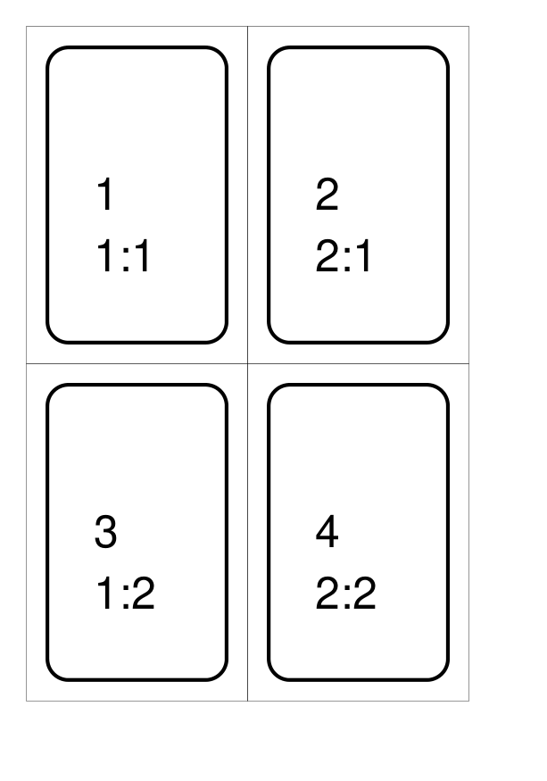
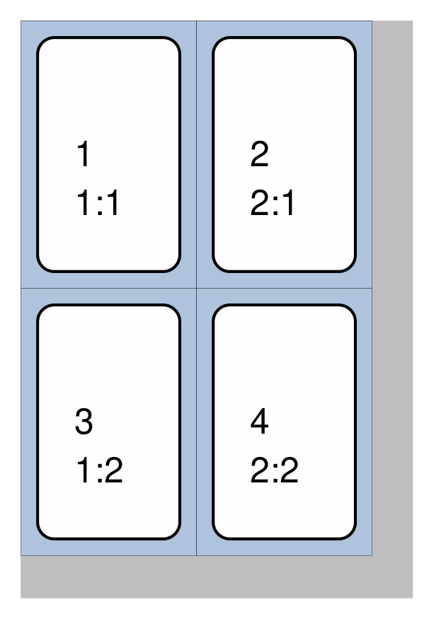
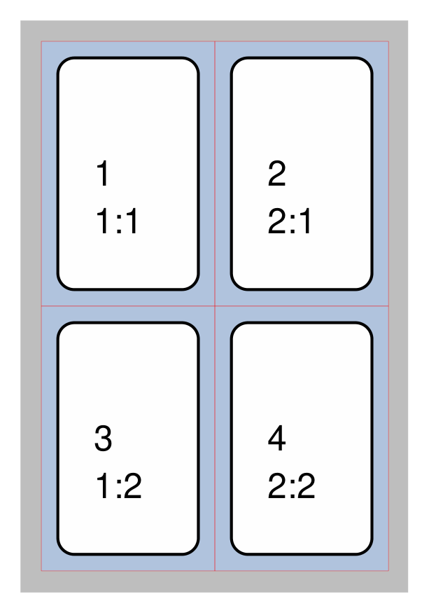
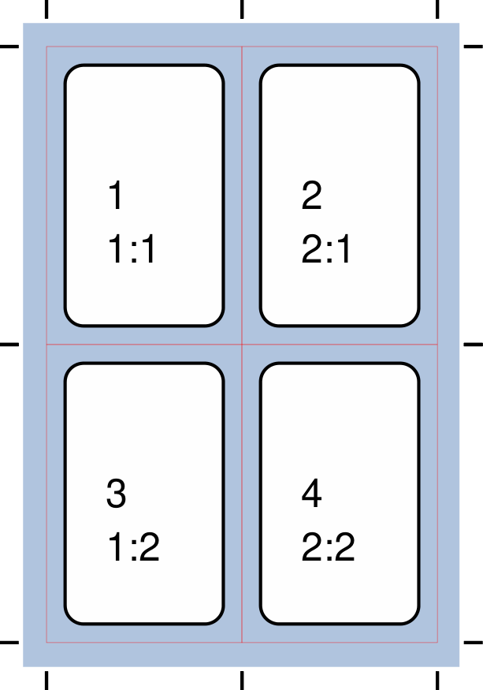
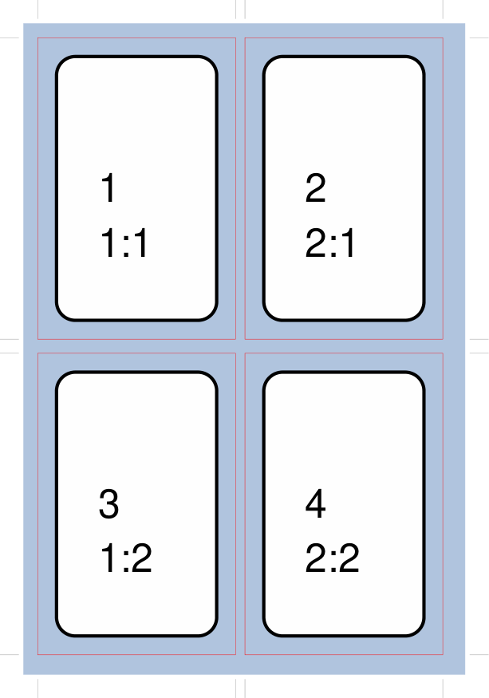
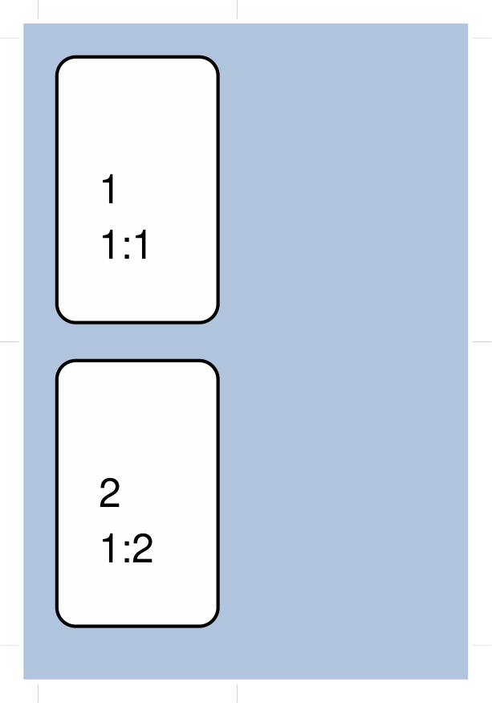
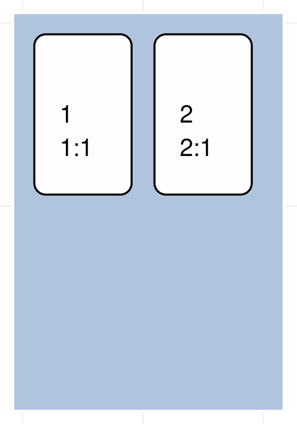
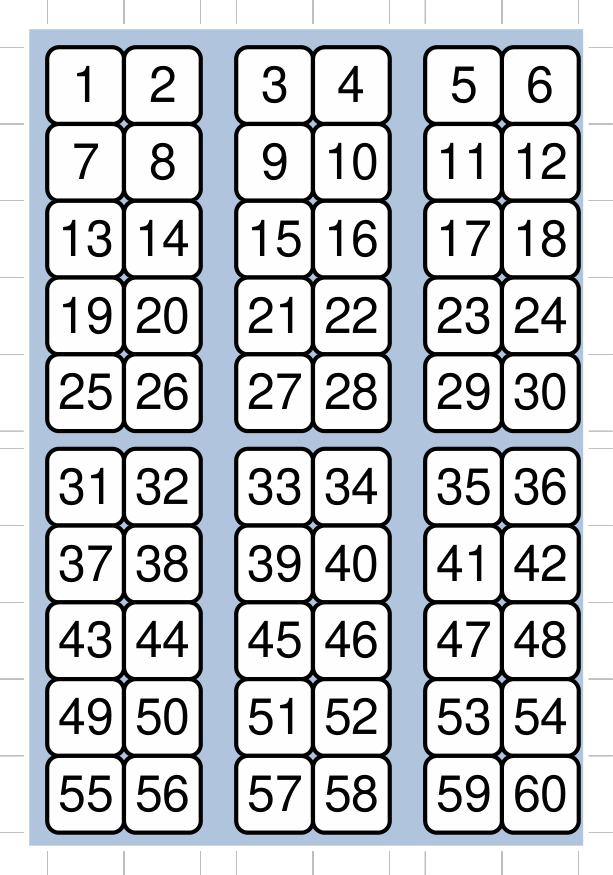

================
The Deck Command
================

.. |dash| unicode:: U+2014 .. EM DASH SIGN

This section assumes you are very familiar with the concepts, terms and
ideas for :doc:`protograf <index>` as presented in the
:doc:`Basic Concepts <basic_concepts>` , that you understand all of the
:doc:`Additional Concepts <additional_concepts>`
and that you've created some basic scripts of your own using the
:doc:`Core Shapes <core_shapes>`.

It also assumes you have read through the section on
:doc:`card decks <card_decks>`.

.. _table-of-contents-deck:

- `Overview`_

  - `Primary Properties`_
  - `Secondary Properties`_
- `Property Examples`_


Overview
========
`↑ <table-of-contents-deck_>`_

This command provides the overall "framework" for the cards that are defined
in the script.  It's primary purpose is to set the card size, and then
calculate how many cards appear on a page.  It manages the "flow" of cards as
they get drawn.


.. _deck-command-primary:

Primary Properties
------------------
`↑ <table-of-contents-deck_>`_

The following are key properties that will often need to be set for a
``Deck``:

- **cards** - the number of cards appearing in the deck; it defaults
  to 9; note that other commands such as ``Data()`` and ``Matrix()`` can alter
  this value
- **height** - the card height for a rectangular card;
  it defaults to 8.89 cm, or 3.5", i.e. the height of a Poker playing card
- **width** - the card width for a rectangular card;
  it defaults to 6.35 cm, or 2.5", i.e. the width of a Poker playing card


.. _deck-command-secondary:

Secondary Properties
--------------------
`↑ <table-of-contents-deck_>`_

The following are other properties that can also be set for a ``Deck``:

- **bleed_fill** - set a background color for the page (up to the margins);
  if no separate **fill** property is set, then this color will be used instead
- **card_name**  - the name of a column in the dataset defined by
  :ref:`the Data Command <the-data-command>` that specifies
  what file name will be given to the card when it is exported as an image
  (if not supplied, will default to using the page number and card number)
- **card_size** - a pre-existing card size used to set *width* and *height*
  (values for *width* and *height* will override these); can be one of:
  ``"poker"``, ``"bridge"``, ``"mini"``, ``"miniamerican"``, ``"minieuropean"``,
  ``"skat"``, ``"tarot"`` or ``"business"``
- **cols** - the maximum number of card columns that should appear on a
  page
- **copy** - the name of a column in the dataset defined by
  :ref:`the Data Command <the-data-command>` that specifies
  how many copies of a card are needed
- **fill** - sets the color of the card's area; defaults to ``white``
- **frame** - the default card frame is a *rectangle* (or square, if the
  height and width match); but can be set to *hexagon* or *circle*
- **grid_marks** - if set to ``True``, will cause small marks to be drawn at
  the border of the page that align with the edges of the card frames
- **grid_marks_length** - the length of the grid mark; defaults to ``0.85`` cm
  (about one-third of an inch)
- **grid_marks_stroke** - the color of the grid mark; defaults to ``gray``
- **grid_marks_stroke_width** - the line width of the grid mark; defaults to 0.1
- **grouping** - sets the number of cards to be drawn adjacent to each other
  before a blank space is added by the **spacing** property |dash| use
  **grouping_col** and/or **grouping_row** to set spacing specifically for the
  horizontal (columns) or vertical (rows) direction respectively. Note that
  **grouping** does not apply to  *hexagon* **frame** cards.
- **gutter** - a value set for this helps determines the spacing between the
  fronts and backs of cards when these are drawn on two halves of the same
  page; its value is divided in half, and added to the top margin value, and
  each set of cards is drawn that distance away from the centre line of the page
- **gutter_stroke** - if set, will cause a line of that color to be used
  for the *gutter* line; this defaults to ``gray`` (to match grid marks)
- **gutter_stroke_width** - if set to a value, will cause a line of that
  thickness to be used for the *gutter* line
- **gutter_dotted** - sets the style of the *gutter* line
- **gutter_layout** - sets the orientation of the page for the cards drawn in
  the two gutter "halves"; this can be ``portrait`` (the default) or
  ``landscape```; the latter is useful when you have very tall cards e.g.
  ``tarot`` sized ones.
- **mask** - an expression which should evaluate to ``True`` or ``False``.
  This expression has the same kind of syntax as the
  :ref:`T(emplate) command <the-template-command>`
  and it uses data available from the Deck's
  :ref:`Data Command <the-data-command>`). If the expression result is ``True``
  then any matching cards will be masked i.e. ignored and not drawn
- **radius** - the radius for a frame of type *hexagon* or *circle*;
  it defaults to 2.54 cm (one inch)
- **rounding** - sets the size of rounding on each corner of a rectangular
  frame card
- **rows** - the maximum number of card rows that should appear on a page
- **spacing** - create blank space between each card or grouping |dash| use
  **spacing_x** and/or **spacing_y** to set spacing specifically for the
  horizontal or vertical direction respectively.
- **stroke** - sets the color of the card's border; defaults to ``black``
- **zones** - a list that defines shapes that must appear on one or more pages

.. HINT::

    The one property that does not appear with the ``Deck()`` command is the
    option to export the cards as individual PNG images.  To this you need
    to add ``cards=True`` to the :ref:`Save() <save-command>` command.


.. _property-examples:

Property Examples
=================
`↑ <table-of-contents-deck_>`_

- `Example 1. Defaults`_
- `Example 2. Card Bleed`_
- `Example 3. Full Bleed`_
- `Example 4. Offset`_
- `Example 5. Grid Marks`_
- `Example 6. Card Spacing`_
- `Example 7. Clean Layout`_
- `Example 8. Column Limit`_
- `Example 9. Row Limit`_
- `Example 10. Circular Frame`_
- `Example 11. Card Grouping`_
- `Example 12. CardBack and Gutter`_
- `Example 13. Deck Zones`_

These examples are shown on a small A8-sized page, as the purpose is to
illustrate how the Deck properties are used; normally cards would be
set out on A4- or Letter-sized pages, but the principle will be the
same.

In most cases |dash| except where otherwise shown |dash| a basic
``Rectangle``, with a thick rounded border, is used as the shape that is
drawn on each card.  This purely for illustration purposes; your cards
would have their own set of one or more shapes that you would want to
draw on  them.

The ``Rectangle`` also has its *label* set to show the Card's *sequence*
number i.e. the order in  which it is drawn (usually top-to-bottom and
left-to-right), sometimes followed by its *column* and *row* number.

The part of the script for doing this is:

  .. code:: python

    Card(
        '*',
        rectangle(
            x=0.2, y=0.2,
            width=1.7, height=2.8,
            stroke_width=1, rounding=0.2,
            label='{{sequence}}\n{{id}}')
    )

In your script, the ``Deck()`` command should appear first before
any of the ``Card()`` commands.

.. HINT::

  Remember that **any number** of ``Card()`` commands, each drawing one or
  more shapes on one or more cards, can be used in a script!


Example 1. Defaults
-------------------
`^ <property-examples_>`_



===== ======
|d01| This example shows the definition of a deck for a set of small
      cards.

      The card size means that there will be 4 rectangular cards on each
      A8 page:

      .. code:: python

        Deck(
            cards=4,
            height=3.2,
            width=2.1)

      The frame for the card is shown by default as a thin black line.
      The shape, or shapes drawn on a card are located within that frame,
      relative to its boundaries.

===== ======


Example 2. Card Bleed
---------------------
`^ <property-examples_>`_


===== ======
|d02| This example shows the definition of a deck for a set of small
      cards. The card size means that there will be 4 rectangular cards
      on each A8 page:

      .. code:: python

        Deck(
            cards=4,
            height=3.2,
            width=2.1,
            fill="silver")

      Every card can be assigned a background color via the *fill* property
      of the Deck. This is also known as a "bleed" area, and is useful in case
      the cutting is misaligned; allowing the main area of the card to still
      be visible.

===== ======


Example 3. Full Bleed
---------------------
`^ <property-examples_>`_



===== ======
|d03| This example shows the definition of a deck for a set of small
      cards.

      The card size means that there will be 4 rectangular cards
      on each A8 page:

      .. code:: python

        Deck(
            cards=4,
            height=3.2,
            width=2.1,
            fill="silver",
            bleed_fill="gray")

      The bleed area for the card can also be extended to the whole page
      (up to the margins) by using the *bleed_fill* color.

      In this example, the *bleed_fill* is shown as a different color from
      the Card's bleed, so it's clear what its coverage is, but usually
      these colors would match.

      See also `Example 5. Grid Marks`_ below.

===== ======


Example 4. Offset
-----------------
`^ <property-examples_>`_



===== ======
|d04| This example shows the definition of a deck for a set of small
      cards.

      The card size means that there will be 4 rectangular cards
      on each A8 page:

      .. code:: python

        Deck(
            cards=4,
            height=3.2,
            width=2.1,
            stroke="red",
            fill="silver",
            bleed_fill="gray",
            offset=0.25)

      To allow for the possibility that a page may not printed all the way
      to the margin, the printing area for the card frames can be offset
      from the margin by any amount (in this example, by ``0.25`` cm).

      Its also possible to offset only from the left by using **offset_x**
      or only from the bottom by using **offset_y**.

      Note that in this example, the color of the Cards frame line has been
      changed to *red*; depending on the *bleed_fill* color it can be helpful
      to set this.

===== ======


Example 5. Grid Marks
---------------------
`^ <property-examples_>`_



===== ======
|d05| This example shows the definition of a deck for a set of small
      cards.

      The card size means that there will be 4 rectangular cards
      on each A8 page:

      .. code:: python

        Deck(
            cards=4,
            height=3.2,
            width=2.1,
            stroke="red",
            bleed_fill="silver",
            offset=0.25,
            grid_marks=True,
            grid_marks_length=0.2,
            grid_marks_stroke="black",
            grid_marks_stroke_width=1)

      In this example, there are two main changes from previous ones.

      There is now a consistent bleed color across both page background and
      within in the cards themselves; if no separate *fill* property is used,
      then the fill color within the card frame will be set to match that of
      the *bleed_fill*.

      The edge of the page has small marks that are designed to help with
      card cutting; ``grid_marks=True`` enables these marks, and the optional
      *grid_marks_length* allows the length of these lines to be set; the default
      length is ``0.85`` cm.

      In this example, the ``grid_marks_stroke`` has been changed from the
      default color of ``"gray"`` to ``"black"`` and the
      ``grid_marks_stroke_width`` has been increased to ``1`` point.
      (Normally, the stroke width should be thin to better aid with cutting.)

===== ======


Example 6. Card Spacing
-----------------------
`^ <property-examples_>`_



===== ======
|d06| This example shows the definition of a deck for a set of small
      cards.

      The card size means that there will be 4 rectangular cards
      on each A8 page:

      .. code:: python

        Deck(
            cards=4,
            height=3.2,
            width=2.1,
            stroke="red",
            bleed_fill="silver",
            offset=0.15,
            grid_marks=True,
            grid_marks_length=0.2,
            spacing_x=0.1,
            spacing_y=0.15)

      Depending on the printing and cutting requirements, it can be useful
      to add spacing (unused area) between the cards.

      The *spacing* property can sets spacing distance in both x- and
      y-directions.

      This example show spacing set for each direction separately |dash|
      using **spacing_x** for horizontal spacing and **spacing_y** for
      vertical spacing.

      Note that using spacing also adds extra grid marks.

      .. HINT::

        For simple "print, cut and use" cards, spacing is usually *not* needed
        as it just adds more work to the cutting step without much more value!

===== ======


Example 7. Clean Layout
-----------------------
`^ <property-examples_>`_


===== ======
|d07| This example shows the definition of a deck for a set of small
      cards. The card size means that there will be 4 rectangular cards
      on each A8 page:

      .. code:: python

        Deck(
            cards=4,
            height=3.2,
            width=2.1,
            stroke=None,
            bleed_fill="silver",
            offset=0.15,
            grid_marks=True,
            grid_marks_length=0.2,
            spacing=0.15)

      Here, all the other adjustments to the Deck layout |dash| *bleed_fill*,
      *offset*, *grid_marks* and (possibly) *spacing* are as above.

      In this example, drawing of the Card frames is disabled by setting
      ``stroke=None``.

      The result is a "clean" layout where small mistakes in cutting will mean
      cards can still retain a fair visual appearance.

===== ======


Example 8. Column Limit
-----------------------
`^ <property-examples_>`_



===== ======
|d08| This example shows the definition of a deck for a set of small
      cards.

      The card size means that there would normally be 4 rectangular cards
      on each A8 page; but use of *cols* changes this.

      .. code:: python

        Deck(
            cards=4,
            height=3.2,
            width=2.1,
            stroke=None,
            bleed_fill="silver",
            offset=0.15,
            grid_marks=True,
            grid_marks_length=0.2,
            cols=1)

      By default, **protograf** will fit as many cards as possible into the
      available page area.

      If for any reason, there needs to be fewer cards on a page, then setting
      the *cols* property will limit the creation of the number of columns on
      each one.

===== ======


Example 9. Row Limit
--------------------
`^ <property-examples_>`_



===== ======
|d09| This example shows the definition of a deck for a set of small
      cards.

      The card size means that there would normally be 4 rectangular cards
      on each A8 page; but use of *rows* changes this.

      .. code:: python

        Deck(
            cards=4,
            height=3.2,
            width=2.1,
            stroke=None,
            bleed_fill="silver",
            offset=0.15,
            grid_marks=True,
            grid_marks_length=0.2,
            rows=1)

      By default, **protograf** will fit as many cards as possible into the
      available page area.

      If for any reason, there needs to be fewer cards on a page, then
      setting the *rows* property will limit the creation of the
      number of rows on each one.

===== ======


Example 10. Circular Frame
--------------------------
`^ <property-examples_>`_


===== ======
|d10| This example shows the definition of a deck for a set of small
      cards.

      The card size means that there will be 6 circular cards
      on each A8 page:

      .. code:: python

        Deck(
            cards=6,
            radius=1,
            bleed_fill="silver",
            offset=0.15,
            grid_marks=True,
            grid_marks_length=0.2,
            spacing=0.15,
            frame='circle')

      The default frame for a Card is a rectangle, but this can be changed
      by setting the **frame** property to either **circle** or **hexagon**.

      In this example, because the cards are circular, the *radius* property
      needs to be set.

      The **frame** property also can be seen "in action" in various
      examples; see a :ref:`hexagonal example <hexagonal-cards>`
      and another :ref:`circular example <circular-cards>`.

===== ======


Example 11. Card Grouping
-------------------------
`^ <property-examples_>`_



===== ======
|d11| This example shows the definition of a deck for a set of very small
      cards |dash| these are more likely to be game counters.

      The card size means that there will be 60 square cards
      on each A8 page:

      .. code:: python

        Deck(
            cards=60,
            width=0.65,
            height=0.65,
            bleed_fill="silver",
            offset=0.15,
            grid_marks=True,
            grid_marks_length=0.2,
            spacing_x=0.3,
            spacing_y=0.15,
            grouping_cols=2,
            grouping_rows=5,
            stroke=None,
            )
        Card(
            '*',
            rectangle(
                x=0, y=0,
                width=0.65, height=0.65,
                stroke_width=1, rounding=0.1,
                label='{{sequence}}'),
        )

      By default, **protograf** will fit as many cards as possible into the
      available page area.

      This example shows how cards in the same grouping |dash| whether in a row
      or column |dash| are kept together, and how the spacing is inserted
      between each *group* rather than between each *individual card*.

===== ======


Example 12. CardBack and Gutter
-------------------------------
`^ <property-examples_>`_


===== ======
|d13| This example shows the definition of a deck for a set of small
      cards.

      The card size means that there would normally be 4 rectangular cards
      on each A8 page; but the layout is changed to have a mix of normal
      Cards and CardBacks. In this case, the card backs are created with a
      green rectangle |dash| but any type of technique used for graphics for
      the front of the card can also be used for the back.

      .. code:: python

        Deck(
            cards=4,
            height=2.1,
            width=3.2,
            bleed_fill="lightsteelblue",
            offset=0.15,
            grid_marks=True,
            grid_marks_length=0.2,
            gutter=0.4
            )
        # design card
        Card(
            '*',
            rectangle(
                x=0.2, y=0.2,
                width=2.8, height=1.7,
                stroke_width=1, rounding=0.2,
                label='{{sequence}}\n{{id}}'),
        )
        # design card back
        CardBack(
            '*',
            rectangle(
                x=0.3, y=0.3,
                width=2.5, height=1.5,
                stroke_width=1, rounding=0.1,
                fill="yellowgreen",
                label='{{sequence}}*\n{{id}}'),
        )

      The ``gutter`` property for Deck() sets the space between the fronts
      and the backs, which face each other across the page.

===== ======


Example 13. Deck Zones
----------------------
`^ <property-examples_>`_


===== ======
|d14| This example shows the definition of a deck for a set of very small
      cards |dash| these are more likely to be game counters.

      The card size means that there will be 32 small square cards
      on each A8 page:

      .. code:: python

        # design deck
        page_header = text(
            text="protograf-cards_deck#14 // page:{{page}}",
            x=2.5, y=0.5, font_size=6, )
        silver = rectangle(
             x=0.5, y=0.75, width=4, height=4,
             fill_stroke="silver")
        gold = rectangle(
             x=0.5, y=3.75, width=4, height=3,
             fill_stroke="gold")
        Deck(
            cards=32,
            width=0.65,
            height=0.65,
            offset=1,
            grid_marks=True,
            grid_marks_length=0.2,
            spacing_x=0.3,
            spacing_y=0.25,
            grouping_cols=2,
            grouping_rows=4,
            stroke=None,
            zones=[
                ('*', page_header),
                ('1', silver),
                ('1', gold)]
            )
        # design cards
        Card(
            '1-16',
            rectangle(
                x=0.05, y=0.05, width=0.55, height=0.55,
                stroke_width=0.75, rounding=0.1,
                fill="silver",
                label='{{sequence}}'),
        )
        Card(
            '17-32',
            rectangle(
                x=0.05, y=0.05, width=0.55, height=0.55,
                stroke_width=0.75, rounding=0.1,
                fill="gold",
                label='{{sequence}}'),
        )

      This example is similar to `Example 11. Card Grouping`_.

      The ``zones`` property for ``Deck()`` defines a list of shapes that must
      be drawn on the specified pages.

      Each item in the list is a set of two values: the first is the page
      number |dash| or range of page numbers |dash| and the second is the
      shape to be drawn on the page(s); this is defined as usual for such
      a shape i.e. the *x* and *y* values are relative to the page margins
      and not those of the card.

      In this case, there is ``Text()`` that is drawn on every page |dash|
      using the ``*`` value |dash| and colored rectangles that are drawn on
      page one; ``silver`` colored at the top and ``gold`` colored lower down.

===== ======
