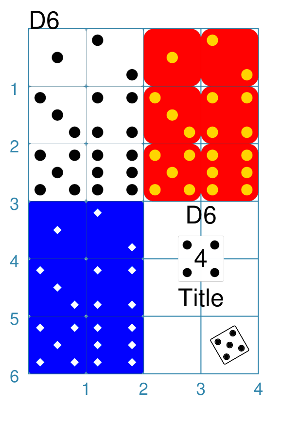

====
Dice
====

.. |dash| unicode:: U+2014 .. EM DASH SIGN

This section assumes you are very familiar with the concepts, terms and ideas
for :doc:`protograf <index>`  as presented in the
:doc:`Basic Concepts <basic_concepts>` , that you understand all of the
:doc:`Additional Concepts <additional_concepts>` and that you've created some
basic scripts of your own using the :doc:`Core Shapes <core_shapes>`. You also
be familiar with the various types of shape's properties described in the
:doc:`Customised Shapes <customised_shapes>`

.. _diceOver:

Overview
========

Dice are widely used in many games, so being able to easily add them to
a graphic layout can be useful.

.. _d6-object:

D6 Properties
=============

The six-sided die object ``D6`` shares some of basic properties of many
other :doc:`shapes <core_shapes>`, with additional properties of *roll* and
*random*, as well as the various *pip_* properties.

d6 Examples
===========

The examples below shows how a D6 can be created and styled.

D6 Styling
----------
`^ <diceOver_>`_

===== ======
|d61| This example shows D6 objects constructed using commands like:

      .. code:: python

        D6(x=0, y=0)
        D6(x=1, y=0, roll=2)
        D6(x=0, y=1, roll=3)
        D6(x=1, y=1, roll=4)
        D6(x=0, y=2, roll=5)
        D6(x=1, y=2, roll=6)

        red_yello = Common(
            pip_fill="gold", pip_stroke="orange",
            fill="red", rounding=0.175)
        D6(x=2, y=0, common=red_yello)
        D6(x=3, y=0, roll=2, common=red_yello)
        D6(x=2, y=1, roll=3, common=red_yello)
        D6(x=3, y=1, roll=4, common=red_yello)
        D6(x=2, y=2, roll=5, common=red_yello)
        D6(x=3, y=2, roll=6, common=red_yello)

        blu_wite = Common(
            pip_fill="white",
            pip_stroke="aqua",
            pip_shape="diamond",
            fill="blue", pip_fraction=0.15)
        D6(x=0, y=3, common=blu_wite)
        D6(x=1, y=3, roll=2, common=blu_wite)
        D6(x=0, y=4, roll=3, common=blu_wite)
        D6(x=1, y=4, roll=4, common=blu_wite)
        D6(x=0, y=5, roll=5, common=blu_wite)
        D6(x=1, y=5, roll=6, common=blu_wite)

        D6(
            x=2.6, y=3.6, side=0.8,
            roll=4,
            title="Title",
            heading="D6",
            label="4")
        D6(
            cx=3.5, cy=5.5, side=0.5,
            roll=5,
            stroke_width=0.5,
            rotation=30)

      All of the D6 shapes are constructed in the same way |dash| setting an *x*
      and *y* value (or *cx* and *cy*).

      The red dice show how the pip *stroke* and *fill* can be set to different
      colors.

      The blue dice show how the pip size and shape can be changed.  Size is
      represented as a fraction of the width/height of the die.  The default
      size is one-fifth (``0.2``) but it can be as small as ``0.1`` or as large
      as ``0.33``.  The default pip shape is a ``circle``, but can also be
      assigned to be a ``diamond``.

      The white dice in the lower-right show how the D6, like many other
      shapes, can be assigned text captions, and that it can be rotated.
      The *stroke_width* of the rotated die has also been made thicker.

===== ======
