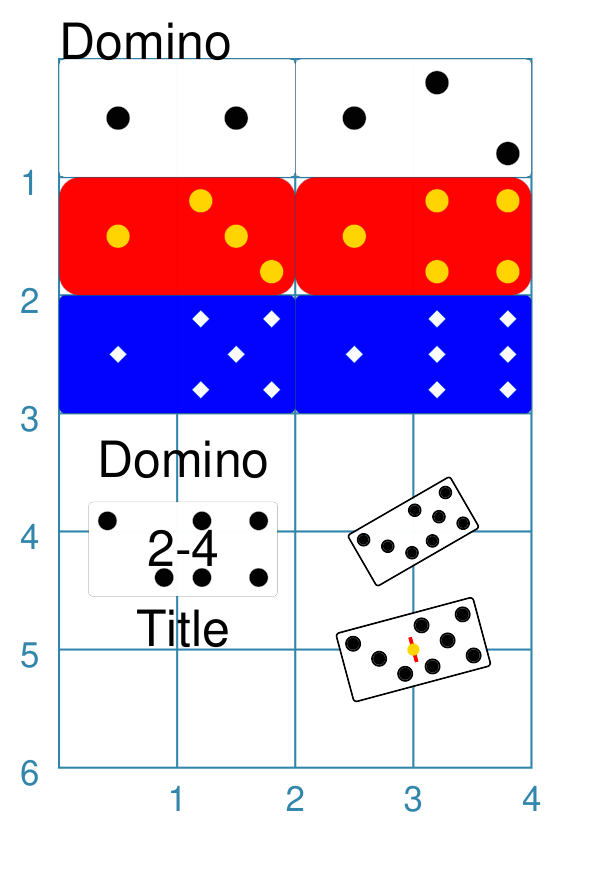

========
Dominoes
========

.. |dash| unicode:: U+2014 .. EM DASH SIGN

This section assumes you are very familiar with the concepts, terms and ideas
for :doc:`protograf <index>`  as presented in the
:doc:`Basic Concepts <basic_concepts>` , that you understand all of the
:doc:`Additional Concepts <additional_concepts>` and that you've created some
basic scripts of your own using the :doc:`Core Shapes <core_shapes>`. You also
be familiar with the various types of shape's properties described in the
:doc:`Customised Shapes <customised_shapes>`

.. _dominoesOver:

Overview
========

Dominoes are widely used in a number of games, so being able to easily add 
them to a graphic layout can be useful.

.. _domino-object:

Domino Properties
=================

The rectangular object ``Domino`` shares some of the basic properties of many
other :doc:`shapes <core_shapes>`, with additional properties of *pips* and
*random*, as well as the various *pip_* properties.

Domino Styling
==============

The examples below shows how a Domino can be created and styled.

`^ <dominoesOver_>`_

===== ======
|do1| This example shows Domino objects constructed using these commands:

      .. code:: python
      
        # ---- styling properties
        red_yello = Common(
            pip_fill="gold", 
            pip_stroke="orange",
            fill="red", rounding=0.175)
        blu_wite = Common(
            pip_fill="white",
            pip_shape="diamond",
            pip_stroke="aqua",
            fill="blue", pip_fraction=0.15)
        
        # ---- basic Domino
        Domino(x=0, y=0)
        Domino(x=2, y=0, pips=(1, 2))
        # ---- color rounded Domino
        Domino(x=0, y=1, pips=(1, 3), 
               common=red_yello)
        Domino(x=2, y=1, pips=(1, 4), 
               common=red_yello)
        # ---- color smaller Domino
        Domino(x=0, y=2, pips=(1, 5), 
               common=blu_wite)
        Domino(x=2, y=2, pips=(1, 6), 
               common=blu_wite)
        
        # ---- sized, rotation, centre_line
        Domino(
            x=0.25, y=3.75, side=0.8, 
            pips=(2, 4), 
            title="Title", 
            heading="Domino", 
            label="2-4")
        Domino(
            cx=3, cy=4, 
            side=0.5, 
            pips=(3, 5), 
            stroke_width=0.5, 
            rotation=30)
        Domino(
            cx=3, cy=5, 
            side=0.6, 
            centre_line=True,
            centre_line_stroke="red",
            centre_line_stroke_width=1,
            centre_line_length=0.22,
            centre_shape=dot(stroke="gold"),
            pips=(3, 5), 
            stroke_width=0.5, 
            rotation=15)

      All of the Domino shapes are constructed in the same way |dash| setting 
      an *x* and *y* value (or *cx* and *cy*).

      The red dominoes show how the pip *stroke* and *fill* can be set to 
      different colors.

      The blue dominoes show how the pips *size* and *shape* can be changed.  
      Size is represented as a fraction of the height of the domino. The default
      size is one-fifth (``0.2``) but it can be as small as ``0.1`` or as large
      as ``0.33``.  The default pip shape is a ``circle``, but can also be
      assigned to be a ``diamond``.

      The white dominoes in the lower-right section show how the Domino, like 
      many other shapes, can be assigned text captions, and that it can be 
      rotated. The *stroke_width* of the rotated dominoes has also been made thicker.
      
      A domino can also be assigned *centre_line* and/or *centre_shape* 
      properties; this can be seen in the lower-right example.
      
      The *centre_line* can be styled using the usual appended names, 
      including ``_stroke``, ``_stroke_width``, ``_length``, ``_dashed``, 
      and ``_dotted``.

===== ======
