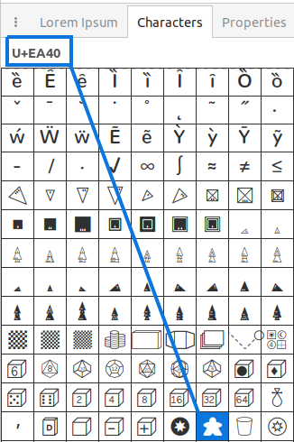

=================
Special Functions
=================

.. |dash| unicode:: U+2014 .. EM DASH SIGN

This list provides a guide to using all the functions that are specific to
:doc:`protograf <index>`.

.. NOTE::

  :doc:`protograf <index>` is a small, specialised tool; but its part of a
  much greater Python language "ecosystem", and functions from the
  :doc:`Python language <python_commands>` |dash| or other
  `Python packages <https://pypi.org>`_  |dash| can be also be used to
  further enhance your own script.

.. _table-of-contents-func:

- `Overview`_
- `Summary`_
- `split()`_
- `steps()`_
- `uni()`_
- `group()`_

Overview
========
`↑ <table-of-contents-func_>`_

Functions |dash| in both :doc:`protograf <index>` and Python |dash| represent
"tools" designed to process or create data to achieve a specific outcome.

The section on  :doc:`Python language <python_commands>` explains how to use
some of its built-in functions, such as ``range``, but there are many, many
more.

:doc:`protograf <index>` provides some functions specific to its own purpose
of enabling creation of cards and other graphic layouts.

In all cases, a function is used or activated through its name followed by
round brackets; something like this |dash| ``the_function_name()``.  In some
cases, additional properties |dash| much like the ones used for a
:ref:`Command() <command-concept>` |dash| can be set to customise the
function's behaviour.

.. _summary-func:

Summary
=======
`↑ <table-of-contents-func_>`_

- `split()`_ -  turn a string into a list
- `steps()`_ - generate a list of numbers
- `uni()`_ - access a symbol, or glyph, from a font's character set
- `group()`_ - create sets of shapes for a Card

.. _split-function:

split()
=======
`^ <summary-func_>`_

The ``split()`` function is used to turn a string into a list; for example:

.. code:: python

    split("A,B,C")

which generates this list: ``["A", "B", "C"]``

or:

.. code:: python

    split("A B C")

which also generates this list: ``["A", "B", "C"]`` - this is because, in the
absence of a comma, the whitespace is used to separate items.

If you use another symbol as a separator, you can set this with a *separator*
property; for example:

.. code:: python

    split("A;B;C", separator=";")

which generates this list: ``["A", "B", "C"]``

If you have extra white space in the string, it can be removed with *clean*
property; for example:

.. code:: python

    split("A; B; C", separator=";")

generates this list: ``["A", " B", " C"]`` with spaces left in, but:

.. code:: python

    split("A; B; C", separator=";", clean=True)

generates this list: ``["A", "B", "C"]``

.. _steps-function:

steps()
=======
`^ <summary-func_>`_

The ``steps()`` function is used to generate a list of numbers.

There are two required properties: *start* and *end* but is usual to omit
the names and just supply the values; for example:

.. code:: python

    steps(1, 10)

which generates this list: ``[1, 2, 3, 4, 5, 6, 7, 8, 9, 10]``

By default, the third property, called the *step* is set to ``1``.
This can be changed; for example:

.. code:: python

    steps(1, 10, 2)

which generates this list: ``[1, 3, 5, 7, 9]``

The numbers can be decimal values, and the step can be negative, for example:

.. code:: python

    steps(10.5, 1.5, -2.25)

which generates this list: ``[10.5, 8.25, 6.0, 3.75, 1.5]``

.. _uni-function:

uni()
=====
`^ <summary-func_>`_

The ``uni()`` function is used to access a symbol, or glyph, from a font's
character set by providing its Unicode text value as ``U+`` value.

For example, a glyph in a specific font may have a "meeple" symbol
(https://en.wikipedia.org/wiki/Meeple) which is represented
by the Unicode text value ``U+EA40``.  This value can be seen in a
font management program:

To use this in a script, simply wrap it in the function as:
``uni("U+EA40")`` after the font has been set (see the
:ref:`Font() <the-font-command>` command).

.. _group-function-link:

group()
=======
`^ <summary-func_>`_

The ``group()`` function is used when working with
:doc:`Card Decks <card_decks>`  - see :ref:`group() <group-function>`
for more details.
