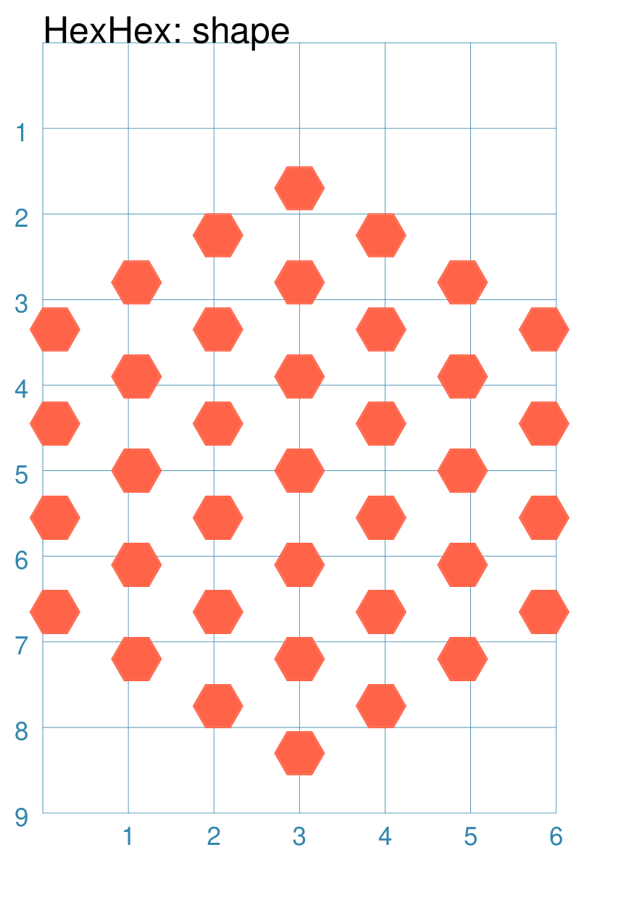
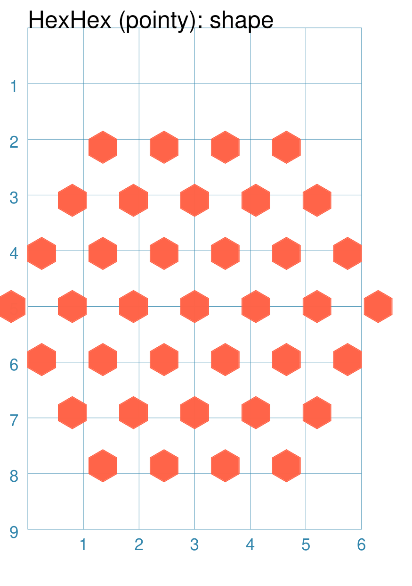
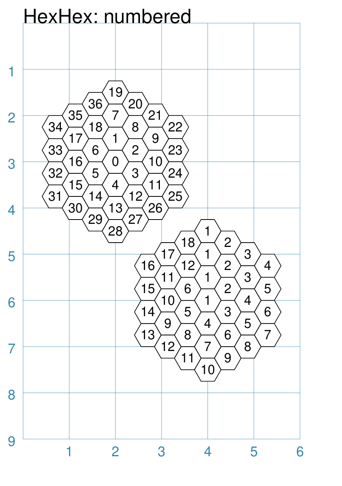
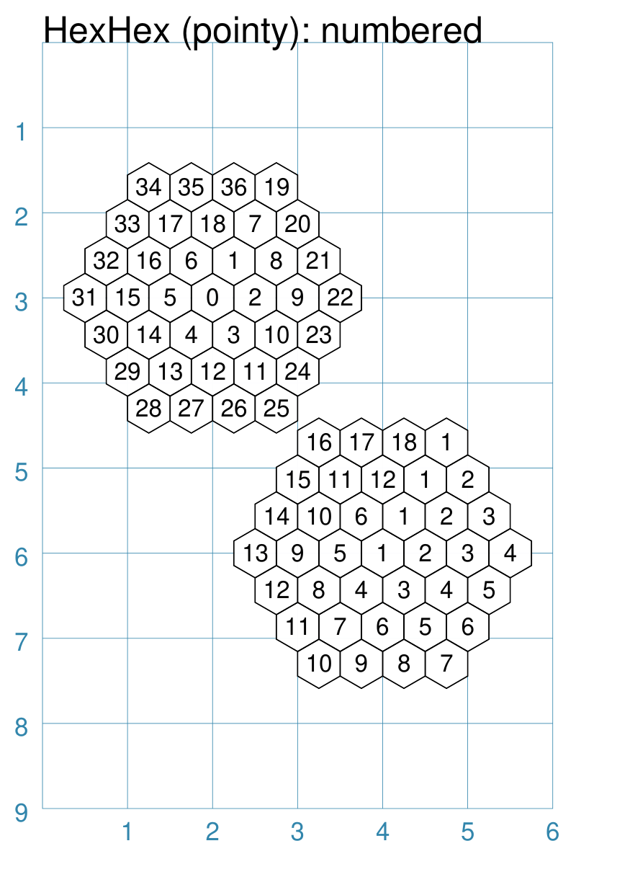
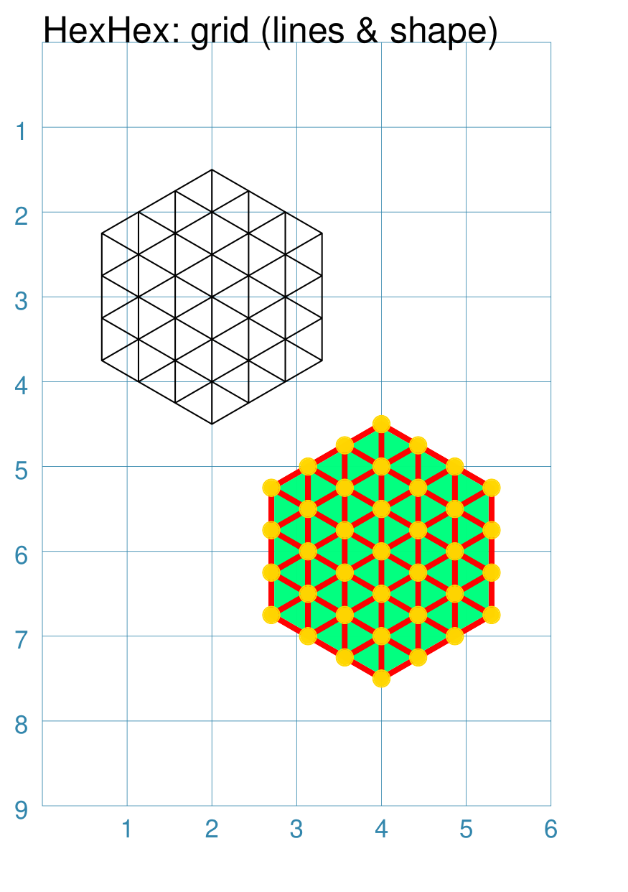
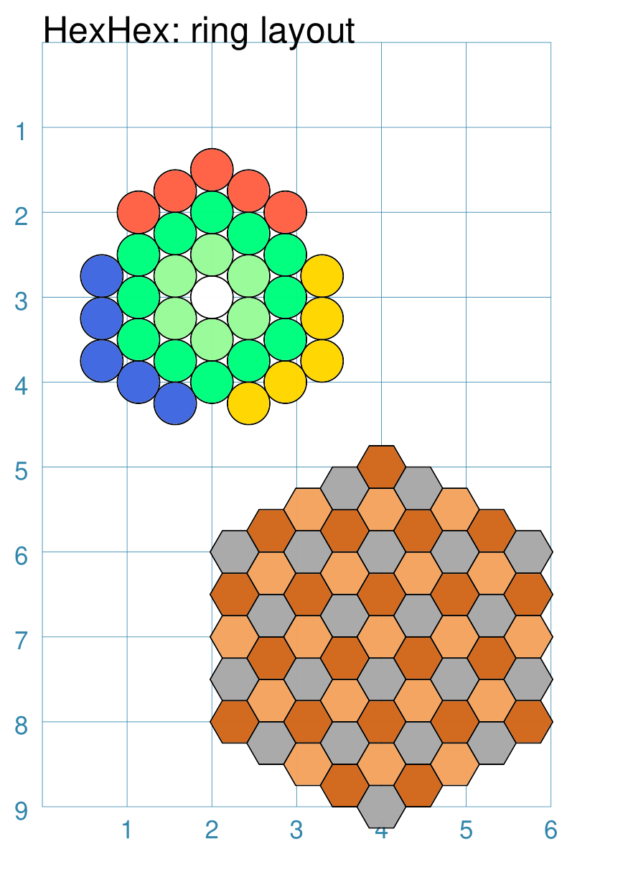

============
HexHex Grids
============

.. |copy| unicode:: U+000A9 .. COPYRIGHT SIGN
   :trim:
.. |deg|  unicode:: U+00B0 .. DEGREE SIGN
   :ltrim:
.. |dash| unicode:: U+2014 .. EM DASH SIGN

This section assumes you are very familiar with the concepts, terms and
ideas for :doc:`protograf <index>` as presented in the
:doc:`Basic Concepts <basic_concepts>` , that you understand all of the
:doc:`Additional Concepts <additional_concepts>`
and that you've created some basic scripts of your own using the
:doc:`Core Shapes <core_shapes>`.

It will also be helpful to have seen and understood the concepts
presented in the section on :doc:`Repetitive Elements <layouts>` and to be
familiar with the use and customisation of a :ref:`Hexagon shape <hexIndex>`.

.. _table-of-contents-hexhexg:

- `Overview`_
- `HexHex Grid Properties`_
- `Default HexHex Grid`_
- `HexHex Grid with a Shape`_
- `HexHex Grid with Numbers`_
- `HexHex Grid with Lines`_
- `HexHex Grid with Ring Layout`_
- `Other HexHex Grid Resources`_

.. _hexhexIndex:

Overview
========
`↑ <table-of-contents-hexhexg_>`_

HexHex |dash| or "beehive" |dash| grids are widely used as grids for abstract
board games.

A HexHex grid is really a more specialised version of a
:doc:`Hexagonal grid <hexagonal_grids>`; but is different in terms of its
available |dash| and underlying |dash| properties, and in the ways it can
be customised.

Although the grid is hexagonal, and the default shape which appears on the
grid intersections is a :ref:`Hexagon <hexIndex>` sized so as to create
a seamless array of hexagons, **any** shape which has a defined centre point
can be specified for placement on the grid intersections.

Some examples of HexHex grids for games are shown in the section on
:doc:`abstract <examples/abstract>` boards.


HexHex Grid Properties
======================
`↑ <table-of-contents-hexhexg_>`_

A HexHex grid has the following key properties:

- *cx* and *cy* - set the centre position of the grid;
  defaults to ``1`` cm for each
- *rings* - sets the number of rings around the centre hexagon;
  defaults to ``1`` |dash| rings increase sequentially as the grid grows
  larger
- *orientation* - set to either ``flat`` (the default) or ``pointy`` to
  set the orientation of the centre hexagon around which others are drawn
- *shape* - sets the shape to be drawn on all grid points; defaults to
  a hexagon
- *shapes* - sets a list of ``(ring, [shapes..])`` to be drawn
- *show_sequence* - set the label for each grid point shape to match the
  sequence number (starting from zero at the centre)
- *show_counter* - set the label for each grid point shape to match the
  counter number (starting from ``1`` for each new ring)

Grid points |dash| or intersections |dash| are defined as the centre points
of "virtual" hexagons; these can be defined in the same way as a normal
:ref:`Hexagon <hexIndex>` i.e. by:

- *height* - sets the distance from flat-edge to flat-edge
- *radius* - sets the distance from centre to a vertex
- *diameter* - sets the distance from vertex to an opposite vertex


Gridlines
---------

In addition to the above properties, the intersections can be joined to
create a series of gridlines.

To activate the grid, set the property ``gridlines=True``

Additional styling can be set for the gridlines:

- *gridlines_fill* - set the color for the interior area of the grid
- *gridlines_stroke* - set the color for the lines
- *gridlines_stroke_width* - set the lines thickness
- *gridlines_dashed* - activate the dashed styling for the lines, if set
  to ``True``

Default HexHex Grid
===================
`↑ <table-of-contents-hexhexg_>`_

The basic hexagonal grid is laid out in a rectangular fashion. It can be
customised in a number of ways.

.. |hh1| image:: images/custom/hexhex/default.png
   :width: 330

===== ======
|hh1| This example shows a grid constructed using the command:

      .. code:: python

        HexHex(height=0.5)

      It has the following properties that differ from the defaults:

      - *height* - flat-edge to opposite flat-edge; normally a default
        of ``1`` of each hexagon making up the grid

===== ======


HexHex Grid with a Shape
========================
`↑ <table-of-contents-hexhexg_>`_

A HexHex grid can




===== ======
|hh3| This example shows a grid constructed using the command:

      .. code:: python

        HexHex(
            cx=3, cy=5,
            height=1.2,
            rings=3,
            shape=hexagon(
                height=0.5,
                fill_stroke="tomato")
        )

      It has the following properties that differ from the defaults:

      - *cx* and *cy* - set the centre location of the grid relative to
        the page margins  (``2`` and ``5`` cm respectively)
      - *height* - set hexagon height to ``1.2`` cm
      - *rings* - set the number of rings to ``3``
      - *shape* - the type of Shape to be drawn on the grod as well as
        that shape's properties (in this case, a small, red Hexagon)

===== ======



===== ======
|hh4| This example shows a grid constructed using the command:

      .. code:: python

        HexHex(
            cx=3, cy=5,
            height=1.1,
            rings=3,
            orientation="pointy",
            shape=hexagon(
                height=0.5,
                fill_stroke="tomato",
                orientation="pointy")
        )

      It has the following properties that differ from the defaults:

      - *cx* and *cy* - set the centre location of the grid relative to
        the page margins  (``2`` and ``5`` cm respectively)
      - *height* - set hexagon height to ``1.1`` cm
      - *rings* - set the number of rings to ``3``
      - *orientation* - set to ``pointy`` (a vertex facing upwards)
      - *shape* - the type of Shape to be drawn on the grid as well as
        that shape's properties (in this case, a small, red, pointy
        Hexagon)

===== ======


HexHex Grid with Numbers
========================
`↑ <table-of-contents-hexhexg_>`_



===== ======
|hh5| This example shows a grid constructed using the command:

      .. code:: python

        HexHex(
            cx=2, cy=3,
            height=0.5,
            rings=3,
            show_sequence=True)
        HexHex(
            cx=4, cy=6,
            height=0.5,
            rings=3,
            show_counter=True)

      The upper grid has the following properties that differ from the
      defaults:

      - *cx* and *cy* - set the centre location of the grid relative to
        the page margins (``2`` and ``3`` cm respectively)
      - *height* - set to ``0.5`` cm
      - *rings* - set the number of rings to ``3``
      - *orientation* - set to ``pointy`` (a vertex facing upwards)
      - *show_sequence* - set to ``True`` in order to display the
        sequence number (starting from ``0`` in the centre)

      The lower grid has the following properties that differ from the
      defaults:

      - *cx* and *cy* - set the centre location of the grid relative to
        the page margins (``4`` and ``6`` cm respectively)
      - *height* - set hexagon height to ``0.5`` cm
      - *rings* - set the number of rings to ``3``
      - *show_counter* - set to ``True`` in order to display the
        counter number (starting from ``1`` for each ring)

===== ======



===== ======
|hh6| This example shows a grid constructed using the command:

      .. code:: python

        HexHex(
            cx=2, cy=3,
            height=0.5,
            rings=3,
            orientation="pointy",
            show_sequence=True)
        HexHex(
            cx=4, cy=6,
            height=0.5,
            rings=3,
            orientation="pointy",
            show_counter=True)

      The upper grid has the following properties that differ from the
      defaults:

      - *cx* and *cy* - set the centre location of the grid relative to
        the page margins (``2`` and ``3`` cm respectively)
      - *height* - set to ``0.5`` cm
      - *rings* - set the number of rings to ``3``
      - *orientation* - set to ``pointy`` (a vertex facing upwards)
      - *show_sequence* - set to ``True`` in order to display the
        sequence number (starting from ``0`` in the centre)

      The lower grid has the following properties that differ from the
      defaults:

      - *cx* and *cy* - set the centre location of the grid relative to
        the page margins (``4`` and ``6`` cm respectively)
      - *height* - set hexagon height to ``0.5`` cm
      - *rings* - set the number of rings to ``3``
      - *orientation* - set to ``pointy`` (a vertex facing upwards)
      - *show_counter* - set to ``True`` in order to display the
        counter number (starting from ``1`` for each ring)

===== ======


HexHex Grid with Lines
======================
`↑ <table-of-contents-hexhexg_>`_



===== ======
|hh7| This example shows a grid constructed using the command:

      .. code:: python

        HexHex(
            cx=2, cy=3,
            height=0.5,
            rings=3,
            fill=None,
            shape=None,  # grid only!
            gridlines=True)
        HexHex(
            cx=4, cy=6,
            height=0.5,
            rings=3,
            shape=circle(
              radius=0.1,
              fill_stroke="gold"),
            gridlines=True,
            gridlines_fill="springgreen",
            gridlines_stroke="red",
            gridlines_stroke_width=2)

      The upper grid has the following properties that differ from the
      defaults:

      - *cx* and *cy* - set the centre location of the grid relative to
        the page margins (``2`` and ``3`` cm respectively)
      - *height* - set hexagon height to ``0.5`` cm
      - *rings* - set the number of rings to ``3``
      - *gridlines* - set to ``True`` in order to display the grid lines

      The upper grid also sets ``shape=None`` to turn off the display of
      the default hexagon which is normally drawn on the grid intersections.

      The lower grid has the following properties that differ from the
      defaults:

      - *cx* and *cy* - set the centre location of the grid relative to
        the page margins (``4`` and ``6`` cm respectively)
      - *height* - set hexagon height to ``0.5`` cm
      - *rings* - set the number of rings to ``3``
      - *gridlines* - set to ``True`` in order to display the grid lines

      The lower grid also adds additional styling for the grid: its *fill*
      color; the *stroke* color for the lines; and the *stroke_width* for
      the gridlines thickness.

===== ======

.. |hh8| image:: images/custom/hexhex/lines_pointy.png
   :width: 330

===== ======
|hh8| This example shows a grid constructed using the command:

      .. code:: python

        HexHex(
            cx=2, cy=3,
            height=0.5,
            rings=3,
            orientation="pointy",
            fill=None,
            shape=None,  # grid only!
            gridlines=True)
        HexHex(
            cx=4, cy=6,
            height=0.5,
            rings=3,
            orientation="pointy",
            shape=circle(
              radius=0.1,
              fill_stroke="gold"),
            gridlines=True,
            gridlines_fill="springgreen",
            gridlines_stroke="red",
            gridlines_stroke_width=2)

      The upper grid has the following properties that differ from the
      defaults:

      - *cx* and *cy* - set the centre location of the grid relative to
        the page margins (``2`` and ``3`` cm respectively)
      - *height* - set hexagon height to ``0.5`` cm
      - *rings* - set the number of rings to ``3``
      - *orientation* - set to ``pointy`` (a vertex facing upwards)
      - *gridlines* - set to ``True`` in order to display the grid lines

      The upper grid also sets ``shape=None`` to turn off the display of
      the default hexagon which is normally drawn on the grid intersections.

      The lower grid has the following properties that differ from the
      defaults:

      - *cx* and *cy* - set the centre location of the grid relative to
        the page margins (``4`` and ``6`` cm respectively)
      - *height* - set hexagon height to ``0.5`` cm
      - *rings* - set the number of rings to ``3``
      - *orientation* - set to ``pointy`` (a vertex facing upwards)
      - *gridlines* - set to ``True`` in order to display the grid lines

      The lower grid also adds additional styling for the grid: its *fill*
      color; the *stroke* color for the lines; and the *stroke_width* for
      the gridlines thickness.

===== ======


HexHex Grid with Ring Layout
============================
`↑ <table-of-contents-hexhexg_>`_




===== ======
|hh9| This example shows a grid constructed using the command:

      .. code:: python

        wcirc = circle(radius=0.25, fill="white")
        pcirc = circle(radius=0.25, fill="palegreen")
        scirc = circle(radius=0.25, fill="springgreen")
        tcirc = circle(radius=0.25, fill="tomato")
        gcirc = circle(radius=0.25, fill="gold")
        bcirc = circle(radius=0.25, fill="royalblue")
        HexHex(
           cx=2, cy=3,
           rings=4,
           height=0.5,
           shapes=[
               (0, [wcirc]),
               (1, [pcirc]*6),
               (2, [scirc]*12),
               (3, [tcirc]*3 + [None] +
                   [gcirc]*5 + [None] +
                   [bcirc]*5 + [None] +
                   [tcirc]*2),]
        )

        Gr = hexagon(height=0.5, fill="darkgray")
        Br = hexagon(height=0.5, fill="chocolate")
        Yl = hexagon(height=0.5, fill="sandybrown")
        HexHex(
           cx=4, cy=7,
           rings=4,
           height=0.5,
           shapes=[
               (0, [Yl]),
               (1, [Br, Gr]*3),
               (2, [Gr, Yl, Br, Yl]*3),
               (3, [Yl, Br, Gr, Yl, Gr, Br]*3),
               (4, [Br, Gr, Yl, Br, Gr, Br, Yl, Gr]*3),]
        )
            gridlines_stroke_width=2)

      The upper grid has the following properties that differ from the
      defaults:

      - *cx* and *cy* - set the centre location of the grid relative to
        the page margins (``2`` and ``3`` cm respectively)
      - *height* - set hexagon height to ``0.5`` cm
      - *rings* - set the number of rings to ``4``
      - *shapes* - set the shapes to be used for each of the rings

      The *shapes* property is a list of "set" values; where each set is
      a pair of values enclosed in round brackets.  The first value is the
      ring number and the second is a list of shapes.  In this case, the
      shapes are defined earlier in the script (the various colored
      ``circle`` shapes).

      The lower grid has the following properties that differ from the
      defaults:

      - *cx* and *cy* - set the centre location of the grid relative to
        the page margins (``4`` and ``7`` cm respectively)
      - *height* - set hexagon height to ``0.5`` cm
      - *rings* - set the number of rings to ``4``
      - *shapes* - set the shapes to be used for each of the rings

      The *shapes* property is a list of "set" values; where each set is
      a pair of values enclosed in round brackets.  The first value is the
      ring number and the second is a list of shapes.  In this case, the
      shapes are defined earlier in the script (the various colored
      ``hexagon`` shapes).

      .. HINT::

        Note the use of the ``[x]*7`` type of notation to create a list
        with all elements repeated multiple times.

        Note also that lists can be combined to form a single list by
        using a ``+`` sign.

        For example, ``[a, b]*2 + [d]*3``` results in a list that looks
        like ``[a, b, a, b, d, d, d]``

===== ======


===== ======
|hh0| This example shows a grid constructed using the command:

      .. code:: python

        wcirc = circle(radius=0.25, fill="white")
        pcirc = circle(radius=0.25, fill="palegreen")
        scirc = circle(radius=0.25, fill="springgreen")
        tcirc = circle(radius=0.25, fill="tomato")
        gcirc = circle(radius=0.25, fill="gold")
        bcirc = circle(radius=0.25, fill="royalblue")
        HexHex(
           cx=2, cy=3,
           rings=4,
           orientation="pointy",
           height=0.5,
           shapes=[
               (0, [wcirc]),
               (1, [pcirc]*6),
               (2, [scirc]*12),
               (3, [tcirc]*3 + [None] +
                   [gcirc]*5 + [None] +
                   [bcirc]*5 + [None] +
                   [tcirc]*2),]
        )

        Gr = hexagon(height=0.5, fill="darkgray")
        Br = hexagon(height=0.5, fill="chocolate")
        Yl = hexagon(height=0.5, fill="sandybrown")
        HexHex(
           cx=4, cy=7,
           rings=4,
           orientation="pointy",
           height=0.5,
           shapes=[
               (0, [Yl]),
               (1, [Br, Gr]*3),
               (2, [Gr, Yl, Br, Yl]*3),
               (3, [Yl, Br, Gr, Yl, Gr, Br]*3),
               (4, [Br, Gr, Yl, Br, Gr, Br, Yl, Gr]*3),]
        )
            gridlines_stroke_width=2)

      The upper grid has the following properties that differ from the
      defaults:

      - *cx* and *cy* - set the centre location of the grid relative to
        the page margins (``2`` and ``3`` cm respectively)
      - *height* - set hexagon height to ``0.5`` cm
      - *rings* - set the number of rings to ``4``
      - *orientation* - set to ``pointy`` (a vertex facing upwards)
      - *shapes* - set the shapes to be used for each of the rings

      The *shapes* property is a list of "set" values; where each set is
      a pair of values enclosed in round brackets.  The first value is the
      ring number and the second is a list of shapes.  In this case, the
      shapes are defined earlier in the script (the various colored
      ``circle`` shapes).

      The lower grid has the following properties that differ from the
      defaults:

      - *cx* and *cy* - set the centre location of the grid relative to
        the page margins (``4`` and ``7`` cm respectively)
      - *height* - set hexagon height to ``0.5`` cm
      - *rings* - set the number of rings to ``4``
      - *orientation* - set to ``pointy`` (a vertex facing upwards)
      - *shapes* - set the shapes to be used for each of the rings

      The *shapes* property is a list of "set" values; where each set is
      a pair of values enclosed in round brackets.  The first value is the
      ring number and the second is a list of shapes.  In this case, the
      shapes are defined earlier in the script (the various colored
      ``hexagon`` shapes).

      .. HINT::

        Note the use of the ``[x]*7`` type of notation to create a list
        with all elements repeated multiple times.

        Note also that lists can be combined to form a single list by
        using a ``+`` sign.

        For example, ``[a, b]*2 + [d]*3``` results in a list that looks
        like ``[a, b, a, b, d, d, d]``

===== ======

.. _other-hexhex-resources:

Other HexHex Grid Resources
===========================
`↑ <table-of-contents-hexhexg_>`_

There are already a number of software tools available for creating
hexhex grids of various kinds and for different purposes.

-  *HEXGRID* (https://hamhambone.github.io/hexgrid/) - an online hex
   grid generator which interactively creates a display, downloadable as
   a PNG image; use "Map: Shape" of *hexagon* to generate a HexHex
-  *draw_game_board* (https://github.com/jpneto/draw_game_boards/tree/main) -
   a Python tool to translate boards and playing pieces, including HexHex
   boards, from an ASCII format into SVG.
