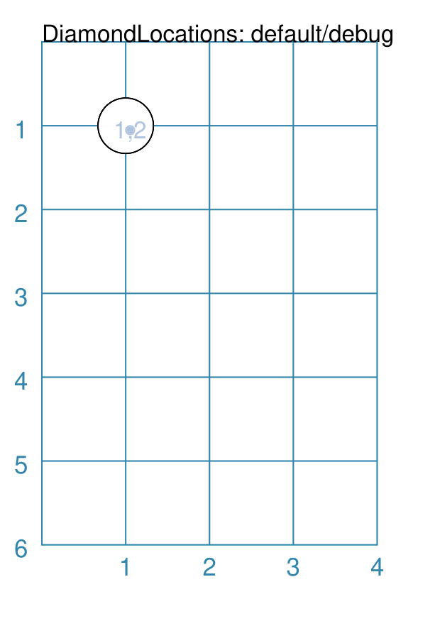
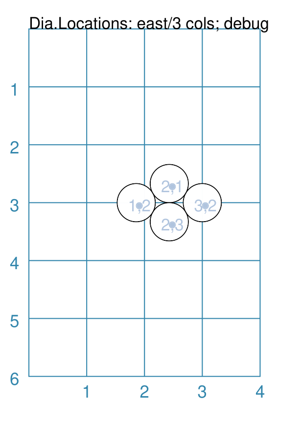
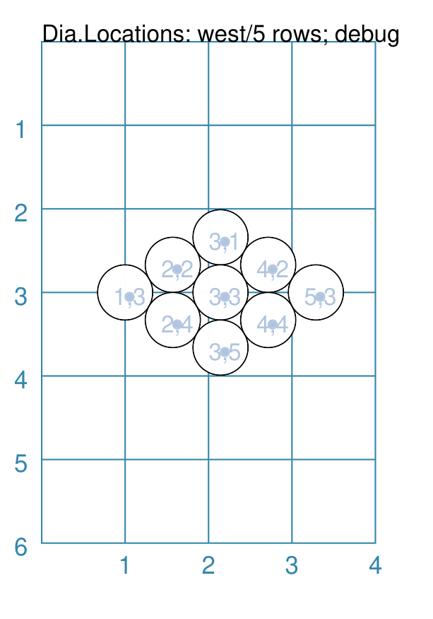
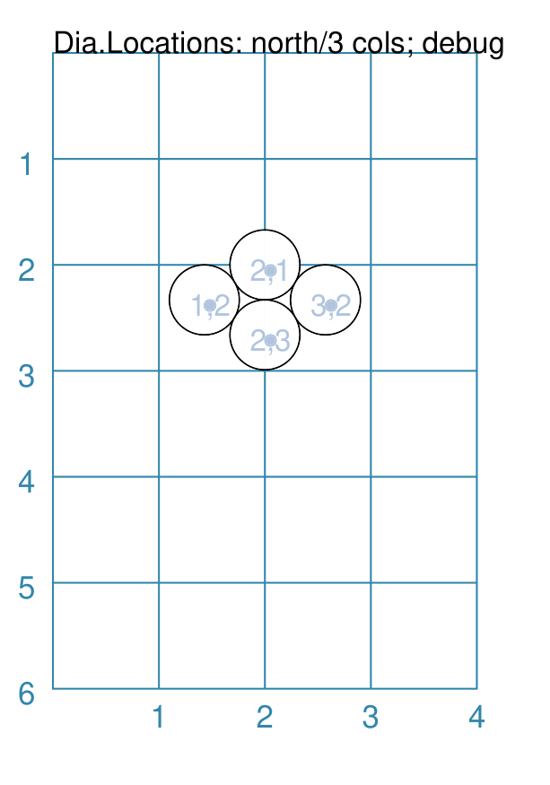
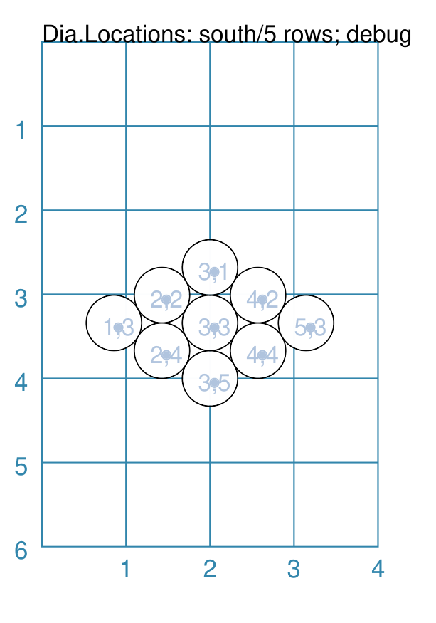
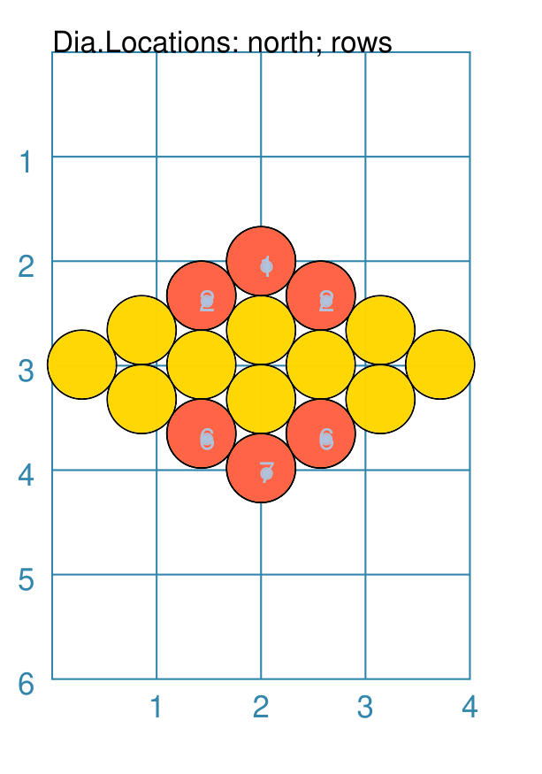
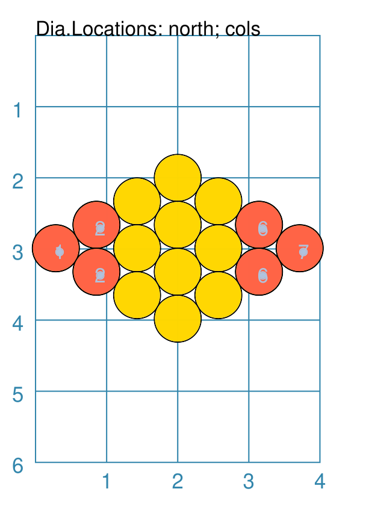
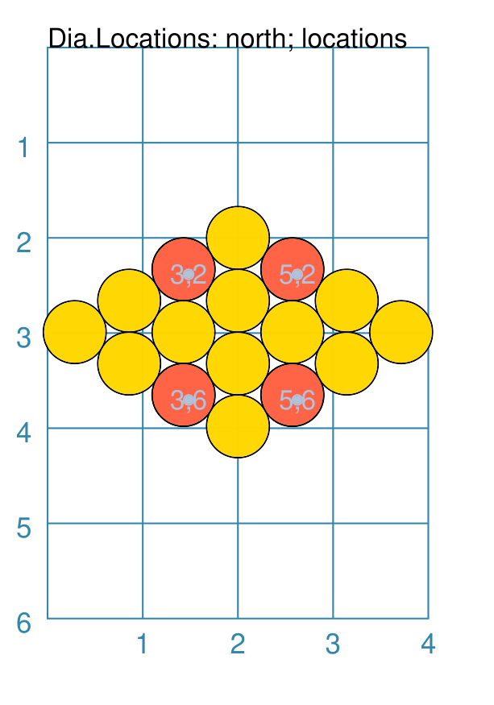
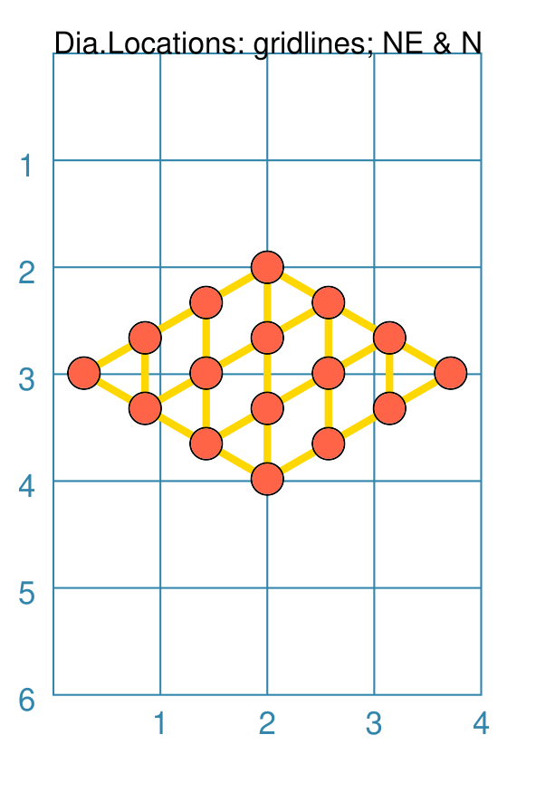
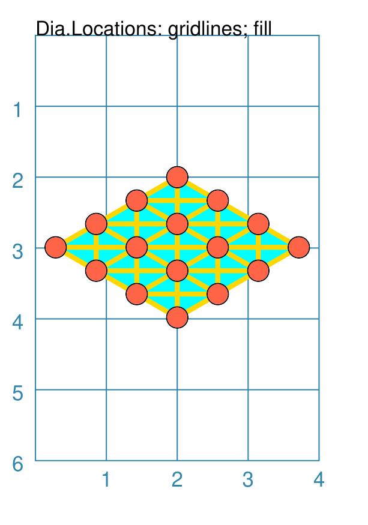

========================
DiamondLocations Command
========================

.. |dash| unicode:: U+2014 .. EM DASH SIGN

This section assumes you are very familiar with the concepts, terms and
ideas for :doc:`protograf <index>` as presented in the
:doc:`Basic Concepts <basic_concepts>` , that you understand all of the
:doc:`Additional Concepts <additional_concepts>`
and that you've created some basic scripts of your own using the
:doc:`Core Shapes <core_shapes>`.

This is part of the set of commands used for :doc:`Layouts <layouts>`,
that are used in conjunction with the :doc:`Layout command <layout_command>`.

.. _table-of-contents-dialay:

- `Overview`_
- `Usage`_
- `Properties`_

Overview
========
`↑ <table-of-contents-dialay_>`_

The ``DiamondLocations()`` command defines an ordered series
of row and column locations that create a diamond pattern i.e
two equilateral triangles placed edge-to-edge. This pattern is
termed a **grid**.

The x- and y-values of these rows and columns are then used to
set the centres of the elements that can be placed there using the
:ref:`Layout() <layout-command>` command.

Apart from the ``DiamondLocations()`` command described here,
there are also these other commands which allow you to layout
elements in a more repetitive or regular way within a page:

- :doc:`Repeat <layouts_repeat>`
- :doc:`Sequence <layouts_sequence>`
- :doc:`Tracks <layouts_track>`
- :doc:`RectangularLocations <layouts_rectangular>`
- :doc:`TriangularLocations <layouts_triangular>`

Usage
=====
`↑ <table-of-contents-dialay_>`_

The ``DiamondLocations()`` command accepts the following properties:

- **x** - the horizontal position of the starting point of the grid; this
  defaults to ``1``
- **y** - the vertical position of the starting point of the grid; this
  defaults to ``1``
- **cols** - this is the number of locations in the horizontal direction; this
  defaults to ``3`` (the minimum)
- **rows** - this is the number of locations in the vertical direction; this
  defaults to ``3`` (the minimum)
- **facing** - this is the compass point from where the grid is initially
  drawn; values can be *north*, *south*, *east* and
  *west* |dash| this is the default i.e. the left "corner" point

.. NOTE::

    Bear in mind that the ``DiamondLocations()`` command is designed
    to work in conjunction with a :ref:`Layout() command <layout-command>`
    which accepts, as its first property, the name assigned to the **grid**.

.. _dialay-properties:

Properties
==========
`↑ <table-of-contents-dialay_>`_

- `Example 1. Rows and Columns`_
- `Example 2. East - 3 Columns`_
- `Example 3. West - 5 Rows`_
- `Example 4. North - 3 Columns`_
- `Example 5. South - 5 Rows`_
- `Example 6. Shapes - by Rows`_
- `Example 7. Shapes - by Columns`_
- `Example 8. Shapes - by Locations`_
- `Example 9. Gridlines - Direction`_
- `Example 10. Gridlines - Fill`_

Many examples below make use of some named ``Circle`` shapes which
are defined as:

  .. code:: python

    circles = Common(
        diameter=1.0,
        label="{{sequence}}//{{col}}-{{row}}",
        label_size=6)
    a_circle = circle(common=circles)
    d_circle = circle(x=0, y=0, radius=0.33)

In these examples, the placeholder names ``{{sequence}}``, ``{{col}}``
and ``{{row}}`` will be replaced, in the label for the Circle, by the
values for the row and column in which that circle is placed, as well as
by the sequence number (order) in which that Circle is drawn.

Example 1. Rows and Columns
---------------------------
`^ <dialay-properties_>`_

===== ======
|tl0| This example shows the shape constructed using differing values for
      its properties.

      .. code:: python

          dia = DiamondLocations()
          Layout(
            dia, shapes=[d_circle,], debug='cr')

      Here, because there is only the default ``3`` *rows* and *cols*,
      located at x-position ``1`` cm and y-position ``1`` cm,
      all the Circle shapes that are drawn are super-imposed.

===== ======

Example 2. East - 3 Columns
---------------------------
`^ <dialay-properties_>`_

===== ======
|tl1| This example shows the shape constructed using differing values for
      its properties.

      .. code:: python

          dia = DiamondLocations(
              facing='east', cols=3,
              x=3, y=3, side=0.66)
          Layout(
            dia, shapes=[d_circle,], debug='cr')

      Here, the layout starts on the mid-right side - because the facing
      is ``east`` the triangle extends leftwards into the interior of
      the drawing.

      The *debug* value shows the column and row values (in that order).

===== ======

Example 3. West - 5 Rows
------------------------
`^ <dialay-properties_>`_

===== ======
|tl2| This example shows the shape constructed using differing values for
      its properties.

      .. code:: python

          dia = DiamondLocations(
              facing='west', rows=5,
              x=1, y=3, side=0.66)
          Layout(
            dia, shapes=[d_circle,], debug='cr')

      Here, the layout starts on the mid-left side - because the facing
      is ``west`` the triangle extends rightwards into the interior of
      the drawing.

      The *debug* value shows the column and row values (in that order).

===== ======

Example 4. North - 3 Columns
----------------------------
`^ <dialay-properties_>`_

===== ======
|tl3| This example shows the shape constructed using differing values for
      its properties.

      .. code:: python

          dia = DiamondLocations(
              facing='north', cols=2,
              y=2, x=2, side=0.66)
          Layout(
            dia, shapes=[d_circle,], debug='cr')

      Here, the layout starts on the top-centre side - because the facing
      is ``north`` the grid extends downwards into the interior of
      the drawing.

      The *debug* value shows the column and row values (in that order).

===== ======

Example 5. South - 5 Rows
-------------------------
`^ <dialay-properties_>`_

===== ======
|tl4| This example shows the shape constructed using differing values for
      its properties.

      .. code:: python

          dia = DiamondLocations(
              facing='south', rows=5,
              y=4, x=2, side=0.66)
          Layout(
            dia, shapes=[d_circle,], debug='cr')

      Here, the layout starts on the lower-centre side - because the facing
      is ``south`` the grid extends upwards into the interior of
      the drawing.

      The *debug* value shows the column and row values (in that order).

===== ======

Example 6. Shapes - by Rows
---------------------------
`^ <dialay-properties_>`_

===== ======
|tl5| This example shows the shape constructed using differing values for
      its properties.

      .. code:: python

        dia = DiamondLocations(
          facing='north',
          y=2, x=2,
          side=.66, cols=7)
        Layout(
          dia,
          shapes=[gold_circle])
        Layout(
          dia,
          shapes=[red_circle],
          rows=[1,2,6,7],
          debug='r')

      Here, two sets of circles are drawn onto the diamond grid.

      The first set |dash| the ``gold`` circles |dash| are drawn at every
      location.

      The second set |dash| the ``red`` circles |dash| are drawn on specific
      rows; in this case, the top two and the bottom two, via the list of
      numbers assigned to the *rows* property.

      The *debug* value in the red circles shows the row number (in order).

===== ======

Example 7. Shapes - by Columns
------------------------------
`^ <dialay-properties_>`_

===== ======
|tl6| This example shows the shape constructed using differing values for
      its properties.

      .. code:: python

        dia = DiamondLocations(
          facing='north',
          y=2, x=2,
          side=.66, cols=7)
        Layout(
          dia,
          shapes=[gold_circle])
        Layout(
          dia,
          shapes=[red_circle],
          cols=[1,2,6,7],
          debug='c')

      Here, two sets of circles are drawn onto the diamond grid.

      The first set |dash| the ``gold`` circles |dash| are drawn at every
      location.

      The second set |dash| the ``red`` circles |dash| are drawn on specific
      columns; in this case, the leftmost two and the rightmost two, via the
      list of numbers assigned to the *cols* property.

      The *debug* value in the red circles shows the column number (in order).

===== ======

Example 8. Shapes - by Locations
--------------------------------
`^ <dialay-properties_>`_

===== ======
|tl7| This example shows the shape constructed using differing values for
      its properties.

      .. code:: python

        dia = DiamondLocations(
          facing='north',
          y=2, x=2,
          side=.66, cols=7)
        Layout(
          dia,
          shapes=[gold_circle])
        Layout(
          dia,
          shapes=[red_circle],
          locations=[
           (3,2), (5,2), (3,6), (5,6)],
          debug='c')

      Here, two sets of circles are drawn onto the diamond grid.

      The first set |dash| the ``gold`` circles |dash| are drawn at every
      location.

      The second set |dash| the ``red`` circles |dash| are drawn at specific
      locations; using a pair of ``(col, row)`` numbers in the list of
      values assigned to the *locations* property.

      The *debug* value shows the column and row values (in that order).

===== ======

Example 9. Gridlines - Direction
--------------------------------
`^ <dialay-properties_>`_

===== ======
|tl8| This example shows the shape constructed using differing values for
      its properties.

      .. code:: python

        small_circle = circle(
          radius=0.15,
          fill="tomato")
        dia = DiamondLocations(
          facing='north',
          y=2, x=2,
          side=.66, cols=7)
        Layout(
          dia,
          gridlines='ne n',
          gridlines_stroke="gold",
          gridlines_stroke_width=2,
          shapes=[small_circle])

      Here, the grid itself is displayed |dash| it is always drawn first
      before any shapes.

      The outline of the grid is always drawn.

      The key prefix is *gridlines* and the value assigned to it will
      determine in which direction, or directions, the gridlines are drawn;
      in this case, north and north-east.

      The usual customisation settings are possible for the gridlines;
      color, thickness, etc.

===== ======

Example 10. Gridlines - Fill
----------------------------
`^ <dialay-properties_>`_

===== ======
|tl9| This example shows the shape constructed using differing values for
      its properties.

      .. code:: python

        small_circle = circle(
          radius=0.15,
          fill="tomato")
        dia = DiamondLocations(
          facing='north',
          y=2, x=2,
          side=.66, cols=7)
        Layout(
          dia,
          gridlines='*',
          gridlines_fill="aqua",
          gridlines_stroke="gold",
          gridlines_stroke_width=2,
          shapes=[small_circle])

      Here, the grid itself is displayed |dash| it is always drawn first
      before any shapes.

      The outline of the grid is always drawn.  If the *gridlines_fill*
      property is assigned a color, then the grid will be filled with that
      color before any gridlines are drawn.

      The key prefix is *gridlines* and the value assigned to it will
      determine in which direction, or directions, the gridlines are drawn;
      in this case, because of the ``*`` value, they are drawn in all
      possible directions.

      The usual customisation settings are possible for the gridlines;
      color, thickness, etc.

===== ======
