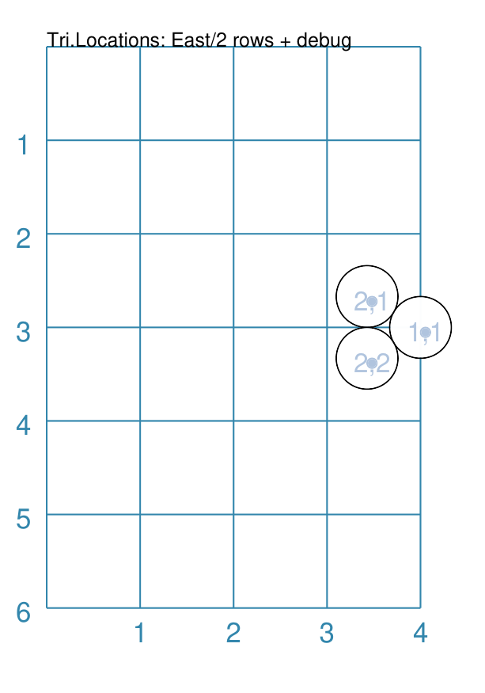
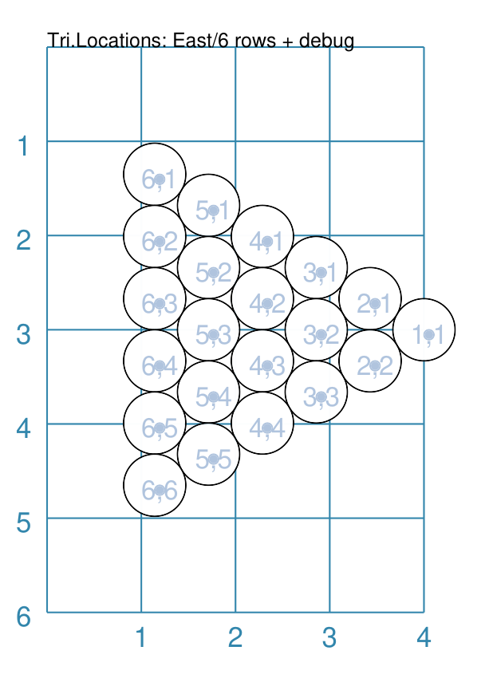
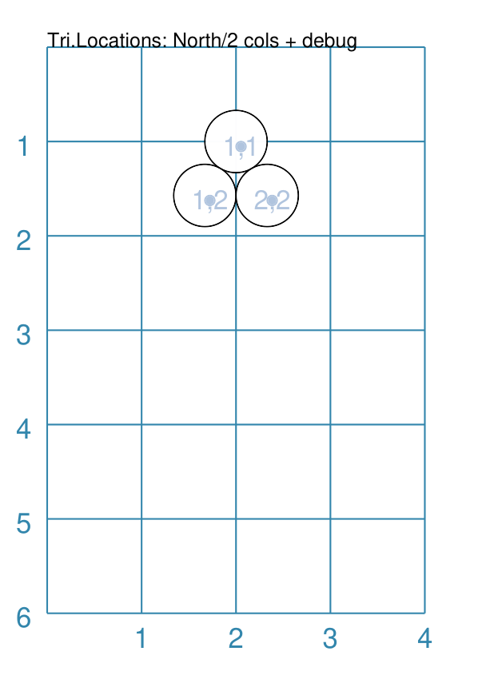
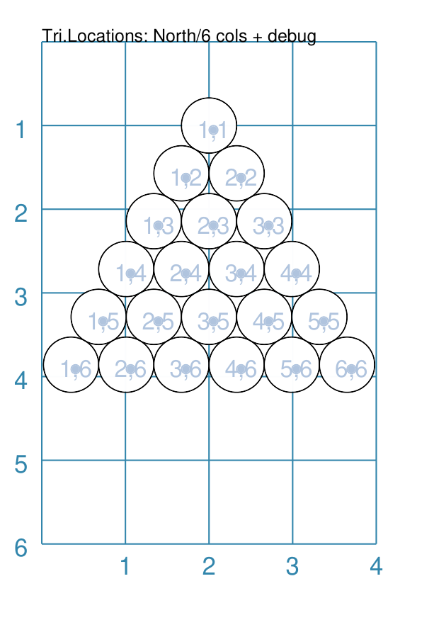
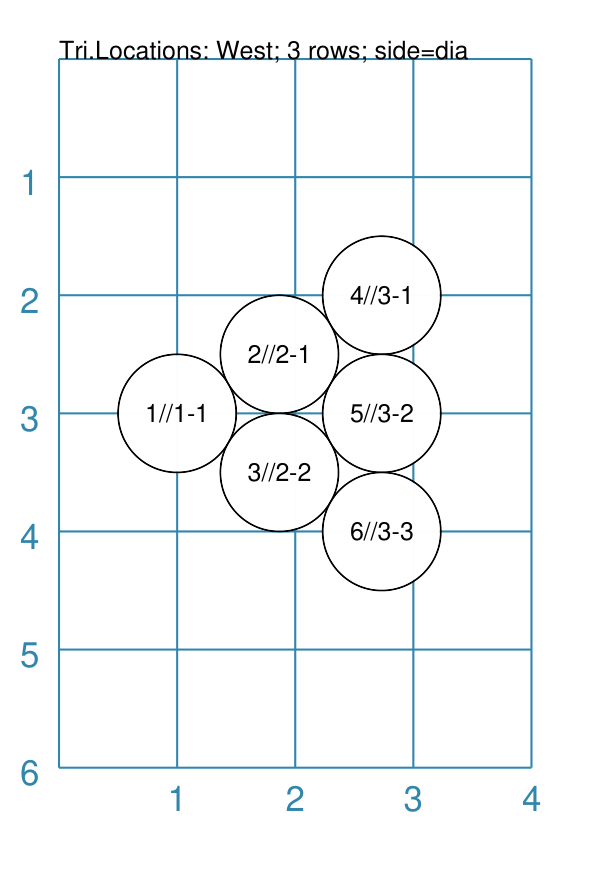
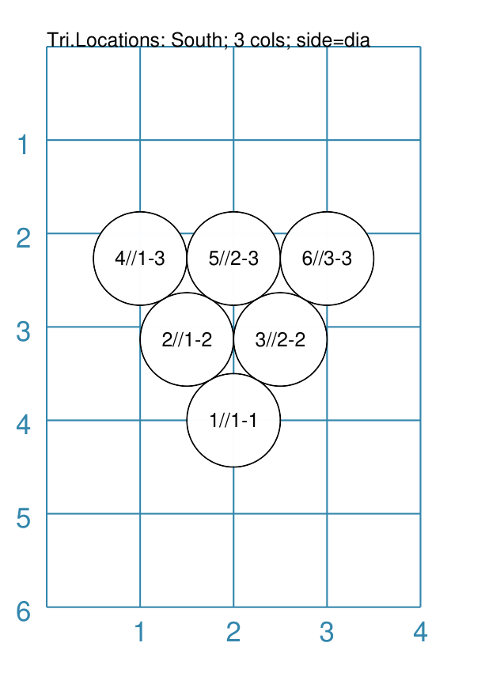
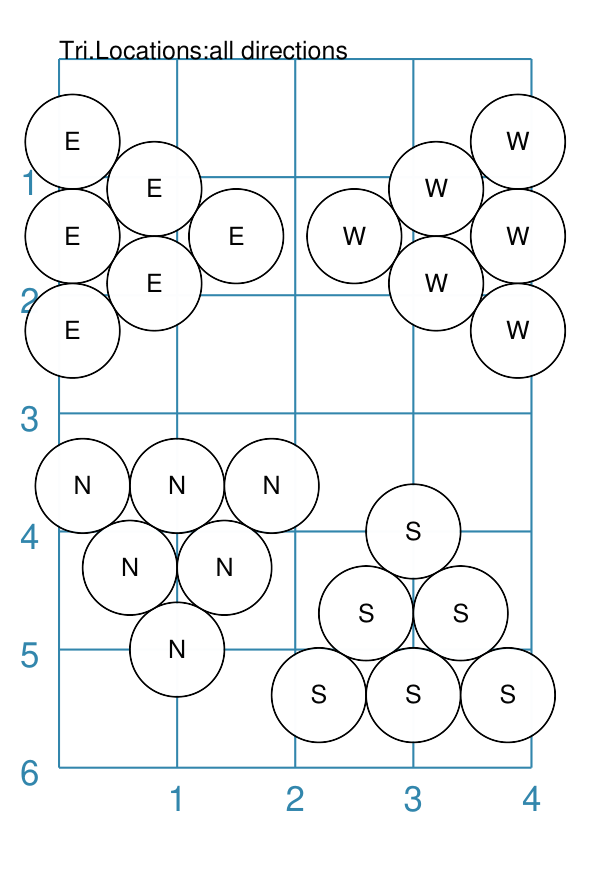

========================
DiamondLocations Command
========================

.. |dash| unicode:: U+2014 .. EM DASH SIGN

This section assumes you are very familiar with the concepts, terms and
ideas for :doc:`protograf <index>` as presented in the
:doc:`Basic Concepts <basic_concepts>` , that you understand all of the
:doc:`Additional Concepts <additional_concepts>`
and that you've created some basic scripts of your own using the
:doc:`Core Shapes <core_shapes>`.

This is part of the set of commands used for :doc:`Layouts <layouts>`.

.. _table-of-contents-dialay:

- `Overview`_
- `Usage`_
- `Properties`_

Overview
========
`↑ <table-of-contents-dialay_>`_

The ``DiamondLocations()`` command defines an ordered series
of row and column locations that create a diamond pattern i.e
two equilateral triangles placed edge-to-edge. This pattern is
termed a **grid**.

The x- and y-values of these rows and columns are then used to
set the centres of the elements that can be placed there using the
:ref:`Layout() <layout-command>` command.

Apart from the ``DiamondLocations()`` command described here,
there are also these other commands which allow you to layout
elements in a more repetitive or regular way within a page:

- :doc:`Repeat <layouts_repeat>`
- :doc:`Sequence <layouts_sequence>`
- :doc:`Tracks <layouts_track>`
- :doc:`RectangularLocations <layouts_rectangular>`
- :doc:`TriangularLocations <layouts_triangular>`

Usage
=====
`↑ <table-of-contents-dialay_>`_

The ``DiamondLocations()`` command accepts the following properties:

- **x** - the horizontal position of the starting point of the grid; this
  defaults to ``1``
- **y** - the vertical position of the starting point of the grid; this
  defaults to ``1``
- **cols** - this is the number of locations in the horizontal direction; this
  defaults to ``3`` (the minimum)
- **rows** - this is the number of locations in the vertical direction; this
  defaults to ``3`` (the minimum)
- **facing** - this is the compass point from where the grid is initially
  drawn; values can be *north*, *south*, *east* and
  *west* |dash| this is the default i.e. the left "corner" point

.. NOTE::

    Bear in mind that the ``DiamondLocations()`` command is designed
    to work in conjunction with a :ref:`Layout() command <layout-command>`
    which accepts, as its first property, the name assigned to the **grid**.

.. _dialay-properties:

Properties
==========
`↑ <table-of-contents-dialay_>`_

- `Example 1. Rows and Columns`_
- `Example 2. East - 2 Rows`_
- `Example 3. East - 6 Rows`_
- `Example 4. North - 2 Columns`_
- `Example 5. North - 6 Columns`_
- `Example 6. West - 3 Rows`_
- `Example 7. South - 3 Columns`_
- `Example 8. Mixed Styles`_

Many examples below make use of some common ``Circle`` shapes which
are defined as:

  .. code:: python

    circles = Common(
        x=0, y=0, diameter=1.0,
        label="{{sequence}}//{{col}}-{{row}}", label_size=6)
    a_circle = circle(common=circles)
    d_circle = circle(x=0, y=0, radius=0.33)

In these examples, the placeholder names ``{{sequence}}``, ``{{col}}``
and ``{{row}}`` will be replaced, in the label for the Circle, by the
values for the row and column in which that circle is placed, as well as
by the sequence number (order) in which that Circle is drawn.

Example 1. Rows and Columns
---------------------------
`^ <dialay-properties_>`_

.. |tl0| image:: images/layouts/layout_tri_default.png
   :width: 330

===== ======
|tl0| This example shows the shape constructed using differing values for
      its properties.

      .. code:: python

          dia = DiamondLocations()
          Layout(dia, shapes=[d_circle,], debug='cr')

      Here, because there is only the default ``2`` *rows* and *cols*,
      located at x-position ``1`` cm and y-position ``1`` cm,
      the *four* Circle shapes that are drawn are all super-imposed.

===== ======

Example 2. East - 2 Rows
------------------------
`^ <dialay-properties_>`_

===== ======
|tl1| This example shows the shape constructed using differing values for
      its properties.

      .. code:: python

          dia = DiamondLocations(
              facing='east', rows=2,
              x=4, y=3, side=0.66)
          Layout(dia, shapes=[d_circle,], debug='cr')

      Here, the layout starts on the mid-right side - because the facing
      is ``east`` the triangle extends leftwards into the interior of
      the drawing.

      The *debug* value shows the column and row values (in that order).

===== ======

Example 3. East - 6 Rows
------------------------
`^ <dialay-properties_>`_

===== ======
|tl2| This example shows the shape constructed using differing values for
      its properties.

      .. code:: python

          dia = DiamondLocations(
              facing='east', rows=6,
              x=4, y=3, side=0.66)
          Layout(dia, shapes=[d_circle,], debug='cr')

      Here, the layout starts on the mid-right side - because the facing
      is ``east`` the triangle extends leftwards into the interior of
      the drawing.

      The *debug* value shows the column and row values (in that order).

===== ======

Example 4. North - 2 Columns
----------------------------
`^ <dialay-properties_>`_

===== ======
|tl3| This example shows the shape constructed using differing values for
      its properties.

      .. code:: python

          dia = DiamondLocations(
              facing='north', cols=2,
              y=1, x=2, side=0.66)
          Layout(dia, shapes=[d_circle,], debug='cr')

      Here, the layout starts on the top-centre side - because the facing
      is ``north`` the triangle extends downwards into the interior of
      the drawing.

      The *debug* value shows the column and row values (in that order).

===== ======

Example 5. North - 6 Columns
----------------------------
`^ <dialay-properties_>`_

===== ======
|tl4| This example shows the shape constructed using differing values for
      its properties.

      .. code:: python

          dia = DiamondLocations(
              facing='north', cols=6,
              y=1, x=2, side=0.66)
          Layout(dia, shapes=[d_circle,], debug='cr')

      Here, the layout starts on the top-centre side - because the facing
      is ``north`` the triangle extends downwards into the interior of
      the drawing.

      The *debug* value shows the column and row values (in that order).

===== ======

Example 6. West - 3 Rows
------------------------
`^ <dialay-properties_>`_

===== ======
|tl5| This example shows the shape constructed using differing values for
      its properties.

      .. code:: python

          dia = DiamondLocations(
              facing="west", rows=3,
              x=1, y=3, side=1.0)
          Layout(dia, shapes=[a_circle,])

      Here, the layout starts on the left-centre side - because the facing
      is ``west`` the triangle extends rightwards into the interior of
      the drawing.

      The *debug* value shows the column and row values (in that order).

===== ======

Example 7. South - 3 Columns
----------------------------
`^ <dialay-properties_>`_

===== ======
|tl6| This example shows the shape constructed using differing values for
      its properties.

      .. code:: python

          dia = DiamondLocations(
              cols=3, facing="south",
              x=2, y=4, side=1.0)
          Layout(dia, shapes=[a_circle,])

      Here, the layout starts in the mid-centre side - because the facing
      is ``south`` the triangle extends upwards into the interior of
      the drawing.

      The *debug* value shows the column and row values (in that order).

===== ======

Example 8. Mixed Styles
-----------------------
`^ <dialay-properties_>`_

===== ======
|tl7| This example shows the shape constructed using differing values for
      its properties.

      .. code:: python

        dia = DiamondLocations(
            facing='east', rows=3,
            y=1.5, x=1.5, side=0.8)
        Layout(
            dia, shapes=[circle(
                common=small_circle, label="E"),])

        dia = DiamondLocations(
            facing='west', rows=3,
            y=1.5, x=2.5, side=0.8)
        Layout(
            dia, shapes=[circle(
                common=small_circle, label="W"),])

        dia = DiamondLocations(
            facing='south', cols=3,
            y=5, x=1, side=0.8)
        Layout(
            dia, shapes=[circle(
                common=small_circle, label="N"),])

        dia = DiamondLocations(
            facing='north', cols=3,
            y=4, x=3, side=0.8)
        Layout(
            dia, shapes=[circle(
                common=small_circle, label="S"),])

      These layouts are similar to other examples.

      The circles, in each case, now show fixed text.

===== ======
