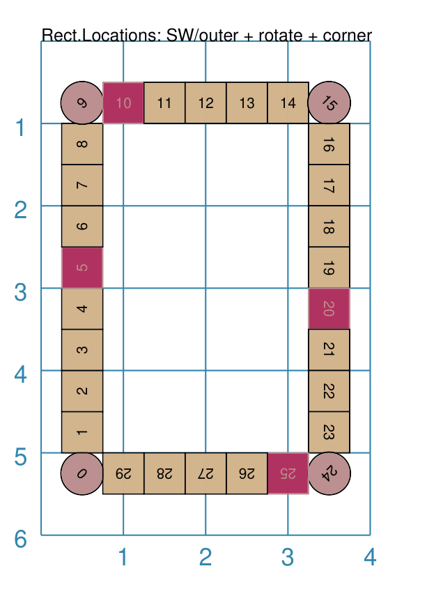
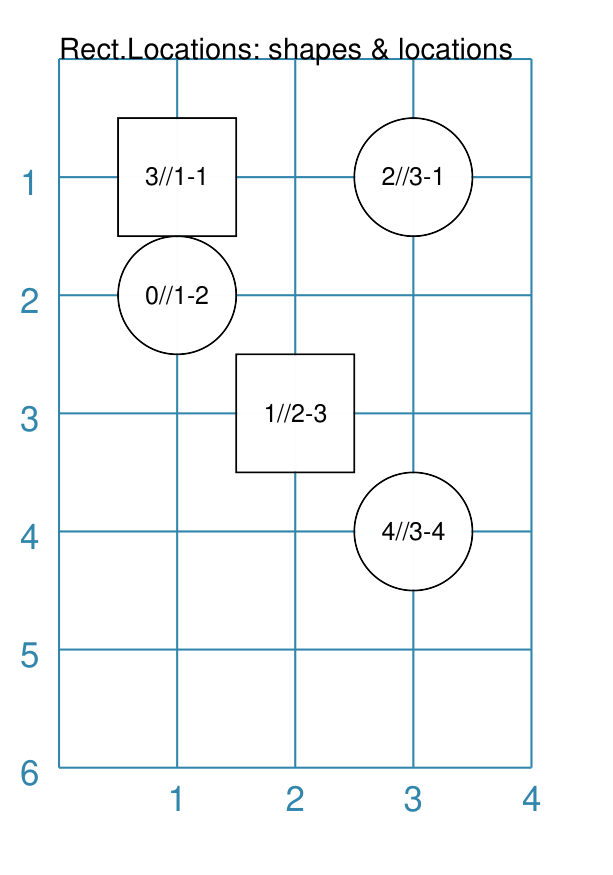

============================
RectangularLocations Command
============================

.. |dash| unicode:: U+2014 .. EM DASH SIGN
.. |deg|  unicode:: U+00B0 .. DEGREE SIGN
   :ltrim:

This section assumes you are very familiar with the concepts, terms and
ideas for :doc:`protograf <index>` as presented in the
:doc:`Basic Concepts <basic_concepts>` , that you understand all of the
:doc:`Additional Concepts <additional_concepts>`
and that you've created some basic scripts of your own using the
:doc:`Core Shapes <core_shapes>`.

This is part of the set of commands use for :doc:`Layouts <layouts>`.

.. _table-of-contents-rect:

- `Overview`_
- `Usage`_

  - `RectangularLocations`_
  - `Layout Command`_
- `Key Properties`_

Overview
========
`↑ <table-of-contents-rect_>`_

The ``RectangularLocations()`` command defines an ordered series
of row and column locations that create a rectangular grid.  The x- and
y-values of these rows and columns are then used to set the centres of
the elements that can be placed there using the ``Layout()`` command.

The rows and columns themselves are not drawn |dash| if needed you can use
the *debug* property to display them (see `Example 10. Debug`_  below).

Apart from the ``RectangularLocations()`` command described here,
there are also these other commands which allow you to layout
elements in a more repetitive or regular way within a page:

- :doc:`Repeat <layouts_repeat>`
- :doc:`Sequence <layouts_sequence>`
- :doc:`Tracks <layouts_track>`
- :doc:`TriangularLocations <layouts_triangular>`

Usage
=====
`↑ <table-of-contents-rect_>`_

RectangularLocations
--------------------

The ``RectangularLocations()`` command accepts the following properties:

- **cols** - this is the number of locations in the horizontal direction; this
  defaults to *2*
- **rows** - this is the number of locations in the vertical direction; this
  defaults to *2*
- **interval** - this is horizontal distance between columns, as well as the
  vertical distance between rows, in the grid; defaults to ``1`` cm
- **interval_x** - this is horizontal distance between the centres of the
  columns in the grid; defaults to **interval**
- **interval_y** - this is vertical distance between the centres of the
  rows in the gridl defaults to **interval**
- **direction** - this is the compass direction of the line of travel when
  creating the row and column layout; the default is e(ast).
- **start** - this is the initial corner, defined a secondary compass direction,
  from where the grid is initially drawn; values can be *ne*, *nw*, *se*, and
  *sw*, the default i.e. the lower-left corner
- **pattern** - this is the way in which the grid is drawn; the default
  behaviour is to draw each row, and then move across all columns in a regular
  line; but the setting can also be:

  - *snaking* - which means the direction is reversed across each row
  - *outer* - which means only the locations in the outer-most edge of the grid
    are created

The ``RectangularLocations()`` creates a "virtual" grid that always has the
first row and first column in the upper-left corner and the last row and last
column in the lower-right corner.

.. _layoutIndex:

Layout Command
--------------

The ``Layout()`` command - designed to be used in conjuction with a
location-based grid - specifies the shapes that are to be drawn at locations.

It accepts the following properties:

- **grid** - this *must* be the first property used for the command; it will
  refer to, in this case, a row & column grid created by ``RectangularLocations()``
- **locations** - a list of sets of ``(col, row)`` pairs; these are locations
  that will be used for drawing, in the order that they appear
- **shapes** - this is a list of one or more of the core shapes available,
  for example, a circle or rectangle; if no shapes are provided, the program
  will issue a ``WARNING`` message
- **masked** - a list of sequence numbers for the locations in which shapes
  should **not** be displayed
- **visible** - a list of sequence numbers for the **only** locations in
  which shapes should be displayed

Debug
~~~~~

A property that is not usually used for a final layout, but can be helpful
during the design stage is  **debug**.

**debug** will display the centre points of the grid, along with any
extra information specified.  Allowed values for debug include:

  - *none* - only the locations are shown as small dots; matching the color
    of the :ref:`Blueprint <blueprintIndex>`
  - *count* - shows the sequence number i.e. the order of drawing
  - *xy* - shows x- and y-values
  - *yx* - shows y- and x-values
  - *rowcol* - shows row and column numbers
  - *colrow* - shows column and row numbers
  - *id* - shows the internal ID number assigned to the location

.. _key-properties-rect:

Key Properties
==============
`↑ <table-of-contents-rect_>`_

- `Example 1. Rows and Columns`_
- `Example 2. Start and Direction`_
- `Example 3. Row and Column Interval`_
- `Example 4. Row and Column Offset`_
- `Example 5. Snaking`_
- `Example 6. Outer Edge`_

  - `Example 6a. Outer Edge - Shapes`_
  - `Example 6b. Outer Edge - Stop and Start`_
  - `Example 6c. Outer Edge - Rotation`_

- `Example 7. Masked`_
- `Example 8. Visible`_
- `Example 9. Locations Setting`_
- `Example 10. Debug`_

All examples below make use of a common ``Circle`` shape (assigned to
the name *a_circle*) defined as:

  .. code:: python

    a_circle = circle(
        x=0, y=0, diameter=1.0,
        label="{{sequence}}//{{col}}-{{row}}", label_size=6)

In these examples, the placeholder names ``{{sequence}}``, ``{{col}}``
and ``{{row}}`` will be replaced, in the label for the Circle, by the
values for the row and column in which that circle is placed, as well as
by the sequence value - or order number - in which that Circle gets drawn.

Example 1. Rows and Columns
---------------------------
`^ <key-properties-rect_>`_

===== ======
|r00| This example shows the design constructed using the following values
      for the shapes' properties.

      .. code:: python

        rect = RectangularLocations(
            cols=3, rows=4)
        Layout(rect, shapes=[a_circle])

      As can be seen the sequence starts, by default, in the lower-left;
      and increases from left to right and then from bottom to top.

      The column and row numbers (which follow next to the *//* in the
      label) show that the topmost row is ``1`` and leftmost column
      is ``1``.

===== ======

Example 2. Start and Direction
------------------------------
`^ <key-properties-rect_>`_

===== ======
|r01| This example shows the design constructed using the following values
      for the shapes' properties.

      .. code:: python

        rect = RectangularLocations(
            cols=3, rows=4,
            start="NW", direction="east")
        Layout(rect, shapes=[a_circle])

      Here the sequence starts in the top-left / northwest ("NW") corner,
      and then flows to the right ("east") and down.

===== ======

Example 3. Row and Column Interval
----------------------------------
`^ <key-properties-rect_>`_

.. |02a| image:: images/layouts/rect_basic_interval.png
   :width: 330

===== ======
|02a| This example shows the design constructed using the following values
      for the shapes' properties.

      .. code:: python

        rect = RectangularLocations(
            cols=3, rows=4, start="NW", direction="east",
            interval=1.25)
        Layout(rect, shapes=[a_circle])

      Here the sequence starts in the top-left / northwest ("NW") corner,
      and then flows to the right ("east") and down.

      The *interval* property adds spacing in both x- and y-directions.

===== ======

===== ======
|02b| This example shows the design constructed using the following values
      for the shapes' properties.

      .. code:: python

        rect = RectangularLocations(
            cols=3, rows=4, start="NW", direction="east",
            x=1.5, y=1.5,
            interval_y=1.25, interval_x=0.75)
        Layout(rect, shapes=[a_circle])

      The *x-interval* property adds spacing in the x-direction, which is less
      than the *y-interval* property spacing in the y-direction.

===== ======

Example 4. Row and Column Offset
--------------------------------
`^ <key-properties-rect_>`_

===== ======
|03a| This example shows the design constructed using the following values
      for the shapes' properties.

      .. code:: python

        rect = RectangularLocations(
            cols=3, rows=4,
            start="NW", direction="east",
            col_even=0.5)
        Layout(rect, shapes=[a_circle])

      The *col_even* adds a positive value to every even column, making
      these shift downwards relative to the odd columns.

      Setting a value for *col_odd* would have the opposite effect.

===== ======

.. |03b| image:: images/layouts/rect_basic_east_odd.png
   :width: 330

===== ======
|03b| This example shows the design constructed using the following values
      for the shapes' properties.

      .. code:: python

        rect = RectangularLocations(
            cols=3, rows=4,
            start="NW", direction="east",
            row_odd=0.5)
        Layout(rect, shapes=[a_circle])

      The *row_odd* adds a positive value to every odd row, making
      these shift rightwards relative to the even rows.

      Setting a value for *row_even* would have the opposite effect.

===== ======

Example 5. Snaking
------------------
`^ <key-properties-rect_>`_

===== ======
|r03| This example shows the design constructed using the following values
      for the shapes' properties.

      .. code:: python

        rect = RectangularLocations(
            cols=3, rows=4,
            start="NW", direction="east",
            pattern="snake")
        Layout(rect, shapes=[a_circle])

      The ``snake`` setting for the *pattern* property means that the
      sequence alternates directions |dash| starting east on the first
      row and then west on the next and so on.

===== ======

Example 6. Outer Edge
---------------------
`^ <key-properties-rect_>`_

===== ======
|r04| This example shows the design constructed using the following values
      for the shapes' properties.

      .. code:: python

        rect = RectangularLocations(
            cols=3, rows=4,
            start="NW", direction="east",
            pattern="outer")
        Layout(rect, shapes=[a_circle])

      The ``outer`` setting for the *pattern* property means that only
      the locations on the outermost edge of the rectangle are used.

      The sequence starts off ``east`` and then south, west and north.

      So, the combination of the *start* property and the initial
      *direction* property determine how an outer sequence proceeds.

===== ======

.. NOTE::

   The examples below all make use of some Common elements:

    .. code:: python

        is_common = Common(label="{{sequence}}")
        rct_common = Common(
            height=0.5, width=0.5,
            label_size=5, points=[('s', 0.1)])

Example 6a. Outer Edge - Shapes
-------------------------------
`^ <key-properties-rect_>`_

===== ======
|r4a| This example shows the design constructed using the following values
      for the shapes' properties.

      .. code:: python

        sqr = square(common=is_common, side=0.9,
                     label_size=6)
        sqr5 = square(common=is_common, side=1.0,
                      label_size=8, fill="yellow")

        rect = RectangularLocations(
            x=0.5, y=0.5,
            cols=4, rows=6, interval=1,
            start="SW", direction="north",
            pattern="outer")
        Layout(rect, shapes=[sqr]*4 + [sqr5] )

      This example shows how to provide copies of different shapes that
      must be drawn.

      Using the ``[sqr]*4`` is a shortcut way to ensure that four copies
      of the Square named ``sqr`` are drawn.

      Similarly, using ``+`` adds another, different shape |dash| in this
      case the Square named ``sqr5`` |dash| to the final list
      of *shapes* that will be used for the Layout; thereby creating
      the pattern shown.

      In summary, the final list of shapes becomes:

          ``[sqr, sqr, sqr, sqr, sqr5]``

      This notation can also be used if the approach shown in the example
      is too confusing!

      As before, the ``{{sequence}}`` value is assigned to the Squares'
      *label* property.

===== ======

Example 6b. Outer Edge - Stop and Start
---------------------------------------
`^ <key-properties-rect_>`_

===== ======
|r4b| This example shows the design constructed using the following values
      for the shapes' properties.

      .. code:: python

        rct_small = Common(label_size=5, side=0.48)
        rct1 = square(
            common=rct_small,
            fill_stroke="palegreen")
        rct5 = square(
            common=rct_small,
            fill_stroke="lightgreen")
        rct10 = square(
            common=rct_small,
            fill_stroke="mediumseagreen")

        rect = RectangularLocations(
            x=0.25, y=0.25,
            cols=8, rows=11, interval=0.5
            start="NW", direction="east",
            pattern="outer",
            stop=26)
        Layout(rect, shapes=[rct1]*4 + [rct5] + [rct1]*4 + [rct10])

      This example shows how by providing a value of ``26`` for the *stop*
      property that drawing of shapes stops at sequence number ``26``.

      The setting and drawing of *shapes* is as per the previous example.

      Note that it does not matter how many locations will be used; when all
      shapes in the list have been processed the cycle will start again with
      the first.

===== ======

Example 6c. Outer Edge - Rotation
---------------------------------
`^ <key-properties-rect_>`_

===== ======
|r4c| This example shows the design constructed using the following values
      for the shapes' properties.

      .. code:: python

        rct_common = Common(
            label_size=5, points=[('s', 0.1)],
            height=0.5, width=0.5)
        circ = circle(
            label="{{sequence - 1}}",
            label_size=5, radius=0.26, fill="rosybrown")
        rct2 = rectangle(
            common=rct_common, label="{{sequence - 1}}",
            fill="tan")
        rct3 = rectangle(
            common=rct_common, label="{{sequence - 1}}",
            fill="maroon", stroke="rosybrown")

        locs = RectangularLocations(
            x=0.5, y=0.75, cols=7, rows=10, interval=0.5,
            start="SW", direction="north", pattern="outer")
        Layout(
            locs,
            shapes=[rct3] + [rct2]*4,
            rotations=[
                ("1", 135),
                ("2-9", 90),
                ("10", 45),
                ("16", -45),
                ("17-24", 270),
                ("25", 225),
                ("26-30", 180)
            ],
            corners=[('*',circ)])

      Labels are created by use of the ``{{sequence - 1}}`` placeholder; using
      ``-1`` after the usual ``sequence`` means that the value of 1 is
      subtracted from every sequence number, and also means that in this case
      the numbering will start from zero not one.

      The *rotations* property references specific sequence values in a list of
      sets of values; for example, ``("17-24", 270)`` rotates the shapes at all
      the sequence values from 17 to 24 (inclusive) by 270 |deg|.

      The *rotations* property sequence value is the original one; **not** the
      one being displayed!

      The *corners* settings allows the corner elements to be replaced by those
      appearing in this list - in this case the use of ``*`` means all of the
      corners.

===== ======

Example 7. Masked
-----------------
`^ <key-properties-rect_>`_

===== ======
|r05| This example shows the design constructed using the following values
      for the shapes' properties.

      .. code:: python

        rect = RectangularLocations(
            cols=3, rows=4, start="NW",
            direction="east",
            pattern="outer")
        Layout(rect, shapes=[a_circle],
               masked=[2,7])

      The *masked* property means that two of the shapes |dash| corresponding
      to sequence numbers ``2`` and ``7`` |dash| will not be drawn.
===== ======

Example 8. Visible
------------------
`^ <key-properties-rect_>`_

===== ======
|r06| This example shows the design constructed using the following values
      for the shapes' properties.

      .. code:: python

        rect = RectangularLocations(
            cols=3, rows=4, start="NW",
            direction="east",
            pattern="outer")
        Layout(rect, shapes=[a_circle],
               visible=[1,3,6,8])

      The *visible* property means that only those shapes |dash| corresponding
      to sequence numbers ``1``, ``3``, ``6`` and ``8`` |dash| will be drawn.

===== ======

Example 9. Locations Setting
----------------------------
`^ <key-properties-rect_>`_

===== ======
|r07| This example shows the design constructed using the following values
      for the shapes' properties.

      .. code:: python

        rect = RectangularLocations(cols=3, rows=4)
        Layout(
          rect,
          shapes=[
              a_circle,
              rectangle(
                  label="{{sequence}}//{{col}}-{{row}}",
                  label_size=6)],
          locations=[(1,2), (2,3), (3,1), (1,1), (3,4)])

      The shapes are allocated to the list of *locations* provided.

      Each location is identified by its pair of ``(column, row)``
      numbers.

      The shape allocation cycles through the list of *shapes* provided;
      in this case the Circle and Rectangle.

===== ======

Example 10. Debug
-----------------
`^ <key-properties-rect_>`_

.. |10a| image:: images/layouts/rect_basic_debug.png
   :width: 330

===== ======
|10a| This example shows the design constructed using the following values
      for the shapes' properties.

      .. code:: python

        rect = RectangularLocations(
            cols=3, rows=4, x=0.5, y=0.5)
        Layout(rect, debug='none')

      In this case, setting the *debug* property to ``none`` simply
      causes a small, blue dot to be shown at all of the locations.

      This is useful to visualise the **centre** positions to see where
      shapes could be drawn.

===== ======

===== ======
|10b| This example shows the design constructed using the following values
      for the shapes' properties.

      .. code:: python

        rect = RectangularLocations(
            cols=3, rows=4, x=0.5, y=0.5)
        Layout(rect, debug='sequence')

      In this case, setting the *debug* property to ``sequence``
      causes a small, blue dot to be shown at all of the locations, as
      well the matching sequence number.

      This is useful to visualise the **order** in which shapes would be
      drawn at the locations.

===== ======

===== ======
|07c| This example shows the design constructed using the following values
      for the shapes' properties.

      .. code:: python

        rect = RectangularLocations(
            cols=3, rows=4, x=0.5, y=0.5)
        Layout(rect, debug='colrow')

      In this case, setting the *debug* property to ``sequence``
      causes a small, blue dot to be shown at all of the locations, as
      well the matching column and row numbers (on either side of the dot).

      This is useful to visualise the **identity** of each location; for
      example, if you needed to make any of these locations *visible* or
      *masked*.

===== ======
