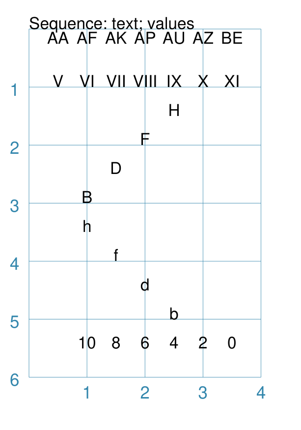
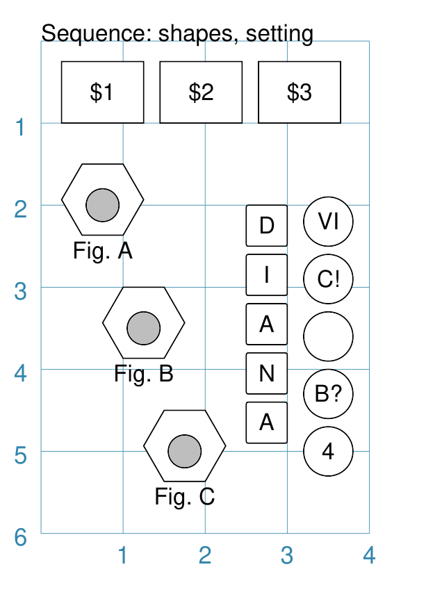

================
Sequence Command
================

.. |dash| unicode:: U+2014 .. EM DASH SIGN

This section assumes you are very familiar with the concepts, terms and
ideas for :doc:`protograf <index>` as presented in the
:doc:`Basic Concepts <basic_concepts>` , that you understand all of the
:doc:`Additional Concepts <additional_concepts>`
and that you've created some basic scripts of your own using the
:doc:`Core Shapes <core_shapes>`.

This is part of the set of commands use for :doc:`Layouts <layouts>`.

Overview
========

The `Sequence()` command is designed to lay out a number of values - letters or
numbers, or shapes - in a straight line.

Apart from the ``Sequence()`` command described here,
there are also these other commands which allow you to layout
elements in a more repetitive or regular way within a page:

- :doc:`Repeat <layouts_repeat>`
- :doc:`Track <layouts_track>`
- :doc:`RectangularLocations <layouts_rectangular>`
- :doc:`TriangularLocations <layouts_triangular>`

Usage
=====

The ``Sequence()`` command accepts the following properties:

- **shape** - this is one of the core shapes available, for example, a circle
  or rectangle; the properties of that shape will determine where the first one
  in the sequence is drawn; the shape should always be specified with a
  lowercase initial so the the ``Sequence()`` can handle the drawing.
- **setting** - [1] this can be a *set* i.e. a number of values enclosed in
  `(...)` round brackets; representing these attributes required to construct
  the sequence:

  - *start* - the value the sequence starts with
  - *end* - the value the sequence ends with
  - *increment* - the difference between one value and next - if negative, the
    values decrease
  - *type* - the sequence can be `letter`, `number`, `roman`, or `excel`
- **setting** - [2] alternatively, the setting can be specified by providing a
  list of values (using square ``[...]`` brackets); these are drawn in the order
  provided and can be a mix of letters or numbers
- **interval_x** and **interval_y** - the distance between the centre of each shape
  that is drawn, starting from the location of the first as the reference point;
  negative numbers means the distances are to the left and down (rather than to
  the right and up)

Example 1.
----------

===== ======
|sqv| This example shows the element constructed using differing values for the
      its properties.

      In each case the ``Text()`` shape is used to display the
      values in the sequence; the values are automatically assigned to its
      **text** property.

      The example with **normal integer numbers** (bottom of example) is created by:

      .. code:: python

          Sequence(
              text(x=1, y=5.5),
              setting=(10, 0, -2, 'number'),
              interval_x=0.5,
          )

      Here the progression is one of numbers.

      The range starts at ``10`` and the sequence will use every second number
      because the interval is ``-2``.

      The first shape is drawn at ``1.5`` cm and the ``interval_x`` property
      means that each shape will be ``0.5`` cm to the right (positive ``x``
      direction) of the previous one.

      The shapes drawn will be in a level line, because the default
      ``interval_y`` value is zero.

      The example with **lowercase letters** (lower middle) is created by:

      .. code:: python

          Sequence(
              text(x=1, y=3.5),
              setting=('h', 'b', -2, 'letter'),
              interval_y=0.5,
              interval_x=0.5,
          )

      Here the progression is one of letters.

      The letters will be lowercase because the start letter |dash| ``h``
      |dash| is lowercase.

      The sequence ends with a ``b``;

      The sequence will use every second letter because the interval value
      is set to ``-2``.

      After the first shape is drawn, each following shape will
      be ``0.5`` cm to the right (``interval_x``) and ``0.5`` cm
      (``interval_y``) above the previous one.

      The example with **uppercase letters** (upper middle) is created by:

      .. code:: python

          Sequence(
              text(x=1, y=3),
              setting=('B', 'H', 2, 'letter'),
              interval_y=-0.5,
              interval_x=0.5,
          )

      Here the progression is one of uppercase letters because the start letter
      is ``B``.

      After the first shape is drawn, each following shape will be
      ``0.5`` cm to the right and below |dash| because ``interval_y`` is
      negative |dash| the previous one.

      The example with **Roman numerals** (upper top) is created by:

      .. code:: python

          Sequence(
              text(x=0.5, y=3),
              setting=(5, 11, 1, 'roman'),
              interval_x=0.5,
          )

      Here the progression is one of Roman numbers.

      The range starts at ``5``, which is a ``V`` in Roman, and ends at
      ``11`` which is a ``XI`` in Roman.

      The example with **Excel columns** (top edge of example) is created by:

      .. code:: python

          Sequence(
              text(x=0.5, y=0.25),
              setting=(27, 52, 5, 'excel'),
              interval_x=0.5,
          )

      Here the progression is one of Excel column headers.

      The value ranges from ``A`` for the first column to ``Z`` for the 26th
      column.

      The values then use letter pairs, as seen here where every ``5`` th
      column header's letters are used.

===== ======

Example 2.
----------

===== ======
|sq2| This example shows the element constructed using differing values for the
      its properties.

      In these cases, values in the sequence are being assigned
      to a text-based property using the special ``{{sequence}}`` keyword.

      The keyword is replaced by the **actual** value of the sequence number
      for the item.

      The example with **rectangles** (top edge) is created by:

      .. code:: python

          Sequence(
              rectangle(
                  x=0.25, y=0.25, height=0.75, width=1,
                  label_size=8, label="${{sequence}}"),
              setting=(1, 3, 1, 'number'),
              interval_x=1.2,
          )

      Here the progression is one of numbers.

      Each number in the sequence is assigned to the ``{{sequence}}`` keyword
      and substituted into the text as part of the ``Rectangle`` 's label;
      the ``$`` is just a normal character.

      The example with **hexagons** and nested circles (middle left) is created by:

      .. code:: python

          Sequence(
              [hexagon(
                 x=0.5, y=1.5, radius=0.5,
                  title_size=8, title="Fig. {{sequence}}"),
               circle(cx=1, cy=2, radius=0.2, fill="gray")],
              setting=('C', 'A', -1),
              interval_y=1.5,
              interval_x=0.5,
          )

      Here the progression is one of uppercase letters (start letter is ``C``).

      Note that the *letter* value is missing from the setting; this is because
      the type of value can be inferred from the start and end values.

      Each lette in the sequence is assigned to the ``{{sequence}}`` keyword and
      so that sequence value becomes part of the ``Hexagon`` 's title text.

      This example also shows how multiple shapes can be drawn at the same time
      with a single ``Sequence`` command.

      Instead of supplying a single shape, provide two or more in a list
      (enclosed with square brackets ``[...]``).

      As always the shapes are drawn in order - in this case, the hexagon first
      and then the grey circle.

      The example with **circles** (middle right) is created by:

      .. code:: python

          Sequence(
              circle(
                  cx=3.5, cy=5, radius=0.3,
                  label="{{sequence}}"),
              setting=[4, 'B?', '', 10, 'VI'],
              interval_y=-0.7,
          )

      Here the progression is a specific list of values.

      The items separated by commas between the square brackets from
      ``[`` to ``]``.

      In this case,
      the list is a mixture of letters and numbers; which are assigned as
      part of the ``Cirle`` 's label via the ``{{sequence}}`` keyword.

      **NOTE** that the ``''`` - empty quotes - for the third item in the
      ``setting`` mean that nothing is assigned to the ``{{sequence}}`` but
      that the ``Cirle`` itself is still drawn!

===== ======
