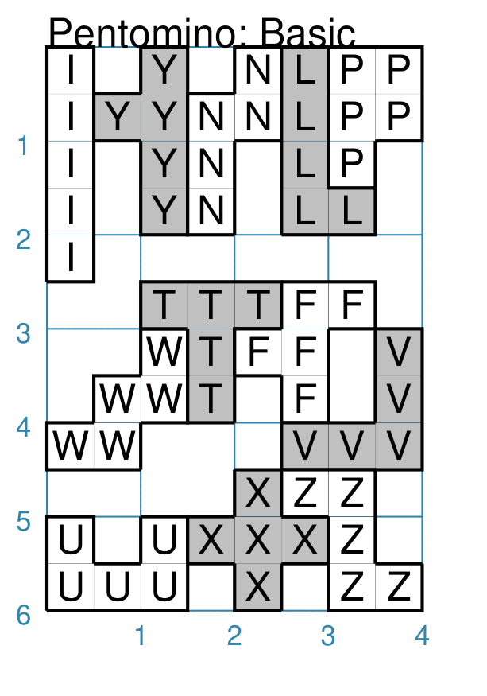
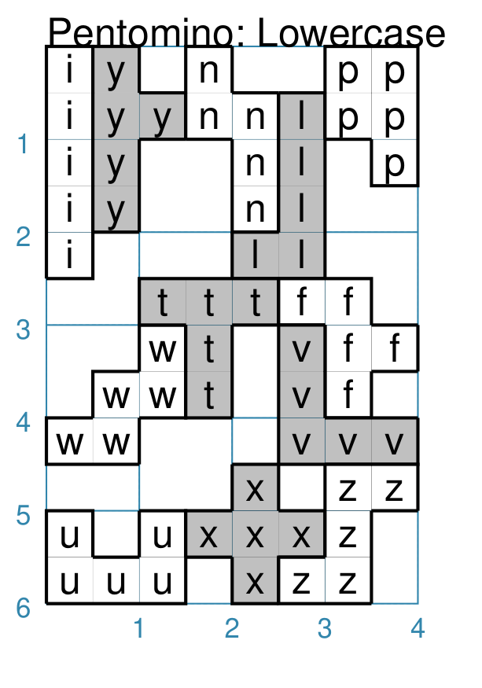
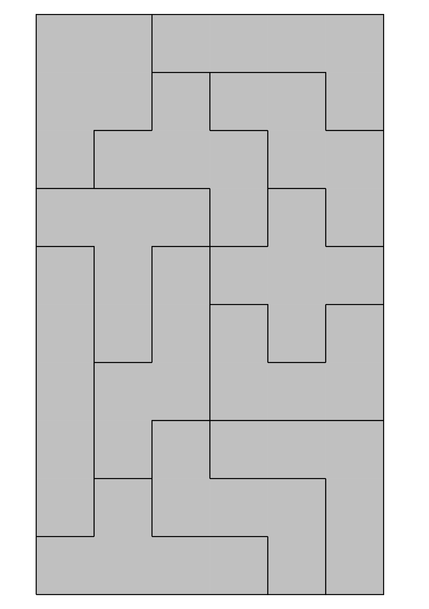

===========
Pentominoes
===========

.. |dash| unicode:: U+2014 .. EM DASH SIGN

This section assumes you are very familiar with the concepts, terms and ideas
for :doc:`protograf <index>`  as presented in the
:doc:`Basic Concepts <basic_concepts>` , that you understand all of the
:doc:`Additional Concepts <additional_concepts>` and that you've created some
basic scripts of your own using the :doc:`Core Shapes <core_shapes>`. You also
be familiar with the various types of shape's properties described in the
:doc:`Customised Shapes <customised_shapes>`

.. _pentominoesOver:

Overview
========

Pentominoes are one of the most popular and well-known types of
:doc:`Polyominoes <polyominoes>` and each one is composed of **5** squares
in one of 12 unique patterns.

They can referred to by their shortcut ``letter`` property which has been
assigned to each of the 12 shapes, based on their similarity to letters in
the Roman alphabet.

Properties
==========

Pentominoes share all the properties of :doc:`Polyominoes <polyominoes>` but,
instead of a *pattern* they are defined using a *letter*.

A *letter* in uppercase format draws a tetromino in such a way that it
resembles that letter; whereas a lowercase letter draws the same basic shape
but inverted from left to right.

Examples
========

The examples below shows how letters are used create a Pentomino or a set
of Pentominoes.

Pentomino: Uppercase Letter
---------------------------
`^ <pentominoesOver_>`_

===== ======
|te1| This example shows Pentominoes constructed using commands like:

      .. code:: python

         basics = Common(
             side=0.5,
             outline_stroke="black", outline_width=1)

         Pentomino(
             x=2, y=2.5,
             letter="F",
             label="F",
             common=basics)

      Each of the twelve shapes is constructed in the same way |dash| setting
      the *letter* property to one of: F, I, L, N, P, T, U, V, W, X, Y and Z.

===== ======

Pentomino: Lowercase Letter
---------------------------
`^ <pentominoesOver_>`_

===== ======
|te2| This example shows Pentominoes constructed using commands like:

      .. code:: python

         basics = Common(
             side=0.5,
             outline_stroke="black", outline_width=1)

         Pentomino(
             x=2.5, y=2.5,
             letter="f",
             label="f",
             common=tbasics)

      Each of the twelve shapes is constructed in the same way |dash| setting
      the *letter* property to one of: F, I, L, N, P, T, U, V, W, X, Y and Z.

===== ======

Pentomino: Arrangement
----------------------
`^ <pentominoesOver_>`_

One of the ways that Pentominoes can be used is to construct a single
large rectangle.

Such a rectange can be 6 by 10 squares in size, as shown below, or 5 x 12
or 4 x 15 or 3 x 20.

See the `pentominoes.py <https://github.com/gamesbook/protograf/blob/master/examples/objects/pentominoes.py>`_
script for how this is done.

