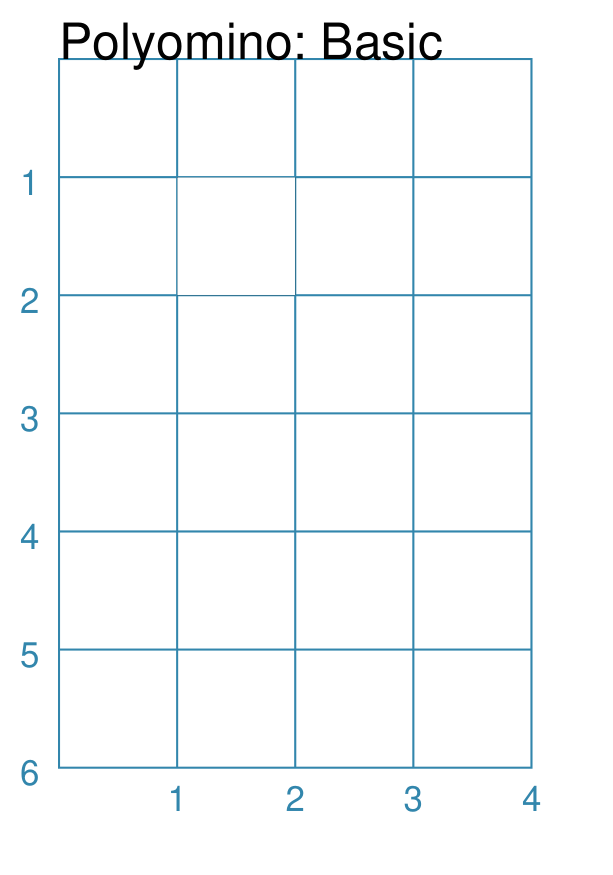
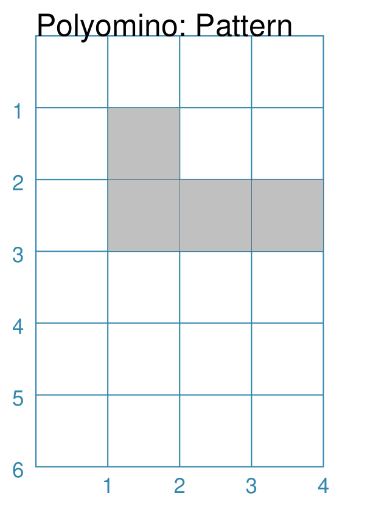
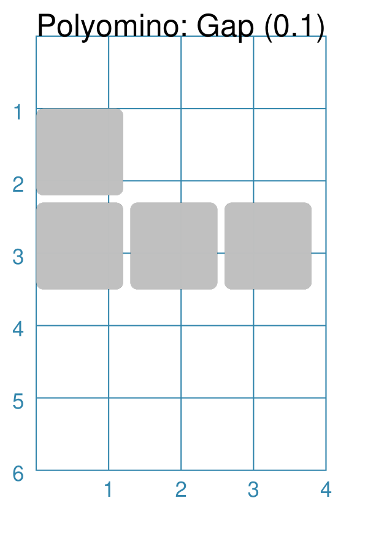
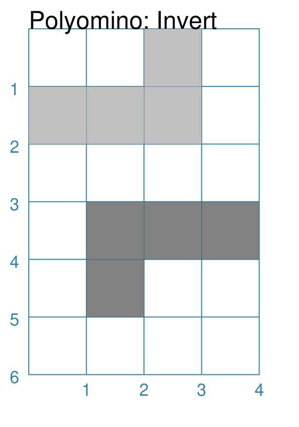
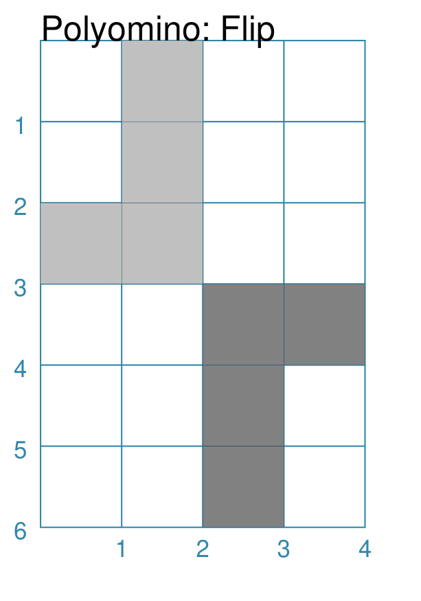
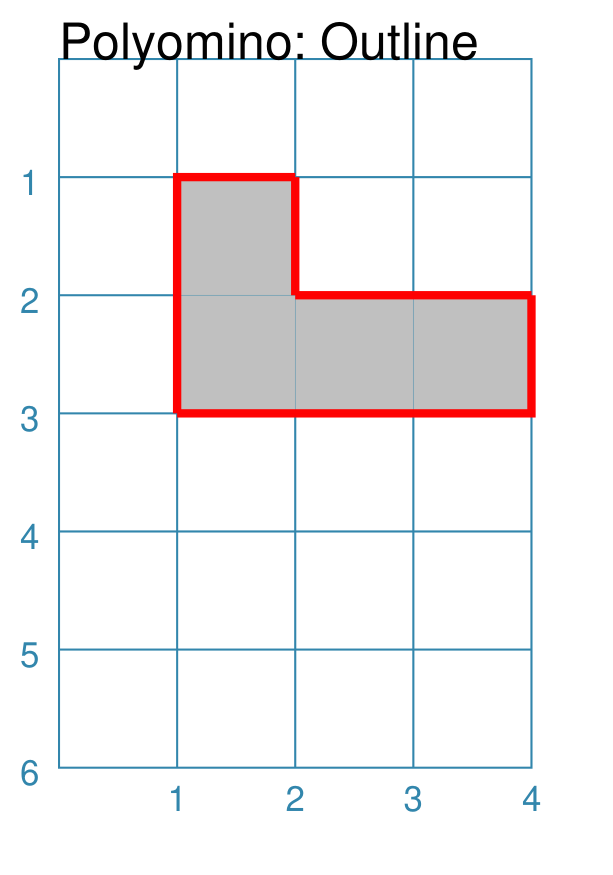
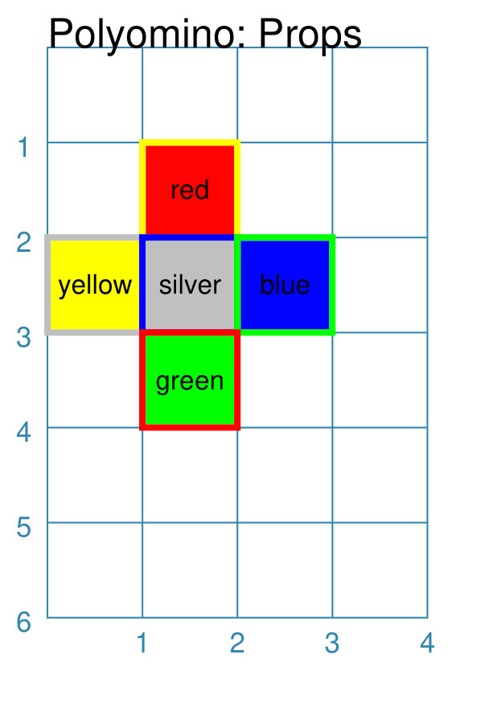
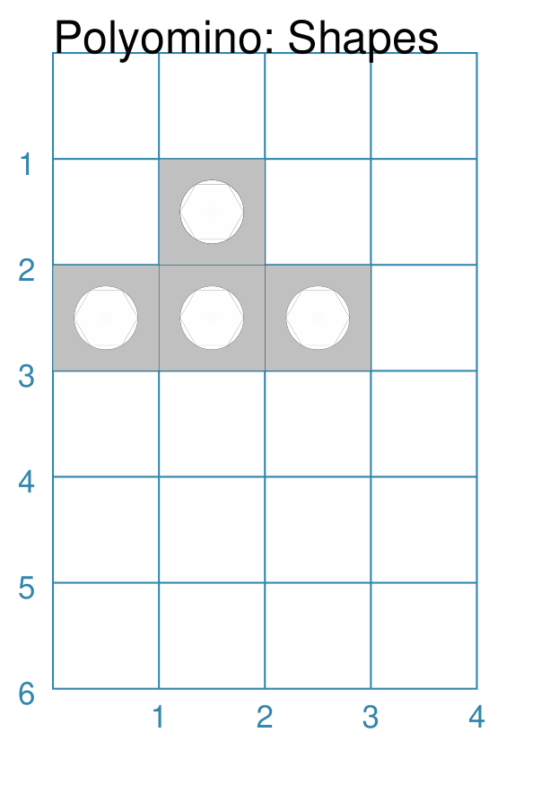
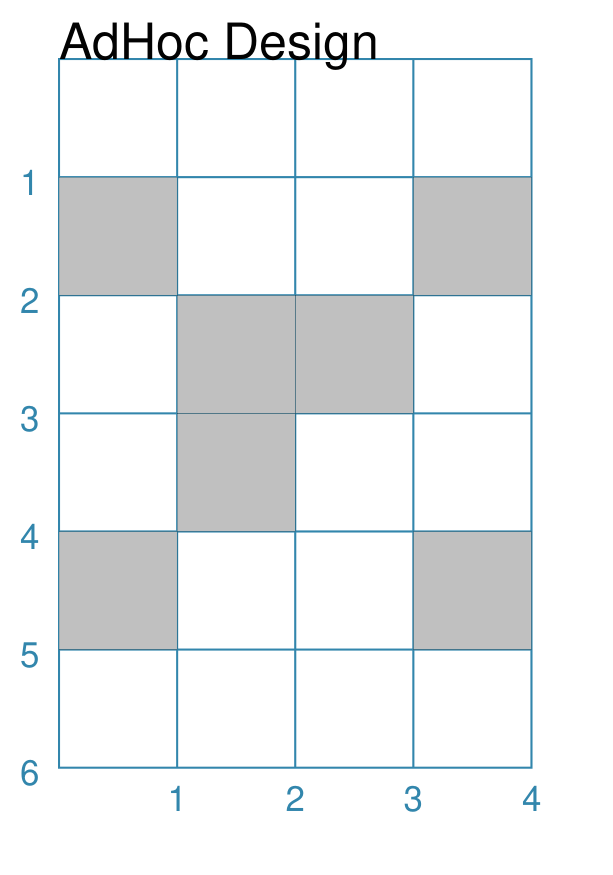

===========
Polyominoes
===========

.. |dash| unicode:: U+2014 .. EM DASH SIGN

This section assumes you are very familiar with the concepts, terms and ideas
for :doc:`protograf <index>`  as presented in the
:doc:`Basic Concepts <basic_concepts>` , that you understand all of the
:doc:`Additional Concepts <additional_concepts>` and that you've created some
basic scripts of your own using the :doc:`Core Shapes <core_shapes>`. You also
be familiar with the various types of shape's properties described in the
:doc:`Customised Shapes <customised_shapes>`

.. _polyominoesOver:

Overview
========

Polyominoes are :doc:`graphical objects <objects>` constructed out of a
``pattern`` of one or more squares.

Normally, polyominoes are made up of squares that touch other squares
along one or more sides, but the ``pattern`` property approach used by
:doc:`protograf <index>` means that any kind of arrangement can be
constructed.

.. _polyominoesIndex:

Properties
=========

There are a number of ways that a Polyomino can be customised.

- `Basic/Default <polyomBasic_>`_
- `Pattern <polyomPattern_>`_
- `Gap <polyomGap_>`_
- `Invert <polyomInvert_>`_
- `Flip <polyomFlip_>`_
- `Outline <polyomOutline_>`_
- `Properties <polyomProps_>`_
- `Shapes <polyomShapes_>`_
- `AdHoc Design <polyomDesign_>`_

.. _polyomBasic:

Polyomino: Basic
----------------
`^ <polyominoesIndex_>`_

===== ======
|po1| This example shows a Polyomino constructed using the command:

      .. code:: python

         Polyomino()

      This shape can be hard to see as it looks like a simple square
      with a thin outline.

      It uses only defaults.

      It takes on all the basic propety settings for size, stroke and color.

      The default ``pattern`` is set to ``[[1]]`` - this is a monimo.

===== ======

.. _polyomPattern:

Polyomino: Pattern
------------------
`^ <polyominoesIndex_>`_

===== ======
|po2| This example shows a Polyomino constructed using the command:

      .. code:: python

         Polyomino(
             fill="silver",
             pattern=['110', '111'])

      It...

===== ======

.. _polyomGap:

Polyomino: Gap
--------------
`^ <polyominoesIndex_>`_

===== ======
|po3| This example shows a Polyomino constructed using the command:

      .. code:: python

         Polyomino(
             x=0,
             fill="silver",
             pattern=['110', '111'],
             gap=0.1,
             rounding=0.1)

      It...

===== ======

.. _polyomInvert:

Polyomino: Invert
-----------------
`^ <polyominoesIndex_>`_

===== ======
|po4| This example shows Polyominoes constructed using these commands:

      .. code:: python

        Polyomino(
            x=0, y=0,
            fill="silver",
            pattern=['110', '111'],
             invert="LR")
        Polyomino(
            x=1, y=3,
            fill="grey"
            pattern=['110', '111'],
            invert="TB")

      It...

===== ======

.. _polyomFlip:

Polyomino: Flip
---------------
`^ <polyominoesIndex_>`_

===== ======
|po5| This example shows Polyominoes constructed using these commands:

      .. code:: python

        Polyomino(
            x=0, y=0,
            fill="silver",
            pattern=['110', '111'],
            flip="north")
        Polyomino(
            x=2, y=3,
            fill="grey",
            pattern=['110', '111'],
            flip="south")

      It...

===== ======

.. _polyomOutline :

Polyomino: Outline
------------------
`^ <polyominoesIndex_>`_

===== ======
|po6| This example shows a Polyomino constructed using the command:

      .. code:: python

         Polyomino(
             fill_stroke="silver",
             pattern=['110', '111'],
             outline_stroke='red',
             outline_width=2)

      It...

===== ======

.. _polyomProps:

Polyomino: Properties
---------------------
`^ <polyominoesIndex_>`_

===== ======
|po7| This example shows a Polyomino constructed using the command:

      .. code:: python

        Polyomino(
            x=0, y=1,
            stroke=None,
            pattern=['010', '234', '050'],
            fills=[
                'red','yellow','silver','blue','green'],
            strokes=[
                'yellow','silver','blue','green','red'],
            stroke_width=2,
            label_stroke="black",
            label_size=8,
            labels=[
                'red','yellow','silver','blue','green'],
        )

      It...

===== ======

.. _polyomShapes:

Polyomino: Shapes
-----------------
`^ <polyominoesIndex_>`_

===== ======
|po8| This example shows a Polyomino constructed using the command:

      .. code:: python

        Polyomino(
            x=0, y=1,
            fill="silver",
            pattern=['010', '234'],
            centre_shapes=[
                square(side=0.6),
                circle(radius=0.3),
                dot(),
                hexagon(radius=0.3)]
        )

      It...

===== ======

.. _polyomDesign:

Polyomino: Adhoc Design
-----------------------
`^ <polyominoesIndex_>`_

===== ======
|po9| This example shows a Polyomino constructed using the command:

      .. code:: python

         Polyomino(
             x=0, y=1,
             fill="silver",
             pattern=[
                 '1001', '0110', '0110', '1001'])

      It...

===== ======
