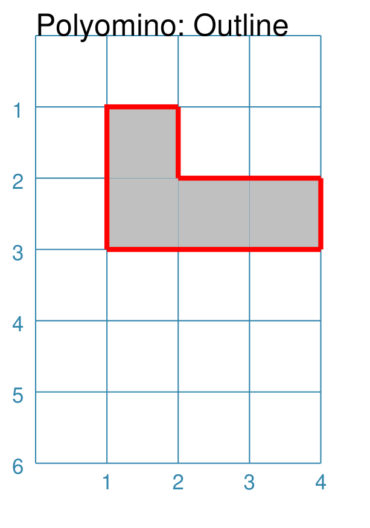

===========
Polyominoes
===========

.. |dash| unicode:: U+2014 .. EM DASH SIGN
.. |deg|  unicode:: U+00B0 .. DEGREE SIGN
   :ltrim:

This section assumes you are very familiar with the concepts, terms and ideas
for :doc:`protograf <index>`  as presented in the
:doc:`Basic Concepts <basic_concepts>` , that you understand all of the
:doc:`Additional Concepts <additional_concepts>` and that you've created some
basic scripts of your own using the :doc:`Core Shapes <core_shapes>`. You also
be familiar with the various types of shape's properties described in the
:doc:`Customised Shapes <customised_shapes>`

.. _polyominoesOver:

Overview
========

Polyominoes are :doc:`graphical objects <objects>` constructed out of a
``pattern`` of one or more squares.

Normally, polyominoes are made up of squares that touch other squares
along one or more sides, but the ``pattern`` property approach used by
:doc:`protograf <index>` means that any kind of arrangement can be
constructed.

.. _polyominoesProps:

Properties
==========

In addition to the properties that are applicable to a
:ref:`Square <square-command>` or :ref:`Rectangle <rectangle-command>`
a Polyomino can also be customised with the following properties:

- **pattern** - this is a list of string values; one string per row. Each string
  contains one or more numbers aka "columns". Each number represents a square,
  with a zero (0) representing a space.
- **invert** - this can either be ``leftright`` (``lr``) or ``topbottom``
  (``tb``) and will reverse the order of the numbers, either in a left-to-right
  (numbers at the end of a row go to the start and vice-versa) or top-to-bottom
  (rows at the end go to the start and vice-versa)
- **flip** - this can either be ``north`` (``n``) or ``south`` (``s``) and
  transposes rows and columns; effectively rotating the shape 90 |deg|
- **gap** - this is the amount of space to leave between each row and each
  column in the pattern
- **outline** - along with **outline_stroke** and **outline_stroke_width**
  is used to draw a line around the boundary of all connected squares in
  the pattern |dash| it cannot be used in conjunction with a non-zero *gap*
- **fills** - each square can be associated with a different fill color
- **strokes** - each square can be associated with a different stroke color
- **labels** - each square can be linked to a different label
- **shapes** - each square can be linked to a different centred shape

.. _polyominoesIndex:

Examples
========

The examples below shows how various properties can be used to customise a
Polyomino.

- `Basic/Default <polyomBasic_>`_
- `Pattern <polyomPattern_>`_
- `Gap <polyomGap_>`_
- `Invert <polyomInvert_>`_
- `Flip <polyomFlip_>`_
- `Outline <polyomOutline_>`_
- `Properties <polyomProps_>`_
- `Shapes <polyomShapes_>`_
- `AdHoc Design <polyomDesign_>`_

.. _polyomBasic:

Polyomino: Basic
----------------
`^ <polyominoesIndex_>`_

.. |po1| image:: images/objects/polyomino_basic.png
   :width: 330

===== ======
|po1| This example shows a Polyomino constructed using the command:

      .. code:: python

         Polyomino()

      This shape can be hard to see as it looks like a simple square
      with a thin outline.

      It uses only default values for size, stroke and color.

      The default ``pattern`` is set to ``['1']`` - this is a monomino or
      "size 1" Polyomino.

===== ======

.. _polyomPattern:

Polyomino: Pattern
------------------
`^ <polyominoesIndex_>`_

.. |po2| image:: images/objects/polyomino_pattern.png
   :width: 330

===== ======
|po2| This example shows a Polyomino constructed using the command:

      .. code:: python

         Polyomino(
             fill="silver",
             pattern=['100', '111'])

      The *pattern* is a key property for a Polyomino.

      Each string in the pattern's list represents a row, starting with the
      "top" row. Each number in the string represents a column.

      **NOTE** Each row must be of the same length!

      A square is drawn at each row/column position where the number is not
      zero (0).

      In this example, the first row has 1 square followed by two spaces
      (the two ``0``), and the second row has 3 squares.

===== ======

.. _polyomGap:

Polyomino: Gap
--------------
`^ <polyominoesIndex_>`_

.. |po3| image:: images/objects/polyomino_gap.png
   :width: 330

===== ======
|po3| This example shows a Polyomino constructed using the command:

      .. code:: python

         Polyomino(
             x=0, y=1,
             fill="silver",
             side=1.2,
             pattern=['100', '111'],
             gap=0.1,
             rounding=0.1)

      A **gap** ensures space between each square |dash| both in the vertical
      and the horizontal direction.

      In this example, a few other properties have been set.  These are ones
      applicable to the drawing of a square - such as its size (``side``), fill
      color, and corner **rounding**. Note that these properties are applied to
      all the squares that are drawn.

      Note that setting ``x`` and ``y`` determines the top-left corner where
      the pattern starts |dash| even if that is a space.

===== ======

.. _polyomInvert:

Polyomino: Invert
-----------------
`^ <polyominoesIndex_>`_

===== ======
|po4| This example shows Polyominoes constructed using these commands:

      .. code:: python

        Polyomino(
            x=0, y=0,
            fill="silver",
            pattern=['100', '111'],
            invert="LR")
        Polyomino(
            x=1, y=3,
            fill="grey"
            pattern=['100', '111'],
            invert="TB")

      In this example, the *invert* property is used to alter the order of
      the squares:

      - ``LR`` or *left-right* changes the order of columns within the rows; in
        this case the pattern becomes ``['001', '111']``
      - ``TB`` or *top-bottom* swops the position of the rows; in
        this case the pattern becomes ``['111', '100']``

===== ======

.. _polyomFlip:

Polyomino: Flip
---------------
`^ <polyominoesIndex_>`_

.. |po5| image:: images/objects/polyomino_flip.png
   :width: 330

===== ======
|po5| This example shows Polyominoes constructed using these commands:

      .. code:: python

        Polyomino(
            x=0, y=0,
            fill="silver",
            pattern=['100', '111'],
            flip="north")
        Polyomino(
            x=2, y=3,
            fill="grey",
            pattern=['100', '111'],
            flip="south")

      In this example, the *flip* property is used to alter the order of
      the squares:

      - ``north`` transposes rows and columns such that the pattern is
        rotated 90 |deg| "upwards"
      - ``south`` transposes rows and columns such that the pattern is
        rotated 90 |deg| "downwards"

===== ======

.. _polyomOutline :

Polyomino: Outline
------------------
`^ <polyominoesIndex_>`_

===== ======
|po6| This example shows a Polyomino constructed using the command:

      .. code:: python

         Polyomino(
             fill_stroke="silver",
             pattern=['100', '111'],
             outline_stroke='red',
             outline_width=2)

      In this example, the *flip* property is used to draw a thick red line
      around the perimeters of all the squares in the Polyomino.

      Note that the *fill_stroke* propery is used to ensure that all the
      squares are a uniform color.

===== ======

.. _polyomProps:

Polyomino: Properties
---------------------
`^ <polyominoesIndex_>`_

===== ======
|po7| This example shows a Polyomino constructed using the command:

      .. code:: python

        Polyomino(
            x=0, y=1,
            stroke=None,
            pattern=['010', '234', '050'],
            fills=[
                'red','yellow','silver','blue','green'],
            strokes=[
                'yellow','silver','blue','green','red'],
            stroke_width=2,
            label_stroke="black",
            label_size=8,
            labels=[
                'red','yellow','silver','blue','green'],
        )

      In this example, the pattern is made from numbers other than just ``1``.

      In addition, values are assiged to the *fills*, *strokes* and
      *labels* properties. The order of these values will determine how
      they are used: the first value is assigned to square number ``1`` in
      the pattern (top-centre); the second value is assigned to square number
      ``2`` in the pattern (middle-left); and so on.

===== ======

.. _polyomShapes:

Polyomino: Shapes
-----------------
`^ <polyominoesIndex_>`_

.. |po8| image:: images/objects/polyomino_shapes.png
   :width: 330

===== ======
|po8| This example shows a Polyomino constructed using the command:

      .. code:: python

        Polyomino(
            x=0, y=1,
            fill="silver",
            pattern=['010', '232'],
            centre_shapes=[
                circle(radius=0.3),
                dot(),
                hexagon(radius=0.3)]
        )

      In this example, the pattern is made from numbers other than just ``1``.

      In addition, values are assiged to the *centre_shapes* property. The order
      of these values will determine how they are used: the Circle shape is
      assigned to, and drawn in, polyomino square number ``1`` in the pattern
      (top-centre); the Circle shape is assigned to, and drawn in, polyomino
      square number ``3`` in the pattern (lower-centre); and so on.

      It should be noted that a number can be used multiple times in the
      pattern; in this example, the number ``2`` appears twice and so both
      the outer polyomino square in the second row display the Dot().

===== ======

.. _polyomDesign:

Polyomino: Adhoc Design
-----------------------
`^ <polyominoesIndex_>`_

.. |po9| image:: images/objects/polyomino_generic.png
   :width: 330

===== ======
|po9| This example shows a Polyomino constructed using the command:

      .. code:: python

         Polyomino(
             x=0, y=1,
             fill="silver",
             pattern=[
                 '1001', '0110', '0100', '1001'])

      In this example, the pattern is constructed in such a way that the
      squares comprising it are not all adjacent to another square.

      Technically, this is **not** a Polyomino but can provide a useful way
      to construct a pattern made up of squares in an arbitrary layout.

===== ======
