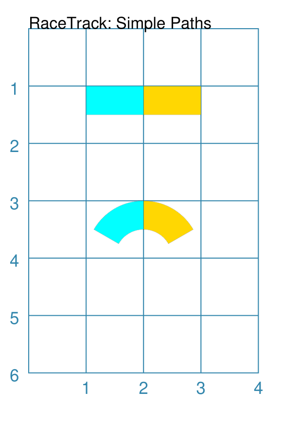
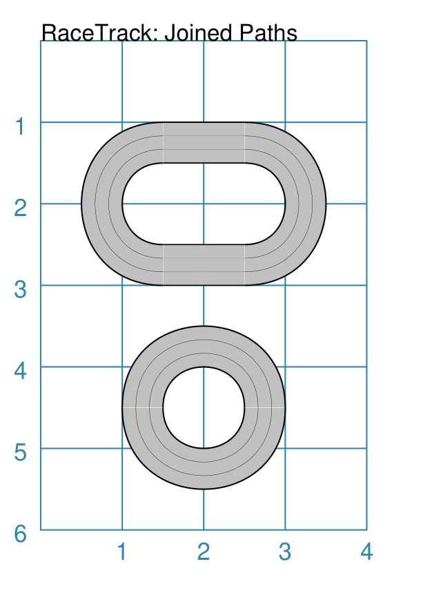
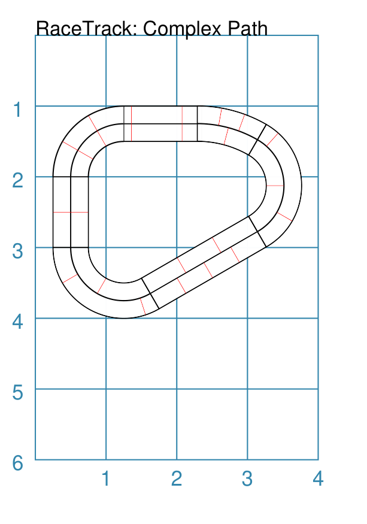
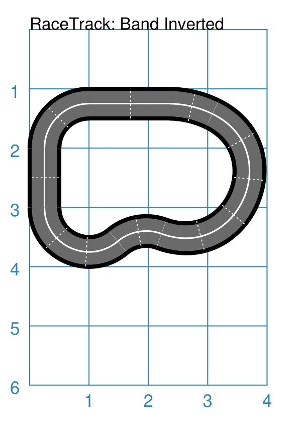

=========
RaceTrack
=========

.. |dash| unicode:: U+2014 .. EM DASH SIGN

This section assumes you are very familiar with the concepts, terms and ideas
for :doc:`protograf <index>`  as presented in the
:doc:`Basic Concepts <basic_concepts>` , that you understand all of the
:doc:`Additional Concepts <additional_concepts>` and that you've created some
basic scripts of your own using the :doc:`Core Shapes <core_shapes>`. You also
be familiar with the various types of shapes' properties described in the
:doc:`Customised Shapes <customised_shapes>`

.. _racetrackOver:

Overview
========

A number of games make use of a RaceTrack, so being able to readily add
one to a graphic, or game board layout, can be useful.

It should be noted that while the object's name is "RaceTrack" it is really
more of a pathway, to which can be added styling by means of the properties
of the shapes that compose it.

.. _racetrack-object:

RaceTrack Properties
====================

A ``RaceTrack`` is effectively a pathway; and, if the end of the pathway
aligns with the start, it becomes what can be perceived as a "racetrack".

The ``RaceTrack`` does not really have the positioning and styling properties
common to many other :doc:`shapes <core_shapes>`; instead it derives its
appearance from the Bands and/or Rectangles which compose it.

The ``RaceTrack`` command only has one property:

- **stages** - this is a list (inside ``[`` ... ``]`` brackets) of one or more
  :ref:`Rectangles <rectangle-command>` and/or :ref:`Bands <band-command>`

Starting with the first shape, and proceeding **counter-clockwise**, each shape
is laid-out, its end aligned with the start of the previous one.  This means
that the position of all shapes, except the first, is overridden by the
``RaceTrack`` construction.

.. NOTE::

    The "width" of the ``RaceTrack`` is determined by the *height* of the first
    shape in the **stages** list.  All other subsequent shapes have their height
    set to match that one.

RaceTrack Examples
==================

The examples below show how Bands and/or Rectangles are used to create a
RaceTrack.

- `Example 1. Simple Track`_
- `Example 2. Joined Track`_
- `Example 3. Complex Track`_
- `Example 4. Inverted Track`_

Example 1. Simple Track
------------------------
`^ <racetrack-object_>`_

===== ======
|rt1| This example shows a RaceTrack constructed using commands like:

      .. code:: python

         basics = Common(
           width=1.0,
           stroke="black")

         rect1 = rectangle(
           common=basics, fill="gold",
           height=0.5, x=2)
         rect2 = rectangle(
           common=basics, fill="aqua",
           height=1.0)

         RaceTrack(stages=[rect1, rect2])

         styles = Common(
           stroke="black",
           radius=1,
           angle_width=60)

         band1 = band(
           common=styles, fill="gold",
           height=0.5, cx=2, cy=4,
           angle_start=30)
         band2 = band(
           common=styles, fill="aqua",
           height=0.25)

         RaceTrack(stages=[band1, band2])

      The start of the RaceTrack is determined by the position of ``rect1``
      as it is first in the *stages* list.

      The top example shows a RaceTrack composed of Rectangles.

      The position and height of ``rect2`` are both changed; the *height* is
      set to match that of ``rect1``, while its position is changed so that its
      right-edge aligns with the left-edge of of ``rect1``.

      The middle example shows a RaceTrack composed of Bands.

      The position and height of ``band2`` are both changed; the *height* is
      set to match that of ``band1``, while its position is changed so that its
      right-edge aligns with the left-edge of of ``band1``.

===== ======

Example 2. Joined Track
------------------------
`^ <racetrack-object_>`_

===== ======
|rt2| This example shows RaceTracks constructed using commands like:

      .. code:: python

        joined = Common(
          height=0.5,
          fill="silver",
          stroke_width=0.5,
          lanes=3,
          no_ends=True)

        rectJ = rectangle(
          common=joined,
          x=1.5)

        bandJ = band(
          common=joined,
          cx=2, cy=4.5, radius=1,
          angle_width=180)

        RaceTrack(stages=[rectJ, bandJ, rectJ, bandJ])

        RaceTrack(stages=[bandJ, bandJ])

      The start of the uppper RaceTrack is determined by the position of
      ``rectJ`` as it is first in the *stages* list; whereas the start of
      the lower RaceTrack is determined by the position of ``bandJ``.

      In this example, as in the one above, the use of the ``Common`` command
      enables shared properties between the elements of the RaceTrack.

      The use of the *no_ends* property means that the ends of the stages are
      drawn in the same color as the *fill* of each shape |dash| in this case,
      ``silver``.

      As in the previous example, the *stages* are drawn in sequence, with the
      right, or east, end of the current stage aligning with the left, or west,
      end of the previous.  The start of each RaceTrack is determined by the
      position of the first stage in the list of *stages*.

===== ======

Example 3. Complex Track
------------------------
`^ <racetrack-object_>`_

===== ======
|rt3| This example shows a RaceTrack constructed using commands like:

      .. code:: python

        mixed = Common(
          height=0.5,
          stroke_width=0.5,
          lanes_stroke_width=0.5,
          sections_stroke_width=0.25,
          sections_stroke="red",
          lanes=2)

        r1 = rectangle(
          common=mixed,
          x=1.25,
          width=1.1,
          sections=[0.25, 0.9])
        r2 = rectangle(
          common=mixed,
          width=1,
          lanes=[0.25, 0.75], sections=2)
        r3 = rectangle(
          common=mixed,
          width=1.75,
          sections=[
            [0.333, 0.66],
            [1/4, 1/2, 3/4], [1/3, 2/3]])

        b1 = band(
          common=mixed,
          radius=1,
          angle_width=90,
          sections=3)
        b2 = band(
          common=mixed,
          radius=1,
          angle_width=120,
          sections=[[0.5], [0.25, 0.9]])
        b3 = band(
          common=mixed,
          radius=1.95,
          angle_width=30,
          sections=[[0.5], [0.33, 0.66]])

        RaceTrack(stages=[r1, b1, r2, b2, r3, b2, b3])

      In this example, as in the ones above, the use of the ``Common`` command
      enables shared properties between the elements of the RaceTrack.
      In particular, the *lanes* and the *sections* are styled in a similar
      fashion for both the Rectangles and the Bands.

      While it often makes sense for the the different *stages* to share the same
      number of lanes, this example shows how each can have their own differing
      number of sections, which in turn can be different on a per-lane basis.
      For details, consult the relevant examples for
      :ref:`Rectangles <rectangle-command>` and :ref:`Bands <band-command>`.

      .. HINT::

          Getting "closure" on a RaceTrack composed of multiple elements can
          be tricky. In this case, some experimentation was needed to "flatten"
          the last Band (``b3``) by giving it a longer radius, while also
          extending the width of first Rectangle by a small amount, such the two
          shapes joned in a more natural way.

===== ======

Example 4. Inverted Track
-------------------------
`^ <racetrack-object_>`_

===== ======
|rt4| This example shows a RaceTrack constructed using commands like:

      .. code:: python

        rtrack = Common(
            height=0.5,
            fill="dimgrey",
            stroke_width=2,
            lanes_stroke_width=0.75,
            lanes_stroke="white",
            sections_stroke_width=0.5,
            sections_stroke="white",
            sections_dotted=True,
            no_ends=True,
            lanes=2)

        r1 = rectangle(
            common=rtrack,
            x=1, width=1.4,
            sections=2)
        r2 = rectangle(
            common=rtrack,
            sections=2)

        b1 = band(
            common=rtrack,
            radius=1,
            sections=2)
        b2 = band(
            common=rtrack,
            radius=1,
            sections=3,
            angle_start=30, angle_width=130)
        b4 = band(
            common=rtrack,
            radius=1,
            sections=2,
            inverted=True,
            angle_width=60)
        b5 = band(
            common=rtrack,
            radius=1.35,
            sections=5,
            angle_width=174)
        b6 = band(
            common=rtrack,
            radius=1.95,
            sections=2,
            angle_width=25)

      In this example, as in the ones above, the use of the ``Common`` command
      enables shared properties between the elements of the RaceTrack.
      In particular, the *lanes* and the *sections* are styled in a similar
      fashion for both the Rectangles and the Bands.

      This is example is much the same as `Example 3. Complex Track`_, but there
      is a change for the third Band |dash| ``b3`` |dash| that is drawn.

      The use of the ``inverted=True`` means that Band is not drawn with its
      centre point "inside" the track area |dash| what is called the *infield*
      in racing terms |dash| but outside of this.  This also means that the
      Band is drawn in the opposite direction from the others; which may in
      turn impact where the *sections* appear.

===== ======
