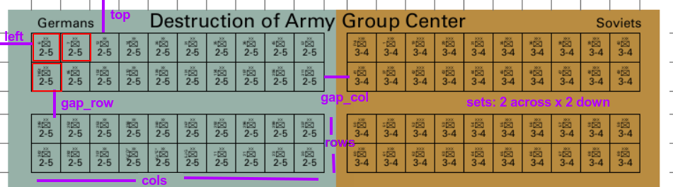

=========================
Counter Extraction Script
=========================

.. |dash| unicode:: U+2014 .. EM DASH SIGN

This section is part of the "add-on" scripts for **protograf**.
For background and general information, see the :doc:`overview <overview>`.

Purpose
=======

Extraction of individual rectangular counter images, as might be found on a
scan of a full set of counters on a wargame's countersheet |dash| typically
an A4 or Letter-sized card |dash| is useful to provide images to programs
such as `VASSAL <https://vassalengine.org/>`_

Usage
=====

To use this script, you open a terminal and "run" it with Python in a similar way
that you do for a PG script |dash| see
:ref:`Run a file with Python <runWithPython>` |dash| as follows::

    python -m protograf.scripts.counter_extraction

The script requires a *configuration* file to work properly; if this is called
anything except ``config.ini``, you will need to pass in the file name to the
script as follows::

    python -m protograf.scripts.counter_extraction myfilename.ini

Configuration
=============

The  *configuration* for the script should be stored in a plain text file;
you can use the same kind of editor that you use for **protograf**
scripts.

An example of the contents of such a file is shown below::

    [file]
    name=test.jpg
    output=/tmp/pb

    [counter]
    width=120
    height=120
    top=24
    left=33
    gap_x=5
    gap_y=5
    prefix=pb_var

    [group]
    sets=1x3
    cols=8
    rows=2
    gap_col=0
    gap_row=28

    [frame]
    thickness=2
    color=black
    alias=1

There are four sections in the file, identifed by the ``[name]`` format, and
each section contains one or more settings, in the format ``name=value``.
By changing these values, the script behaves in different ways.

The script does provide default values for these, but its best to set your
own to ensure the output is correct!

File section
------------

This section contains the settings for input and output:

- *name*: this is name of the countersheet file; if it is located outside of
  the directory from whcih the script is being run; the full and absolute path
  to that directory must be supplied as well
- *output*: this is the name of the directory in which the counter images must
  be stored

Counter section
---------------

This section contains the settings for individual counters:

- *width*: this is the width in pixels of the portion of the counter that must
  be extracted
- *height*: this is the height in pixels of the portion of the counter that must
  be extracted
- *top*: this is the distance in pixels from the top of the countersheet image
  to the top-edge of the top-left counter in it
- *left*: this is the distance in pixels from the left of the countersheet
  image to the left-edge of the top-left counter in it
- *gap_x*: this is the gap "across" between the right edge of the portion of
  the counter that must be extracted and the left edge of the portion of the
  next adjacent counter that must be extracted
- *gap_y*: this is the gap "down" between the lower edge of the portion of
  the counter that must be extracted and the top edge of the portion of the
  next adjacent counter that must be extracted
- *prefix*: this is text that must be added to each counter's filename

Group section
-------------

This section contains the settings for the way that counters are "grouped"
on a countersheet:

- *sets*: this is the number of groups of counters "across" and "down"; so
  ``2x3`` means two groups across, with three groups down
- *cols*: this is the number of counters in a group, going across the image
- *rows*: this is the number of counters in a group, going down the image
- *gap_col*: this is the distance in pixels between each group,
  going across the image
- *gap_row*: this is the distance in pixels between each group,
  going down the image

Frame section
-------------

This section contains the settings for the appearance of an extra "frame"
|dash| a thick line added around the border of each counter image:

- *thickness*: this is the width in pixels of the frame; it *must* be an
  even number - 2, 4, 6 etc.  If it is ``0`` then no frame is drawn
- *color*: this is the color of the frame as a common name |dash| such as
  ``black``, ``red``, ``orange``, ``green``, ``blue``, ``yellow`` |dash| or
  a hexadecimal color code, such as ``#4B0082``
- *alias*: setting this to a non-zero value, e.g. ``1``, will cause the image
  frame to be drawn with an aliasing effect

Example
-------

An example of some of these settings can be seen in this image:

