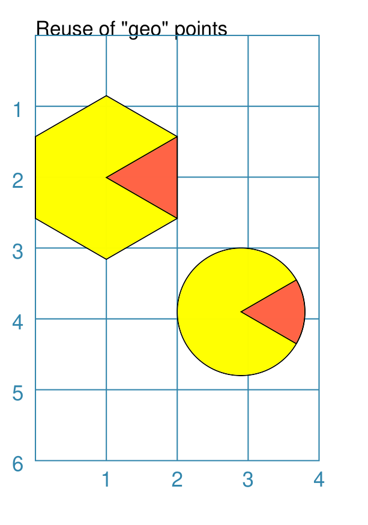
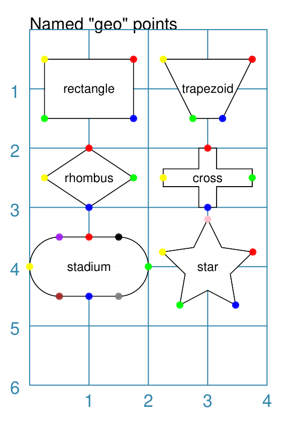
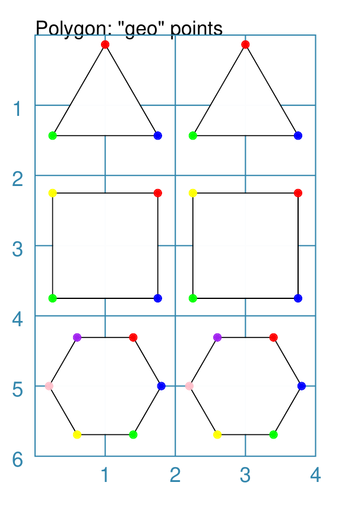
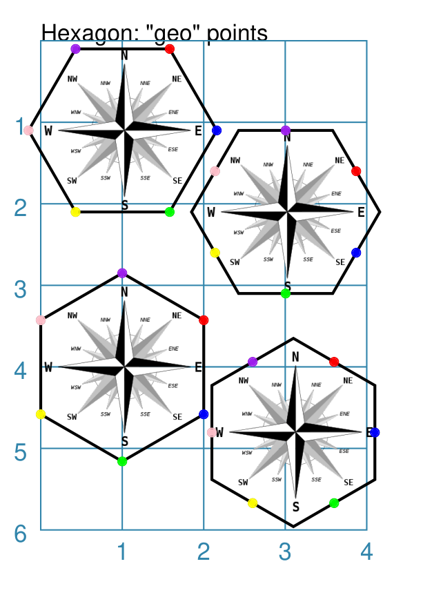
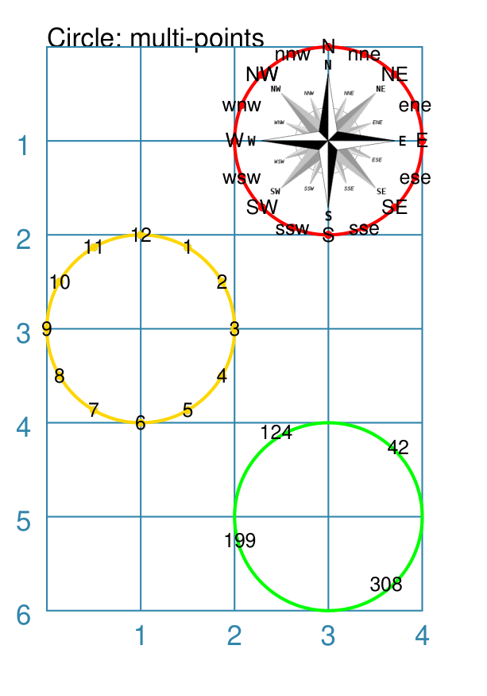

===============
Shapes Geometry
===============

.. |dash| unicode:: U+2014 .. EM DASH SIGN
.. |copy| unicode:: U+000A9 .. COPYRIGHT SIGN
   :trim:
.. |deg|  unicode:: U+00B0 .. DEGREE SIGN
   :ltrim:

The descriptions here assume you are familiar with the concepts, terms
and ideas for :doc:`protograf <index>` as presented in the
:doc:`Basic Concepts <basic_concepts>` |dash| especially *units*,
*properties* and *defaults*.

You should have already seen how these shapes were created, with defaults,
in :doc:`Core Shapes <core_shapes>`.  You will also need to understand how
shapes can be :doc:`further customised <customised_shapes>`

.. _table-of-contents-geometry:

- `Overview`_
- `Point-based Locations`_
- `Geometry Properties`_
- `Examples of using Named Geometry Properties`_

Overview
========
`↑ <table-of-contents-geometry_>`_

When reading this section, you should already know how shapes are created by
using commands, and understand how their properties are set.

This section describes the use of **point** locations to set where shapes are
drawn. It also covers the availability and use of a shape's **geometry**
properties that can be used to set *relative* locations e.g. given that a
Rectangle has been drawn, use a relative reference to its north-east corner.

.. _point-command:

Point-based Locations
=====================
`↑ <table-of-contents-geometry_>`_

For the majority of shapes, their location is typically set either by supplying
their ``x`` and ``y`` values to define the top-left position of the shape
|dash| with both values defaulting to ``1`` |dash| or through using their ``cx``
and ``cy`` values to define the centre position of the shape |dash| with both
values defaulting to ``1``.

It is also possible to use the ``xy`` property or ``cxy`` property to achieve
the same result; the difference being that the script needs to provide values
for these properties using a ``Point`` command rather than a single number.

The ``Point()`` command simply uses two values |dash| if not names are used,
then it us s assumed that these correspond to the ``x`` and ``y`` properties;
in that order.

For example, in all cases below the top-left of the Rectangle is at
x-position ``2`` and y-position ``3``:

.. code:: python

    Rectangle(x=2, y=3)
    Rectangle(xy=Point(x=2, y=3))
    Rectangle(xy=Point(2, 3))

In this example, in all cases below the centre of the Rectangle is at
x-position ``1`` and y-position ``4``:

.. code:: python

    Rectangle(cx=1, cy=4)
    Rectangle(cxy=Point(x=1, y=4))
    Rectangle(cxy=Point(1, 4))

Setting locations this way is more verbose and perhaps less immediately clear
than using single properties.  However, it might be of use in some cases |dash|
and is certainly needed when referencing another shape's geometry (see below).

.. _geometryProps:

Geometry Properties
===================
`↑ <table-of-contents-geometry_>`_

Much of :doc:`protograf <index>`'s documentation and focus is on *setting*
of properties for shapes so that they appear the way you want them to.
However, it can be useful to reuse those properties to allow for more
flexibility and ease-of-change in a script.

Using a Property
----------------

Each shape, depending on its characteristics, has various geometry properties
available.

.. WARNING::

    The correct geometry properties only become available **after** a shape
    has been drawn!

Geometry properties are referenced using a ``NAME.geo.XYZ`` syntax; where the
``NAME`` is a name assigned in the script to the shape, and the ``XYZ`` is
the property being referenced.  For example:

.. code:: python

    box = Rectangle(cx=1, cy=4, height=2, width=5)
    Circle(cxy=box.geo.c, radius=1)

Here the name ``box`` is assigned to the Rectangle, and the Circle's centre
*point* is set by referencing the Rectangle's centre *point* via the
``box.geo.c``, where the ``c`` refers to the **centre**.

.. HINT::

    You can also refer to a shape's geometry properties by using the terms in
    full |dash| for example, ``box.geometry.centre``

A ``Circle`` also has **clock** locations available; see
- `Example 5. Circle Named and Other Points`_.

Available Properties
--------------------

There are a number of potentially available properties.  Obviously, though,
their value may or may not exist depending on the shape involved. For example,
circular-like shapes such as a Circle, Hexagon and Polygon have a radius,
whereas shapes such as a Rhombus, Rectangle or Cross do not.

Named Location Properties
~~~~~~~~~~~~~~~~~~~~~~~~~

Locations refer to key points for a shape.

Key points include: the shape centre |dash| common to most shapes;
the vertices which help define its "outer" lines; and, for specific shapes,
the perbii i.e. the mid-points of the lines between two vertices at which
the lines from the centre of the shape form right-angles to them.

Locations are typically referenced via :ref:`compass directions <termsDirection>`
which match the location, **relative to the shape's centre**, in an exact or
*approximate* way. These include:

* ``n`` - a point on the north edge or vertex
* ``s`` - a point on the south edge or vertex
* ``e`` - a point on the east edge or vertex
* ``w`` - a point on the west edge or vertex
* ``ne`` - a point on the north-east edge or vertex
* ``se`` - a point on the south-east edge or vertex
* ``nw`` - a point on the north-west edge or vertex
* ``sw`` - a point on the south-west edge or vertex
* ``nnw`` - a point on the north-north-west edge or vertex
* ``nne`` - a point on the north-north-east edge or vertex
* ``sse`` - a point on the south-south-east edge or vertex
* ``ssw`` - a point on the south-south-west edge or vertex
* ``wnw`` - a point on the west-north-west edge or vertex
* ``ene`` - a point on the east-north-east edge or vertex
* ``ese`` - a point on the east-south-east edge or vertex
* ``wsw`` - a point on the west-south-west edge or vertex

Usage of these is shown in `Example 4. Hexagonal Vertices and Perbii`_ as
well as `Example 5. Circle Named and Other Points`_.

Numbered Location Properties
~~~~~~~~~~~~~~~~~~~~~~~~~~~~

It is not always possible access locations by name.  For some shapes, such
as a Polygon or Star, they can only be referenced by a number.

Numbered locations include:

* ``vertices`` (``v``) |dash| a list of vertices for the shape, where each item
  is referenced by a number, starting from ``0``.
* ``perbii`` (``p``) |dash| a list of perbii for the shape, where each item
  is referenced by a number, starting from ``0``.

As an example:

.. code:: python

    ply = Polygon(cx=1, cy=4, sides=7, side=1)
    Line(xy=ply.geo.v[3], length=1)

Here the Line uses, as its starting point, the fourth vertex of the 7-sided
Polygon named ``ply``.

See `Example 3. Use of Vertices for Polygon`_ for use of numbered locations.

Size Properties
~~~~~~~~~~~~~~~

In general, size properties are associated with regular, enclosed shapes.

* ``area`` - the area of the shape
* ``perimeter`` - the length of the line around the shape
* ``radius`` - the radius of the shape, where applicable
* ``diameter`` - the diameter of the shape, where applicable
* ``side`` - the length of a side of the shape (if all sides are equal)
* ``length`` - the length of the shape (if it has a single length)
* ``width`` - the width of the shape  (if it has a single width)
* ``height`` - the height of the shape (if it has a single height)
* ``sides`` - the number of sides of the shape (if all sides are of equal length)

.. WARNING::

    Be aware that calculations are **not** yet in place for some, or all, of
    these calculated values, or that the calculations themselves may still
    only be approximations |dash| use these properties with caution for now!

Non-Numeric Properties
~~~~~~~~~~~~~~~~~~~~~~

* ``type`` - the shape type (the internal **protograf** type)
* ``name`` - the shape's name is usually the same as its command (this property
  does **not** refer to any name that might have been assigned to it in a
  script)

.. _examples-named-geometry:

Examples of using Named Geometry Properties
===========================================
`↑ <table-of-contents-geometry_>`_

- `Example 1. Named Properties`_
- `Example 2. Use of Named Points for Shapes`_
- `Example 3. Use of Vertices for Polygon`_
- `Example 4. Hexagonal Vertices and Perbii`_
- `Example 5. Circle Named and Other Points`_

Example 1. Named Properties
---------------------------
`^ <examples-named-geometry_>`_

===== ======
|go1| This example shows named points referenced using these
      commands:

      .. code:: python

        hx = Hexagon(
          x=0, y=0.85, height=2,
          fill="yellow",
          orientation="pointy")
        Polyshape(
          points=[hx.geo.c, hx.geo.ne, hx.geo.se],
          fill="tomato")

        cc = Circle(
          x=2, y=3, radius=0.9,
          fill="yellow")
        Sector(
          cxy=cc.geo.c,
          radius=cc.geo.radius,
          angle_width=60,
          angle_start=-30,
          fill="tomato")

      The two "primary" shapes |dash| Hexagon and Circle |dash| are
      assigned names (``hx`` and ``cc`` respectively).

      These are then used to gain access to their geometric properties.

      For example, the triangular Polyshape is drawn over the Hexagon by
      referencing various of its available vertices for use in the *points*
      property.

      The Sector is drawn over the Circle by referencing both the *radius*
      and the centre of the Circle (assigned to *cxy*).

===== ======

Example 2. Use of Named Points for Shapes
-----------------------------------------
`^ <examples-named-geometry_>`_

===== ======
|go2| This example shows named points referenced using these
      commands:

      .. code:: python

        sh = Rectangle(
            cx=1, cy=1, height=1, width=1.5,
            label="rectangle", label_size=6)
        Dot(cxy=sh.geo.ne, fill_stroke="red")
        Dot(cxy=sh.geo.se, fill_stroke="blue")
        Dot(cxy=sh.geo.sw, fill_stroke="green")
        Dot(cxy=sh.geo.nw, fill_stroke="yellow")
        sh = Trapezoid(
            cx=3, cy=1, height=1, width=1.5,
            label="trapezoid", label_size=6)
        Dot(cxy=sh.geo.ne, fill_stroke="red")
        Dot(cxy=sh.geo.se, fill_stroke="blue")
        Dot(cxy=sh.geo.sw, fill_stroke="green")
        Dot(cxy=sh.geo.nw, fill_stroke="yellow")
        sh = Rhombus(
            cx=1, cy=2.5, height=1, width=1.5,
            label="rhombus", label_size=6)
        Dot(cxy=sh.geo.n, fill_stroke="red")
        Dot(cxy=sh.geo.s, fill_stroke="blue")
        Dot(cxy=sh.geo.e, fill_stroke="green")
        Dot(cxy=sh.geo.w, fill_stroke="yellow")
        sh = Cross(
            cx=3, cy=2.5, height=1, width=1.5,
            label="cross", label_size=6)
        Dot(cxy=sh.geo.n, fill_stroke="red")
        Dot(cxy=sh.geo.s, fill_stroke="blue")
        Dot(cxy=sh.geo.e, fill_stroke="green")
        Dot(cxy=sh.geo.w, fill_stroke="yellow")
        sh = Stadium(
            cx=1, cy=4, height=1, width=1,
            label="stadium", label_size=6)
        Dot(cxy=sh.geo.n, fill_stroke="red")
        Dot(cxy=sh.geo.s, fill_stroke="blue")
        Dot(cxy=sh.geo.e, fill_stroke="green")
        Dot(cxy=sh.geo.w, fill_stroke="yellow")
        sh = Star(
            cx=3, cy=4, radius=0.8, rays=5,
            label="star", label_size=6)
        Dot(cxy=sh.geo.v[0], fill_stroke="red")
        Dot(cxy=sh.geo.v[1], fill_stroke="blue")
        Dot(cxy=sh.geo.v[2], fill_stroke="green")
        Dot(cxy=sh.geo.v[3], fill_stroke="yellow")
        Dot(cxy=sh.geo.v[4], fill_stroke="pink")

      This example shows the "equivalence" between use of compass directions
      for a number of different shapes.

      Note that the Stadium points will lie on a curve if it has edges that
      "bulge" in that direction;

===== ======

Example 3. Use of Vertices for Polygon
--------------------------------------
`^ <examples-named-geometry_>`_

===== ======
|go3| This example shows numbered and named points referenced using these
      commands:

      .. code:: python

        p1 = Polygon(x=1, y=1, sides=3, side=1.5)
        Dot(cxy=p1.geo.n, fill_stroke="red")
        Dot(cxy=p1.geo.se, fill_stroke="blue")
        Dot(cxy=p1.geo.sw, fill_stroke="green")
        p2 = Polygon(x=3, y=1, sides=3, side=1.5)
        Dot(cxy=p2.geo.v[2], fill_stroke="red")
        Dot(cxy=p2.geo.v[0], fill_stroke="blue")
        Dot(cxy=p2.geo.v[1], fill_stroke="green")

        p1 = Polygon(x=1, y=3, sides=4, side=1.5)
        Dot(cxy=p1.geo.ne, fill_stroke="red")
        Dot(cxy=p1.geo.se, fill_stroke="blue")
        Dot(cxy=p1.geo.sw, fill_stroke="green")
        Dot(cxy=p1.geo.nw, fill_stroke="yellow")
        p2 = Polygon(x=3, y=3, sides=4, side=1.5)
        Dot(cxy=p2.geo.v[0], fill_stroke="red")
        Dot(cxy=p2.geo.v[1], fill_stroke="blue")
        Dot(cxy=p2.geo.v[2], fill_stroke="green")
        Dot(cxy=p2.geo.v[3], fill_stroke="yellow")

        p1 = Polygon(x=1, y=5, sides=6, side=0.8)
        Dot(cxy=p1.geo.ne, fill_stroke="red")
        Dot(cxy=p1.geo.e, fill_stroke="blue")
        Dot(cxy=p1.geo.se, fill_stroke="green")
        Dot(cxy=p1.geo.sw, fill_stroke="yellow")
        Dot(cxy=p1.geo.w, fill_stroke="pink")
        Dot(cxy=p1.geo.nw, fill_stroke="purple")
        p2 = Polygon(x=3, y=5, sides=6, side=0.8)
        Dot(cxy=p2.geo.v[0], fill_stroke="red")
        Dot(cxy=p2.geo.v[1], fill_stroke="blue")
        Dot(cxy=p2.geo.v[2], fill_stroke="green")
        Dot(cxy=p2.geo.v[3], fill_stroke="yellow")
        Dot(cxy=p2.geo.v[4], fill_stroke="pink")
        Dot(cxy=p2.geo.v[5], fill_stroke="purple")

      This example shows the "equivalence" between use of compass directions
      versus numbered vertices (such as ``v[0]``).  The named directions can
      only be used for these polygons because of their smaller number of sides.

      Other sizes of polygons will **not** have any named locations available,
      and to reference their vertices will require the use of numbers.

===== ======

Example 4. Hexagonal Vertices and Perbii
----------------------------------------
`^ <examples-named-geometry_>`_

===== ======
|go4| This example shows the points that can be referenced using these
      commands:

      .. code:: python

        Image(
          "compass.png",
          x=0, y=0.1, height=2, width=2)
        hx = Hexagon(
          x=-0.15, y=0.1, height=2,
          fill=None, stroke_width=1)
        Dot(cxy=hx.geo.ne, fill_stroke="red")
        Dot(cxy=hx.geo.e, fill_stroke="blue")
        Dot(cxy=hx.geo.se, fill_stroke="green")
        Dot(cxy=hx.geo.sw, fill_stroke="yellow")
        Dot(cxy=hx.geo.w, fill_stroke="pink")
        Dot(cxy=hx.geo.nw, fill_stroke="purple")

        Image(
          "compass.png",
          x=2, y=1.1, height=2, width=2)
        hx = Hexagon(
          x=1.85, y=1.1, height=2,
          fill=None, stroke_width=1)
        Dot(cxy=hx.geo.ene, fill_stroke="red")
        Dot(cxy=hx.geo.ese, fill_stroke="blue")
        Dot(cxy=hx.geo.s, fill_stroke="green")
        Dot(cxy=hx.geo.wsw, fill_stroke="yellow")
        Dot(cxy=hx.geo.wnw, fill_stroke="pink")
        Dot(cxy=hx.geo.n, fill_stroke="purple")

        Image(
          "compass.png",
          x=0, y=3, height=2, width=2)
        hx = Hexagon(
          x=0, y=2.85, height=2, fill=None,
          stroke_width=1, orientation="pointy")
        Dot(cxy=hx.geo.ne, fill_stroke="red")
        Dot(cxy=hx.geo.se, fill_stroke="blue")
        Dot(cxy=hx.geo.s, fill_stroke="green")
        Dot(cxy=hx.geo.sw, fill_stroke="yellow")
        Dot(cxy=hx.geo.nw, fill_stroke="pink")
        Dot(cxy=hx.geo.n, fill_stroke="purple")

        Image(
          "compass.png",
          x=2.1, y=3.8, height=2, width=2)
        hx = Hexagon(
          x=2.1, y=3.65, height=2, fill=None,
          stroke_width=1, orientation="pointy")
        Dot(cxy=hx.geo.nne, fill_stroke="red")
        Dot(cxy=hx.geo.e, fill_stroke="blue")
        Dot(cxy=hx.geo.sse, fill_stroke="green")
        Dot(cxy=hx.geo.ssw, fill_stroke="yellow")
        Dot(cxy=hx.geo.w, fill_stroke="pink")
        Dot(cxy=hx.geo.nnw, fill_stroke="purple")

      These four Hexagons each show a different aspect of using named
      locations. In all cases, a series of colored Dots are drawn, in the
      same sequence, in a clockwise direction.

      While vertices can be easily identified with primary or secondary
      compass directions, some of the perbii can only be identified by
      tertiary compass directions.

      The compass image provides some context to see how the named locations
      are only approximations to the actual compass directions.

===== ======

Example 5. Circle Named and Other Points
----------------------------------------
`^ <examples-named-geometry_>`_

A Circle has three different ways to locate a point on its circumference.

===== ======
|go5| This example shows the points that can be referenced using these
      commands:

      .. code:: python

        cr = Circle(cx=3, cy=1, radius=1, fill=None, stroke_width=1, stroke="red")
        dcp = Common(dot_width=2, stroke="red", label_stroke="black")
        Dot(common=dcp, label="N", cxy=cr.geo.n)
        Dot(common=dcp, label="S", cxy=cr.geo.s)
        Dot(common=dcp, label="E", cxy=cr.geo.e)
        Dot(common=dcp, label="W", cxy=cr.geo.w)
        ...
        cr = Circle(cx=1, cy=3, radius=1, fill=None, stroke_width=1, stroke="gold")
        dcc = Common(dot_width=2, stroke="gold", label_stroke="black")
        Dot(common=dcc, label="12", cxy=cr.clock.h12)
        Dot(common=dcc, label="9", cxy=cr.clock.h9)
        Dot(common=dcc, label="6", cxy=cr.clock.h6)
        Dot(common=dcc, label="3", cxy=cr.clock.h3)
        ...
        cr = Circle(cx=3, cy=5, radius=1, fill=None, stroke_width=1, stroke="green")
        Text("42", xy=cr.poc(42))
        Text("124", xy=cr.poc(124))
        Text("308", xy=cr.poc(308))
        Text("199", xy=cr.poc(199))

      **NOTE** that the code shown above is abbreviated (``...``) but the
      pattern of usage should be clear from what is here.

      The *red* circle shows the use of named compass points; all sixteen are
      available for a circle.

      The *yellow* circle shows the use of named **clock** points; these are
      referenced using a ``NAME.clock.hN`` syntax; where ``NAME`` is the name
      assigned in the script to the Circle, and the ``hN`` is an ``h``
      followed by a number corresponding to an hour position.

      The *green* circle shows the use of **angles** to set a location.  The
      format is ``NAME.poc(N)`` where ``NAME`` is the name assigned in the
      script to the Circle, and the ``poc(N)`` is the method by which an
      angle in degrees, between 0 to 360, measured counter-clockwise from
      the east direction, can be specified.

===== ======
