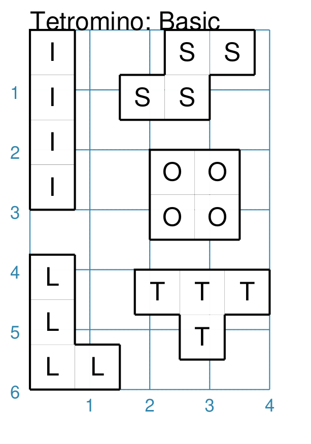
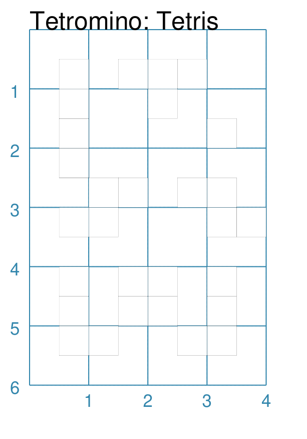

===========
Tetrominoes
===========

.. |dash| unicode:: U+2014 .. EM DASH SIGN

This section assumes you are very familiar with the concepts, terms and ideas
for :doc:`protograf <index>`  as presented in the
:doc:`Basic Concepts <basic_concepts>` , that you understand all of the
:doc:`Additional Concepts <additional_concepts>` and that you've created some
basic scripts of your own using the :doc:`Core Shapes <core_shapes>`. You also
be familiar with the various types of shape's properties described in the
:doc:`Customised Shapes <customised_shapes>`

.. _tetrominoesOver:

Overview
========

Tetrominoes became well-known through the computer game "Tetris", which
originated in 1985.  Tetrominoes are one type of :doc:`Polyominoes <polyominoes>`
and each one is composed of **4** squares in one of 5 unique patterns.

They can referred to by their shortcut ``letter`` property which has been
assigned to each of the 5 unique shapes, based on their similarity to letters
in the Roman alphabet.

Properties
==========

Tetrominoes share all the properties of :doc:`Polyominoes <polyominoes>` but,
instead of a *pattern* they are defined using a *letter*.

A *letter* in uppercase format draws a Tetromino in such a way that it
resembles that letter; whereas a lowercase letter draws the same basic shape
but inverted from left to right.

Examples
========

The examples below shows how letters are used to create a Tetromino.

Tetromino: Uppercase Letter
---------------------------
`^ <tetrominoesOver_>`_

===== ======
|te1| This example shows Tetrominoes constructed using commands like:

      .. code:: python

         tbasics = Common(
             side=0.75,
             outline_stroke="black", outline_width=1)

         Tetromino(
             x=1.5, y=0,
             letter="S",
             label="S",
             common=tbasics)

      Each of the five shapes is constructed in the same way |dash| setting
      the *letter* property to one of: I, S, L, O, or T.

===== ======

Tetromino: Lowercase Letter
---------------------------
`^ <tetrominoesOver_>`_

===== ======
|te2| This example shows Tetrominoes constructed using commands like:

      .. code:: python

         tbasics = Common(
             side=0.75,
             outline_stroke="black", outline_width=1)

         Tetromino(
             x=1.5, y=0,
             letter="s",
             label="s",
             common=tbasics)

      Each of the five shapes is constructed in the same way |dash| setting
      the *letter* property to one of: i, s, l, o, or t.

===== ======

Tetromino: Tetris-styled
------------------------
`^ <tetrominoesOver_>`_

===== ======
|te3| This example shows Tetrominoes constructed using commands like:

      .. code:: python

         Tetromino(
             x=1.5, y=0,
             side=0.5,
             letter="I",
             tetris=True)

      Each of the five shapes is constructed in the same way |dash| setting
      the *letter* property to one of: I, S, L, O, or T (or their lowercase
      equivalent).

      In addition, the ``*`` value for the letter can be used to create a
      single grey monominoe.

      The *tetris* property overrides the default color and stroke of the
      shapes and creates a style that mimics that used in the original
      Tetris computer game.

===== ======
